\[DEPRECATED\] Forecasting Lab: Production Figures
================

# Intro

This R notebook was the first approach to examining FRCBS monthly
product sales data and old forecasting models. The aim was to understand
the underlying characteristics of the series, and to have a quick,
mainly visual, look at the performance of the forecasts in use already.

This notebook should not give you much correct information as most of
the analysis methods have now been improved. You will see the shape and
behaviour of the product series without the correct monthly adjustment,
the first attempts at seasonal decomposition (with poor performance) and
some figures on the old model performances. You should not trust the CV
numbers here. The document ends with a quick and crude attempt with a
NNAR model.

``` r
# Imports
library(forecast)
library(ggplot2)
library(gridExtra)
library(knitr)
```

## Create original dataset that should remain immutable throughout labbing

``` r
# Load data
monthly_sales <- read.table("/home/esa/production_forecasts/data/kuukausimyynti.txt", header = T, sep = "\t")

# Separate yyyy/mmm column into months and years
monthly_sales$year <- substr(monthly_sales$kuukausi, 1, 4)
monthly_sales$month <- factor(substr(monthly_sales$kuukausi, 6, 8), levels=c("tam", "hel", "maa", "huh", "tou", "kes", "hei", "elo", "syy", "lok", "mar", "jou"))

# Create a numeric column for months
monthly_sales$month_num <- as.numeric(monthly_sales$month)

# Omit empty values
d <- na.omit(monthly_sales)
```

## Create time series objects

``` r
# Red cells
ts.red <- ts(d$Punasoluvalmisteet, 
             start=as.numeric(c(d$year[1], d$month_num[1])), 
             end=as.numeric(c(tail(d$year, 1), tail(d$month_num, 1))), 
             frequency=12)
# Platelets
ts.pla <- ts(d$Trombosyyttivalmisteet,
             start=as.numeric(c(d$year[1], d$month_num[1])), 
             end=as.numeric(c(tail(d$year, 1), tail(d$month_num, 1))), 
             frequency=12)
# Fresh Frozen Plasma (or Octaplas nowadays)
ts.ffp <- ts(d$FFP,
             start=as.numeric(c(d$year[1], d$month_num[1])), 
             end=as.numeric(c(tail(d$year, 1), tail(d$month_num, 1))), 
             frequency=12)

# Create plots for a quick overview
tsm <- cbind(ts.red, ts.pla, ts.ffp)
p1 <- autoplot(ts.red)
p2 <- autoplot(ts.pla)
p3 <- autoplot(ts.ffp)
p4 <- autoplot(tsm) + ggtitle("All products as is")
grid.arrange(grobs=list(p1, p2, p3, p4), 
             widths=c(4, 2, 2), 
             layout_matrix = rbind(c(4, 1, 2), 
                                   c(4, 3, NA)))
```

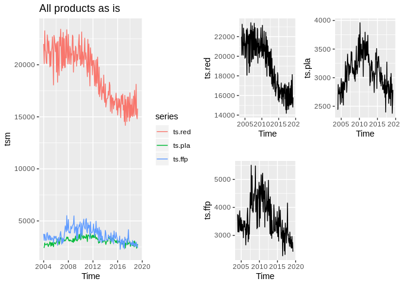<!-- -->

Initial remarks: Blood product types don’t seem to correlate in sales.
Why are platelets and plasma triangular while red cells have a smoother
downwards trend curve? It’s also obvious that red cells get sold in much
larger quantities than platelets or plasma.

``` r
# Correlation plot
GGally::ggpairs(as.data.frame(cbind(ts.red, ts.pla, ts.ffp)))
```

    ## Registered S3 method overwritten by 'GGally':
    ##   method from   
    ##   +.gg   ggplot2

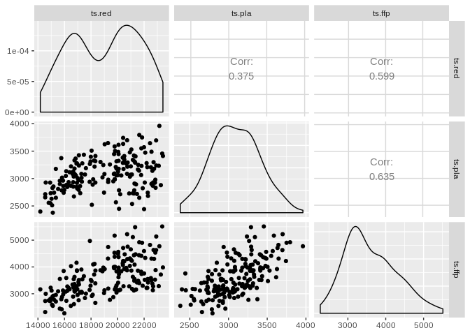<!-- -->

The correlation is not non-existent though, as all of the products have
a downward trend beginning from 2011. Let’s inspect their seasonality
more closely and see if we could extract it from the
series.

``` r
ggseasonplot(ts.red, year.labels = TRUE, year.labels.left = TRUE) + ggtitle("Red cell yearly seasonality")
```

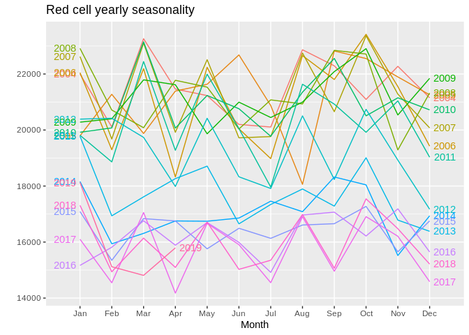<!-- -->

There seems to be a set of prominent features present in the red cell
sales series. January starts off high and demand decreases sharply in
February. Same pattern happens with March and April, May and June,
August and September and October and November. Overall the zig-zag
pattern repeats throughout the year. The current standing hypothesis is
that this is mainly due to differing month lengths and some overlapping
holiday seasons. Let’s check the monthly
subseries:

``` r
ggsubseriesplot(ts.red) + ggtitle("Red cell monthly subseries with averages")
```

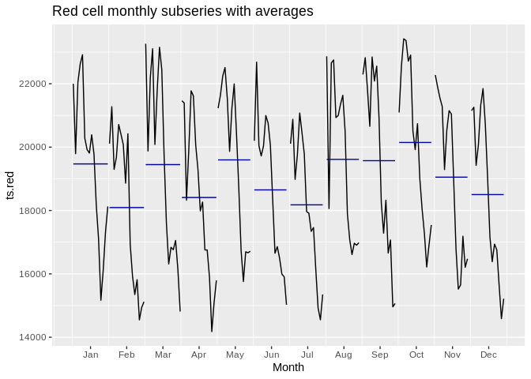<!-- -->

Next up,
platelets

``` r
ggseasonplot(ts.pla, year.labels = TRUE, year.labels.left = TRUE) + ggtitle("Platelet yearly seasonality")
```

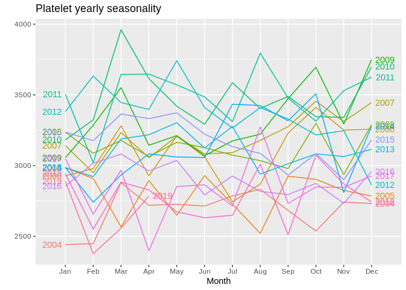<!-- -->

The pattern found in red cell sales is not as prominent in platelets,
but some zig-zagging is still
present.

``` r
ggseasonplot(ts.ffp, year.labels = TRUE, year.labels.left = TRUE) + ggtitle("Plasma yearly seasonality")
```

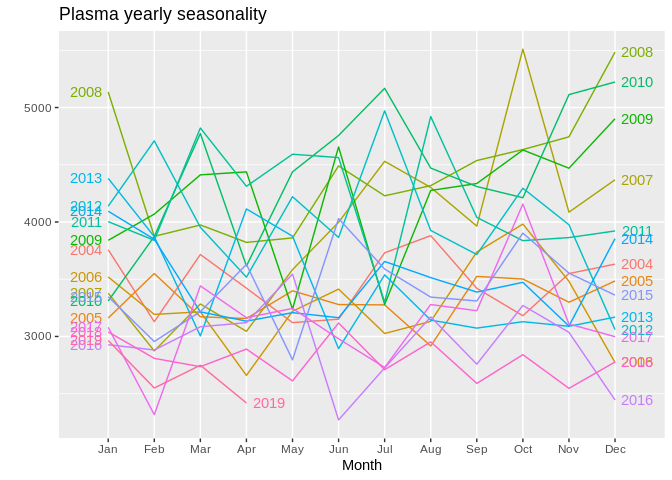<!-- -->

Frozen fresh plasma is even more messy, but some believable zig-zagging
could be pointed out.

So, there is some obvious seasonality in the series. Wonder what it
might look like if we try decomposing with
LOESS?

``` r
decomposed <- stl(ts.red, s.window="periodic")  # Seasonal and Trend decomposition using LOESS
seasonal <- decomposed$time.series[,1]          # Season component
trend <- decomposed$time.series[,2]             # Trend component
remainder <- decomposed$time.series[,3]         # Remainder component

autoplot(decomposed) + ggtitle("STL decomposition of red cell series")  # Plot
```

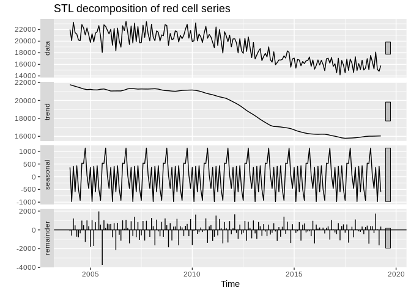<!-- -->

STL seems to think that the trend is significant, but that the remainder
is 3 to 4 times greater in magnitude compared to the seasonal component
(thus making the seasonality somewhat negligible), so it’s questionable
whether we should trust this decomposition. Let’s check the
autocorrelation of the
remainder:

``` r
ggAcf(remainder) + ggtitle("Autocorrelation of remainder in STL decomposition of red cell series")  # Plot
```

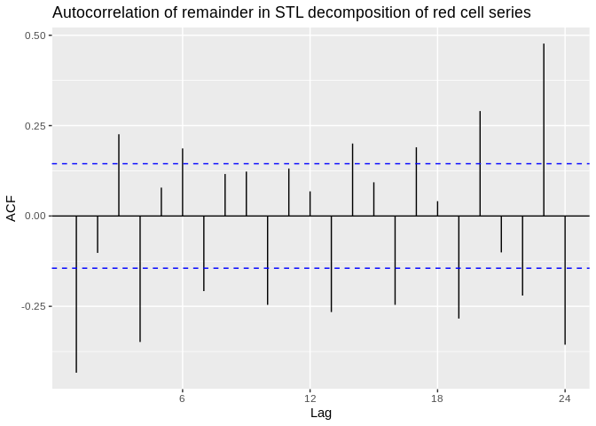<!-- -->

There is significant autocorrelation at multiple lags, which tells us
that either there is a considerable amount of information thrown out
during the decomposition or that the series is close to a random walk.
This is not a particularly good decomposition. Let’s check
decompositions for platelets and plasma also.

``` r
# Platelets
pla_decomposed <- stl(ts.pla, s.window="periodic")  # Seasonal and Trend decomposition using LOESS
pla_seasonal <- decomposed$time.series[,1]          # Season component
pla_trend <- decomposed$time.series[,2]             # Trend component
pla_remainder <- decomposed$time.series[,3]         # Remainder component

# FFP
ffp_decomposed <- stl(ts.ffp, s.window="periodic")  # Seasonal and Trend decomposition using LOESS
ffp_seasonal <- decomposed$time.series[,1]          # Season component
ffp_trend <- decomposed$time.series[,2]             # Trend component
ffp_remainder <- decomposed$time.series[,3]         # Remainder component

grid.arrange(grobs=list(autoplot(pla_decomposed),
                        autoplot(ffp_decomposed),
                        ggAcf(pla_remainder),
                        ggAcf(ffp_remainder)),
             layout_matrix=rbind(c(1, 2),
                                 c(3, 4)))
```

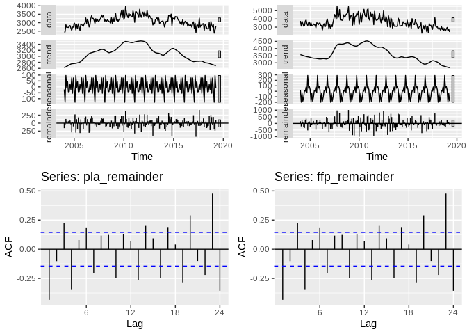<!-- -->

Same decomposition problems persist with platelets and plasma\!

## Old forecasts

Old forecasts are built using **STL+ETS** and **ETS** models, including
also a naïve 6 month repetition forecast. I will not be considering the
naïve “forecast” here, as I’m fairly certain we want to do proper
modelling.

``` r
# Seasonal and Trend decomposition by LOESS + ETS
# The t.window of stl() should be an odd number, but someone has decided against it here. Will investigate.
stl.red <- forecast(stl(ts.red, s.window="periodic", t.window=6), h=12)
stl.pla <- forecast(stl(ts.pla, s.window="periodic", t.window=6), h=12)
stl.ffp <- forecast(stl(ts.ffp, s.window="periodic", t.window=6), h=12)

# Exponential smoothing state space model
# ets() is an automated model selection function, so these are not the same model! Uses AICc, AIC and BIC.
ets.red <- forecast(ets(ts.red), h=12)
ets.pla <- forecast(ets(ts.pla), h=12)
ets.ffp <- forecast(ets(ts.ffp), h=12)

# Plot
grid.arrange(grobs=list(autoplot(stl.red),
                        autoplot(stl.pla),
                        autoplot(stl.ffp),
                        autoplot(ets.red),
                        autoplot(ets.pla),
                        autoplot(ets.ffp)),
             layout_matrix=rbind(c(1, 4),
                                 c(2, 5),
                                 c(3, 6)))
```

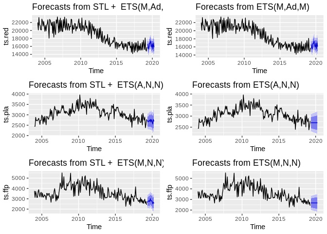<!-- -->

ETS models are based on weighted averages of past observations, with
*exponentially* decaying weights as the observations move further back
in time. The ETS function used in Tuimala’s script optimize the
smoothing parameters and initial values required by minimising the sum
of the squared errors (SSE). They can be simple explonential smoothing
models (SES), or state space models consisting of Error, Trend and
Seasonal parts. The \(ets()\) function used here tries to automatically
select the best model from the ets model family using information
criteria measures (AIC, AICc and BIC).

The STL+ETS models use a “Seasonal and Trend decomposition by LOESS”
method to extract the seasonal component of the series and feed the
seasonally adjusted series to the \(ets()\) function. As we saw from our
independent decompositions by STL, the seasonal component seems to be
rather small compared to everything else and possibly unreliable, which
explain why the STL+ETS and ETS models behave so similarly.

## Check the errors of yearly predictions.

``` r
yearly <- ggplot() 
forecast_errors <- c()
stl_RMSE <- c()
stl_MAPE <- c()
# Loop 
for(i in seq(from=2008, to=2018, by=1)){
  fit <- stl(window(ts.red, start=2004, end=c(i-1, 12)), s.window="periodic", t.window=6)  # Fit based on history so far
  fcast <- forecast(fit, h=12)  # Forecast the next year
  segment <- window(ts.red, start=i, end=c(i, 12))  # Extract that year from the history for plotting purposes
  
  # Build the plot piece by piece
  yearly <- yearly + autolayer(fcast) + autolayer(segment, colour=FALSE)
  
  # Calculate raw forecast errors
  forecast_errors <- c(forecast_errors, abs(data.frame(fcast)$Point.Forecast - segment))
  
  stl_RMSE <- c(stl_RMSE, data.frame(accuracy(fcast, segment))$RMSE)
  stl_MAPE <- c(stl_MAPE, data.frame(accuracy(fcast, segment))$MAPE)
}

yearly + ggtitle("STL+ETS forecast of red cell sales year by year") +
  scale_x_discrete(limits=c(2008, 2009, 2010, 2011, 2012, 2013, 2014, 2015, 2016, 2017, 2018)) + xlab("Time") +
  ylab("Unit sales")
```

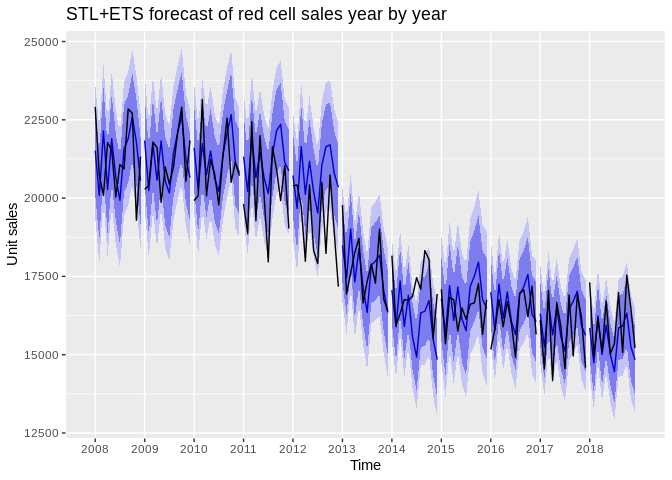<!-- -->

``` r
autoplot(ts(forecast_errors, start=2008, end=2018, frequency=12)) + ggtitle("STL+ETS historical forecast errors for red cells") + ylab("Unit sales")
```

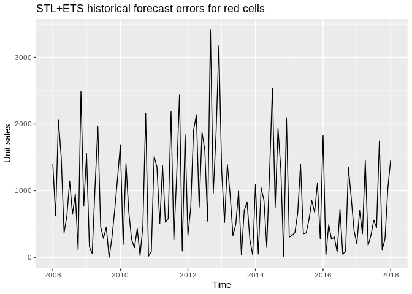<!-- -->

``` r
yearly_ets <- ggplot() 
ets_forecast_errors <- c()
ets_RMSE <- c()
ets_MAPE <- c()
# Loop 
for(i in seq(from=2008, to=2018, by=1)){
  fit <- ets(window(ts.red, start=2004, end=c(i-1, 12)))  # Fit based on history so far
  fcast <- forecast(fit, h=12)  # Forecast the next year
  segment <- window(ts.red, start=i, end=c(i, 12))  # Extract that year from the history for plotting purposes
  
  # Build the plot piece by piece
  yearly_ets <- yearly_ets + autolayer(fcast) + autolayer(segment, colour=FALSE)
  
  # Calculate forecast errors
  ets_forecast_errors <- c(ets_forecast_errors, abs(data.frame(fcast)$Point.Forecast - segment))
  
  ets_RMSE <- c(ets_RMSE, data.frame(accuracy(fcast, segment))$RMSE)
  ets_MAPE <- c(ets_MAPE, data.frame(accuracy(fcast, segment))$MAPE)
}

yearly_ets + ggtitle("ETS forecast of red cell sales year by year") +
  scale_x_discrete(limits=c(2008, 2009, 2010, 2011, 2012, 2013, 2014, 2015, 2016, 2017, 2018)) + xlab("Time") +
  ylab("Unit sales")
```

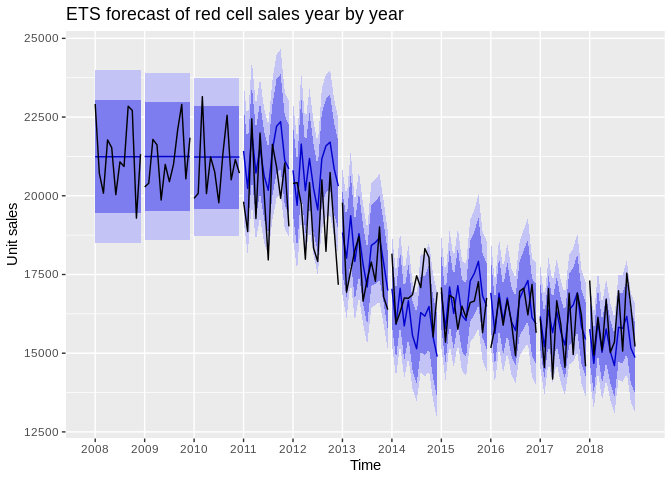<!-- -->

``` r
autoplot(ts(ets_forecast_errors, start=2008, end=2018, frequency=12)) + ggtitle("ETS historical forecast errors for red cells") + ylab("Unit sales")
```

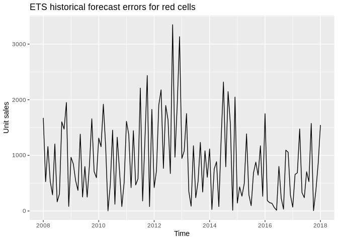<!-- -->

Now for the platelets and plasma:

``` r
####################
# STL + ETS MODELS
####################

# PLATELETS
yearly_pla <- ggplot() 
forecast_errors_pla <- c()
stl_pla_RMSE <- c()
stl_pla_MAPE <- c()
# Loop 
for(i in seq(from=2008, to=2018, by=1)){
  fit <- stl(window(ts.pla, start=2004, end=c(i-1, 12)), s.window="periodic", t.window=6)  # Fit based on history so far
  fcast <- forecast(fit, h=12)  # Forecast the next year
  segment <- window(ts.pla, start=i, end=c(i, 12))  # Extract that year from the history for plotting purposes
  
  # Build the plot piece by piece
  yearly_pla <- yearly_pla + autolayer(fcast) + autolayer(segment, colour=FALSE)
  
  # Calculate forecast errors
  forecast_errors_pla <- c(forecast_errors_pla, abs(data.frame(fcast)$Point.Forecast - segment))
  
  # Calculate RMSE and MAPE
  stl_pla_RMSE <- c(stl_pla_RMSE, data.frame(accuracy(fcast, segment))$RMSE)
  stl_pla_MAPE <- c(stl_pla_MAPE, data.frame(accuracy(fcast, segment))$MAPE)
}

# Plots
plap <- yearly_pla + ggtitle("STL+ETS forecast of platelet sales year by year") + 
  scale_x_discrete(limits=c(2008, 2009, 2010, 2011, 2012, 2013, 2014, 2015, 2016, 2017, 2018)) + xlab("Time") + 
  ylab("Unit sales")

pla_errs <- autoplot(ts(forecast_errors_pla, start=2008, end=2018, frequency=12)) + ggtitle("STL+ETS historical forecast errors for platelets") + ylab("Unit sales")

# PLASMA
yearly_ffp <- ggplot() 
forecast_errors_ffp <- c()
stl_ffp_RMSE <- c()
stl_ffp_MAPE <- c()
# Loop 
for(i in seq(from=2008, to=2018, by=1)){
  fit <- stl(window(ts.ffp, start=2004, end=c(i-1, 12)), s.window="periodic", t.window=6)  # Fit based on history so far
  fcast <- forecast(fit, h=12)  # Forecast the next year
  segment <- window(ts.ffp, start=i, end=c(i, 12))  # Extract that year from the history for plotting purposes
  
  # Build the plot piece by piece
  yearly_ffp <- yearly_ffp + autolayer(fcast) + autolayer(segment, colour=FALSE)
  
  # Calculate forecast errors
  forecast_errors_ffp <- c(forecast_errors_ffp, abs(data.frame(fcast)$Point.Forecast - segment))
  
  # Calculate RMSE and MAPE
  stl_ffp_RMSE <- c(stl_ffp_RMSE, data.frame(accuracy(fcast, segment))$RMSE)
  stl_ffp_MAPE <- c(stl_ffp_MAPE, data.frame(accuracy(fcast, segment))$MAPE)
}

# Plots
ffpp <- yearly_ffp + ggtitle("STL+ETS forecast of plasma sales year by year") + 
  scale_x_discrete(limits=c(2008, 2009, 2010, 2011, 2012, 2013, 2014, 2015, 2016, 2017, 2018)) + xlab("Time") + 
  ylab("Unit sales")

ffp_errs <- autoplot(ts(forecast_errors_ffp, start=2008, end=2018, frequency=12)) + ggtitle("STL+ETS historical forecast errors for plasma") + ylab("Unit sales")

###################
# ETS MODELS
###################

# PLATELETS
yearly_ets_pla <- ggplot() 
ets_forecast_errors_pla <- c()
ets_pla_RMSE <- c()
ets_pla_MAPE <- c()
# Loop 
for(i in seq(from=2008, to=2018, by=1)){
  fit <- ets(window(ts.pla, start=2004, end=c(i-1, 12)))  # Fit based on history so far
  fcast <- forecast(fit, h=12)  # Forecast the next year
  segment <- window(ts.pla, start=i, end=c(i, 12))  # Extract that year from the history for plotting purposes
  
  # Build the plot piece by piece
  yearly_ets_pla <- yearly_ets_pla + autolayer(fcast) + autolayer(segment, colour=FALSE)
  
  # Calculate forecast errors
  ets_forecast_errors_pla <- c(ets_forecast_errors_pla, abs(data.frame(fcast)$Point.Forecast - segment))
  
  # Calculate RMSE and MAPE
  ets_pla_RMSE <- c(ets_pla_RMSE, data.frame(accuracy(fcast, segment))$RMSE)
  ets_pla_MAPE <- c(ets_pla_MAPE, data.frame(accuracy(fcast, segment))$MAPE)
}

ets_plap <- yearly_ets + ggtitle("ETS forecast of platelet sales year by year") +
  scale_x_discrete(limits=c(2008, 2009, 2010, 2011, 2012, 2013, 2014, 2015, 2016, 2017, 2018)) + xlab("Time") +
  ylab("Unit sales")

ets_pla_errs <- autoplot(ts(ets_forecast_errors_pla, start=2008, end=2018, frequency=12)) + ggtitle("ETS historical forecast errors for platelets") + ylab("Unit sales")

# PLASMA
yearly_ets_ffp <- ggplot() 
ets_forecast_errors_ffp <- c()
ets_ffp_RMSE <- c()
ets_ffp_MAPE <- c()
# Loop 
for(i in seq(from=2008, to=2018, by=1)){
  fit <- ets(window(ts.ffp, start=2004, end=c(i-1, 12)))  # Fit based on history so far
  fcast <- forecast(fit, h=12)  # Forecast the next year
  segment <- window(ts.ffp, start=i, end=c(i, 12))  # Extract that year from the history for plotting purposes
  
  # Build the plot piece by piece
  yearly_ets_ffp <- yearly_ets_ffp + autolayer(fcast) + autolayer(segment, colour=FALSE)
  
  # Calculate raw forecast errors
  ets_forecast_errors_ffp <- c(ets_forecast_errors_ffp, abs(data.frame(fcast)$Point.Forecast - segment))
  
  # Calculate RMSE and MAPE
  ets_ffp_RMSE <- c(ets_ffp_RMSE, data.frame(accuracy(fcast, segment))$RMSE)
  ets_ffp_MAPE <- c(ets_ffp_MAPE, data.frame(accuracy(fcast, segment))$MAPE)
}

ets_ffpp <- yearly_ets_ffp + ggtitle("ETS forecast of plasma sales year by year") +
  scale_x_discrete(limits=c(2008, 2009, 2010, 2011, 2012, 2013, 2014, 2015, 2016, 2017, 2018)) + xlab("Time") +
  ylab("Unit sales")

ets_ffp_errs <- autoplot(ts(ets_forecast_errors_ffp, start=2008, end=2018, frequency=12)) + ggtitle("ETS historical forecast errors for plasma") + ylab("Unit sales")

#########
# PLOT
#########

grid.arrange(grobs=list(plap,
                        pla_errs,
                        ffpp,
                        ffp_errs,
                        ets_plap,
                        ets_pla_errs,
                        ets_ffpp,
                        ets_ffp_errs),
             layout_matrix=rbind(c(1, 2),
                                 c(3, 4),
                                 c(5, 6),
                                 c(7, 8)))
```

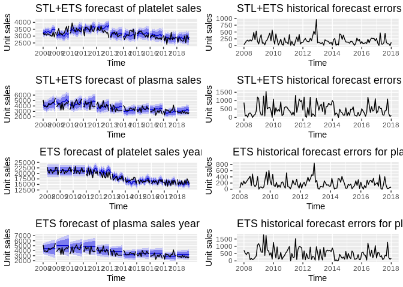<!-- -->

Sandbox for closer inspection:

``` r
plap  # Platelets STL
```

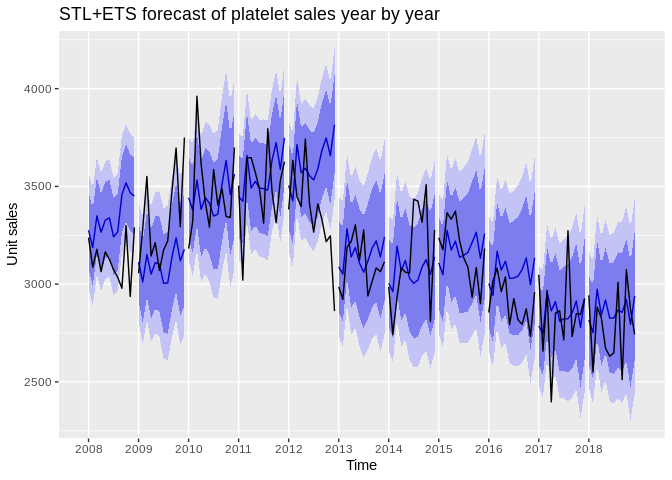<!-- -->

Find out which performed better on average:

``` r
results <- matrix(c(mean(stl_RMSE), mean(stl_MAPE), 
                    mean(ets_RMSE), mean(ets_MAPE), 
                    mean(stl_pla_RMSE), mean(stl_pla_MAPE),
                    mean(ets_pla_RMSE), mean(ets_pla_MAPE),
                    mean(stl_ffp_RMSE), mean(stl_ffp_MAPE),
                    mean(ets_ffp_RMSE), mean(ets_ffp_MAPE)),ncol=2,byrow=TRUE)
colnames(results) <- c("RMSE", "MAPE")
rownames(results) <- c("STL+ETS red", 
                       "ETS red", 
                       "STL+ETS pla",
                       "ETS pla",
                       "STL+ETS ffp",
                       "ETS ffp")
results <- kable(results, "markdown")
results
```

|             |      RMSE |      MAPE |
| :---------- | --------: | --------: |
| STL+ETS red | 1037.4420 |  4.382631 |
| ETS red     | 1076.3851 |  4.572516 |
| STL+ETS pla |  195.9130 |  5.130505 |
| ETS pla     |  207.2205 |  5.403643 |
| STL+ETS ffp |  498.5572 | 10.965570 |
| ETS ffp     |  524.8731 | 11.796454 |

## Playing around with a NN

``` r
library(ggplot2)
fit <- nnetar(ts.red, lambda=0)
autoplot(forecast(fit, PI=TRUE, h=12))
```

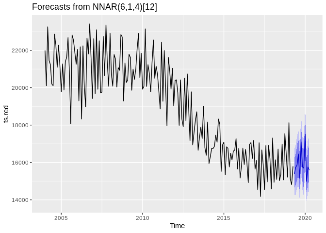<!-- -->
