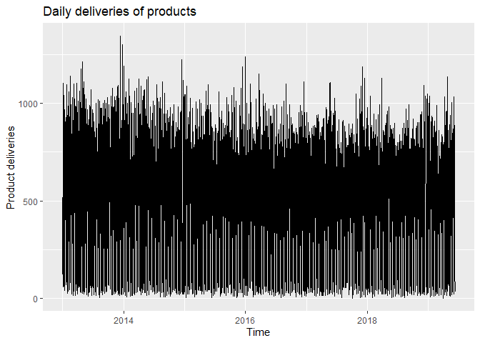
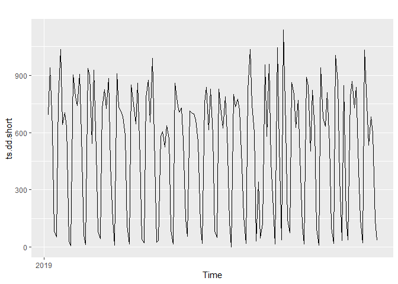
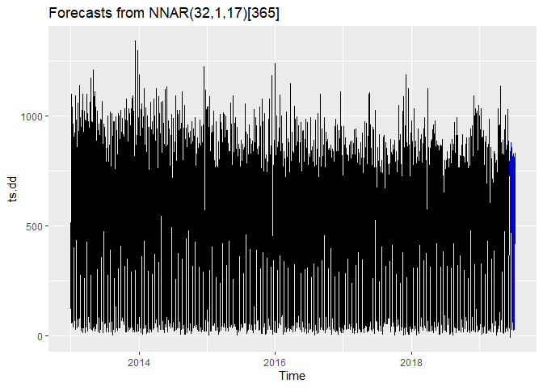

Daily Deliveries Lab
================

``` r
# Set working directory
# knitr::opts_knit$set(root.dir = "/home/esa/production_forecasts") # Working on Ubuntu
knitr::opts_knit$set(root.dir = "V:/production_forecasts") # Working home
```

## Create original dataset that should remain immutable throughout labbing

``` r
library(forecast)
library(ggplot2)
library(gridExtra)
library(knitr)
library(xlsx)
source("src/evalhelp.R")

# Load data
dd <- read.xlsx("./data/deliveries_daily.xlsx", sheetName = "Document_CH207")
colnames(dd) <- c("Date", "Deliveries")
```

``` r
# Omit empty values
dd <- na.omit(dd)
```

## Create the time series object

``` r
ts.dd <- ts(dd$Deliveries, 
             start = as.numeric(c(2013, 1)), 
             frequency = 365)  # This tells the series that it is daily data
autoplot(ts.dd) + ggtitle("Daily deliveries of products") + ylab("Product deliveries")
```

<!-- -->

``` r
ts.dd.short <- window(ts.dd, start = c(2019, 3))
autoplot(ts.dd.short)
```

<!-- -->

The weekly level seems to be very well behaving. Saturdays and Sundays
see deliveries under hundred, while mondays start at over 900 to 1000.
There also seems to be a consistent dip at Wednesday\!

## A neural net

``` r
nnetar.e <- tsCV(ts.dd, fnnet, h = 1)
nnetar.crit <- cMAPE(nnetar.e, ts.dd)
nnetar.mape <- mean(abs(100*nnetar.e/ts.dd), na.rm = TRUE)
nnetar.rmse <- sqrt(mean(nnetar.e^2, na.rm = TRUE))

netarbench <- matrix(c(nnetar.crit, nnetar.mape, nnetar.rmse),
                   ncol = 3,
                   byrow = TRUE)
colnames(netarbench) <- c("cMAPE", "MAPE", "RMSE")
rownames(netarbench) <- c("NN")
kable(netarbench, "markdown")
```

|    |    cMAPE |     MAPE |     RMSE |
| :- | -------: | -------: | -------: |
| NN | 197.0299 | 132.3311 | 175.3787 |

``` r
autoplot(forecast(nnetar(ts.dd, PI = TRUE), h=30))
```

<!-- -->
