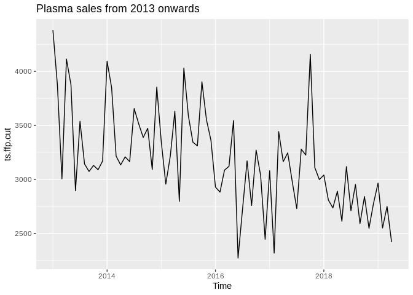
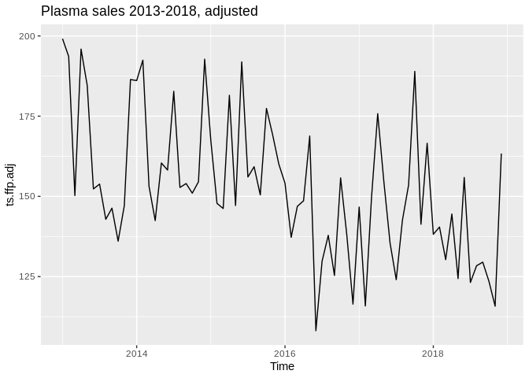
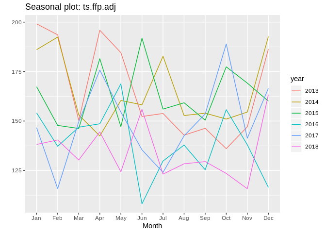
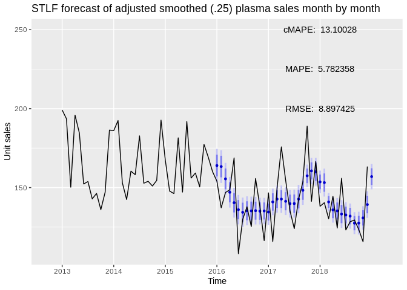
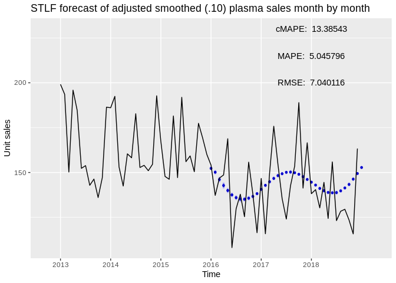

Benchmarking Lab: FFP
================

``` r
# Set working directory
knitr::opts_knit$set(root.dir = "/home/esa/production_forecasts") # Working on Ubuntu
# knitr::opts_knit$set(root.dir = "V:/production_forecasts") # Working home
# knitr::opts_knit$set(root.dir = "C:/Users/esatu/production_forecasts") # Working on laptop
```

## Create original dataset that should remain immutable throughout labbing

``` r
library(forecast)
library(ggplot2)
library(gridExtra)
library(knitr)
library(readxl)
source("src/evalhelp.R")

# Load data
monthly_sales <- read.table("./data/kuukausimyynti.txt", header = T, sep = "\t")

# Separate yyyy/mmm column into months and years
monthly_sales$year <- substr(monthly_sales$kuukausi, 1, 4)
monthly_sales$month <- factor(substr(monthly_sales$kuukausi, 6, 8), levels = c("tam", "hel", "maa", "huh", "tou", "kes", "hei", "elo", "syy", "lok", "mar", "jou"))

# Create a numeric column for months
monthly_sales$month_num <- as.numeric(monthly_sales$month)

# Omit empty values
d <- na.omit(monthly_sales)
```

## Create the time series object

``` r
ts.ffp <- ts(d$FFP, 
             start = as.numeric(c(d$year[1], d$month_num[1])), 
             end = as.numeric(c(tail(d$year, 1), tail(d$month_num, 1))), 
             frequency = 12)  # This tells the series that it is monthly data
```

## Previously used production forecasts

These are our true benchmark before any improvements

``` r
# STL + ETS
old.stl.e <- tsCV(ts.ffp, fstl, t.window = 6, h = 1)
old.stl.crit <- cMAPE(old.stl.e, ts.ffp)
old.stl.mape <- mean(abs(100*old.stl.e/ts.ffp), na.rm = TRUE)
old.stl.rmse <- sqrt(mean(old.stl.e^2, na.rm = TRUE))

# ETS
old.ets.e <- tsCV(ts.ffp, fets, h = 1)
old.ets.crit <- cMAPE(old.ets.e, ts.ffp)
old.ets.mape <- mean(abs(100*old.ets.e/ts.ffp), na.rm = TRUE)
old.ets.rmse <- sqrt(mean(old.ets.e^2, na.rm = TRUE))


# Table
oldbench <- matrix(c(old.stl.crit, old.stl.mape, old.stl.rmse, 
                     old.ets.crit, old.ets.mape, old.ets.rmse),
                   ncol = 3,
                   byrow = TRUE)

colnames(oldbench) <- c("cMAPE", "MAPE", "RMSE")
rownames(oldbench) <- c("old STL", "old ETS")
kable(oldbench, "markdown")
```

|         |    cMAPE |     MAPE |     RMSE |
| :------ | -------: | -------: | -------: |
| old STL | 16.63378 | 10.98079 | 513.9762 |
| old ETS | 15.65900 | 10.16362 | 476.9400 |

## Get baseline benchmarks to beat

These are our absolute worst forecasts we can make. A random walk
forecast takes the previous value of the series and walks randomly to
some direction. A naive forecast will forecast only the previous value
of the series. A seasonal naive will forecast only the previous value of
the same season of the series. Mean forecast will forecast the series
mean.

``` r
# Random walk with drift
rwf.e <- tsCV(ts.ffp, rwf, drift = TRUE, h = 1)
rwf.crit <- cMAPE(rwf.e, ts.ffp)
rwf.rmse <- sqrt(mean(rwf.e^2, na.rm = TRUE))
rwf.mape <- mean(abs(100*rwf.e/ts.ffp), na.rm = TRUE)

# Naive
naive.e <- tsCV(ts.ffp, naive, h = 1)
naive.crit <- cMAPE(naive.e, ts.ffp)
naive.rmse <- sqrt(mean(naive.e^2, na.rm = TRUE))
naive.mape <- mean(abs(100*naive.e/ts.ffp), na.rm = TRUE)

# Seasonal naive
snaive.e <- tsCV(ts.ffp, snaive, h = 1)
snaive.crit <- cMAPE(snaive.e, ts.ffp)
snaive.rmse <- sqrt(mean(snaive.e^2, na.rm = TRUE))
snaive.mape <- mean(abs(100*snaive.e/ts.ffp), na.rm = TRUE)

# Mean forecast
meanf.e <- tsCV(ts.ffp, meanf, h = 1)
meanf.crit <- cMAPE(meanf.e, ts.ffp)
meanf.rmse <- sqrt(mean(meanf.e^2, na.rm = TRUE))
meanf.mape <- mean(abs(100*meanf.e/ts.ffp), na.rm = TRUE)

benchmarks <- matrix(c(rwf.crit, rwf.mape, rwf.rmse,
                       naive.crit, naive.mape, naive.rmse,
                       snaive.crit, snaive.mape, snaive.rmse,
                       meanf.crit, meanf.mape, meanf.rmse),
                     ncol = 3,
                     byrow = TRUE)
colnames(benchmarks) <- c("cMAPE", "MAPE", "RMSE")
rownames(benchmarks) <- c("RWF", "NAIVE", "SNAIVE", "MEANF")
kable(benchmarks, "markdown")
```

|        |    cMAPE |     MAPE |     RMSE |
| :----- | -------: | -------: | -------: |
| RWF    | 18.69029 | 12.94736 | 608.2189 |
| NAIVE  | 18.57157 | 12.73501 | 598.3025 |
| SNAIVE | 22.05153 | 13.91718 | 651.1486 |
| MEANF  | 26.02951 | 16.00014 | 683.1530 |

These are considerably worse than our old forecasts, which is to be
expected.

## Cutting our series

Next, we’ll limit our series scope to 2013. This ought to improve our
forecasts some, as the significant level change that occurred in
2012-2013 doesn’t get to affect our modelling. We will later limit this
series to the end of 2018 in order to to business day adjustments.

``` r
# Window
ts.ffp.cut<- window(ts.ffp, start = 2013)
autoplot(ts.ffp.cut) + ggtitle("Plasma sales from 2013 onwards")
```

<!-- --> We
will now run all of our benchmarks again in a single chunk (to save
space).

``` r
# STL + ETS
old.stl.e <- tsCV(ts.ffp.cut, fstl, t.window = 6, h = 1)
old.stl.crit <- cMAPE(old.stl.e, ts.ffp.cut)
old.stl.mape <- mean(abs(100*old.stl.e/ts.ffp.cut), na.rm = TRUE)
old.stl.rmse <- sqrt(mean(old.stl.e^2, na.rm = TRUE))

# ETS
old.ets.e <- tsCV(ts.ffp.cut, fets, h = 1)
old.ets.crit <- cMAPE(old.ets.e, ts.ffp.cut)
old.ets.mape <- mean(abs(100*old.ets.e/ts.ffp.cut), na.rm = TRUE)
old.ets.rmse <- sqrt(mean(old.ets.e^2, na.rm = TRUE))

# Random walk with drift
rwf.e <- tsCV(ts.ffp.cut, rwf, drift = TRUE, h = 1)
rwf.crit <- cMAPE(rwf.e, ts.ffp.cut)
rwf.rmse <- sqrt(mean(rwf.e^2, na.rm = TRUE))
rwf.mape <- mean(abs(100*rwf.e/ts.ffp.cut), na.rm = TRUE)

# Naive
naive.e <- tsCV(ts.ffp.cut, naive, h = 1)
naive.crit <- cMAPE(naive.e, ts.ffp.cut)
naive.rmse <- sqrt(mean(naive.e^2, na.rm = TRUE))
naive.mape <- mean(abs(100*naive.e/ts.ffp.cut), na.rm = TRUE)

# Seasonal naive
snaive.e <- tsCV(ts.ffp.cut, snaive, h = 1)
snaive.crit <- cMAPE(snaive.e, ts.ffp.cut)
snaive.rmse <- sqrt(mean(snaive.e^2, na.rm = TRUE))
snaive.mape <- mean(abs(100*snaive.e/ts.ffp.cut), na.rm = TRUE)

# Mean forecast
meanf.e <- tsCV(ts.ffp.cut, meanf, h = 1)
meanf.crit <- cMAPE(meanf.e, ts.ffp.cut)
meanf.rmse <- sqrt(mean(meanf.e^2, na.rm = TRUE))
meanf.mape <- mean(abs(100*meanf.e/ts.ffp.cut), na.rm = TRUE)

# Table
cutbench <- matrix(c(old.stl.crit, old.stl.mape, old.stl.rmse, 
                     old.ets.crit, old.ets.mape, old.ets.rmse,
                     rwf.crit, rwf.mape, rwf.rmse,
                     naive.crit, naive.mape, naive.rmse,
                     snaive.crit, snaive.mape, snaive.rmse,
                     meanf.crit, meanf.mape, meanf.rmse),
                     ncol = 3,
                     byrow = TRUE)

colnames(cutbench) <- c("cMAPE", "MAPE", "RMSE")
rownames(cutbench) <- c("STL", "ETS", "RWF", "NAIVE", "SNAIVE", "MEANF")
kable(cutbench, "markdown")
```

|        |    cMAPE |     MAPE |     RMSE |
| :----- | -------: | -------: | -------: |
| STL    | 20.02782 | 12.34761 | 480.7574 |
| ETS    | 17.71578 | 10.81064 | 458.5317 |
| RWF    | 18.38942 | 13.13848 | 533.9521 |
| NAIVE  | 18.76348 | 12.66934 | 505.8655 |
| SNAIVE | 28.47593 | 16.21391 | 655.4871 |
| MEANF  | 22.71205 | 12.37661 | 467.6460 |

## Business day adjustment (series between 2013 - 2018)

``` r
# Load business day data
biz <- read_excel("./data/workdays_monthly.xlsx", sheet = "Tabella")
```

    ## New names:
    ## * `` -> ...1

``` r
colnames(biz) <- c("month", "days")

# Business day adjustment
ts.ffp.adj <- window(ts.ffp, start = 2013, end = c(2018, 12)) / tail(head(biz$days, 84), 72)
```

Let’s see how our series looks now

``` r
autoplot(ts.ffp.adj) + ggtitle("Plasma sales 2013-2018, adjusted")
```

<!-- -->

``` r
ggseasonplot(ts.ffp.adj)
```

<!-- -->

We will build all our future models based on this adjustment. Let’s see
if it gives any improvement on our earlier benchmarks:

``` r
# STL + ETS
new.stl.e <- tsCV(ts.ffp.adj, fstl, t.window = 6, h = 1)
new.stl.crit <- cMAPE(new.stl.e, ts.ffp.adj)
new.stl.mape <- mean(abs(100*new.stl.e/ts.ffp.adj), na.rm = TRUE)
new.stl.rmse <- sqrt(mean(new.stl.e^2, na.rm = TRUE))

# ETS
new.ets.e <- tsCV(ts.ffp.adj, fets, h = 1)
new.ets.crit <- cMAPE(new.ets.e, ts.ffp.adj)
new.ets.mape <- mean(abs(100*new.ets.e/ts.ffp.adj), na.rm = TRUE)
new.ets.rmse <- sqrt(mean(new.ets.e^2, na.rm = TRUE))

# Random walk with drift
rwf.e.adj <- tsCV(ts.ffp.adj, rwf, drift = TRUE, h = 1)
rwf.crit.adj <- cMAPE(rwf.e.adj, ts.ffp.adj)
rwf.rmse.adj <- sqrt(mean(rwf.e.adj^2, na.rm = TRUE))
rwf.mape.adj <- mean(abs(100*rwf.e.adj/ts.ffp.adj), na.rm = TRUE)

# Naive
naive.e.adj <- tsCV(ts.ffp.adj, naive, h = 1)
naive.crit.adj <- cMAPE(naive.e.adj, ts.ffp.adj)
naive.rmse.adj <- sqrt(mean(naive.e.adj^2, na.rm = TRUE))
naive.mape.adj <- mean(abs(100*naive.e.adj/ts.ffp.adj), na.rm = TRUE)

# Seasonal naive
snaive.e.adj <- tsCV(ts.ffp.adj, snaive, h = 1)
snaive.crit.adj <- cMAPE(snaive.e.adj, ts.ffp.adj)
snaive.rmse.adj <- sqrt(mean(snaive.e.adj^2, na.rm = TRUE))
snaive.mape.adj <- mean(abs(100*snaive.e.adj/ts.ffp.adj), na.rm = TRUE)

# Mean forecast
meanf.e.adj <- tsCV(ts.ffp.adj, meanf, h = 1)
meanf.crit.adj <- cMAPE(meanf.e.adj, ts.ffp.adj)
meanf.rmse.adj <- sqrt(mean(meanf.e.adj^2, na.rm = TRUE))
meanf.mape.adj <- mean(abs(100*meanf.e.adj/ts.ffp.adj), na.rm = TRUE)

# Table
adjusted <- matrix(c(new.stl.crit, new.stl.mape, new.stl.rmse, 
                     new.ets.crit, new.ets.mape, new.ets.rmse,
                     rwf.crit.adj, rwf.mape.adj, rwf.rmse.adj,
                     naive.crit.adj, naive.mape.adj, naive.rmse.adj,
                     snaive.crit.adj, snaive.mape.adj, snaive.rmse.adj,
                     meanf.crit.adj, meanf.mape.adj, meanf.rmse.adj),
                     ncol = 3,
                     byrow = TRUE)

colnames(adjusted) <- c("cMAPE", "MAPE", "RMSE")
rownames(adjusted) <- c("STL", "ETS", "RWF", "NAIVE", "SNAIVE", "MEANF")
kable(adjusted, "markdown")
```

|        |    cMAPE |     MAPE |     RMSE |
| :----- | -------: | -------: | -------: |
| STL    | 21.24462 | 13.56317 | 24.36697 |
| ETS    | 18.29829 | 11.48900 | 20.82977 |
| RWF    | 19.12534 | 13.60701 | 25.55531 |
| NAIVE  | 18.93952 | 12.95620 | 24.29857 |
| SNAIVE | 27.25319 | 15.75394 | 29.64056 |
| MEANF  | 23.40799 | 12.95711 | 22.51149 |

## Rolling windows

``` r
# 4 YEARS

# STL + ETS
new.stl.4.e <- tsCV(ts.ffp.adj, fstl, t.window = 6, h = 1, window = 48)
new.stl.4.crit <- cMAPE(new.stl.4.e, ts.ffp.adj)
new.stl.4.mape <- mean(abs(100*new.stl.4.e/ts.ffp.adj), na.rm = TRUE)
new.stl.4.rmse <- sqrt(mean(new.stl.4.e^2, na.rm = TRUE))

# ETS
new.ets.4.e <- tsCV(ts.ffp.adj, fets, h = 1, window = 48)
new.ets.4.crit <- cMAPE(new.ets.4.e, ts.ffp.adj)
new.ets.4.mape <- mean(abs(100*new.ets.4.e/ts.ffp.adj), na.rm = TRUE)
new.ets.4.rmse <- sqrt(mean(new.ets.4.e^2, na.rm = TRUE))

# Random walk with drift
rwf.e.4.adj <- tsCV(ts.ffp.adj, rwf, drift = TRUE, h = 1, window = 48)
rwf.crit.4.adj <- cMAPE(rwf.e.4.adj, ts.ffp.adj)
rwf.rmse.4.adj <- sqrt(mean(rwf.e.4.adj^2, na.rm = TRUE))
rwf.mape.4.adj <- mean(abs(100*rwf.e.4.adj/ts.ffp.adj), na.rm = TRUE)

# Naive
naive.e.4.adj <- tsCV(ts.ffp.adj, naive, h = 1, window = 48)
naive.crit.4.adj <- cMAPE(naive.e.4.adj, ts.ffp.adj)
naive.rmse.4.adj <- sqrt(mean(naive.e.4.adj^2, na.rm = TRUE))
naive.mape.4.adj <- mean(abs(100*naive.e.4.adj/ts.ffp.adj), na.rm = TRUE)

# Seasonal naive
snaive.e.4.adj <- tsCV(ts.ffp.adj, snaive, h = 1, window = 48)
snaive.crit.4.adj <- cMAPE(snaive.e.4.adj, ts.ffp.adj)
snaive.rmse.4.adj <- sqrt(mean(snaive.e.4.adj^2, na.rm = TRUE))
snaive.mape.4.adj <- mean(abs(100*snaive.e.4.adj/ts.ffp.adj), na.rm = TRUE)

# Mean forecast
meanf.e.4.adj <- tsCV(ts.ffp.adj, meanf, h = 1, window = 48)
meanf.crit.4.adj <- cMAPE(meanf.e.4.adj, ts.ffp.adj)
meanf.rmse.4.adj <- sqrt(mean(meanf.e.4.adj^2, na.rm = TRUE))
meanf.mape.4.adj <- mean(abs(100*meanf.e.4.adj/ts.ffp.adj), na.rm = TRUE)


# 3 YEARS

# STL + ETS
new.stl.3.e <- tsCV(ts.ffp.adj, fstl, t.window = 6, h = 1, window = 36)
new.stl.3.crit <- cMAPE(new.stl.3.e, ts.ffp.adj)
new.stl.3.mape <- mean(abs(100*new.stl.3.e/ts.ffp.adj), na.rm = TRUE)
new.stl.3.rmse <- sqrt(mean(new.stl.3.e^2, na.rm = TRUE))

# ETS
new.ets.3.e <- tsCV(ts.ffp.adj, fets, h = 1, window = 36)
new.ets.3.crit <- cMAPE(new.ets.3.e, ts.ffp.adj)
new.ets.3.mape <- mean(abs(100*new.ets.3.e/ts.ffp.adj), na.rm = TRUE)
new.ets.3.rmse <- sqrt(mean(new.ets.3.e^2, na.rm = TRUE))

# Random walk with drift
rwf.e.3.adj <- tsCV(ts.ffp.adj, rwf, drift = TRUE, h = 1, window = 36)
rwf.crit.3.adj <- cMAPE(rwf.e.3.adj, ts.ffp.adj)
rwf.rmse.3.adj <- sqrt(mean(rwf.e.3.adj^2, na.rm = TRUE))
rwf.mape.3.adj <- mean(abs(100*rwf.e.3.adj/ts.ffp.adj), na.rm = TRUE)

# Naive
naive.e.3.adj <- tsCV(ts.ffp.adj, naive, h = 1, window = 36)
naive.crit.3.adj <- cMAPE(naive.e.3.adj, ts.ffp.adj)
naive.rmse.3.adj <- sqrt(mean(naive.e.3.adj^2, na.rm = TRUE))
naive.mape.3.adj <- mean(abs(100*naive.e.3.adj/ts.ffp.adj), na.rm = TRUE)

# Seasonal naive
snaive.e.3.adj <- tsCV(ts.ffp.adj, snaive, h = 1, window = 36)
snaive.crit.3.adj <- cMAPE(snaive.e.3.adj, ts.ffp.adj)
snaive.rmse.3.adj <- sqrt(mean(snaive.e.3.adj^2, na.rm = TRUE))
snaive.mape.3.adj <- mean(abs(100*snaive.e.3.adj/ts.ffp.adj), na.rm = TRUE)

# Mean forecast
meanf.e.3.adj <- tsCV(ts.ffp.adj, meanf, h = 1, window = 36)
meanf.crit.3.adj <- cMAPE(meanf.e.3.adj, ts.ffp.adj)
meanf.rmse.3.adj <- sqrt(mean(meanf.e.3.adj^2, na.rm = TRUE))
meanf.mape.3.adj <- mean(abs(100*meanf.e.3.adj/ts.ffp.adj), na.rm = TRUE)


# 2 YEARS

# STL + ETS (not possible)
new.stl.2.crit <- NA
new.stl.2.mape <- NA
new.stl.2.rmse <- NA

# ETS
new.ets.2.e <- tsCV(ts.ffp.adj, fets, h = 1, window = 24)
new.ets.2.crit <- cMAPE(new.ets.2.e, ts.ffp.adj)
new.ets.2.mape <- mean(abs(100*new.ets.2.e/ts.ffp.adj), na.rm = TRUE)
new.ets.2.rmse <- sqrt(mean(new.ets.2.e^2, na.rm = TRUE))

# Random walk with drift
rwf.e.2.adj <- tsCV(ts.ffp.adj, rwf, drift = TRUE, h = 1, window = 24)
rwf.crit.2.adj <- cMAPE(rwf.e.2.adj, ts.ffp.adj)
rwf.rmse.2.adj <- sqrt(mean(rwf.e.2.adj^2, na.rm = TRUE))
rwf.mape.2.adj <- mean(abs(100*rwf.e.2.adj/ts.ffp.adj), na.rm = TRUE)

# Naive
naive.e.2.adj <- tsCV(ts.ffp.adj, naive, h = 1, window = 24)
naive.crit.2.adj <- cMAPE(naive.e.2.adj, ts.ffp.adj)
naive.rmse.2.adj <- sqrt(mean(naive.e.2.adj^2, na.rm = TRUE))
naive.mape.2.adj <- mean(abs(100*naive.e.2.adj/ts.ffp.adj), na.rm = TRUE)

# Seasonal naive
snaive.e.2.adj <- tsCV(ts.ffp.adj, snaive, h = 1, window = 24)
snaive.crit.2.adj <- cMAPE(snaive.e.2.adj, ts.ffp.adj)
snaive.rmse.2.adj <- sqrt(mean(snaive.e.2.adj^2, na.rm = TRUE))
snaive.mape.2.adj <- mean(abs(100*snaive.e.2.adj/ts.ffp.adj), na.rm = TRUE)

# Mean forecast
meanf.e.2.adj <- tsCV(ts.ffp.adj, meanf, h = 1, window = 24)
meanf.crit.2.adj <- cMAPE(meanf.e.2.adj, ts.ffp.adj)
meanf.rmse.2.adj <- sqrt(mean(meanf.e.2.adj^2, na.rm = TRUE))
meanf.mape.2.adj <- mean(abs(100*meanf.e.2.adj/ts.ffp.adj), na.rm = TRUE)


# 1 YEAR

# STL + ETS (not possible)
new.stl.1.crit <- NA
new.stl.1.mape <- NA
new.stl.1.rmse <- NA

# ETS
new.ets.1.e <- tsCV(ts.ffp.adj, fets, h = 1, window = 12)
new.ets.1.crit <- cMAPE(new.ets.1.e, ts.ffp.adj)
new.ets.1.mape <- mean(abs(100*new.ets.1.e/ts.ffp.adj), na.rm = TRUE)
new.ets.1.rmse <- sqrt(mean(new.ets.1.e^2, na.rm = TRUE))

# Random walk with drift
rwf.e.1.adj <- tsCV(ts.ffp.adj, rwf, drift = TRUE, h = 1, window = 12)
rwf.crit.1.adj <- cMAPE(rwf.e.1.adj, ts.ffp.adj)
rwf.rmse.1.adj <- sqrt(mean(rwf.e.1.adj^2, na.rm = TRUE))
rwf.mape.1.adj <- mean(abs(100*rwf.e.1.adj/ts.ffp.adj), na.rm = TRUE)

# Naive
naive.e.1.adj <- tsCV(ts.ffp.adj, naive, h = 1, window = 12)
naive.crit.1.adj <- cMAPE(naive.e.1.adj, ts.ffp.adj)
naive.rmse.1.adj <- sqrt(mean(naive.e.1.adj^2, na.rm = TRUE))
naive.mape.1.adj <- mean(abs(100*naive.e.1.adj/ts.ffp.adj), na.rm = TRUE)

# Seasonal naive
snaive.e.1.adj <- tsCV(ts.ffp.adj, snaive, h = 1, window = 12)
snaive.crit.1.adj <- cMAPE(snaive.e.1.adj, ts.ffp.adj)
snaive.rmse.1.adj <- sqrt(mean(snaive.e.1.adj^2, na.rm = TRUE))
snaive.mape.1.adj <- mean(abs(100*snaive.e.1.adj/ts.ffp.adj), na.rm = TRUE)

# Mean forecast
meanf.e.1.adj <- tsCV(ts.ffp.adj, meanf, h = 1, window = 12)
meanf.crit.1.adj <- cMAPE(meanf.e.1.adj, ts.ffp.adj)
meanf.rmse.1.adj <- sqrt(mean(meanf.e.1.adj^2, na.rm = TRUE))
meanf.mape.1.adj <- mean(abs(100*meanf.e.1.adj/ts.ffp.adj), na.rm = TRUE)

# Table
rolling <- matrix(c(new.stl.4.crit, new.stl.4.mape, new.stl.4.rmse,
                    new.ets.4.crit, new.ets.4.mape, new.ets.4.rmse,
                    rwf.crit.4.adj, rwf.mape.4.adj, rwf.rmse.4.adj,
                    naive.crit.4.adj, naive.mape.4.adj, naive.rmse.4.adj,
                    snaive.crit.4.adj, snaive.mape.4.adj, snaive.rmse.4.adj,
                    meanf.crit.4.adj, meanf.mape.4.adj, meanf.rmse.4.adj,
                    new.stl.3.crit, new.stl.3.mape, new.stl.3.rmse, 
                    new.ets.3.crit, new.ets.3.mape, new.ets.3.rmse,
                    rwf.crit.3.adj, rwf.mape.3.adj, rwf.rmse.3.adj,
                    naive.crit.3.adj, naive.mape.3.adj, naive.rmse.3.adj,
                    snaive.crit.3.adj, snaive.mape.3.adj, snaive.rmse.3.adj,
                    meanf.crit.3.adj, meanf.mape.3.adj, meanf.rmse.3.adj,
                    new.stl.2.crit, new.stl.2.mape, new.stl.2.rmse,
                    new.ets.2.crit, new.ets.2.mape, new.ets.2.rmse,
                    rwf.crit.2.adj, rwf.mape.2.adj, rwf.rmse.2.adj,
                    naive.crit.2.adj, naive.mape.2.adj, naive.rmse.2.adj,
                    snaive.crit.2.adj, snaive.mape.2.adj, snaive.rmse.2.adj,
                    meanf.crit.2.adj, meanf.mape.2.adj, meanf.rmse.2.adj,
                    new.stl.1.crit, new.stl.1.mape, new.stl.1.rmse, 
                    new.ets.1.crit, new.ets.1.mape, new.ets.1.rmse,
                    rwf.crit.1.adj, rwf.mape.1.adj, rwf.rmse.1.adj,
                    naive.crit.1.adj, naive.mape.1.adj, naive.rmse.1.adj,
                    snaive.crit.1.adj, snaive.mape.1.adj, snaive.rmse.1.adj,
                    meanf.crit.1.adj, meanf.mape.1.adj, meanf.rmse.1.adj),
                  ncol = 3,
                  byrow = TRUE)

colnames(rolling) <- c("cMAPE", "MAPE", "RMSE")
rownames(rolling) <- c("STL 4", "ETS 4", "RWF 4", "NAIVE 4", "SNAIVE 4", "MEANF 4",
                       "STL 3", "ETS 3", "RWF 3", "NAIVE 3", "SNAIVE 3", "MEANF 3",
                       "STL 2", "ETS 2", "RWF 2", "NAIVE 2", "SNAIVE 2", "MEANF 2",
                       "STL 1", "ETS 1", "RWF 1", "NAIVE 1", "SNAIVE 1", "MEANF 1")
kable(rolling, "markdown")
```

|          |    cMAPE |     MAPE |     RMSE |
| :------- | -------: | -------: | -------: |
| STL 4    | 19.65157 | 12.81084 | 20.47595 |
| ETS 4    | 17.78824 | 11.91934 | 19.42221 |
| RWF 4    | 21.71283 | 15.60260 | 25.51443 |
| NAIVE 4  | 21.60566 | 15.39112 | 25.19029 |
| SNAIVE 4 | 23.27595 | 14.86395 | 25.63107 |
| MEANF 4  | 23.24029 | 12.94099 | 20.85880 |
| STL 3    | 24.29522 | 14.50074 | 24.35334 |
| ETS 3    | 22.65885 | 13.60042 | 21.82184 |
| RWF 3    | 21.28427 | 14.89000 | 25.15804 |
| NAIVE 3  | 21.22854 | 14.67714 | 24.79314 |
| SNAIVE 3 | 27.87736 | 16.29853 | 28.74154 |
| MEANF 3  | 24.02151 | 13.21107 | 21.97509 |
| STL 2    |       NA |       NA |       NA |
| ETS 2    | 17.86731 | 11.41432 | 19.96322 |
| RWF 2    | 20.83758 | 14.38113 | 25.31860 |
| NAIVE 2  | 20.76851 | 14.20736 | 24.93154 |
| SNAIVE 2 | 26.05769 | 15.62735 | 28.03100 |
| MEANF 2  | 18.77003 | 11.07383 | 19.66614 |
| STL 1    |       NA |       NA |       NA |
| ETS 1    | 17.34356 | 11.26844 | 20.26395 |
| RWF 1    | 19.74367 | 13.68182 | 25.19690 |
| NAIVE 1  | 19.18109 | 13.14401 | 24.09994 |
| SNAIVE 1 | 23.70648 | 14.37059 | 26.67208 |
| MEANF 1  | 17.15064 | 10.80534 | 18.97583 |

*The series isn’t long enough to test rolling windows reliably\!* These
will have to be ignored, probably.

## New models

### Moving average

``` r
# 5-MA
ma5.e.adj <- tsCV(ts.ffp.adj, fMA, order = 5, h = 1)
ma5.crit.adj <- cMAPE(ma5.e.adj, ts.ffp.adj)
ma5.rmse.adj <- sqrt(mean(ma5.e.adj^2, na.rm = TRUE))
ma5.mape.adj <- mean(abs(100*ma5.e.adj/ts.ffp.adj), na.rm = TRUE)

# 7-MA
ma7.e.adj <- tsCV(ts.ffp.adj, fMA, order = 7, h = 1)
ma7.crit.adj <- cMAPE(ma7.e.adj, ts.ffp.adj)
ma7.rmse.adj <- sqrt(mean(ma7.e.adj^2, na.rm = TRUE))
ma7.mape.adj <- mean(abs(100*ma7.e.adj/ts.ffp.adj), na.rm = TRUE)

# 9-MA
ma9.e.adj <- tsCV(ts.ffp.adj, fMA, order = 9, h = 1)
ma9.crit.adj <- cMAPE(ma9.e.adj, ts.ffp.adj)
ma9.rmse.adj <- sqrt(mean(ma9.e.adj^2, na.rm = TRUE))
ma9.mape.adj <- mean(abs(100*ma9.e.adj/ts.ffp.adj), na.rm = TRUE)

# 12-MA
ma12.e.adj <- tsCV(ts.ffp.adj, fMA, order = 12, h = 1)
ma12.crit.adj <- cMAPE(ma12.e.adj, ts.ffp.adj)
ma12.rmse.adj <- sqrt(mean(ma12.e.adj^2, na.rm = TRUE))
ma12.mape.adj <- mean(abs(100*ma12.e.adj/ts.ffp.adj), na.rm = TRUE)

mabench <- matrix(c(ma5.crit.adj, ma5.mape.adj, ma5.rmse.adj,
                    ma7.crit.adj, ma7.mape.adj, ma7.rmse.adj,
                    ma9.crit.adj, ma9.mape.adj, ma9.rmse.adj,
                    ma12.crit.adj, ma12.mape.adj, ma12.rmse.adj),
                   ncol = 3,
                   byrow = TRUE)

colnames(mabench) <- c("cMAPE", "MAPE", "RMSE")
rownames(mabench) <- c("5-MA", "7-MA", "9-MA", "12-MA")
kable(mabench, "markdown")
```

|       |    cMAPE |     MAPE |     RMSE |
| :---- | -------: | -------: | -------: |
| 5-MA  | 17.76226 | 11.48489 | 20.41960 |
| 7-MA  | 17.20194 | 11.06395 | 19.71316 |
| 9-MA  | 17.55921 | 11.25665 | 19.71402 |
| 12-MA | 17.38720 | 10.88418 | 18.94729 |

### Complex decompositions

``` r
stlf.e.adj <- tsCV(ts.ffp.adj, stlf, h = 1)
stlf.crit.adj <- cMAPE(stlf.e.adj, ts.ffp.adj)
stlf.mape.adj <- mean(abs(100*stlf.e.adj/ts.ffp.adj), na.rm = TRUE)
stlf.rmse.adj <- sqrt(mean(stlf.e.adj^2, na.rm = TRUE))

tbats.e.adj <- tsCV(ts.ffp.adj, fTBATS, h = 1)
tbats.crit.adj <- cMAPE(tbats.e.adj, ts.ffp.adj)
tbats.mape.adj <- mean(abs(100*tbats.e.adj/ts.ffp.adj), na.rm = TRUE)
tbats.rmse.adj <- sqrt(mean(tbats.e.adj^2, na.rm = TRUE))

complex <- matrix(c(stlf.crit.adj, stlf.mape.adj, stlf.rmse.adj,
                    tbats.crit.adj, tbats.mape.adj, tbats.rmse.adj),
                  ncol = 3,
                  byrow = TRUE)
colnames(complex) <- c("cMAPE", "MAPE", "RMSE")
rownames(complex) <- c("STLF", "TBATS")
kable(complex, "markdown")
```

|       |    cMAPE |     MAPE |     RMSE |
| :---- | -------: | -------: | -------: |
| STLF  | 20.92701 | 13.47787 | 24.05688 |
| TBATS | 23.84693 | 14.99948 | 40.01895 |

### A neural network

``` r
nnetar.e <- tsCV(ts.ffp.adj, fnnet, h = 1)
nnetar.crit <- cMAPE(nnetar.e, ts.ffp.adj)
nnetar.mape <- mean(abs(100*nnetar.e/ts.ffp.adj), na.rm = TRUE)
nnetar.rmse <- sqrt(mean(nnetar.e^2, na.rm = TRUE))

nnet <- matrix(c(nnetar.crit, nnetar.mape, nnetar.rmse),
               ncol = 3,
               byrow = TRUE)
colnames(nnet) <- c("cMAPE", "MAPE", "RMSE")
rownames(nnet) <- c("NN")
kable(nnet, "markdown")
```

|    |    cMAPE |     MAPE |     RMSE |
| :- | -------: | -------: | -------: |
| NN | 34.32182 | 25.60304 | 112.3736 |

No improvement with a crude NN, only to be expected.

### Smoothed tests with stlf (might be broken)

This will have to be done “the old way”, because tSCV() cannot be given
two different series for error calculation. **THIS WILL MAKE THE RESULTS
INCOMPARABLE**

``` r
# Filter
smooth25.ffp.adj <- ts(itsmr::smooth.fft(ts.ffp.adj, .25), start = 2013, 
                   end = c(2018, 12), frequency = 12)
smooth10.ffp.adj <- ts(itsmr::smooth.fft(ts.ffp.adj, .1), start = 2013, 
                   end = c(2018, 12), frequency = 12)

stlf_smooth_plot <- ggplot() 
stlf_smooth_cMAPE <- c()
stlf_smooth_RMSE <- c()
stlf_smooth_MAPE <- c()
# Loop 
for(i in seq(from = 36, to = 72, by = 1)){
  fit <- stlf(head(smooth25.ffp.adj, i))  # Fit based on history so far
  fcast <- forecast(fit, h = 1)  # Forecast the next month
  segment <- ts.ffp.adj[i + 1]  # Extract that year from the history for error
  
  # Build the plot piece by piece
  stlf_smooth_plot <- stlf_smooth_plot + autolayer(fcast)
  
  # Calculate raw forecast errors
  pe <- 100*(data.frame(fcast)$Point.Forecast - segment)/segment
  crt <- mean(ifelse(test = pe < 0, yes = abs(pe * 2), no = pe), na.rm = TRUE)
  stlf_smooth_cMAPE <- c(stlf_smooth_cMAPE, crt) 
  
  stlf_smooth_RMSE <- c(stlf_smooth_RMSE, data.frame(accuracy(fcast, segment))$RMSE)
  stlf_smooth_MAPE <- c(stlf_smooth_MAPE, data.frame(accuracy(fcast, segment))$MAPE)
}

stlf_smooth_plot + ggtitle("STLF forecast of adjusted smoothed (.25) plasma sales month by month") +
  scale_x_discrete(limits=c(2013, 2014, 2015, 2016, 2017, 2018)) + xlab("Time") +
  ylab("Unit sales") + autolayer(window(ts.ffp.adj, start = 2013), colour = FALSE) +
  geom_text(aes(2018, 200, label = paste("RMSE: ", as.name(mean(stlf_smooth_RMSE, na.rm = TRUE))))) + 
  geom_text(aes(2018, 225, label = paste("MAPE: ", as.name(mean(stlf_smooth_MAPE, na.rm = TRUE))))) +
  geom_text(aes(2018, 250, label = paste("cMAPE: ", as.name(mean(stlf_smooth_cMAPE, na.rm = TRUE)))))
```

<!-- -->

``` r
stl_smooth_plot <- ggplot() 
stl_smooth_cMAPE <- c()
stl_smooth_RMSE <- c()
stl_smooth_MAPE <- c()
# Loop 
for(i in seq(from = 36, to = 72, by = 1)){
  fit <- stlf(head(smooth10.ffp.adj, i), s.window = "periodic", t.window = 7)  # Fit based on history so far
  fcast <- forecast(fit, h = 1)  # Forecast the next month
  segment <- ts.ffp.adj[i + 1]  # Extract that year from the history for error
  
  # Build the plot piece by piece
  stl_smooth_plot <- stl_smooth_plot + autolayer(fcast)
  
  # Calculate raw forecast errors
  pe <- 100*(data.frame(fcast)$Point.Forecast - segment)/segment
  crt <- mean(ifelse(test = pe < 0, yes = abs(pe * 2), no = pe), na.rm = TRUE)
  stl_smooth_cMAPE <- c(stl_smooth_cMAPE, crt) 
  
  stl_smooth_RMSE <- c(stl_smooth_RMSE, data.frame(accuracy(fcast, segment))$RMSE)
  stl_smooth_MAPE <- c(stl_smooth_MAPE, data.frame(accuracy(fcast, segment))$MAPE)
}

stl_smooth_plot + ggtitle("STLF forecast of adjusted smoothed (.10) plasma sales month by month") +
  scale_x_discrete(limits=c(2013, 2014, 2015, 2016, 2017, 2018)) + xlab("Time") +
  ylab("Unit sales") + autolayer(window(ts.ffp.adj, start = 2013), colour = FALSE) +
  geom_text(aes(2018, 200, label = paste("RMSE: ", as.name(mean(stl_smooth_RMSE, na.rm = TRUE))))) + 
  geom_text(aes(2018, 215, label = paste("MAPE: ", as.name(mean(stl_smooth_MAPE, na.rm = TRUE))))) +
  geom_text(aes(2018, 230, label = paste("cMAPE: ", as.name(mean(stl_smooth_cMAPE, na.rm = TRUE)))))
```

<!-- -->

The smoothing seems to be somewhat effective in minimizing the error.
This is however not exactly comparable. I’ll have to look into making
these comparable with other metrics.

### Regression

``` r
reg.e <- tsCV(ts.ffp.adj, freg, h = 1)
reg.crit <- cMAPE(reg.e, ts.ffp.adj)
reg.mape <- mean(abs(100*reg.e/ts.ffp.adj), na.rm = TRUE)
reg.rmse <- sqrt(mean(reg.e^2, na.rm = TRUE))

regbench <- matrix(c(reg.crit, reg.mape, reg.rmse),
               ncol = 3,
               byrow = TRUE)
colnames(regbench) <- c("cMAPE", "MAPE", "RMSE")
rownames(regbench) <- c("linReg")
kable(regbench, "markdown")
```

|        |    cMAPE |     MAPE |    RMSE |
| :----- | -------: | -------: | ------: |
| linReg | 18.25714 | 12.42893 | 23.1057 |

Simple linear regression does not perform that well. We’ll make it
dynamic by using dummy variables for months:

``` r
jan <- rep(c(1, 0, 0, 0, 0, 0, 0, 0, 0, 0, 0, 0), 6)
feb <- rep(c(0, 1, 0, 0, 0, 0, 0, 0, 0, 0, 0, 0), 6)
mar <- rep(c(0, 0, 1, 0, 0, 0, 0, 0, 0, 0, 0, 0), 6)
apr <- rep(c(0, 0, 0, 1, 0, 0, 0, 0, 0, 0, 0, 0), 6)
may <- rep(c(0, 0, 0, 0, 1, 0, 0, 0, 0, 0, 0, 0), 6)
jun <- rep(c(0, 0, 0, 0, 0, 1, 0, 0, 0, 0, 0, 0), 6)
jul <- rep(c(0, 0, 0, 0, 0, 0, 1, 0, 0, 0, 0, 0), 6)
aug <- rep(c(0, 0, 0, 0, 0, 0, 0, 1, 0, 0, 0, 0), 6)
sep <- rep(c(0, 0, 0, 0, 0, 0, 0, 0, 1, 0, 0, 0), 6)
oct <- rep(c(0, 0, 0, 0, 0, 0, 0, 0, 0, 1, 0, 0), 6)
nov <- rep(c(0, 0, 0, 0, 0, 0, 0, 0, 0, 0, 1, 0), 6)
month.m <- matrix(c(jan, feb, mar, apr, may, jun, jul, aug, sep, oct, nov),
                  ncol = 11,
                  byrow = FALSE)

arima.e <- tsCV(ts.ffp.adj, farima, xreg = month.m, h = 1)
arima.crit <- cMAPE(arima.e, ts.ffp.adj)
arima.mape <- mean(abs(100*arima.e/ts.ffp.adj), na.rm = TRUE)
arima.rmse <- sqrt(mean(arima.e^2, na.rm = TRUE))

arimabench <- matrix(c(arima.crit, arima.mape, arima.rmse),
               ncol = 3,
               byrow = TRUE)
colnames(arimabench) <- c("cMAPE", "MAPE", "RMSE")
rownames(arimabench) <- c("DynReg")
kable(arimabench, "markdown")
```

|        |    cMAPE |     MAPE |     RMSE |
| :----- | -------: | -------: | -------: |
| DynReg | 5.560374 | 2.780187 | 5.536364 |

DynReg seems to work best? (Why though?)
