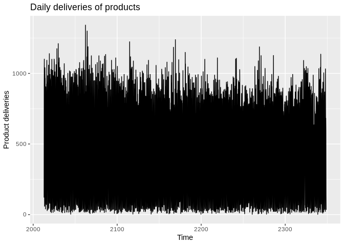
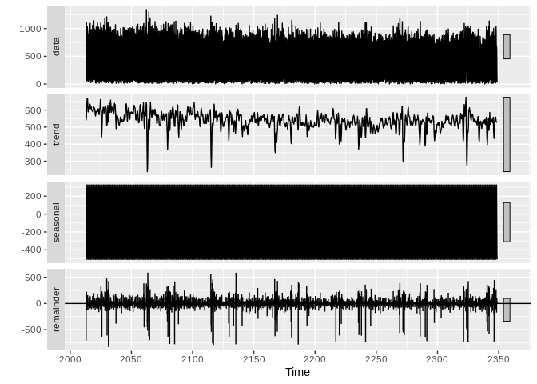

Daily Deliveries Lab
================

``` r
# Set working directory
knitr::opts_knit$set(root.dir = "/home/esa/production_forecasts") # Working on Ubuntu
# knitr::opts_knit$set(root.dir = "V:/production_forecasts") # Working home
```

## Create original dataset that should remain immutable throughout labbing

``` r
library(forecast)
library(ggplot2)
library(gridExtra)
library(knitr)
library(readxl)
source("src/evalhelp.R")

# Load data
dd <- read_excel("./data/deliveries_daily.xlsx", sheet = "Document_CH207")
colnames(dd) <- c("Date", "Deliveries")
# Omit empty values
dd <- na.omit(dd)
```

## Create the time series object

``` r
ts.dd <- ts(dd$Deliveries, 
             start = as.numeric(c(2013, 1)), 
             frequency = 7)
autoplot(ts.dd) + ggtitle("Daily deliveries of products") + ylab("Product deliveries")
```

<!-- -->

``` r
decomposed <- stl(ts.dd, s.window = "periodic")  # Seasonal and Trend decomposition using LOESS
seasonal <- decomposed$time.series[, 1]          # Season component
trend <- decomposed$time.series[, 2]             # Trend component
remainder <- decomposed$time.series[, 3]         # Remainder component

autoplot(decomposed)  # Plot
```

<!-- -->

``` r
mon <- rep(c(1, 0, 0, 0, 0, 0, 0), 52)
tue <- rep(c(0, 1, 0, 0, 0, 0, 0), 52)
wed <- rep(c(0, 0, 1, 0, 0, 0, 0), 52)
thu <- rep(c(0, 0, 0, 1, 0, 0, 0), 52)
fri <- rep(c(0, 0, 0, 0, 1, 0, 0), 52)
sat <- rep(c(0, 0, 0, 0, 0, 1, 0), 52)

week.m <- matrix(c(mon, tue, wed, thu, fri, sat),
                 ncol = 6,
                 byrow = FALSE)

arima.e <- tsCV(tail(ts.dd, 364), farima, xreg = week.m, h = 1)
arima.crit <- cMAPE(arima.e, tail(ts.dd, 364))
arima.mape <- mean(abs(100*arima.e/tail(ts.dd, 364)), na.rm = TRUE)
arima.rmse <- sqrt(mean(arima.e^2, na.rm = TRUE))

arimabench <- matrix(c(arima.crit, arima.mape, arima.rmse),
               ncol = 3,
               byrow = TRUE)
colnames(arimabench) <- c("cMAPE", "MAPE", "RMSE")
rownames(arimabench) <- c("DynReg")
kable(arimabench, "markdown")
```

|        |    cMAPE |     MAPE | RMSE |
| :----- | -------: | -------: | ---: |
| DynReg | 6.075949 | 6.075949 |   48 |

``` r
ets.e <- tsCV(tail(ts.dd, 70), fTBATS, h = 1)
ets.crit <- cMAPE(ets.e, tail(ts.dd, 70))
ets.mape <- mean(abs(100*ets.e/tail(ts.dd, 70)), na.rm = TRUE)
ets.rmse <- sqrt(mean(ets.e^2, na.rm = TRUE))

etsbench <- matrix(c(ets.crit, ets.mape, ets.rmse),
               ncol = 3,
               byrow = TRUE)
colnames(etsbench) <- c("cMAPE", "MAPE", "RMSE")
rownames(etsbench) <- c("TBATS")
kable(etsbench, "markdown")
```

|       |    cMAPE |     MAPE |     RMSE |
| :---- | -------: | -------: | -------: |
| TBATS | 285.9665 | 256.2595 | 238.7825 |

## Try Bayesian approach for the heck of it

``` r
## BEGIN: function ##
rabsts <- function(data, season.num, season.dur, pred.horizon) {
  ##get trend or/and seasonal state
  if(season.num==0){
    ss <- bsts::AddLocalLinearTrend(list(), data)}
  else{
    ss <- bsts::AddLocalLinearTrend(list(), data)
    ss <- bsts::AddSeasonal(ss, data, nseasons = season.num, season.duration = season.dur)}
  
  ##build Bayesial model
  bsts.model <- bsts::bsts(data, state.specification = ss, niter = 666, ping=0, seed=1000)
  
  ##predict
  result<-bsts::predict.bsts(bsts.model, horizon = pred.horizon, burn = SuggestBurn(0.1, bsts.model), quantiles = c(.025, .975))
  pred<-data.frame(result$mean,result$median)
  return(pred)
}
## END: function ##
```

``` r
suppressMessages(library(bsts))

pred <- rabsts(head(tail(ts.dd, 70), 63), season.num = 10, season.dur = 1, pred.horizon = 7)
```
