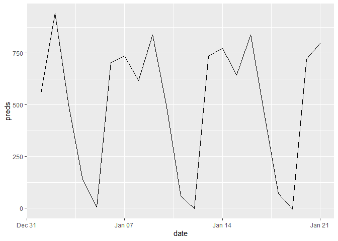

Delivery Lab: Red Cells (all)
================

``` r
library(forecast)
library(ggplot2)
library(gridExtra)
library(knitr)
library(readxl)
library(plyr)
library(lubridate)
library(numbers)
source("src/evalhelp.R")
```

``` r
# deliv <- read_excel("./data/ketju_data.xlsx", sheet = "Punasolutoimitukset kaikki")[, c('Päivämäärä', 'Toimitukset punasolut')]
deliv <- read_excel("./data/deliveries_daily.xlsx", sheet = "Document_CH207")[, c('Päivämäärä', 'Toimitukset')]
colnames(deliv) <- c("time", "deliveries")  # Change column names
deliv$time <- as.Date(deliv$time)


sales <- read.table("./data/kuukausimyynti.txt", header = T, sep = "\t")

# Sales data begins January 2004 and ends on April 2019
sales$date <- seq(from = as.Date("2004-01-01"), to = as.Date("2019-04-01"), by = "month")

# We'll be examining only red cells for now, so we'll drop everything we don't need
keep = c("Punasoluvalmisteet", "date")
sales <- sales[keep]
```

## Data integrity check

``` r
# Daily series, whole
alldates <- seq(from = as.Date("2013-01-01"), to = as.Date("2019-01-01"), by = "day")
# Monthly series, whole
allmonths <- seq(from = as.Date("2013-01-01"), to = as.Date("2019-01-01"), by = "month")

# Deliveries
deliv <- deliv[deliv$time >= "2013-01-01" & deliv$time <= "2019-01-01", ]
deliv.missing <- alldates[!alldates %in% deliv$time]

# Sales
sales <- sales[sales$date >= "2013-01-01", ]
sales.missing <- allmonths[!allmonths %in% sales$date]

print(deliv.missing)
```

    ## [1] "2013-10-28" "2013-10-29" "2013-10-30" "2013-10-31" "2013-11-01"
    ## [6] "2013-11-02" "2013-11-03"

``` r
print(sales.missing)
```

    ## Date of length 0

Only deliveries are missing days. We’ll probably want to start our
analysis at 2014, as 4 missing days in October 2013 correspond already
to a \~3200 unit error.

## First sanity check: does delivery data agree with sales data?

``` r
# Sum deliveries into monthly bins
deliv.monthly <- aggregate(deliveries ~ month(time) + year(time), data = deliv, FUN = sum)
data <- data.frame(date = seq(from = as.Date("2014-01-01"), to = as.Date("2018-12-01"), by = "month"),
                   deliv = deliv.monthly[deliv.monthly$`year(time)` >= 2014 & deliv.monthly$`year(time)` <= 2018, ]$deliveries,
                   sales = sales[sales$date >= "2014-01-01" & sales$date <= "2018-12-01", ]$Punasoluvalmisteet)
```

``` r
# Plot
ggplot() + 
  geom_line(data = data, aes(x = date, y = deliv, colour = "deliveries"), size = 1) + 
  geom_point(data = data, aes(x = date, y = deliv, colour = "deliveries")) +
  geom_line(data = data, aes(x = date, y = sales, colour = "sales"), size = 1) + 
  geom_point(data = data, aes(x = date, y = sales, colour = "sales")) +
  scale_color_manual(values = c("#DF013A", "#298A08")) +
  theme(legend.position = "bottom", legend.margin = margin(t = -20, b = 20)) +
  labs(title = "Deliveries vs. Sales",
       subtitle = "Deliveries correspond to sales with adequate accuracy",
       caption = "Note: No missing data points during this period", 
       x = "", y = "blood bags") 
```

<!-- -->

## Forecasting deliveries

``` r
deliv.mts <- msts(deliv$deliveries, start = 2013, seasonal.periods=c(7,365.25))
deliv.mts <- window(deliv.mts, start = 2014)
fit <- tbats(deliv.mts)
```

``` r
fc <- predict(fit, h = 21)
autoplot(fc, main = "3 week prediction with TBATS", include = 21)
```

<!-- -->

The model clearly seems to have an idea about the weekly pattern. Let’s
run a rolling partition test (a kind of CV) and average out the MAPEs to
see what kind of errors we are talking about here.

``` r
mapes <- c()
for (i in 1:15){ 
  cat("
  -----------------------------
      RUNNING PARTITION ", i)
  
  nTest <- 7*i
  nTrain <- length(deliv.mts) - nTest
  train <- window(deliv.mts, 
                  start = decimal_date(as.Date("2014-01-01")), 
                  end = c(decimal_date(as.Date("2014-01-01")), nTrain))
  test <- window(deliv.mts, 
                 start = c(decimal_date(as.Date("2014-01-01")), (nTrain + 1)), 
                 end = c(decimal_date(as.Date("2014-01-01")), (nTrain + 7)))
  
  fit <- tbats(train)
  fcast <- predict(fit, h = 7)
  
  mapes <- c(mapes, accuracy(fcast, test)[2, ]["MAPE"])
}
```

    ## 
    ##   -----------------------------
    ##       RUNNING PARTITION  1
    ##   -----------------------------
    ##       RUNNING PARTITION  2
    ##   -----------------------------
    ##       RUNNING PARTITION  3
    ##   -----------------------------
    ##       RUNNING PARTITION  4
    ##   -----------------------------
    ##       RUNNING PARTITION  5
    ##   -----------------------------
    ##       RUNNING PARTITION  6
    ##   -----------------------------
    ##       RUNNING PARTITION  7
    ##   -----------------------------
    ##       RUNNING PARTITION  8
    ##   -----------------------------
    ##       RUNNING PARTITION  9
    ##   -----------------------------
    ##       RUNNING PARTITION  10
    ##   -----------------------------
    ##       RUNNING PARTITION  11
    ##   -----------------------------
    ##       RUNNING PARTITION  12
    ##   -----------------------------
    ##       RUNNING PARTITION  13
    ##   -----------------------------
    ##       RUNNING PARTITION  14
    ##   -----------------------------
    ##       RUNNING PARTITION  15

``` r
cat("
    ==========================
    FINISHED
    ===========================
    
    MAPE
    AVG: ", round(mean(mapes), digits = 2),
    "
    SD: ", round(sd(mapes), digits = 2),
    "
    MAX: ", round(max(mapes), digits = 2),
    "
    MIN: ", round(min(mapes), digits = 2))
```

    ## 
    ##     ==========================
    ##     FINISHED
    ##     ===========================
    ##     
    ##     MAPE
    ##     AVG:  124.58 
    ##     SD:  204.1 
    ##     MAX:  621.68 
    ##     MIN:  8.31

Let’s try linear regression with refitted residuals (to deal with
multiseasonality).

``` r
deliv.ts <- ts(deliv$deliveries, start = decimal_date(as.Date("2014-01-01")), frequency = 7)
deliv.lm <- tslm(deliv.ts ~ trend + season)
```

``` r
res.arima <- auto.arima(deliv.lm$residuals)
res.arima.fcast <- forecast(res.arima, h = 21)
resf <- as.numeric(res.arima.fcast$mean)

lmfcast <- forecast(deliv.lm, h = 21)
lmf <- as.numeric(lmfcast$mean)

fcast <- lmf + resf
```

``` r
fcast <- data.frame(date = seq(from = as.Date("2019-01-01"), to = as.Date("2019-01-21"), by = "day"), 
                    preds = fcast)

ggplot() + geom_line(data = fcast, aes(x = date, y = preds))
```

<!-- -->

The produced forecast seems be similar with the TBATS forecast. Let’s
run a similar partitioning check.

``` r
lm.mapes <- c()
for (i in 1:15){
  cat("
  -----------------------------
      RUNNING PARTITION ", i)
  
  nTest <- 7*i  
  nTrain <- length(deliv.ts) - nTest 
  train <- window(deliv.ts, 
                  start = decimal_date(as.Date("2014-01-01")), 
                  end = c(decimal_date(as.Date("2014-01-01")), nTrain))
  test <- window(deliv.ts, 
                 start = c(decimal_date(as.Date("2014-01-01")), (nTrain + 1)), 
                 end = c(decimal_date(as.Date("2014-01-01")), (nTrain + 7)))
  
  trainlm <- tslm(train ~ trend + season)
  trainlmf <- forecast(trainlm, h = 7)
 
  residauto <- auto.arima(trainlm$residuals)
  residf <- forecast(residauto, h = 7)
  
  y <- as.numeric(trainlmf$mean)
  x <- as.numeric(residf$mean)
  fcast <- x + y
  
  lm.mapes <- c(lm.mapes, accuracy(fcast, test)[,]["MAPE"])
}
```

    ## 
    ##   -----------------------------
    ##       RUNNING PARTITION  1
    ##   -----------------------------
    ##       RUNNING PARTITION  2
    ##   -----------------------------
    ##       RUNNING PARTITION  3
    ##   -----------------------------
    ##       RUNNING PARTITION  4
    ##   -----------------------------
    ##       RUNNING PARTITION  5
    ##   -----------------------------
    ##       RUNNING PARTITION  6
    ##   -----------------------------
    ##       RUNNING PARTITION  7
    ##   -----------------------------
    ##       RUNNING PARTITION  8
    ##   -----------------------------
    ##       RUNNING PARTITION  9
    ##   -----------------------------
    ##       RUNNING PARTITION  10
    ##   -----------------------------
    ##       RUNNING PARTITION  11
    ##   -----------------------------
    ##       RUNNING PARTITION  12
    ##   -----------------------------
    ##       RUNNING PARTITION  13
    ##   -----------------------------
    ##       RUNNING PARTITION  14
    ##   -----------------------------
    ##       RUNNING PARTITION  15

``` r
cat("
    ==========================
    FINISHED
    ===========================
    
    MAPE
    AVG: ", round(mean(mapes), digits = 2),
    "
    SD: ", round(sd(mapes), digits = 2),
    "
    MAX: ", round(max(mapes), digits = 2),
    "
    MIN: ", round(min(mapes), digits = 2))
```

    ## 
    ##     ==========================
    ##     FINISHED
    ##     ===========================
    ##     
    ##     MAPE
    ##     AVG:  124.58 
    ##     SD:  204.1 
    ##     MAX:  621.68 
    ##     MIN:  8.31

The errors seem to be somewhat similar.
