Delivery Lab: Red Cells (all)
================

``` r
library(forecast)
library(ggplot2)
library(gridExtra)
library(knitr)
library(readxl)
library(plyr)
library(lubridate)
library(numbers)
library(data.table)
source("src/evalhelp.R")
```

``` r
# Get all the files
dfold <- "/home/esa/production_forecasts/data/FACS/"
files <- list.files(path = dfold, pattern = "FAC0091_*")

# Compile a dataframe by going over all files
dlist <- list()
for (i in files) {
  # Read a single file to a df called d
  d <- read.delim(file = paste0(dfold, "/", i), header = FALSE, sep = ";", stringsAsFactors = FALSE, colClasses = 'character')
  if(length(d) == 26){
    d <- d[, !(names(d) %in% c("V10"))]  # The column numbers unfortunately vary between files, so we'll adjust
    }
  colnames(d) <- c("V1", "V2", "V3", "V4", "V5", "V6", "V7", "V8", "V9", "V10",
                   "V11", "V12", "V13", "V14", "V15", "V16", "V17", "V18", "V19", "V20",
                   "V21", "V22", "V23", "V24", "V25")  # This is done so as to have easier column handling later on
  dlist[[i]] <- d
}

d <- as.data.frame(rbindlist(dlist, fill = TRUE))

# Sales
sales <- read.table("./data/kuukausimyynti.txt", header = T, sep = "\t")
# Sales data begins January 2004 and ends on April 2019
sales$date <- seq(from = as.Date("2004-01-01"), to = as.Date("2019-04-01"), by = "month")
# We'll be examining only red cells for now, so we'll drop everything we don't need
keep = c("Punasoluvalmisteet", "date")
sales <- sales[keep]
```

``` r
# Divide into distributions (P) and returns (R)
P <- d[d$V1 == "P", ]
R <- d[d$V1 == "R", ]

# For distributions, we'll keep Distribution date, Quantity, ABO type, Volume, Exp date
keep <- c("V12", "V18", "V20", "V22", "V24")
distr <- P[keep]
colnames(distr) <- c("date", "quantity", "ABO", "volume", "exp")

# For returns we keep the return date
keep <- c("V4", "V7")
retrn <- R[keep]
colnames(retrn) <- c("date", "quantity")

# Datify
distr$date <- dmy(distr$date); distr$exp <- dmy(distr$exp)
retrn$date <- dmy(retrn$date)

# Numerify
distr$quantity <- as.numeric(distr$quantity); distr$volume <- as.numeric(distr$volume)
retrn$quantity <- as.numeric(retrn$quantity)
```

``` r
all.distr <- aggregate(distr$quantity, by = list(distr$date), sum); colnames(all.distr) <- c("date", "pcs")

# O minus
Ominus <- distr[distr$ABO == "O -", ]
Ominus.distr <- aggregate(Ominus$quantity, by = list(Ominus$date), sum); colnames(Ominus.distr) <- c("date", "pcs")

# O plus
Oplus <- distr[distr$ABO == "O +", ]
Oplus.distr <- aggregate(Oplus$quantity, by = list(Oplus$date), sum); colnames(Oplus.distr) <- c("date", "pcs")

# A minus
Aminus <- distr[distr$ABO == "A -", ]
Aminus.distr <- aggregate(Aminus$quantity, by = list(Aminus$date), sum); colnames(Aminus.distr) <- c("date", "pcs")

# A plus
Aplus <- distr[distr$ABO == "A +", ]
Aplus.distr <- aggregate(Aplus$quantity, by = list(Aplus$date), sum); colnames(Aplus.distr) <- c("date", "pcs")

# B minus
Bminus <- distr[distr$ABO == "B -", ]
Bminus.distr <- aggregate(Bminus$quantity, by = list(Bminus$date), sum); colnames(Bminus.distr) <- c("date", "pcs")

# B plus
Bplus <- distr[distr$ABO == "B +", ]
Bplus.distr <- aggregate(Bplus$quantity, by = list(Bplus$date), sum); colnames(Bplus.distr) <- c("date", "pcs")

# AB minus
ABminus <- distr[distr$ABO == "AB-", ]
ABminus.distr <- aggregate(ABminus$quantity, by = list(ABminus$date), sum); colnames(ABminus.distr) <- c("date", "pcs")

# AB plus
ABplus <- distr[distr$ABO == "AB+", ]
ABplus.distr <- aggregate(ABplus$quantity, by = list(ABplus$date), sum); colnames(ABplus.distr) <- c("date", "pcs")
```

*Notes for development phase: 4% of the data is missing “ABO” and
“volume” information. 4% is too much to be outright omitted, but now
we have the problem where the smaller ABO series don’t add up to
“all.distr”.*

## Data goodness checks

``` r
alldates <- seq(from = as.Date("2014-01-01"), to = as.Date("2019-07-07"), by = "day")
typedates <- list(all.distr$date, Ominus.distr$date, Oplus.distr$date, Aminus.distr$date, Aplus.distr$date, Bminus.distr$date, Bplus.distr$date, ABminus.distr$date, ABplus.distr$date)
types <- list("All", "O-", "O+", "A-", "A+", "B-", "B+", "AB-", "AB+")
for(i in seq(9)){
  cat("Missing observations in ", types[[i]], ": ", length(alldates[!alldates %in% typedates[[i]]]), "\n")
}
```

    ## Missing observations in  All :  0 
    ## Missing observations in  O- :  7 
    ## Missing observations in  O+ :  0 
    ## Missing observations in  A- :  32 
    ## Missing observations in  A+ :  0 
    ## Missing observations in  B- :  129 
    ## Missing observations in  B+ :  33 
    ## Missing observations in  AB- :  353 
    ## Missing observations in  AB+ :  140

Some blood types seem to have quite a lot of missing days. Let’s look at
the series more closely to get an estimate of the ratio between zeros
and actual missing data.

``` r
ggplot(data = all.distr, aes(x = pcs)) + geom_histogram(binwidth = 1) + 
  labs(title = "All",
       subtitle = "Smallest value found: 2",
       caption = "", 
       x = "pcs", y = "count")
```

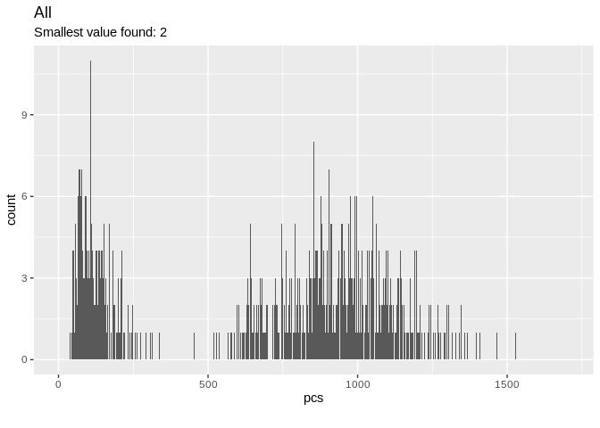<!-- -->

``` r
ggplot(data = Ominus.distr, aes(x = pcs)) + geom_histogram(binwidth = 1) + 
  labs(title = "O-",
       subtitle = "All 7 missing values could be zeroes",
       caption = "", 
       x = "pcs", y = "count")
```

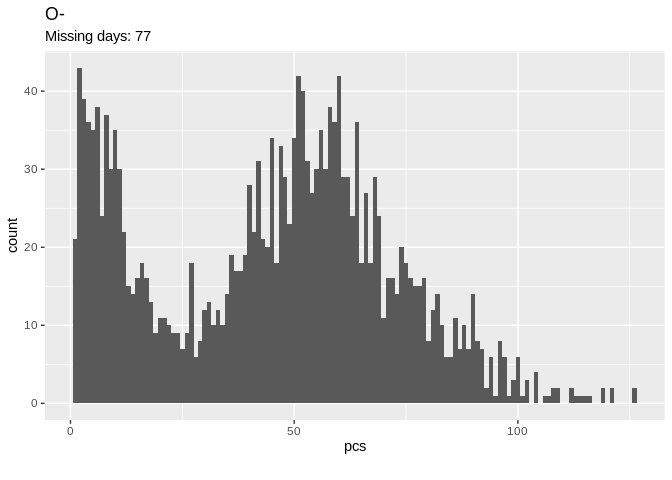<!-- -->

``` r
ggplot(data = Oplus.distr, aes(x = pcs)) + geom_histogram(binwidth = 1) + 
  labs(title = "O+",
       subtitle = "Smallest value found: 4",
       caption = "", 
       x = "pcs", y = "count")
```

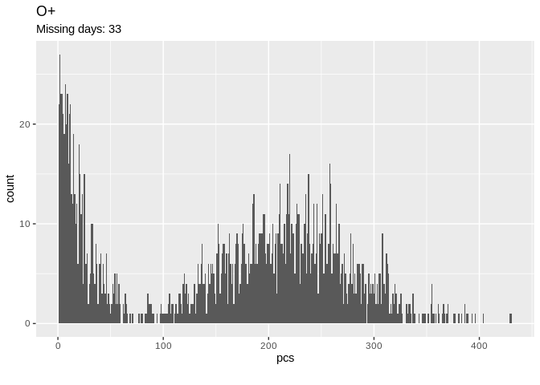<!-- -->

``` r
ggplot(data = Aminus.distr, aes(x = pcs)) + geom_histogram(binwidth = 1) + 
  labs(title = "A-",
       subtitle = "All 32 missing values could be zeroes",
       caption = "", 
       x = "pcs", y = "count")
```

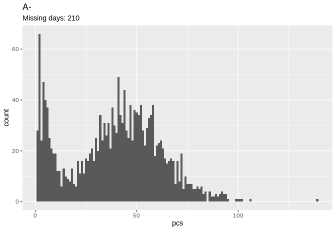<!-- -->

``` r
ggplot(data = Aplus.distr, aes(x = pcs)) + geom_histogram(binwidth = 1) + 
  labs(title = "A+",
       subtitle = "Smallest value found: 1",
       caption = "", 
       x = "pcs", y = "count")
```

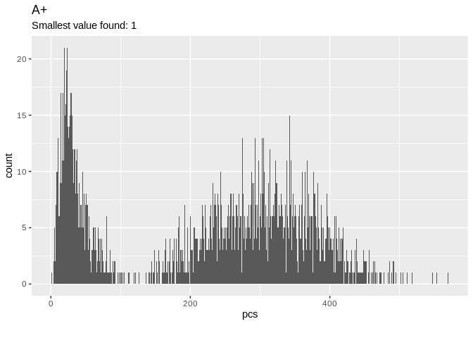<!-- -->

``` r
ggplot(data = Bminus.distr, aes(x = pcs)) + geom_histogram(binwidth = 1) + 
  labs(title = "B-",
       subtitle = "129 zeroes would be a lot, possibly missing data?",
       caption = "", 
       x = "pcs", y = "count")
```

<!-- -->

``` r
ggplot(data = Bplus.distr, aes(x = pcs)) + geom_histogram(binwidth = 1) + 
  labs(title = "B+",
       subtitle = "All 33 missing values could be zeroes",
       caption = "", 
       x = "pcs", y = "count")
```

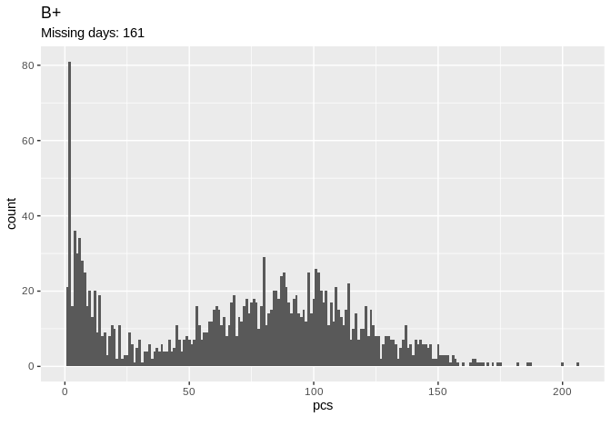<!-- -->

``` r
ggplot(data = ABminus.distr, aes(x = pcs)) + geom_histogram(binwidth = 1) + 
  labs(title = "AB-",
       subtitle = "353 zeroes would be a lot, possibly missing data?",
       caption = "", 
       x = "pcs", y = "count")
```

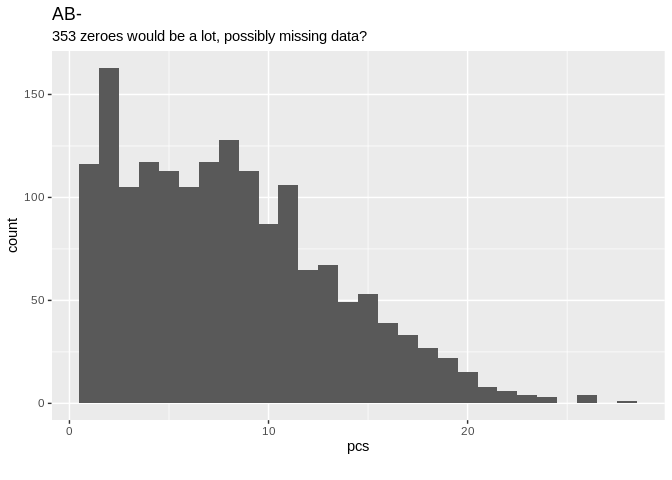<!-- -->

``` r
ggplot(data = ABplus.distr, aes(x = pcs)) + geom_histogram(binwidth = 1) + 
  labs(title = "AB+",
       subtitle = "140 zeroes would be a lot, possibly missing data?",
       caption = "", 
       x = "pcs", y = "count")
```

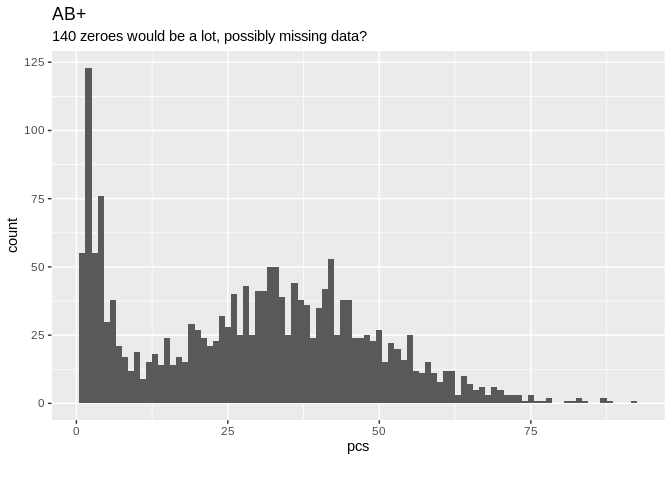<!-- -->

## First sanity check: does distribution data agree with sales data?

``` r
# Sum deliveries into monthly bins
distr.monthly <- aggregate(pcs ~ month(date) + year(date), data = all.distr, FUN = sum)
data <- data.frame(date = seq(from = as.Date("2014-01-01"), to = as.Date("2018-12-01"), by = "month"),
                   distr = distr.monthly[distr.monthly$`year(date)` >= 2014 & distr.monthly$`year(date)` <= 2018, ]$pcs,
                   sales = sales[sales$date >= "2014-01-01" & sales$date <= "2018-12-01", ]$Punasoluvalmisteet)
```

``` r
# Plot
ggplot() + 
  geom_line(data = data, aes(x = date, y = distr, colour = "distribution"), size = 1) + 
  geom_point(data = data, aes(x = date, y = distr, colour = "distribution")) +
  geom_line(data = data, aes(x = date, y = sales, colour = "sales"), size = 1) + 
  geom_point(data = data, aes(x = date, y = sales, colour = "sales")) +
  scale_color_manual(values = c("#DF013A", "#298A08")) +
  theme(legend.position = "bottom", legend.margin = margin(t = -20, b = 20)) +
  labs(title = "Distribution vs. Sales",
       subtitle = "Distribution does not correspond with sales. Why?",
       caption = "Note: Possibly some missing data points in the distribution series", 
       x = "", y = "blood bags") 
```

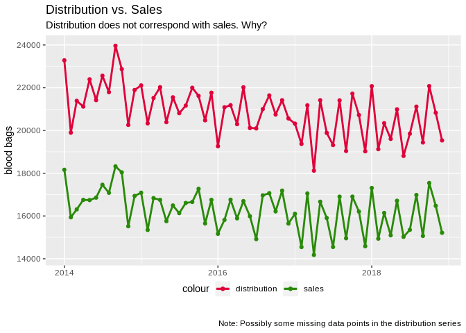<!-- -->

The distributions data is not comparable with the sales data. The
overall shape of the series is very similar, but the level is wholly
different. The similarity might not be enough though, let’s do a level
correction and see how well our series match then.

``` r
# Plot with level correction (-4000 to distributions)
ggplot() + 
  geom_line(data = data, aes(x = date, y = distr -4000, colour = "distribution"), size = 1) + 
  geom_point(data = data, aes(x = date, y = distr -4000, colour = "distribution")) +
  geom_line(data = data, aes(x = date, y = sales, colour = "sales"), size = 1) + 
  geom_point(data = data, aes(x = date, y = sales, colour = "sales")) +
  scale_color_manual(values = c("#DF013A", "#298A08")) +
  theme(legend.position = "bottom", legend.margin = margin(t = -20, b = 20)) +
  labs(title = "Distribution vs. Sales",
       subtitle = "Distribution does not correspond with sales. Why?",
       caption = "Note: Level correction of -4000 pcs applied to distributions data", 
       x = "", y = "blood bags") 
```

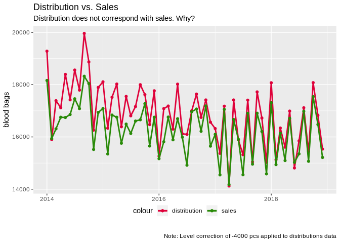<!-- -->

## Forecasting deliveries

``` r
distr.mts <- msts(all.distr$pcs, start = 2013, seasonal.periods = c(7, 365.25))
distr.mts <- window(distr.mts, start = 2014)
fit <- tbats(distr.mts)
```

``` r
fc <- predict(fit, h = 21)
autoplot(fc, main = "3 week prediction with TBATS", include = 21)
```

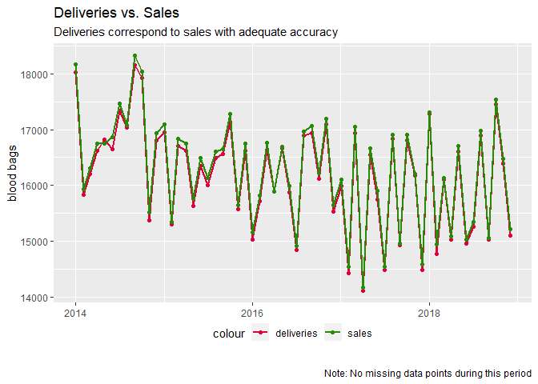<!-- -->

The model clearly seems to have an idea about the weekly pattern. Let’s
run a rolling partition test (a kind of CV) and average out the MAPEs to
see what kind of errors we are talking about here.

``` r
mapes <- c()
for (i in 1:15){ 
  cat("
  -----------------------------
      RUNNING PARTITION ", i)
  
  nTest <- 7*i
  nTrain <- length(distr.mts) - nTest
  train <- window(distr.mts, 
                  start = decimal_date(as.Date("2014-01-01")), 
                  end = c(decimal_date(as.Date("2014-01-01")), nTrain))
  test <- window(distr.mts, 
                 start = c(decimal_date(as.Date("2014-01-01")), (nTrain + 1)), 
                 end = c(decimal_date(as.Date("2014-01-01")), (nTrain + 7)))
  
  fit <- tbats(train)
  fcast <- predict(fit, h = 7)
  
  mapes <- c(mapes, accuracy(fcast, test)[2, ]["MAPE"])
}
```

    ## 
    ##   -----------------------------
    ##       RUNNING PARTITION  1
    ##   -----------------------------
    ##       RUNNING PARTITION  2
    ##   -----------------------------
    ##       RUNNING PARTITION  3
    ##   -----------------------------
    ##       RUNNING PARTITION  4
    ##   -----------------------------
    ##       RUNNING PARTITION  5
    ##   -----------------------------
    ##       RUNNING PARTITION  6
    ##   -----------------------------
    ##       RUNNING PARTITION  7
    ##   -----------------------------
    ##       RUNNING PARTITION  8
    ##   -----------------------------
    ##       RUNNING PARTITION  9
    ##   -----------------------------
    ##       RUNNING PARTITION  10
    ##   -----------------------------
    ##       RUNNING PARTITION  11
    ##   -----------------------------
    ##       RUNNING PARTITION  12
    ##   -----------------------------
    ##       RUNNING PARTITION  13
    ##   -----------------------------
    ##       RUNNING PARTITION  14
    ##   -----------------------------
    ##       RUNNING PARTITION  15

``` r
cat("
    ==========================
    FINISHED
    ===========================
    
    MAPE
    AVG: ", round(mean(mapes), digits = 2),
    "
    SD: ", round(sd(mapes), digits = 2),
    "
    MAX: ", round(max(mapes), digits = 2),
    "
    MIN: ", round(min(mapes), digits = 2))
```

    ## 
    ##     ==========================
    ##     FINISHED
    ##     ===========================
    ##     
    ##     MAPE
    ##     AVG:  59.92 
    ##     SD:  77.19 
    ##     MAX:  246.36 
    ##     MIN:  6.96

Let’s try linear regression with refitted residuals (to deal with
multiseasonality).

``` r
distr.ts <- ts(all.distr$pcs, start = decimal_date(as.Date("2014-01-01")), frequency = 7)
distr.lm <- tslm(distr.ts ~ trend + season)
```

``` r
res.arima <- auto.arima(distr.lm$residuals)
res.arima.fcast <- forecast(res.arima, h = 21)
resf <- as.numeric(res.arima.fcast$mean)

lmfcast <- forecast(distr.lm, h = 21)
lmf <- as.numeric(lmfcast$mean)

fcast <- lmf + resf
```

``` r
fcast <- data.frame(date = seq(from = as.Date("2019-01-01"), to = as.Date("2019-01-21"), by = "day"), 
                    preds = fcast)

ggplot() + geom_line(data = fcast, aes(x = date, y = preds))
```

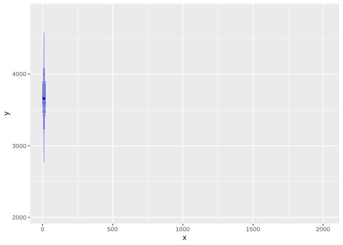<!-- -->

The produced forecast seems be similar with the TBATS forecast. Let’s
run a similar partitioning check.

``` r
lm.mapes <- c()
for (i in 1:15){
  cat("
  -----------------------------
      RUNNING PARTITION ", i)
  
  nTest <- 7*i  
  nTrain <- length(distr.ts) - nTest 
  train <- window(distr.ts, 
                  start = decimal_date(as.Date("2014-01-01")), 
                  end = c(decimal_date(as.Date("2014-01-01")), nTrain))
  test <- window(distr.ts, 
                 start = c(decimal_date(as.Date("2014-01-01")), (nTrain + 1)), 
                 end = c(decimal_date(as.Date("2014-01-01")), (nTrain + 7)))
  
  trainlm <- tslm(train ~ trend + season)
  trainlmf <- forecast(trainlm, h = 7)
 
  residauto <- auto.arima(trainlm$residuals)
  residf <- forecast(residauto, h = 7)
  
  y <- as.numeric(trainlmf$mean)
  x <- as.numeric(residf$mean)
  fcast <- x + y
  
  lm.mapes <- c(lm.mapes, accuracy(fcast, test)[,]["MAPE"])
}
```

    ## 
    ##   -----------------------------
    ##       RUNNING PARTITION  1
    ##   -----------------------------
    ##       RUNNING PARTITION  2
    ##   -----------------------------
    ##       RUNNING PARTITION  3
    ##   -----------------------------
    ##       RUNNING PARTITION  4
    ##   -----------------------------
    ##       RUNNING PARTITION  5
    ##   -----------------------------
    ##       RUNNING PARTITION  6
    ##   -----------------------------
    ##       RUNNING PARTITION  7
    ##   -----------------------------
    ##       RUNNING PARTITION  8
    ##   -----------------------------
    ##       RUNNING PARTITION  9
    ##   -----------------------------
    ##       RUNNING PARTITION  10
    ##   -----------------------------
    ##       RUNNING PARTITION  11
    ##   -----------------------------
    ##       RUNNING PARTITION  12
    ##   -----------------------------
    ##       RUNNING PARTITION  13
    ##   -----------------------------
    ##       RUNNING PARTITION  14
    ##   -----------------------------
    ##       RUNNING PARTITION  15

``` r
cat("
    ==========================
    FINISHED
    ===========================
    
    MAPE
    AVG: ", round(mean(lm.mapes), digits = 2),
    "
    SD: ", round(sd(lm.mapes), digits = 2),
    "
    MAX: ", round(max(lm.mapes), digits = 2),
    "
    MIN: ", round(min(lm.mapes), digits = 2))
```

    ## 
    ##     ==========================
    ##     FINISHED
    ##     ===========================
    ##     
    ##     MAPE
    ##     AVG:  64.56 
    ##     SD:  78.52 
    ##     MAX:  263.22 
    ##     MIN:  10.46

TBATS performs slightly better.

Let’s see how well this is suited for monthly forecasting.

``` r
# Do daily forecasts
distr.mts <- msts(all.distr$pcs, start = 2013, seasonal.periods = c(7, 365.25)) # Redo series
es <- c()
for(i in seq(from = 730, to = length(distr.mts), by = 1)){
  train <- window(distr.mts,
                  start = c(decimal_date(as.Date("2013-01-01"))),
                  end = c(decimal_date(as.Date("2013-01-01")), i))
  test <- distr.mts[i + 1]
  fit <- tbats(train)
  fcast <- predict(fit, h = 1)
  e <- test - fcast$'Point Forecast'
  es <- c(es, e)
}
```

``` r
# Sum up errors by month
mons <- rep(c(31, 28, 31, 30, 31, 30, 31, 31, 30, 31, 30, 31), 4)

moving_index <- 1
mon.es <- c()
for(i in mons){
  mon.e <- sum(es[moving_index:(moving_index -1 + i)])
  moving_index <- moving_index + i
  mon.es <- c(mon.es, mon.e)
  }
```
