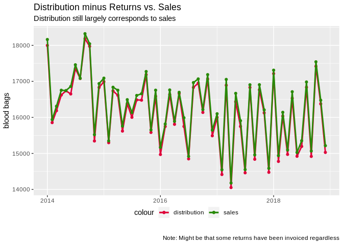
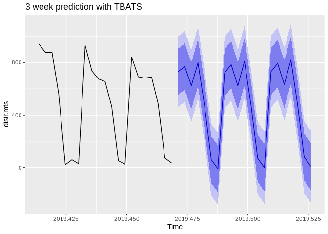
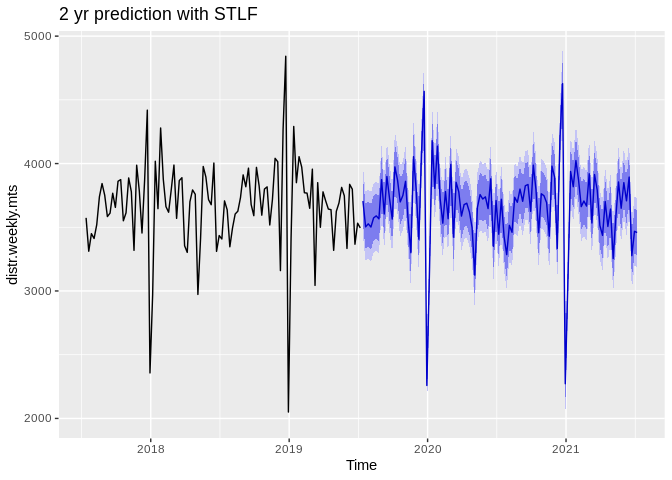

Delivery Lab: Red Cells (all)
================

``` r
library(forecast)
library(ggplot2)
library(gridExtra)
library(knitr)
library(readxl)
library(plyr)
library(lubridate)
library(numbers)
library(data.table)
library(R.utils)
source("src/evalhelp.R")
```

``` r
# Get all the files
dfold <- "/home/esa/production_forecasts/data/FACS/"
files <- list.files(path = dfold, pattern = "FAC0091_*")

# Compile a dataframe by going over all files
dlist <- list()
for (i in files) {
  # Read a single file to a df called d
  d <- read.delim(file = paste0(dfold, "/", i), header = FALSE, sep = ";", stringsAsFactors = FALSE, colClasses = 'character')
  if(length(d) == 26){
    d <- d[, !(names(d) %in% c("V10"))]  # The column numbers unfortunately vary between files, so we'll adjust
    }
  colnames(d) <- c("V1", "V2", "V3", "V4", "V5", "V6", "V7", "V8", "V9", "V10",
                   "V11", "V12", "V13", "V14", "V15", "V16", "V17", "V18", "V19", "V20",
                   "V21", "V22", "V23", "V24", "V25")  # This is done so as to have easier column handling later on
  dlist[[i]] <- d
}

d <- as.data.frame(rbindlist(dlist, fill = TRUE))

# Sales
sales <- read.table("./data/kuukausimyynti.txt", header = T, sep = "\t")
# Sales data begins January 2004 and ends on April 2019
sales$date <- seq(from = as.Date("2004-01-01"), to = as.Date("2019-04-01"), by = "month")
# We'll be examining only red cells for now, so we'll drop everything we don't need
keep = c("Punasoluvalmisteet", "date")
sales <- sales[keep]
```

``` r
# Divide into distributions (P) and returns (R)
P <- d[d$V1 == "P", ]
R <- d[d$V1 == "R", ]

# For distributions, we'll keep Distribution date, Quantity, ABO type, Volume, Exp date
keep <- c("V12", "V14", "V18", "V20", "V22", "V24")
distr <- P[keep]
colnames(distr) <- c("date", "product", "quantity", "ABO", "volume", "exp")

# For returns we keep the return date
keep <- c("V4", "V7")
retrn <- R[keep]
colnames(retrn) <- c("date", "quantity")

# Datify
distr$date <- dmy(distr$date); distr$exp <- dmy(distr$exp)
retrn$date <- dmy(retrn$date)

# Numerify
distr$quantity <- as.numeric(distr$quantity); distr$volume <- as.numeric(distr$volume)
retrn$quantity <- as.numeric(retrn$quantity)
```

``` r
# budKpl    # Blood product sale amendment code

# Product codes for red cell products
codes <- c("budTR001", "A0071V00", "A0074V00", "A0092VA0", "A0092VB0", 
           "E3844V00", "E3845V00", "E3846VA0", "E3846VB0", "E3846VC0",
           "E3846V00", "E3847VA0", "E3847VB0", "E3847VC0", "E3847V00", 
           "E3936VA0", "E3936VB0", "E3939V00", "E3940V00", "E4683V00",
           "E7668V00", "E7673V00", "E4999V00", "E5000V00")

distr <- distr[distr$product %in% codes, ]
```

``` r
all.distr <- aggregate(distr$quantity, by = list(distr$date), sum); colnames(all.distr) <- c("date", "pcs")
all.retrn <- aggregate(retrn$quantity, by = list(retrn$date), sum); colnames(all.retrn) <- c("date", "pcs")

# O minus
Ominus <- distr[distr$ABO == "O -", ]
Ominus.distr <- aggregate(Ominus$quantity, by = list(Ominus$date), sum); colnames(Ominus.distr) <- c("date", "pcs")

# O plus
Oplus <- distr[distr$ABO == "O +", ]
Oplus.distr <- aggregate(Oplus$quantity, by = list(Oplus$date), sum); colnames(Oplus.distr) <- c("date", "pcs")

# A minus
Aminus <- distr[distr$ABO == "A -", ]
Aminus.distr <- aggregate(Aminus$quantity, by = list(Aminus$date), sum); colnames(Aminus.distr) <- c("date", "pcs")

# A plus
Aplus <- distr[distr$ABO == "A +", ]
Aplus.distr <- aggregate(Aplus$quantity, by = list(Aplus$date), sum); colnames(Aplus.distr) <- c("date", "pcs")

# B minus
Bminus <- distr[distr$ABO == "B -", ]
Bminus.distr <- aggregate(Bminus$quantity, by = list(Bminus$date), sum); colnames(Bminus.distr) <- c("date", "pcs")

# B plus
Bplus <- distr[distr$ABO == "B +", ]
Bplus.distr <- aggregate(Bplus$quantity, by = list(Bplus$date), sum); colnames(Bplus.distr) <- c("date", "pcs")

# AB minus
ABminus <- distr[distr$ABO == "AB-", ]
ABminus.distr <- aggregate(ABminus$quantity, by = list(ABminus$date), sum); colnames(ABminus.distr) <- c("date", "pcs")

# AB plus
ABplus <- distr[distr$ABO == "AB+", ]
ABplus.distr <- aggregate(ABplus$quantity, by = list(ABplus$date), sum); colnames(ABplus.distr) <- c("date", "pcs")
```

*Notes for development phase: 4% of the data is missing “ABO” and
“volume” information. 4% is too much to be outright omitted, but now
we have the problem where the smaller ABO series don’t add up to
“all.distr”.*

## Data goodness checks

``` r
alldates <- seq(from = as.Date("2014-01-01"), to = as.Date("2019-07-07"), by = "day")
typedates <- list(all.distr$date, Ominus.distr$date, Oplus.distr$date, 
                  Aminus.distr$date, Aplus.distr$date, Bminus.distr$date, 
                  Bplus.distr$date, ABminus.distr$date, ABplus.distr$date)
types <- list("All", "O-", "O+", "A-", "A+", "B-", "B+", "AB-", "AB+")
for(i in seq(9)){
  cat("Missing observations in ", types[[i]], ": ", length(alldates[!alldates %in% typedates[[i]]]), "\n")
}
```

    ## Missing observations in  All :  0 
    ## Missing observations in  O- :  77 
    ## Missing observations in  O+ :  33 
    ## Missing observations in  A- :  210 
    ## Missing observations in  A+ :  37 
    ## Missing observations in  B- :  342 
    ## Missing observations in  B+ :  161 
    ## Missing observations in  AB- :  538 
    ## Missing observations in  AB+ :  350

Some blood types seem to have quite a lot of missing days. Let’s look at
the series more closely to get an estimate of the ratio between zeros
and actual missing data.

``` r
ggplot(data = all.distr, aes(x = pcs)) + geom_histogram(binwidth = 1) + 
  labs(title = "All",
       subtitle = "Smallest value found: 2",
       caption = "", 
       x = "pcs", y = "count")
```

<!-- -->

``` r
ggplot(data = Ominus.distr, aes(x = pcs)) + geom_histogram(binwidth = 1) + 
  labs(title = "O-",
       subtitle = "Missing days: 77",
       caption = "", 
       x = "pcs", y = "count")
```

<!-- -->

``` r
ggplot(data = Oplus.distr, aes(x = pcs)) + geom_histogram(binwidth = 1) + 
  labs(title = "O+",
       subtitle = "Missing days: 33",
       caption = "", 
       x = "pcs", y = "count")
```

<!-- -->

``` r
ggplot(data = Aminus.distr, aes(x = pcs)) + geom_histogram(binwidth = 1) + 
  labs(title = "A-",
       subtitle = "Missing days: 210",
       caption = "", 
       x = "pcs", y = "count")
```

<!-- -->

``` r
ggplot(data = Aplus.distr, aes(x = pcs)) + geom_histogram(binwidth = 1) + 
  labs(title = "A+",
       subtitle = "Missing days: 37",
       caption = "", 
       x = "pcs", y = "count")
```

<!-- -->

``` r
ggplot(data = Bminus.distr, aes(x = pcs)) + geom_histogram(binwidth = 1) + 
  labs(title = "B-",
       subtitle = "Missing days: 342",
       caption = "", 
       x = "pcs", y = "count")
```

<!-- -->

``` r
ggplot(data = Bplus.distr, aes(x = pcs)) + geom_histogram(binwidth = 1) + 
  labs(title = "B+",
       subtitle = "Missing days: 161",
       caption = "", 
       x = "pcs", y = "count")
```

<!-- -->

``` r
ggplot(data = ABminus.distr, aes(x = pcs)) + geom_histogram(binwidth = 1) + 
  labs(title = "AB-",
       subtitle = "Missing days: 538",
       caption = "", 
       x = "pcs", y = "count")
```

<!-- -->

``` r
ggplot(data = ABplus.distr, aes(x = pcs)) + geom_histogram(binwidth = 1) + 
  labs(title = "AB+",
       subtitle = "Missing days: 350",
       caption = "", 
       x = "pcs", y = "count")
```

<!-- -->

## First sanity check: does distribution data agree with sales data?

``` r
# Sum deliveries into monthly bins
distr.monthly <- aggregate(pcs ~ month(date) + year(date), data = all.distr, FUN = sum)
data <- data.frame(date = seq(from = as.Date("2014-01-01"), to = as.Date("2018-12-01"), by = "month"),
                   distr = distr.monthly[distr.monthly$`year(date)` >= 2014 & distr.monthly$`year(date)` <= 2018, ]$pcs,
                   sales = sales[sales$date >= "2014-01-01" & sales$date <= "2018-12-01", ]$Punasoluvalmisteet)
```

``` r
# Plot
ggplot() + 
  geom_line(data = data, aes(x = date, y = distr, colour = "distribution"), size = 1) + 
  geom_point(data = data, aes(x = date, y = distr, colour = "distribution")) +
  geom_line(data = data, aes(x = date, y = sales, colour = "sales"), size = 1) + 
  geom_point(data = data, aes(x = date, y = sales, colour = "sales")) +
  scale_color_manual(values = c("#DF013A", "#298A08")) +
  theme(legend.position = "bottom", legend.margin = margin(t = -20, b = 20)) +
  labs(title = "Distribution vs. Sales",
       subtitle = "Distribution largely agrees with sales?",
       caption = "Note: Only red cell products here", 
       x = "", y = "blood bags") 
```

<!-- -->

## Considering removals

Removals shouldn’t make much of a difference, since removals contribute
to under a percentage of the entirety of the data. To be thorough
though, we should subtract removals from distributions and see if they
then correspond better with the sales
figures.

``` r
retrn.monthly <- aggregate(pcs ~ month(date) + year(date), data = all.retrn, FUN = sum)
distr.new <- distr.monthly[distr.monthly$`year(date)` >= 2014 & distr.monthly$`year(date)` <= 2018, ]$pcs
retrn.new <- retrn.monthly[retrn.monthly$`year(date)` >= 2014 & retrn.monthly$`year(date)` <= 2018, ]$pcs
tot <- distr.new - retrn.new
data.new <- data.frame(date = seq(from = as.Date("2014-01-01"), to = as.Date("2018-12-01"), by = "month"),
                       distr = distr.new,
                       retrn = retrn.new,
                       tot = tot,
                       sales = sales[sales$date >= "2014-01-01" & sales$date <= "2018-12-01", ]$Punasoluvalmisteet)
```

Plots

``` r
ggplot() + 
  geom_line(data = data.new, aes(x = date, y = tot, colour = "distribution"), size = 1) + 
  geom_point(data = data.new, aes(x = date, y = tot, colour = "distribution")) +
  geom_line(data = data.new, aes(x = date, y = sales, colour = "sales"), size = 1) + 
  geom_point(data = data.new, aes(x = date, y = sales, colour = "sales")) +
  scale_color_manual(values = c("#DF013A", "#298A08")) +
  theme(legend.position = "bottom", legend.margin = margin(t = -20, b = 20)) +
  labs(title = "Distribution minus Returns vs. Sales",
       subtitle = "Distribution still largely corresponds to sales",
       caption = "Note: Might be that some returns have been invoiced regardless", 
       x = "", y = "blood bags")
```

<!-- -->

``` r
# remember that this won't work if there are missing days
# cut to first monday
conct.distr <- tail(all.distr, -15)

pcslist <- list()
weeklist <- list()
datelist <- list()
j <- 0
k <- 0
for(i in seq(to = length(conct.distr$date), by = 7)){
  if(j == 52){j <- 0}
  j <- j + 1
  k <- k + 1
  pcslist[[k]] <- sum(conct.distr$pcs[i : (i + 6)])
  weeklist[[k]] <- j
  datelist[[k]] <- conct.distr$date[i]
}

distr.weekly <- data.frame(week = unlist(weeklist), 
                           startdate = as.Date.numeric(unlist(datelist), origin = "1970-01-01"), 
                           pcs = unlist(pcslist))
```

``` r
ggplot(data = distr.weekly, aes(x = startdate, y = pcs)) + 
  geom_line() + 
  geom_smooth(data = distr.weekly[1:150,], aes(x = startdate, y = pcs), method = "lm", inherit.aes = FALSE) +
  geom_smooth(data = distr.weekly[151:287,], aes(x = startdate, y = pcs), method = "lm", inherit.aes = FALSE) +
  labs(title = "Weekly Distribution",
       subtitle = "Trend turns around 2017 and variance increases",
       x = "", y = "blood bags") +
  theme_bw()
```

<!-- -->

``` r
distr.weekly.mts <- msts(distr.weekly$pcs, start = decimal_date(as.Date("2014-01-06")), seasonal.periods = c(12, 52))
distr.weekly.mts <- window(distr.weekly.mts, start = 2017)
fit.weekly <- stlf(distr.weekly.mts)
autoplot(fit.weekly) +
  labs(title = "2 year forecast with data from 2017 onwards",
       subtitle = "Forecast appears much more certain about the shape of the seasons",
       x = "", y = "blood bags") +
  theme_bw()
```

<!-- -->

``` r
weekly.fc <- predict(fit.weekly, h = 104)
autoplot(weekly.fc, main = "2 yr prediction with STLF", include = 104)
```

<!-- -->

The model clearly seems to have an idea about the pattern. Let’s run a
rolling partition test (a kind of CV) and average out the MAPEs to see
what kind of errors we are talking about here.

## Weekly forecast

``` r
# Define the series to be used
distr.weekly.mts <- msts(distr.weekly$pcs, start = decimal_date(as.Date("2014-01-06")), seasonal.periods = c(12, 52))
distr.weekly.mts <- window(distr.weekly.mts, start = 2017)

es <- c()
apes <- c()
ses <- c()
capes <- c()

# Create progress bar
pb <- txtProgressBar(min = 1, max = length(distr.weekly.mts)-105, style = 3)

for(i in seq(length(distr.weekly.mts)-105)){
  # Define training and testing set as ROLLING WINDOW
  train <- msts(distr.weekly.mts[(1 + i):(104 + i)], start = decimal_date(as.Date("2014-01-06")), seasonal.periods = c(12, 52))
  test <- msts(distr.weekly.mts[(105 + i)], start = decimal_date(as.Date("2014-01-06")), seasonal.periods = c(12, 52))
  
  # Fit
  fit <- stlf(train)
  # Forecast 1 step (week) ahead
  fcast <- forecast(fit, h = 1)
  
  # Calculate errors
  e <- as.numeric(test) - as.numeric(fcast$mean)  # Raw error
  ape <- abs(100 * e/test)  # Absolute percentage error
  se <- e * e   # Squared error (for RMSE later on)
  cape <- ifelse(test = e > 0, yes = abs(e * 2), no = abs(e))/test * 100  # Critical APE (for cMAPE later on)
  
  # Save errors
  es <- c(es, e)
  apes <- c(apes, ape)
  ses <- c(ses, se)
  capes <- c(capes, cape)
  
  setTxtProgressBar(pb, i) # Update progress bar
}
```

    ## 
      |                                                                       
      |                                                                 |   0%
      |                                                                       
      |===                                                              |   4%
      |                                                                       
      |=====                                                            |   8%
      |                                                                       
      |========                                                         |  12%
      |                                                                       
      |==========                                                       |  16%
      |                                                                       
      |=============                                                    |  20%
      |                                                                       
      |================                                                 |  24%
      |                                                                       
      |==================                                               |  28%
      |                                                                       
      |=====================                                            |  32%
      |                                                                       
      |=======================                                          |  36%
      |                                                                       
      |==========================                                       |  40%
      |                                                                       
      |=============================                                    |  44%
      |                                                                       
      |===============================                                  |  48%
      |                                                                       
      |==================================                               |  52%
      |                                                                       
      |====================================                             |  56%
      |                                                                       
      |=======================================                          |  60%
      |                                                                       
      |==========================================                       |  64%
      |                                                                       
      |============================================                     |  68%
      |                                                                       
      |===============================================                  |  72%
      |                                                                       
      |=================================================                |  76%
      |                                                                       
      |====================================================             |  80%
      |                                                                       
      |=======================================================          |  84%
      |                                                                       
      |=========================================================        |  88%
      |                                                                       
      |============================================================     |  92%
      |                                                                       
      |==============================================================   |  96%
      |                                                                       
      |=================================================================| 100%

``` r
close(pb) # Close progress bar
```

``` r
# Print errors for model selection
cat("

RESULTS
======================================
    Minimum error: ", min(abs(es)),
"
    Maximum error: ", max(es),
"
    MAPE: ", mean(apes),
"
    cMAPE: ", mean(capes),
"
    RMSE: ", sqrt(mean(ses)))
```

    ## 
    ## 
    ## RESULTS
    ## ======================================
    ##     Minimum error:  13.62961 
    ##     Maximum error:  812.1562 
    ##     MAPE:  5.928009 
    ##     cMAPE:  9.029555 
    ##     RMSE:  293.2051

``` r
# Define the series to be used
distr.weekly.mts <- msts(distr.weekly$pcs, start = decimal_date(as.Date("2014-01-06")), seasonal.periods = c(12, 52))
#distr.weekly.mts <- window(distr.weekly.mts, start = 2017)

############################
# STLF
############################
plot.stlf <- ggplot()
capes <- c()
# Create progress bar
cat("\nRUNNING STLF\n")
```

    ## 
    ## RUNNING STLF

``` r
pb <- txtProgressBar(min = 1, max = length(distr.weekly.mts) - 105, style = 3)
for(i in seq(length(distr.weekly.mts) - 105)){
  # Define training and testing set as ROLLING WINDOW
  train <- msts(distr.weekly.mts[(1 + i):(104 + i)], start = decimal_date(as.Date("2014-01-06") + i + 1), seasonal.periods = c(12, 52))
  test <- msts(distr.weekly.mts[(105 + i)], start = decimal_date(as.Date("2014-01-06") + 105 + i), seasonal.periods = c(12, 52))
  # Fit
  fit <- stlf(train)
  # Forecast 1 step (week) ahead
  fcast <- forecast(fit, h = 1)
  
  # Build the plot piece by piece
  plot.stlf <- plot.stlf + autolayer(fcast) + autolayer(test, colour=FALSE)
  
  
  # Calculate errors
  e <- as.numeric(test) - as.numeric(fcast$mean)  # Raw error
  cape <- ifelse(test = e > 0, yes = abs(e * 2), no = abs(e))/test * 100  # Critical APE (for cMAPE later on)
  
  # Save errors
  capes <- c(capes, cape)
  
  setTxtProgressBar(pb, i) # Update progress bar
}
```

    ## Warning in mstl(x, s.window = s.window, t.window = t.window, robust =
    ## robust): Dropping seasonal components with fewer than two full periods.

    ## 
      |                                                                       
      |                                                                 |   0%

    ## Warning in mstl(x, s.window = s.window, t.window = t.window, robust =
    ## robust): Dropping seasonal components with fewer than two full periods.

    ## 
      |                                                                       
      |                                                                 |   1%

    ## Warning in mstl(x, s.window = s.window, t.window = t.window, robust =
    ## robust): Dropping seasonal components with fewer than two full periods.

    ## 
      |                                                                       
      |=                                                                |   1%

    ## Warning in mstl(x, s.window = s.window, t.window = t.window, robust =
    ## robust): Dropping seasonal components with fewer than two full periods.

    ## 
      |                                                                       
      |=                                                                |   2%

    ## Warning in mstl(x, s.window = s.window, t.window = t.window, robust =
    ## robust): Dropping seasonal components with fewer than two full periods.
    
    ## Warning in mstl(x, s.window = s.window, t.window = t.window, robust =
    ## robust): Dropping seasonal components with fewer than two full periods.

    ## 
      |                                                                       
      |==                                                               |   3%

    ## Warning in mstl(x, s.window = s.window, t.window = t.window, robust =
    ## robust): Dropping seasonal components with fewer than two full periods.
    
    ## Warning in mstl(x, s.window = s.window, t.window = t.window, robust =
    ## robust): Dropping seasonal components with fewer than two full periods.

    ## 
      |                                                                       
      |===                                                              |   4%

    ## Warning in mstl(x, s.window = s.window, t.window = t.window, robust =
    ## robust): Dropping seasonal components with fewer than two full periods.
    
    ## Warning in mstl(x, s.window = s.window, t.window = t.window, robust =
    ## robust): Dropping seasonal components with fewer than two full periods.

    ## 
      |                                                                       
      |===                                                              |   5%

    ## Warning in mstl(x, s.window = s.window, t.window = t.window, robust =
    ## robust): Dropping seasonal components with fewer than two full periods.

    ## 
      |                                                                       
      |====                                                             |   6%

    ## Warning in mstl(x, s.window = s.window, t.window = t.window, robust =
    ## robust): Dropping seasonal components with fewer than two full periods.
    
    ## Warning in mstl(x, s.window = s.window, t.window = t.window, robust =
    ## robust): Dropping seasonal components with fewer than two full periods.

    ## 
      |                                                                       
      |====                                                             |   7%

    ## Warning in mstl(x, s.window = s.window, t.window = t.window, robust =
    ## robust): Dropping seasonal components with fewer than two full periods.

    ## 
      |                                                                       
      |=====                                                            |   7%

    ## Warning in mstl(x, s.window = s.window, t.window = t.window, robust =
    ## robust): Dropping seasonal components with fewer than two full periods.

    ## 
      |                                                                       
      |=====                                                            |   8%

    ## Warning in mstl(x, s.window = s.window, t.window = t.window, robust =
    ## robust): Dropping seasonal components with fewer than two full periods.
    
    ## Warning in mstl(x, s.window = s.window, t.window = t.window, robust =
    ## robust): Dropping seasonal components with fewer than two full periods.

    ## 
      |                                                                       
      |======                                                           |   9%

    ## Warning in mstl(x, s.window = s.window, t.window = t.window, robust =
    ## robust): Dropping seasonal components with fewer than two full periods.
    
    ## Warning in mstl(x, s.window = s.window, t.window = t.window, robust =
    ## robust): Dropping seasonal components with fewer than two full periods.

    ## 
      |                                                                       
      |======                                                           |  10%

    ## Warning in mstl(x, s.window = s.window, t.window = t.window, robust =
    ## robust): Dropping seasonal components with fewer than two full periods.

    ## 
      |                                                                       
      |=======                                                          |  10%

    ## Warning in mstl(x, s.window = s.window, t.window = t.window, robust =
    ## robust): Dropping seasonal components with fewer than two full periods.

    ## 
      |                                                                       
      |=======                                                          |  11%

    ## Warning in mstl(x, s.window = s.window, t.window = t.window, robust =
    ## robust): Dropping seasonal components with fewer than two full periods.

    ## 
      |                                                                       
      |========                                                         |  12%

    ## Warning in mstl(x, s.window = s.window, t.window = t.window, robust =
    ## robust): Dropping seasonal components with fewer than two full periods.
    
    ## Warning in mstl(x, s.window = s.window, t.window = t.window, robust =
    ## robust): Dropping seasonal components with fewer than two full periods.

    ## 
      |                                                                       
      |========                                                         |  13%

    ## Warning in mstl(x, s.window = s.window, t.window = t.window, robust =
    ## robust): Dropping seasonal components with fewer than two full periods.

    ## 
      |                                                                       
      |=========                                                        |  13%

    ## Warning in mstl(x, s.window = s.window, t.window = t.window, robust =
    ## robust): Dropping seasonal components with fewer than two full periods.

    ## 
      |                                                                       
      |=========                                                        |  14%

    ## Warning in mstl(x, s.window = s.window, t.window = t.window, robust =
    ## robust): Dropping seasonal components with fewer than two full periods.
    
    ## Warning in mstl(x, s.window = s.window, t.window = t.window, robust =
    ## robust): Dropping seasonal components with fewer than two full periods.

    ## 
      |                                                                       
      |==========                                                       |  15%

    ## Warning in mstl(x, s.window = s.window, t.window = t.window, robust =
    ## robust): Dropping seasonal components with fewer than two full periods.
    
    ## Warning in mstl(x, s.window = s.window, t.window = t.window, robust =
    ## robust): Dropping seasonal components with fewer than two full periods.

    ## 
      |                                                                       
      |==========                                                       |  16%

    ## Warning in mstl(x, s.window = s.window, t.window = t.window, robust =
    ## robust): Dropping seasonal components with fewer than two full periods.

    ## 
      |                                                                       
      |===========                                                      |  17%

    ## Warning in mstl(x, s.window = s.window, t.window = t.window, robust =
    ## robust): Dropping seasonal components with fewer than two full periods.
    
    ## Warning in mstl(x, s.window = s.window, t.window = t.window, robust =
    ## robust): Dropping seasonal components with fewer than two full periods.

    ## 
      |                                                                       
      |===========                                                      |  18%

    ## Warning in mstl(x, s.window = s.window, t.window = t.window, robust =
    ## robust): Dropping seasonal components with fewer than two full periods.

    ## 
      |                                                                       
      |============                                                     |  18%

    ## Warning in mstl(x, s.window = s.window, t.window = t.window, robust =
    ## robust): Dropping seasonal components with fewer than two full periods.

    ## 
      |                                                                       
      |============                                                     |  19%

    ## Warning in mstl(x, s.window = s.window, t.window = t.window, robust =
    ## robust): Dropping seasonal components with fewer than two full periods.

    ## 
      |                                                                       
      |=============                                                    |  19%

    ## Warning in mstl(x, s.window = s.window, t.window = t.window, robust =
    ## robust): Dropping seasonal components with fewer than two full periods.

    ## 
      |                                                                       
      |=============                                                    |  20%

    ## Warning in mstl(x, s.window = s.window, t.window = t.window, robust =
    ## robust): Dropping seasonal components with fewer than two full periods.
    
    ## Warning in mstl(x, s.window = s.window, t.window = t.window, robust =
    ## robust): Dropping seasonal components with fewer than two full periods.

    ## 
      |                                                                       
      |==============                                                   |  21%

    ## Warning in mstl(x, s.window = s.window, t.window = t.window, robust =
    ## robust): Dropping seasonal components with fewer than two full periods.

    ## 
      |                                                                       
      |==============                                                   |  22%

    ## Warning in mstl(x, s.window = s.window, t.window = t.window, robust =
    ## robust): Dropping seasonal components with fewer than two full periods.
    
    ## Warning in mstl(x, s.window = s.window, t.window = t.window, robust =
    ## robust): Dropping seasonal components with fewer than two full periods.

    ## 
      |                                                                       
      |===============                                                  |  23%

    ## Warning in mstl(x, s.window = s.window, t.window = t.window, robust =
    ## robust): Dropping seasonal components with fewer than two full periods.
    
    ## Warning in mstl(x, s.window = s.window, t.window = t.window, robust =
    ## robust): Dropping seasonal components with fewer than two full periods.

    ## 
      |                                                                       
      |===============                                                  |  24%

    ## Warning in mstl(x, s.window = s.window, t.window = t.window, robust =
    ## robust): Dropping seasonal components with fewer than two full periods.

    ## 
      |                                                                       
      |================                                                 |  24%

    ## Warning in mstl(x, s.window = s.window, t.window = t.window, robust =
    ## robust): Dropping seasonal components with fewer than two full periods.

    ## 
      |                                                                       
      |================                                                 |  25%

    ## Warning in mstl(x, s.window = s.window, t.window = t.window, robust =
    ## robust): Dropping seasonal components with fewer than two full periods.

    ## 
      |                                                                       
      |=================                                                |  25%

    ## Warning in mstl(x, s.window = s.window, t.window = t.window, robust =
    ## robust): Dropping seasonal components with fewer than two full periods.

    ## 
      |                                                                       
      |=================                                                |  26%

    ## Warning in mstl(x, s.window = s.window, t.window = t.window, robust =
    ## robust): Dropping seasonal components with fewer than two full periods.

    ## 
      |                                                                       
      |=================                                                |  27%

    ## Warning in mstl(x, s.window = s.window, t.window = t.window, robust =
    ## robust): Dropping seasonal components with fewer than two full periods.

    ## 
      |                                                                       
      |==================                                               |  27%

    ## Warning in mstl(x, s.window = s.window, t.window = t.window, robust =
    ## robust): Dropping seasonal components with fewer than two full periods.

    ## 
      |                                                                       
      |==================                                               |  28%

    ## Warning in mstl(x, s.window = s.window, t.window = t.window, robust =
    ## robust): Dropping seasonal components with fewer than two full periods.
    
    ## Warning in mstl(x, s.window = s.window, t.window = t.window, robust =
    ## robust): Dropping seasonal components with fewer than two full periods.

    ## 
      |                                                                       
      |===================                                              |  29%

    ## Warning in mstl(x, s.window = s.window, t.window = t.window, robust =
    ## robust): Dropping seasonal components with fewer than two full periods.
    
    ## Warning in mstl(x, s.window = s.window, t.window = t.window, robust =
    ## robust): Dropping seasonal components with fewer than two full periods.

    ## 
      |                                                                       
      |===================                                              |  30%

    ## Warning in mstl(x, s.window = s.window, t.window = t.window, robust =
    ## robust): Dropping seasonal components with fewer than two full periods.

    ## 
      |                                                                       
      |====================                                             |  30%

    ## Warning in mstl(x, s.window = s.window, t.window = t.window, robust =
    ## robust): Dropping seasonal components with fewer than two full periods.

    ## 
      |                                                                       
      |====================                                             |  31%

    ## Warning in mstl(x, s.window = s.window, t.window = t.window, robust =
    ## robust): Dropping seasonal components with fewer than two full periods.
    
    ## Warning in mstl(x, s.window = s.window, t.window = t.window, robust =
    ## robust): Dropping seasonal components with fewer than two full periods.

    ## 
      |                                                                       
      |=====================                                            |  32%

    ## Warning in mstl(x, s.window = s.window, t.window = t.window, robust =
    ## robust): Dropping seasonal components with fewer than two full periods.

    ## 
      |                                                                       
      |=====================                                            |  33%

    ## Warning in mstl(x, s.window = s.window, t.window = t.window, robust =
    ## robust): Dropping seasonal components with fewer than two full periods.

    ## 
      |                                                                       
      |======================                                           |  33%

    ## Warning in mstl(x, s.window = s.window, t.window = t.window, robust =
    ## robust): Dropping seasonal components with fewer than two full periods.

    ## 
      |                                                                       
      |======================                                           |  34%

    ## Warning in mstl(x, s.window = s.window, t.window = t.window, robust =
    ## robust): Dropping seasonal components with fewer than two full periods.
    
    ## Warning in mstl(x, s.window = s.window, t.window = t.window, robust =
    ## robust): Dropping seasonal components with fewer than two full periods.

    ## 
      |                                                                       
      |=======================                                          |  35%

    ## Warning in mstl(x, s.window = s.window, t.window = t.window, robust =
    ## robust): Dropping seasonal components with fewer than two full periods.
    
    ## Warning in mstl(x, s.window = s.window, t.window = t.window, robust =
    ## robust): Dropping seasonal components with fewer than two full periods.

    ## 
      |                                                                       
      |=======================                                          |  36%

    ## Warning in mstl(x, s.window = s.window, t.window = t.window, robust =
    ## robust): Dropping seasonal components with fewer than two full periods.

    ## 
      |                                                                       
      |========================                                         |  36%

    ## Warning in mstl(x, s.window = s.window, t.window = t.window, robust =
    ## robust): Dropping seasonal components with fewer than two full periods.

    ## 
      |                                                                       
      |========================                                         |  37%

    ## Warning in mstl(x, s.window = s.window, t.window = t.window, robust =
    ## robust): Dropping seasonal components with fewer than two full periods.

    ## 
      |                                                                       
      |========================                                         |  38%

    ## Warning in mstl(x, s.window = s.window, t.window = t.window, robust =
    ## robust): Dropping seasonal components with fewer than two full periods.

    ## 
      |                                                                       
      |=========================                                        |  38%

    ## Warning in mstl(x, s.window = s.window, t.window = t.window, robust =
    ## robust): Dropping seasonal components with fewer than two full periods.

    ## 
      |                                                                       
      |=========================                                        |  39%

    ## Warning in mstl(x, s.window = s.window, t.window = t.window, robust =
    ## robust): Dropping seasonal components with fewer than two full periods.
    
    ## Warning in mstl(x, s.window = s.window, t.window = t.window, robust =
    ## robust): Dropping seasonal components with fewer than two full periods.

    ## 
      |                                                                       
      |==========================                                       |  40%

    ## Warning in mstl(x, s.window = s.window, t.window = t.window, robust =
    ## robust): Dropping seasonal components with fewer than two full periods.
    
    ## Warning in mstl(x, s.window = s.window, t.window = t.window, robust =
    ## robust): Dropping seasonal components with fewer than two full periods.

    ## 
      |                                                                       
      |===========================                                      |  41%

    ## Warning in mstl(x, s.window = s.window, t.window = t.window, robust =
    ## robust): Dropping seasonal components with fewer than two full periods.
    
    ## Warning in mstl(x, s.window = s.window, t.window = t.window, robust =
    ## robust): Dropping seasonal components with fewer than two full periods.

    ## 
      |                                                                       
      |===========================                                      |  42%

    ## Warning in mstl(x, s.window = s.window, t.window = t.window, robust =
    ## robust): Dropping seasonal components with fewer than two full periods.

    ## 
      |                                                                       
      |============================                                     |  43%

    ## Warning in mstl(x, s.window = s.window, t.window = t.window, robust =
    ## robust): Dropping seasonal components with fewer than two full periods.
    
    ## Warning in mstl(x, s.window = s.window, t.window = t.window, robust =
    ## robust): Dropping seasonal components with fewer than two full periods.

    ## 
      |                                                                       
      |============================                                     |  44%

    ## Warning in mstl(x, s.window = s.window, t.window = t.window, robust =
    ## robust): Dropping seasonal components with fewer than two full periods.

    ## 
      |                                                                       
      |=============================                                    |  44%

    ## Warning in mstl(x, s.window = s.window, t.window = t.window, robust =
    ## robust): Dropping seasonal components with fewer than two full periods.

    ## 
      |                                                                       
      |=============================                                    |  45%

    ## Warning in mstl(x, s.window = s.window, t.window = t.window, robust =
    ## robust): Dropping seasonal components with fewer than two full periods.
    
    ## Warning in mstl(x, s.window = s.window, t.window = t.window, robust =
    ## robust): Dropping seasonal components with fewer than two full periods.

    ## 
      |                                                                       
      |==============================                                   |  46%

    ## Warning in mstl(x, s.window = s.window, t.window = t.window, robust =
    ## robust): Dropping seasonal components with fewer than two full periods.
    
    ## Warning in mstl(x, s.window = s.window, t.window = t.window, robust =
    ## robust): Dropping seasonal components with fewer than two full periods.

    ## 
      |                                                                       
      |===============================                                  |  47%

    ## Warning in mstl(x, s.window = s.window, t.window = t.window, robust =
    ## robust): Dropping seasonal components with fewer than two full periods.

    ## 
      |                                                                       
      |===============================                                  |  48%

    ## Warning in mstl(x, s.window = s.window, t.window = t.window, robust =
    ## robust): Dropping seasonal components with fewer than two full periods.
    
    ## Warning in mstl(x, s.window = s.window, t.window = t.window, robust =
    ## robust): Dropping seasonal components with fewer than two full periods.

    ## 
      |                                                                       
      |================================                                 |  49%

    ## Warning in mstl(x, s.window = s.window, t.window = t.window, robust =
    ## robust): Dropping seasonal components with fewer than two full periods.
    
    ## Warning in mstl(x, s.window = s.window, t.window = t.window, robust =
    ## robust): Dropping seasonal components with fewer than two full periods.

    ## 
      |                                                                       
      |================================                                 |  50%

    ## Warning in mstl(x, s.window = s.window, t.window = t.window, robust =
    ## robust): Dropping seasonal components with fewer than two full periods.

    ## 
      |                                                                       
      |=================================                                |  50%

    ## Warning in mstl(x, s.window = s.window, t.window = t.window, robust =
    ## robust): Dropping seasonal components with fewer than two full periods.

    ## 
      |                                                                       
      |=================================                                |  51%

    ## Warning in mstl(x, s.window = s.window, t.window = t.window, robust =
    ## robust): Dropping seasonal components with fewer than two full periods.
    
    ## Warning in mstl(x, s.window = s.window, t.window = t.window, robust =
    ## robust): Dropping seasonal components with fewer than two full periods.

    ## 
      |                                                                       
      |==================================                               |  52%

    ## Warning in mstl(x, s.window = s.window, t.window = t.window, robust =
    ## robust): Dropping seasonal components with fewer than two full periods.
    
    ## Warning in mstl(x, s.window = s.window, t.window = t.window, robust =
    ## robust): Dropping seasonal components with fewer than two full periods.

    ## 
      |                                                                       
      |==================================                               |  53%

    ## Warning in mstl(x, s.window = s.window, t.window = t.window, robust =
    ## robust): Dropping seasonal components with fewer than two full periods.

    ## 
      |                                                                       
      |===================================                              |  54%

    ## Warning in mstl(x, s.window = s.window, t.window = t.window, robust =
    ## robust): Dropping seasonal components with fewer than two full periods.
    
    ## Warning in mstl(x, s.window = s.window, t.window = t.window, robust =
    ## robust): Dropping seasonal components with fewer than two full periods.

    ## 
      |                                                                       
      |====================================                             |  55%

    ## Warning in mstl(x, s.window = s.window, t.window = t.window, robust =
    ## robust): Dropping seasonal components with fewer than two full periods.
    
    ## Warning in mstl(x, s.window = s.window, t.window = t.window, robust =
    ## robust): Dropping seasonal components with fewer than two full periods.

    ## 
      |                                                                       
      |====================================                             |  56%

    ## Warning in mstl(x, s.window = s.window, t.window = t.window, robust =
    ## robust): Dropping seasonal components with fewer than two full periods.

    ## 
      |                                                                       
      |=====================================                            |  56%

    ## Warning in mstl(x, s.window = s.window, t.window = t.window, robust =
    ## robust): Dropping seasonal components with fewer than two full periods.

    ## 
      |                                                                       
      |=====================================                            |  57%

    ## Warning in mstl(x, s.window = s.window, t.window = t.window, robust =
    ## robust): Dropping seasonal components with fewer than two full periods.
    
    ## Warning in mstl(x, s.window = s.window, t.window = t.window, robust =
    ## robust): Dropping seasonal components with fewer than two full periods.

    ## 
      |                                                                       
      |======================================                           |  58%

    ## Warning in mstl(x, s.window = s.window, t.window = t.window, robust =
    ## robust): Dropping seasonal components with fewer than two full periods.

    ## 
      |                                                                       
      |======================================                           |  59%

    ## Warning in mstl(x, s.window = s.window, t.window = t.window, robust =
    ## robust): Dropping seasonal components with fewer than two full periods.
    
    ## Warning in mstl(x, s.window = s.window, t.window = t.window, robust =
    ## robust): Dropping seasonal components with fewer than two full periods.

    ## 
      |                                                                       
      |=======================================                          |  60%

    ## Warning in mstl(x, s.window = s.window, t.window = t.window, robust =
    ## robust): Dropping seasonal components with fewer than two full periods.
    
    ## Warning in mstl(x, s.window = s.window, t.window = t.window, robust =
    ## robust): Dropping seasonal components with fewer than two full periods.

    ## 
      |                                                                       
      |========================================                         |  61%

    ## Warning in mstl(x, s.window = s.window, t.window = t.window, robust =
    ## robust): Dropping seasonal components with fewer than two full periods.
    
    ## Warning in mstl(x, s.window = s.window, t.window = t.window, robust =
    ## robust): Dropping seasonal components with fewer than two full periods.

    ## 
      |                                                                       
      |========================================                         |  62%

    ## Warning in mstl(x, s.window = s.window, t.window = t.window, robust =
    ## robust): Dropping seasonal components with fewer than two full periods.

    ## 
      |                                                                       
      |=========================================                        |  62%

    ## Warning in mstl(x, s.window = s.window, t.window = t.window, robust =
    ## robust): Dropping seasonal components with fewer than two full periods.

    ## 
      |                                                                       
      |=========================================                        |  63%

    ## Warning in mstl(x, s.window = s.window, t.window = t.window, robust =
    ## robust): Dropping seasonal components with fewer than two full periods.

    ## 
      |                                                                       
      |=========================================                        |  64%

    ## Warning in mstl(x, s.window = s.window, t.window = t.window, robust =
    ## robust): Dropping seasonal components with fewer than two full periods.

    ## 
      |                                                                       
      |==========================================                       |  64%

    ## Warning in mstl(x, s.window = s.window, t.window = t.window, robust =
    ## robust): Dropping seasonal components with fewer than two full periods.

    ## 
      |                                                                       
      |==========================================                       |  65%

    ## Warning in mstl(x, s.window = s.window, t.window = t.window, robust =
    ## robust): Dropping seasonal components with fewer than two full periods.
    
    ## Warning in mstl(x, s.window = s.window, t.window = t.window, robust =
    ## robust): Dropping seasonal components with fewer than two full periods.

    ## 
      |                                                                       
      |===========================================                      |  66%

    ## Warning in mstl(x, s.window = s.window, t.window = t.window, robust =
    ## robust): Dropping seasonal components with fewer than two full periods.
    
    ## Warning in mstl(x, s.window = s.window, t.window = t.window, robust =
    ## robust): Dropping seasonal components with fewer than two full periods.

    ## 
      |                                                                       
      |===========================================                      |  67%

    ## Warning in mstl(x, s.window = s.window, t.window = t.window, robust =
    ## robust): Dropping seasonal components with fewer than two full periods.

    ## 
      |                                                                       
      |============================================                     |  67%

    ## Warning in mstl(x, s.window = s.window, t.window = t.window, robust =
    ## robust): Dropping seasonal components with fewer than two full periods.

    ## 
      |                                                                       
      |============================================                     |  68%

    ## Warning in mstl(x, s.window = s.window, t.window = t.window, robust =
    ## robust): Dropping seasonal components with fewer than two full periods.

    ## 
      |                                                                       
      |=============================================                    |  69%

    ## Warning in mstl(x, s.window = s.window, t.window = t.window, robust =
    ## robust): Dropping seasonal components with fewer than two full periods.
    
    ## Warning in mstl(x, s.window = s.window, t.window = t.window, robust =
    ## robust): Dropping seasonal components with fewer than two full periods.

    ## 
      |                                                                       
      |=============================================                    |  70%

    ## Warning in mstl(x, s.window = s.window, t.window = t.window, robust =
    ## robust): Dropping seasonal components with fewer than two full periods.

    ## 
      |                                                                       
      |==============================================                   |  70%

    ## Warning in mstl(x, s.window = s.window, t.window = t.window, robust =
    ## robust): Dropping seasonal components with fewer than two full periods.

    ## 
      |                                                                       
      |==============================================                   |  71%

    ## Warning in mstl(x, s.window = s.window, t.window = t.window, robust =
    ## robust): Dropping seasonal components with fewer than two full periods.
    
    ## Warning in mstl(x, s.window = s.window, t.window = t.window, robust =
    ## robust): Dropping seasonal components with fewer than two full periods.

    ## 
      |                                                                       
      |===============================================                  |  72%

    ## Warning in mstl(x, s.window = s.window, t.window = t.window, robust =
    ## robust): Dropping seasonal components with fewer than two full periods.
    
    ## Warning in mstl(x, s.window = s.window, t.window = t.window, robust =
    ## robust): Dropping seasonal components with fewer than two full periods.

    ## 
      |                                                                       
      |===============================================                  |  73%

    ## Warning in mstl(x, s.window = s.window, t.window = t.window, robust =
    ## robust): Dropping seasonal components with fewer than two full periods.

    ## 
      |                                                                       
      |================================================                 |  73%

    ## Warning in mstl(x, s.window = s.window, t.window = t.window, robust =
    ## robust): Dropping seasonal components with fewer than two full periods.

    ## 
      |                                                                       
      |================================================                 |  74%

    ## Warning in mstl(x, s.window = s.window, t.window = t.window, robust =
    ## robust): Dropping seasonal components with fewer than two full periods.

    ## 
      |                                                                       
      |================================================                 |  75%

    ## Warning in mstl(x, s.window = s.window, t.window = t.window, robust =
    ## robust): Dropping seasonal components with fewer than two full periods.

    ## 
      |                                                                       
      |=================================================                |  75%

    ## Warning in mstl(x, s.window = s.window, t.window = t.window, robust =
    ## robust): Dropping seasonal components with fewer than two full periods.

    ## 
      |                                                                       
      |=================================================                |  76%

    ## Warning in mstl(x, s.window = s.window, t.window = t.window, robust =
    ## robust): Dropping seasonal components with fewer than two full periods.

    ## 
      |                                                                       
      |==================================================               |  76%

    ## Warning in mstl(x, s.window = s.window, t.window = t.window, robust =
    ## robust): Dropping seasonal components with fewer than two full periods.

    ## 
      |                                                                       
      |==================================================               |  77%

    ## Warning in mstl(x, s.window = s.window, t.window = t.window, robust =
    ## robust): Dropping seasonal components with fewer than two full periods.
    
    ## Warning in mstl(x, s.window = s.window, t.window = t.window, robust =
    ## robust): Dropping seasonal components with fewer than two full periods.

    ## 
      |                                                                       
      |===================================================              |  78%

    ## Warning in mstl(x, s.window = s.window, t.window = t.window, robust =
    ## robust): Dropping seasonal components with fewer than two full periods.
    
    ## Warning in mstl(x, s.window = s.window, t.window = t.window, robust =
    ## robust): Dropping seasonal components with fewer than two full periods.

    ## 
      |                                                                       
      |===================================================              |  79%

    ## Warning in mstl(x, s.window = s.window, t.window = t.window, robust =
    ## robust): Dropping seasonal components with fewer than two full periods.

    ## 
      |                                                                       
      |====================================================             |  80%

    ## Warning in mstl(x, s.window = s.window, t.window = t.window, robust =
    ## robust): Dropping seasonal components with fewer than two full periods.
    
    ## Warning in mstl(x, s.window = s.window, t.window = t.window, robust =
    ## robust): Dropping seasonal components with fewer than two full periods.

    ## 
      |                                                                       
      |====================================================             |  81%

    ## Warning in mstl(x, s.window = s.window, t.window = t.window, robust =
    ## robust): Dropping seasonal components with fewer than two full periods.

    ## 
      |                                                                       
      |=====================================================            |  81%

    ## Warning in mstl(x, s.window = s.window, t.window = t.window, robust =
    ## robust): Dropping seasonal components with fewer than two full periods.

    ## 
      |                                                                       
      |=====================================================            |  82%

    ## Warning in mstl(x, s.window = s.window, t.window = t.window, robust =
    ## robust): Dropping seasonal components with fewer than two full periods.

    ## 
      |                                                                       
      |======================================================           |  82%

    ## Warning in mstl(x, s.window = s.window, t.window = t.window, robust =
    ## robust): Dropping seasonal components with fewer than two full periods.

    ## 
      |                                                                       
      |======================================================           |  83%

    ## Warning in mstl(x, s.window = s.window, t.window = t.window, robust =
    ## robust): Dropping seasonal components with fewer than two full periods.
    
    ## Warning in mstl(x, s.window = s.window, t.window = t.window, robust =
    ## robust): Dropping seasonal components with fewer than two full periods.

    ## 
      |                                                                       
      |=======================================================          |  84%

    ## Warning in mstl(x, s.window = s.window, t.window = t.window, robust =
    ## robust): Dropping seasonal components with fewer than two full periods.

    ## 
      |                                                                       
      |=======================================================          |  85%

    ## Warning in mstl(x, s.window = s.window, t.window = t.window, robust =
    ## robust): Dropping seasonal components with fewer than two full periods.
    
    ## Warning in mstl(x, s.window = s.window, t.window = t.window, robust =
    ## robust): Dropping seasonal components with fewer than two full periods.

    ## 
      |                                                                       
      |========================================================         |  86%

    ## Warning in mstl(x, s.window = s.window, t.window = t.window, robust =
    ## robust): Dropping seasonal components with fewer than two full periods.
    
    ## Warning in mstl(x, s.window = s.window, t.window = t.window, robust =
    ## robust): Dropping seasonal components with fewer than two full periods.

    ## 
      |                                                                       
      |========================================================         |  87%

    ## Warning in mstl(x, s.window = s.window, t.window = t.window, robust =
    ## robust): Dropping seasonal components with fewer than two full periods.

    ## 
      |                                                                       
      |=========================================================        |  87%

    ## Warning in mstl(x, s.window = s.window, t.window = t.window, robust =
    ## robust): Dropping seasonal components with fewer than two full periods.

    ## 
      |                                                                       
      |=========================================================        |  88%

    ## Warning in mstl(x, s.window = s.window, t.window = t.window, robust =
    ## robust): Dropping seasonal components with fewer than two full periods.
    
    ## Warning in mstl(x, s.window = s.window, t.window = t.window, robust =
    ## robust): Dropping seasonal components with fewer than two full periods.

    ## 
      |                                                                       
      |==========================================================       |  89%

    ## Warning in mstl(x, s.window = s.window, t.window = t.window, robust =
    ## robust): Dropping seasonal components with fewer than two full periods.

    ## 
      |                                                                       
      |==========================================================       |  90%

    ## Warning in mstl(x, s.window = s.window, t.window = t.window, robust =
    ## robust): Dropping seasonal components with fewer than two full periods.

    ## 
      |                                                                       
      |===========================================================      |  90%

    ## Warning in mstl(x, s.window = s.window, t.window = t.window, robust =
    ## robust): Dropping seasonal components with fewer than two full periods.

    ## 
      |                                                                       
      |===========================================================      |  91%

    ## Warning in mstl(x, s.window = s.window, t.window = t.window, robust =
    ## robust): Dropping seasonal components with fewer than two full periods.
    
    ## Warning in mstl(x, s.window = s.window, t.window = t.window, robust =
    ## robust): Dropping seasonal components with fewer than two full periods.

    ## 
      |                                                                       
      |============================================================     |  92%

    ## Warning in mstl(x, s.window = s.window, t.window = t.window, robust =
    ## robust): Dropping seasonal components with fewer than two full periods.
    
    ## Warning in mstl(x, s.window = s.window, t.window = t.window, robust =
    ## robust): Dropping seasonal components with fewer than two full periods.

    ## 
      |                                                                       
      |============================================================     |  93%

    ## Warning in mstl(x, s.window = s.window, t.window = t.window, robust =
    ## robust): Dropping seasonal components with fewer than two full periods.

    ## 
      |                                                                       
      |=============================================================    |  93%

    ## Warning in mstl(x, s.window = s.window, t.window = t.window, robust =
    ## robust): Dropping seasonal components with fewer than two full periods.

    ## 
      |                                                                       
      |=============================================================    |  94%

    ## Warning in mstl(x, s.window = s.window, t.window = t.window, robust =
    ## robust): Dropping seasonal components with fewer than two full periods.
    
    ## Warning in mstl(x, s.window = s.window, t.window = t.window, robust =
    ## robust): Dropping seasonal components with fewer than two full periods.

    ## 
      |                                                                       
      |==============================================================   |  95%

    ## Warning in mstl(x, s.window = s.window, t.window = t.window, robust =
    ## robust): Dropping seasonal components with fewer than two full periods.

    ## 
      |                                                                       
      |==============================================================   |  96%

    ## Warning in mstl(x, s.window = s.window, t.window = t.window, robust =
    ## robust): Dropping seasonal components with fewer than two full periods.
    
    ## Warning in mstl(x, s.window = s.window, t.window = t.window, robust =
    ## robust): Dropping seasonal components with fewer than two full periods.

    ## 
      |                                                                       
      |===============================================================  |  97%

    ## Warning in mstl(x, s.window = s.window, t.window = t.window, robust =
    ## robust): Dropping seasonal components with fewer than two full periods.
    
    ## Warning in mstl(x, s.window = s.window, t.window = t.window, robust =
    ## robust): Dropping seasonal components with fewer than two full periods.

    ## 
      |                                                                       
      |================================================================ |  98%

    ## Warning in mstl(x, s.window = s.window, t.window = t.window, robust =
    ## robust): Dropping seasonal components with fewer than two full periods.
    
    ## Warning in mstl(x, s.window = s.window, t.window = t.window, robust =
    ## robust): Dropping seasonal components with fewer than two full periods.

    ## 
      |                                                                       
      |================================================================ |  99%

    ## Warning in mstl(x, s.window = s.window, t.window = t.window, robust =
    ## robust): Dropping seasonal components with fewer than two full periods.

    ## 
      |                                                                       
      |=================================================================|  99%

    ## Warning in mstl(x, s.window = s.window, t.window = t.window, robust =
    ## robust): Dropping seasonal components with fewer than two full periods.

    ## 
      |                                                                       
      |=================================================================| 100%

``` r
close(pb) # Close progress bar
```

``` r
stlf.capes <- capes
```

    ## 
    ## RUNNING TBATS

    ## 
      |                                                                       
      |                                                                 |   0%
      |                                                                       
      |                                                                 |   1%
      |                                                                       
      |=                                                                |   1%
      |                                                                       
      |=                                                                |   2%
      |                                                                       
      |==                                                               |   3%
      |                                                                       
      |===                                                              |   4%
      |                                                                       
      |===                                                              |   5%
      |                                                                       
      |====                                                             |   6%
      |                                                                       
      |====                                                             |   7%
      |                                                                       
      |=====                                                            |   7%
      |                                                                       
      |=====                                                            |   8%
      |                                                                       
      |======                                                           |   9%
      |                                                                       
      |======                                                           |  10%
      |                                                                       
      |=======                                                          |  10%
      |                                                                       
      |=======                                                          |  11%
      |                                                                       
      |========                                                         |  12%
      |                                                                       
      |========                                                         |  13%
      |                                                                       
      |=========                                                        |  13%
      |                                                                       
      |=========                                                        |  14%
      |                                                                       
      |==========                                                       |  15%
      |                                                                       
      |==========                                                       |  16%
      |                                                                       
      |===========                                                      |  17%
      |                                                                       
      |===========                                                      |  18%
      |                                                                       
      |============                                                     |  18%
      |                                                                       
      |============                                                     |  19%
      |                                                                       
      |=============                                                    |  19%
      |                                                                       
      |=============                                                    |  20%
      |                                                                       
      |==============                                                   |  21%
      |                                                                       
      |==============                                                   |  22%
      |                                                                       
      |===============                                                  |  23%
      |                                                                       
      |===============                                                  |  24%
      |                                                                       
      |================                                                 |  24%
      |                                                                       
      |================                                                 |  25%
      |                                                                       
      |=================                                                |  25%
      |                                                                       
      |=================                                                |  26%
      |                                                                       
      |=================                                                |  27%
      |                                                                       
      |==================                                               |  27%
      |                                                                       
      |==================                                               |  28%
      |                                                                       
      |===================                                              |  29%
      |                                                                       
      |===================                                              |  30%
      |                                                                       
      |====================                                             |  30%
      |                                                                       
      |====================                                             |  31%
      |                                                                       
      |=====================                                            |  32%
      |                                                                       
      |=====================                                            |  33%
      |                                                                       
      |======================                                           |  33%
      |                                                                       
      |======================                                           |  34%
      |                                                                       
      |=======================                                          |  35%
      |                                                                       
      |=======================                                          |  36%
      |                                                                       
      |========================                                         |  36%
      |                                                                       
      |========================                                         |  37%
      |                                                                       
      |========================                                         |  38%
      |                                                                       
      |=========================                                        |  38%
      |                                                                       
      |=========================                                        |  39%
      |                                                                       
      |==========================                                       |  40%
      |                                                                       
      |===========================                                      |  41%
      |                                                                       
      |===========================                                      |  42%
      |                                                                       
      |============================                                     |  43%
      |                                                                       
      |============================                                     |  44%
      |                                                                       
      |=============================                                    |  44%
      |                                                                       
      |=============================                                    |  45%
      |                                                                       
      |==============================                                   |  46%
      |                                                                       
      |===============================                                  |  47%
      |                                                                       
      |===============================                                  |  48%
      |                                                                       
      |================================                                 |  49%
      |                                                                       
      |================================                                 |  50%
      |                                                                       
      |=================================                                |  50%
      |                                                                       
      |=================================                                |  51%
      |                                                                       
      |==================================                               |  52%
      |                                                                       
      |==================================                               |  53%
      |                                                                       
      |===================================                              |  54%
      |                                                                       
      |====================================                             |  55%
      |                                                                       
      |====================================                             |  56%
      |                                                                       
      |=====================================                            |  56%
      |                                                                       
      |=====================================                            |  57%
      |                                                                       
      |======================================                           |  58%
      |                                                                       
      |======================================                           |  59%
      |                                                                       
      |=======================================                          |  60%
      |                                                                       
      |========================================                         |  61%
      |                                                                       
      |========================================                         |  62%
      |                                                                       
      |=========================================                        |  62%
      |                                                                       
      |=========================================                        |  63%
      |                                                                       
      |=========================================                        |  64%
      |                                                                       
      |==========================================                       |  64%
      |                                                                       
      |==========================================                       |  65%
      |                                                                       
      |===========================================                      |  66%
      |                                                                       
      |===========================================                      |  67%
      |                                                                       
      |============================================                     |  67%
      |                                                                       
      |============================================                     |  68%
      |                                                                       
      |=============================================                    |  69%
      |                                                                       
      |=============================================                    |  70%
      |                                                                       
      |==============================================                   |  70%
      |                                                                       
      |==============================================                   |  71%
      |                                                                       
      |===============================================                  |  72%
      |                                                                       
      |===============================================                  |  73%
      |                                                                       
      |================================================                 |  73%
      |                                                                       
      |================================================                 |  74%
      |                                                                       
      |================================================                 |  75%
      |                                                                       
      |=================================================                |  75%
      |                                                                       
      |=================================================                |  76%
      |                                                                       
      |==================================================               |  76%
      |                                                                       
      |==================================================               |  77%
      |                                                                       
      |===================================================              |  78%
      |                                                                       
      |===================================================              |  79%
      |                                                                       
      |====================================================             |  80%
      |                                                                       
      |====================================================             |  81%
      |                                                                       
      |=====================================================            |  81%
      |                                                                       
      |=====================================================            |  82%
      |                                                                       
      |======================================================           |  82%
      |                                                                       
      |======================================================           |  83%
      |                                                                       
      |=======================================================          |  84%
      |                                                                       
      |=======================================================          |  85%
      |                                                                       
      |========================================================         |  86%
      |                                                                       
      |========================================================         |  87%
      |                                                                       
      |=========================================================        |  87%
      |                                                                       
      |=========================================================        |  88%
      |                                                                       
      |==========================================================       |  89%
      |                                                                       
      |==========================================================       |  90%
      |                                                                       
      |===========================================================      |  90%
      |                                                                       
      |===========================================================      |  91%
      |                                                                       
      |============================================================     |  92%
      |                                                                       
      |============================================================     |  93%
      |                                                                       
      |=============================================================    |  93%
      |                                                                       
      |=============================================================    |  94%
      |                                                                       
      |==============================================================   |  95%
      |                                                                       
      |==============================================================   |  96%
      |                                                                       
      |===============================================================  |  97%
      |                                                                       
      |================================================================ |  98%
      |                                                                       
      |================================================================ |  99%
      |                                                                       
      |=================================================================|  99%
      |                                                                       
      |=================================================================| 100%

    ## 
    ## RUNNING STLF

    ## 
      |                                                                       
      |                                                                 |   0%
      |                                                                       
      |                                                                 |   1%
      |                                                                       
      |=                                                                |   1%
      |                                                                       
      |=                                                                |   2%
      |                                                                       
      |==                                                               |   3%
      |                                                                       
      |===                                                              |   4%
      |                                                                       
      |===                                                              |   5%
      |                                                                       
      |====                                                             |   6%
      |                                                                       
      |====                                                             |   7%
      |                                                                       
      |=====                                                            |   7%
      |                                                                       
      |=====                                                            |   8%
      |                                                                       
      |======                                                           |   9%
      |                                                                       
      |======                                                           |  10%
      |                                                                       
      |=======                                                          |  10%
      |                                                                       
      |=======                                                          |  11%
      |                                                                       
      |========                                                         |  12%
      |                                                                       
      |========                                                         |  13%
      |                                                                       
      |=========                                                        |  13%
      |                                                                       
      |=========                                                        |  14%
      |                                                                       
      |==========                                                       |  15%
      |                                                                       
      |==========                                                       |  16%
      |                                                                       
      |===========                                                      |  17%
      |                                                                       
      |===========                                                      |  18%
      |                                                                       
      |============                                                     |  18%
      |                                                                       
      |============                                                     |  19%
      |                                                                       
      |=============                                                    |  19%
      |                                                                       
      |=============                                                    |  20%
      |                                                                       
      |==============                                                   |  21%
      |                                                                       
      |==============                                                   |  22%
      |                                                                       
      |===============                                                  |  23%
      |                                                                       
      |===============                                                  |  24%
      |                                                                       
      |================                                                 |  24%
      |                                                                       
      |================                                                 |  25%
      |                                                                       
      |=================                                                |  25%
      |                                                                       
      |=================                                                |  26%
      |                                                                       
      |=================                                                |  27%
      |                                                                       
      |==================                                               |  27%
      |                                                                       
      |==================                                               |  28%
      |                                                                       
      |===================                                              |  29%
      |                                                                       
      |===================                                              |  30%
      |                                                                       
      |====================                                             |  30%
      |                                                                       
      |====================                                             |  31%
      |                                                                       
      |=====================                                            |  32%
      |                                                                       
      |=====================                                            |  33%
      |                                                                       
      |======================                                           |  33%
      |                                                                       
      |======================                                           |  34%
      |                                                                       
      |=======================                                          |  35%
      |                                                                       
      |=======================                                          |  36%
      |                                                                       
      |========================                                         |  36%
      |                                                                       
      |========================                                         |  37%
      |                                                                       
      |========================                                         |  38%
      |                                                                       
      |=========================                                        |  38%
      |                                                                       
      |=========================                                        |  39%
      |                                                                       
      |==========================                                       |  40%
      |                                                                       
      |===========================                                      |  41%
      |                                                                       
      |===========================                                      |  42%
      |                                                                       
      |============================                                     |  43%
      |                                                                       
      |============================                                     |  44%
      |                                                                       
      |=============================                                    |  44%
      |                                                                       
      |=============================                                    |  45%
      |                                                                       
      |==============================                                   |  46%
      |                                                                       
      |===============================                                  |  47%
      |                                                                       
      |===============================                                  |  48%
      |                                                                       
      |================================                                 |  49%
      |                                                                       
      |================================                                 |  50%
      |                                                                       
      |=================================                                |  50%
      |                                                                       
      |=================================                                |  51%
      |                                                                       
      |==================================                               |  52%
      |                                                                       
      |==================================                               |  53%
      |                                                                       
      |===================================                              |  54%
      |                                                                       
      |====================================                             |  55%
      |                                                                       
      |====================================                             |  56%
      |                                                                       
      |=====================================                            |  56%
      |                                                                       
      |=====================================                            |  57%
      |                                                                       
      |======================================                           |  58%
      |                                                                       
      |======================================                           |  59%
      |                                                                       
      |=======================================                          |  60%
      |                                                                       
      |========================================                         |  61%
      |                                                                       
      |========================================                         |  62%
      |                                                                       
      |=========================================                        |  62%
      |                                                                       
      |=========================================                        |  63%
      |                                                                       
      |=========================================                        |  64%
      |                                                                       
      |==========================================                       |  64%
      |                                                                       
      |==========================================                       |  65%
      |                                                                       
      |===========================================                      |  66%
      |                                                                       
      |===========================================                      |  67%
      |                                                                       
      |============================================                     |  67%
      |                                                                       
      |============================================                     |  68%
      |                                                                       
      |=============================================                    |  69%
      |                                                                       
      |=============================================                    |  70%
      |                                                                       
      |==============================================                   |  70%
      |                                                                       
      |==============================================                   |  71%
      |                                                                       
      |===============================================                  |  72%
      |                                                                       
      |===============================================                  |  73%
      |                                                                       
      |================================================                 |  73%
      |                                                                       
      |================================================                 |  74%
      |                                                                       
      |================================================                 |  75%
      |                                                                       
      |=================================================                |  75%
      |                                                                       
      |=================================================                |  76%
      |                                                                       
      |==================================================               |  76%
      |                                                                       
      |==================================================               |  77%
      |                                                                       
      |===================================================              |  78%
      |                                                                       
      |===================================================              |  79%
      |                                                                       
      |====================================================             |  80%
      |                                                                       
      |====================================================             |  81%
      |                                                                       
      |=====================================================            |  81%
      |                                                                       
      |=====================================================            |  82%
      |                                                                       
      |======================================================           |  82%
      |                                                                       
      |======================================================           |  83%
      |                                                                       
      |=======================================================          |  84%
      |                                                                       
      |=======================================================          |  85%
      |                                                                       
      |========================================================         |  86%
      |                                                                       
      |========================================================         |  87%
      |                                                                       
      |=========================================================        |  87%
      |                                                                       
      |=========================================================        |  88%
      |                                                                       
      |==========================================================       |  89%
      |                                                                       
      |==========================================================       |  90%
      |                                                                       
      |===========================================================      |  90%
      |                                                                       
      |===========================================================      |  91%
      |                                                                       
      |============================================================     |  92%
      |                                                                       
      |============================================================     |  93%
      |                                                                       
      |=============================================================    |  93%
      |                                                                       
      |=============================================================    |  94%
      |                                                                       
      |==============================================================   |  95%
      |                                                                       
      |==============================================================   |  96%
      |                                                                       
      |===============================================================  |  97%
      |                                                                       
      |================================================================ |  98%
      |                                                                       
      |================================================================ |  99%
      |                                                                       
      |=================================================================|  99%
      |                                                                       
      |=================================================================| 100%

    ## 
    ## RUNNING LMx2

    ## 
      |                                                                       
      |                                                                 |   0%
      |                                                                       
      |                                                                 |   1%
      |                                                                       
      |=                                                                |   1%
      |                                                                       
      |=                                                                |   2%
      |                                                                       
      |==                                                               |   3%
      |                                                                       
      |===                                                              |   4%
      |                                                                       
      |===                                                              |   5%
      |                                                                       
      |====                                                             |   6%
      |                                                                       
      |====                                                             |   7%
      |                                                                       
      |=====                                                            |   7%
      |                                                                       
      |=====                                                            |   8%
      |                                                                       
      |======                                                           |   9%
      |                                                                       
      |======                                                           |  10%
      |                                                                       
      |=======                                                          |  10%
      |                                                                       
      |=======                                                          |  11%
      |                                                                       
      |========                                                         |  12%
      |                                                                       
      |========                                                         |  13%
      |                                                                       
      |=========                                                        |  13%
      |                                                                       
      |=========                                                        |  14%
      |                                                                       
      |==========                                                       |  15%
      |                                                                       
      |==========                                                       |  16%
      |                                                                       
      |===========                                                      |  17%
      |                                                                       
      |===========                                                      |  18%
      |                                                                       
      |============                                                     |  18%
      |                                                                       
      |============                                                     |  19%
      |                                                                       
      |=============                                                    |  19%
      |                                                                       
      |=============                                                    |  20%
      |                                                                       
      |==============                                                   |  21%
      |                                                                       
      |==============                                                   |  22%
      |                                                                       
      |===============                                                  |  23%
      |                                                                       
      |===============                                                  |  24%
      |                                                                       
      |================                                                 |  24%
      |                                                                       
      |================                                                 |  25%
      |                                                                       
      |=================                                                |  25%
      |                                                                       
      |=================                                                |  26%
      |                                                                       
      |=================                                                |  27%
      |                                                                       
      |==================                                               |  27%
      |                                                                       
      |==================                                               |  28%
      |                                                                       
      |===================                                              |  29%
      |                                                                       
      |===================                                              |  30%
      |                                                                       
      |====================                                             |  30%
      |                                                                       
      |====================                                             |  31%
      |                                                                       
      |=====================                                            |  32%
      |                                                                       
      |=====================                                            |  33%
      |                                                                       
      |======================                                           |  33%
      |                                                                       
      |======================                                           |  34%
      |                                                                       
      |=======================                                          |  35%
      |                                                                       
      |=======================                                          |  36%
      |                                                                       
      |========================                                         |  36%
      |                                                                       
      |========================                                         |  37%
      |                                                                       
      |========================                                         |  38%
      |                                                                       
      |=========================                                        |  38%
      |                                                                       
      |=========================                                        |  39%
      |                                                                       
      |==========================                                       |  40%
      |                                                                       
      |===========================                                      |  41%
      |                                                                       
      |===========================                                      |  42%
      |                                                                       
      |============================                                     |  43%
      |                                                                       
      |============================                                     |  44%
      |                                                                       
      |=============================                                    |  44%
      |                                                                       
      |=============================                                    |  45%
      |                                                                       
      |==============================                                   |  46%
      |                                                                       
      |===============================                                  |  47%
      |                                                                       
      |===============================                                  |  48%
      |                                                                       
      |================================                                 |  49%
      |                                                                       
      |================================                                 |  50%
      |                                                                       
      |=================================                                |  50%
      |                                                                       
      |=================================                                |  51%
      |                                                                       
      |==================================                               |  52%
      |                                                                       
      |==================================                               |  53%
      |                                                                       
      |===================================                              |  54%
      |                                                                       
      |====================================                             |  55%
      |                                                                       
      |====================================                             |  56%
      |                                                                       
      |=====================================                            |  56%
      |                                                                       
      |=====================================                            |  57%
      |                                                                       
      |======================================                           |  58%
      |                                                                       
      |======================================                           |  59%
      |                                                                       
      |=======================================                          |  60%
      |                                                                       
      |========================================                         |  61%
      |                                                                       
      |========================================                         |  62%
      |                                                                       
      |=========================================                        |  62%
      |                                                                       
      |=========================================                        |  63%
      |                                                                       
      |=========================================                        |  64%
      |                                                                       
      |==========================================                       |  64%
      |                                                                       
      |==========================================                       |  65%
      |                                                                       
      |===========================================                      |  66%
      |                                                                       
      |===========================================                      |  67%
      |                                                                       
      |============================================                     |  67%
      |                                                                       
      |============================================                     |  68%
      |                                                                       
      |=============================================                    |  69%
      |                                                                       
      |=============================================                    |  70%
      |                                                                       
      |==============================================                   |  70%
      |                                                                       
      |==============================================                   |  71%
      |                                                                       
      |===============================================                  |  72%
      |                                                                       
      |===============================================                  |  73%
      |                                                                       
      |================================================                 |  73%
      |                                                                       
      |================================================                 |  74%
      |                                                                       
      |================================================                 |  75%
      |                                                                       
      |=================================================                |  75%
      |                                                                       
      |=================================================                |  76%
      |                                                                       
      |==================================================               |  76%
      |                                                                       
      |==================================================               |  77%
      |                                                                       
      |===================================================              |  78%
      |                                                                       
      |===================================================              |  79%
      |                                                                       
      |====================================================             |  80%
      |                                                                       
      |====================================================             |  81%
      |                                                                       
      |=====================================================            |  81%
      |                                                                       
      |=====================================================            |  82%
      |                                                                       
      |======================================================           |  82%
      |                                                                       
      |======================================================           |  83%
      |                                                                       
      |=======================================================          |  84%
      |                                                                       
      |=======================================================          |  85%
      |                                                                       
      |========================================================         |  86%
      |                                                                       
      |========================================================         |  87%
      |                                                                       
      |=========================================================        |  87%
      |                                                                       
      |=========================================================        |  88%
      |                                                                       
      |==========================================================       |  89%
      |                                                                       
      |==========================================================       |  90%
      |                                                                       
      |===========================================================      |  90%
      |                                                                       
      |===========================================================      |  91%
      |                                                                       
      |============================================================     |  92%
      |                                                                       
      |============================================================     |  93%
      |                                                                       
      |=============================================================    |  93%
      |                                                                       
      |=============================================================    |  94%
      |                                                                       
      |==============================================================   |  95%
      |                                                                       
      |==============================================================   |  96%
      |                                                                       
      |===============================================================  |  97%
      |                                                                       
      |================================================================ |  98%
      |                                                                       
      |================================================================ |  99%
      |                                                                       
      |=================================================================|  99%
      |                                                                       
      |=================================================================| 100%

    ## 
    ## RUNNING NAIVE

    ## 
      |                                                                       
      |                                                                 |   0%
      |                                                                       
      |                                                                 |   1%
      |                                                                       
      |=                                                                |   1%
      |                                                                       
      |=                                                                |   2%
      |                                                                       
      |==                                                               |   3%
      |                                                                       
      |===                                                              |   4%
      |                                                                       
      |===                                                              |   5%
      |                                                                       
      |====                                                             |   6%
      |                                                                       
      |====                                                             |   7%
      |                                                                       
      |=====                                                            |   7%
      |                                                                       
      |=====                                                            |   8%
      |                                                                       
      |======                                                           |   9%
      |                                                                       
      |======                                                           |  10%
      |                                                                       
      |=======                                                          |  10%
      |                                                                       
      |=======                                                          |  11%
      |                                                                       
      |========                                                         |  12%
      |                                                                       
      |========                                                         |  13%
      |                                                                       
      |=========                                                        |  13%
      |                                                                       
      |=========                                                        |  14%
      |                                                                       
      |==========                                                       |  15%
      |                                                                       
      |==========                                                       |  16%
      |                                                                       
      |===========                                                      |  17%
      |                                                                       
      |===========                                                      |  18%
      |                                                                       
      |============                                                     |  18%
      |                                                                       
      |============                                                     |  19%
      |                                                                       
      |=============                                                    |  19%
      |                                                                       
      |=============                                                    |  20%
      |                                                                       
      |==============                                                   |  21%
      |                                                                       
      |==============                                                   |  22%
      |                                                                       
      |===============                                                  |  23%
      |                                                                       
      |===============                                                  |  24%
      |                                                                       
      |================                                                 |  24%
      |                                                                       
      |================                                                 |  25%
      |                                                                       
      |=================                                                |  25%
      |                                                                       
      |=================                                                |  26%
      |                                                                       
      |=================                                                |  27%
      |                                                                       
      |==================                                               |  27%
      |                                                                       
      |==================                                               |  28%
      |                                                                       
      |===================                                              |  29%
      |                                                                       
      |===================                                              |  30%
      |                                                                       
      |====================                                             |  30%
      |                                                                       
      |====================                                             |  31%
      |                                                                       
      |=====================                                            |  32%
      |                                                                       
      |=====================                                            |  33%
      |                                                                       
      |======================                                           |  33%
      |                                                                       
      |======================                                           |  34%
      |                                                                       
      |=======================                                          |  35%
      |                                                                       
      |=======================                                          |  36%
      |                                                                       
      |========================                                         |  36%
      |                                                                       
      |========================                                         |  37%
      |                                                                       
      |========================                                         |  38%
      |                                                                       
      |=========================                                        |  38%
      |                                                                       
      |=========================                                        |  39%
      |                                                                       
      |==========================                                       |  40%
      |                                                                       
      |===========================                                      |  41%
      |                                                                       
      |===========================                                      |  42%
      |                                                                       
      |============================                                     |  43%
      |                                                                       
      |============================                                     |  44%
      |                                                                       
      |=============================                                    |  44%
      |                                                                       
      |=============================                                    |  45%
      |                                                                       
      |==============================                                   |  46%
      |                                                                       
      |===============================                                  |  47%
      |                                                                       
      |===============================                                  |  48%
      |                                                                       
      |================================                                 |  49%
      |                                                                       
      |================================                                 |  50%
      |                                                                       
      |=================================                                |  50%
      |                                                                       
      |=================================                                |  51%
      |                                                                       
      |==================================                               |  52%
      |                                                                       
      |==================================                               |  53%
      |                                                                       
      |===================================                              |  54%
      |                                                                       
      |====================================                             |  55%
      |                                                                       
      |====================================                             |  56%
      |                                                                       
      |=====================================                            |  56%
      |                                                                       
      |=====================================                            |  57%
      |                                                                       
      |======================================                           |  58%
      |                                                                       
      |======================================                           |  59%
      |                                                                       
      |=======================================                          |  60%
      |                                                                       
      |========================================                         |  61%
      |                                                                       
      |========================================                         |  62%
      |                                                                       
      |=========================================                        |  62%
      |                                                                       
      |=========================================                        |  63%
      |                                                                       
      |=========================================                        |  64%
      |                                                                       
      |==========================================                       |  64%
      |                                                                       
      |==========================================                       |  65%
      |                                                                       
      |===========================================                      |  66%
      |                                                                       
      |===========================================                      |  67%
      |                                                                       
      |============================================                     |  67%
      |                                                                       
      |============================================                     |  68%
      |                                                                       
      |=============================================                    |  69%
      |                                                                       
      |=============================================                    |  70%
      |                                                                       
      |==============================================                   |  70%
      |                                                                       
      |==============================================                   |  71%
      |                                                                       
      |===============================================                  |  72%
      |                                                                       
      |===============================================                  |  73%
      |                                                                       
      |================================================                 |  73%
      |                                                                       
      |================================================                 |  74%
      |                                                                       
      |================================================                 |  75%
      |                                                                       
      |=================================================                |  75%
      |                                                                       
      |=================================================                |  76%
      |                                                                       
      |==================================================               |  76%
      |                                                                       
      |==================================================               |  77%
      |                                                                       
      |===================================================              |  78%
      |                                                                       
      |===================================================              |  79%
      |                                                                       
      |====================================================             |  80%
      |                                                                       
      |====================================================             |  81%
      |                                                                       
      |=====================================================            |  81%
      |                                                                       
      |=====================================================            |  82%
      |                                                                       
      |======================================================           |  82%
      |                                                                       
      |======================================================           |  83%
      |                                                                       
      |=======================================================          |  84%
      |                                                                       
      |=======================================================          |  85%
      |                                                                       
      |========================================================         |  86%
      |                                                                       
      |========================================================         |  87%
      |                                                                       
      |=========================================================        |  87%
      |                                                                       
      |=========================================================        |  88%
      |                                                                       
      |==========================================================       |  89%
      |                                                                       
      |==========================================================       |  90%
      |                                                                       
      |===========================================================      |  90%
      |                                                                       
      |===========================================================      |  91%
      |                                                                       
      |============================================================     |  92%
      |                                                                       
      |============================================================     |  93%
      |                                                                       
      |=============================================================    |  93%
      |                                                                       
      |=============================================================    |  94%
      |                                                                       
      |==============================================================   |  95%
      |                                                                       
      |==============================================================   |  96%
      |                                                                       
      |===============================================================  |  97%
      |                                                                       
      |================================================================ |  98%
      |                                                                       
      |================================================================ |  99%
      |                                                                       
      |=================================================================|  99%
      |                                                                       
      |=================================================================| 100%

    ## 
    ## RUNNING SNAIVE

    ## 
      |                                                                       
      |                                                                 |   0%
      |                                                                       
      |                                                                 |   1%
      |                                                                       
      |=                                                                |   1%
      |                                                                       
      |=                                                                |   2%
      |                                                                       
      |==                                                               |   3%
      |                                                                       
      |===                                                              |   4%
      |                                                                       
      |===                                                              |   5%
      |                                                                       
      |====                                                             |   6%
      |                                                                       
      |====                                                             |   7%
      |                                                                       
      |=====                                                            |   7%
      |                                                                       
      |=====                                                            |   8%
      |                                                                       
      |======                                                           |   9%
      |                                                                       
      |======                                                           |  10%
      |                                                                       
      |=======                                                          |  10%
      |                                                                       
      |=======                                                          |  11%
      |                                                                       
      |========                                                         |  12%
      |                                                                       
      |========                                                         |  13%
      |                                                                       
      |=========                                                        |  13%
      |                                                                       
      |=========                                                        |  14%
      |                                                                       
      |==========                                                       |  15%
      |                                                                       
      |==========                                                       |  16%
      |                                                                       
      |===========                                                      |  17%
      |                                                                       
      |===========                                                      |  18%
      |                                                                       
      |============                                                     |  18%
      |                                                                       
      |============                                                     |  19%
      |                                                                       
      |=============                                                    |  19%
      |                                                                       
      |=============                                                    |  20%
      |                                                                       
      |==============                                                   |  21%
      |                                                                       
      |==============                                                   |  22%
      |                                                                       
      |===============                                                  |  23%
      |                                                                       
      |===============                                                  |  24%
      |                                                                       
      |================                                                 |  24%
      |                                                                       
      |================                                                 |  25%
      |                                                                       
      |=================                                                |  25%
      |                                                                       
      |=================                                                |  26%
      |                                                                       
      |=================                                                |  27%
      |                                                                       
      |==================                                               |  27%
      |                                                                       
      |==================                                               |  28%
      |                                                                       
      |===================                                              |  29%
      |                                                                       
      |===================                                              |  30%
      |                                                                       
      |====================                                             |  30%
      |                                                                       
      |====================                                             |  31%
      |                                                                       
      |=====================                                            |  32%
      |                                                                       
      |=====================                                            |  33%
      |                                                                       
      |======================                                           |  33%
      |                                                                       
      |======================                                           |  34%
      |                                                                       
      |=======================                                          |  35%
      |                                                                       
      |=======================                                          |  36%
      |                                                                       
      |========================                                         |  36%
      |                                                                       
      |========================                                         |  37%
      |                                                                       
      |========================                                         |  38%
      |                                                                       
      |=========================                                        |  38%
      |                                                                       
      |=========================                                        |  39%
      |                                                                       
      |==========================                                       |  40%
      |                                                                       
      |===========================                                      |  41%
      |                                                                       
      |===========================                                      |  42%
      |                                                                       
      |============================                                     |  43%
      |                                                                       
      |============================                                     |  44%
      |                                                                       
      |=============================                                    |  44%
      |                                                                       
      |=============================                                    |  45%
      |                                                                       
      |==============================                                   |  46%
      |                                                                       
      |===============================                                  |  47%
      |                                                                       
      |===============================                                  |  48%
      |                                                                       
      |================================                                 |  49%
      |                                                                       
      |================================                                 |  50%
      |                                                                       
      |=================================                                |  50%
      |                                                                       
      |=================================                                |  51%
      |                                                                       
      |==================================                               |  52%
      |                                                                       
      |==================================                               |  53%
      |                                                                       
      |===================================                              |  54%
      |                                                                       
      |====================================                             |  55%
      |                                                                       
      |====================================                             |  56%
      |                                                                       
      |=====================================                            |  56%
      |                                                                       
      |=====================================                            |  57%
      |                                                                       
      |======================================                           |  58%
      |                                                                       
      |======================================                           |  59%
      |                                                                       
      |=======================================                          |  60%
      |                                                                       
      |========================================                         |  61%
      |                                                                       
      |========================================                         |  62%
      |                                                                       
      |=========================================                        |  62%
      |                                                                       
      |=========================================                        |  63%
      |                                                                       
      |=========================================                        |  64%
      |                                                                       
      |==========================================                       |  64%
      |                                                                       
      |==========================================                       |  65%
      |                                                                       
      |===========================================                      |  66%
      |                                                                       
      |===========================================                      |  67%
      |                                                                       
      |============================================                     |  67%
      |                                                                       
      |============================================                     |  68%
      |                                                                       
      |=============================================                    |  69%
      |                                                                       
      |=============================================                    |  70%
      |                                                                       
      |==============================================                   |  70%
      |                                                                       
      |==============================================                   |  71%
      |                                                                       
      |===============================================                  |  72%
      |                                                                       
      |===============================================                  |  73%
      |                                                                       
      |================================================                 |  73%
      |                                                                       
      |================================================                 |  74%
      |                                                                       
      |================================================                 |  75%
      |                                                                       
      |=================================================                |  75%
      |                                                                       
      |=================================================                |  76%
      |                                                                       
      |==================================================               |  76%
      |                                                                       
      |==================================================               |  77%
      |                                                                       
      |===================================================              |  78%
      |                                                                       
      |===================================================              |  79%
      |                                                                       
      |====================================================             |  80%
      |                                                                       
      |====================================================             |  81%
      |                                                                       
      |=====================================================            |  81%
      |                                                                       
      |=====================================================            |  82%
      |                                                                       
      |======================================================           |  82%
      |                                                                       
      |======================================================           |  83%
      |                                                                       
      |=======================================================          |  84%
      |                                                                       
      |=======================================================          |  85%
      |                                                                       
      |========================================================         |  86%
      |                                                                       
      |========================================================         |  87%
      |                                                                       
      |=========================================================        |  87%
      |                                                                       
      |=========================================================        |  88%
      |                                                                       
      |==========================================================       |  89%
      |                                                                       
      |==========================================================       |  90%
      |                                                                       
      |===========================================================      |  90%
      |                                                                       
      |===========================================================      |  91%
      |                                                                       
      |============================================================     |  92%
      |                                                                       
      |============================================================     |  93%
      |                                                                       
      |=============================================================    |  93%
      |                                                                       
      |=============================================================    |  94%
      |                                                                       
      |==============================================================   |  95%
      |                                                                       
      |==============================================================   |  96%
      |                                                                       
      |===============================================================  |  97%
      |                                                                       
      |================================================================ |  98%
      |                                                                       
      |================================================================ |  99%
      |                                                                       
      |=================================================================|  99%
      |                                                                       
      |=================================================================| 100%

    ## 
    ## RUNNING RWF

    ## 
      |                                                                       
      |                                                                 |   0%
      |                                                                       
      |                                                                 |   1%
      |                                                                       
      |=                                                                |   1%
      |                                                                       
      |=                                                                |   2%
      |                                                                       
      |==                                                               |   3%
      |                                                                       
      |===                                                              |   4%
      |                                                                       
      |===                                                              |   5%
      |                                                                       
      |====                                                             |   6%
      |                                                                       
      |====                                                             |   7%
      |                                                                       
      |=====                                                            |   7%
      |                                                                       
      |=====                                                            |   8%
      |                                                                       
      |======                                                           |   9%
      |                                                                       
      |======                                                           |  10%
      |                                                                       
      |=======                                                          |  10%
      |                                                                       
      |=======                                                          |  11%
      |                                                                       
      |========                                                         |  12%
      |                                                                       
      |========                                                         |  13%
      |                                                                       
      |=========                                                        |  13%
      |                                                                       
      |=========                                                        |  14%
      |                                                                       
      |==========                                                       |  15%
      |                                                                       
      |==========                                                       |  16%
      |                                                                       
      |===========                                                      |  17%
      |                                                                       
      |===========                                                      |  18%
      |                                                                       
      |============                                                     |  18%
      |                                                                       
      |============                                                     |  19%
      |                                                                       
      |=============                                                    |  19%
      |                                                                       
      |=============                                                    |  20%
      |                                                                       
      |==============                                                   |  21%
      |                                                                       
      |==============                                                   |  22%
      |                                                                       
      |===============                                                  |  23%
      |                                                                       
      |===============                                                  |  24%
      |                                                                       
      |================                                                 |  24%
      |                                                                       
      |================                                                 |  25%
      |                                                                       
      |=================                                                |  25%
      |                                                                       
      |=================                                                |  26%
      |                                                                       
      |=================                                                |  27%
      |                                                                       
      |==================                                               |  27%
      |                                                                       
      |==================                                               |  28%
      |                                                                       
      |===================                                              |  29%
      |                                                                       
      |===================                                              |  30%
      |                                                                       
      |====================                                             |  30%
      |                                                                       
      |====================                                             |  31%
      |                                                                       
      |=====================                                            |  32%
      |                                                                       
      |=====================                                            |  33%
      |                                                                       
      |======================                                           |  33%
      |                                                                       
      |======================                                           |  34%
      |                                                                       
      |=======================                                          |  35%
      |                                                                       
      |=======================                                          |  36%
      |                                                                       
      |========================                                         |  36%
      |                                                                       
      |========================                                         |  37%
      |                                                                       
      |========================                                         |  38%
      |                                                                       
      |=========================                                        |  38%
      |                                                                       
      |=========================                                        |  39%
      |                                                                       
      |==========================                                       |  40%
      |                                                                       
      |===========================                                      |  41%
      |                                                                       
      |===========================                                      |  42%
      |                                                                       
      |============================                                     |  43%
      |                                                                       
      |============================                                     |  44%
      |                                                                       
      |=============================                                    |  44%
      |                                                                       
      |=============================                                    |  45%
      |                                                                       
      |==============================                                   |  46%
      |                                                                       
      |===============================                                  |  47%
      |                                                                       
      |===============================                                  |  48%
      |                                                                       
      |================================                                 |  49%
      |                                                                       
      |================================                                 |  50%
      |                                                                       
      |=================================                                |  50%
      |                                                                       
      |=================================                                |  51%
      |                                                                       
      |==================================                               |  52%
      |                                                                       
      |==================================                               |  53%
      |                                                                       
      |===================================                              |  54%
      |                                                                       
      |====================================                             |  55%
      |                                                                       
      |====================================                             |  56%
      |                                                                       
      |=====================================                            |  56%
      |                                                                       
      |=====================================                            |  57%
      |                                                                       
      |======================================                           |  58%
      |                                                                       
      |======================================                           |  59%
      |                                                                       
      |=======================================                          |  60%
      |                                                                       
      |========================================                         |  61%
      |                                                                       
      |========================================                         |  62%
      |                                                                       
      |=========================================                        |  62%
      |                                                                       
      |=========================================                        |  63%
      |                                                                       
      |=========================================                        |  64%
      |                                                                       
      |==========================================                       |  64%
      |                                                                       
      |==========================================                       |  65%
      |                                                                       
      |===========================================                      |  66%
      |                                                                       
      |===========================================                      |  67%
      |                                                                       
      |============================================                     |  67%
      |                                                                       
      |============================================                     |  68%
      |                                                                       
      |=============================================                    |  69%
      |                                                                       
      |=============================================                    |  70%
      |                                                                       
      |==============================================                   |  70%
      |                                                                       
      |==============================================                   |  71%
      |                                                                       
      |===============================================                  |  72%
      |                                                                       
      |===============================================                  |  73%
      |                                                                       
      |================================================                 |  73%
      |                                                                       
      |================================================                 |  74%
      |                                                                       
      |================================================                 |  75%
      |                                                                       
      |=================================================                |  75%
      |                                                                       
      |=================================================                |  76%
      |                                                                       
      |==================================================               |  76%
      |                                                                       
      |==================================================               |  77%
      |                                                                       
      |===================================================              |  78%
      |                                                                       
      |===================================================              |  79%
      |                                                                       
      |====================================================             |  80%
      |                                                                       
      |====================================================             |  81%
      |                                                                       
      |=====================================================            |  81%
      |                                                                       
      |=====================================================            |  82%
      |                                                                       
      |======================================================           |  82%
      |                                                                       
      |======================================================           |  83%
      |                                                                       
      |=======================================================          |  84%
      |                                                                       
      |=======================================================          |  85%
      |                                                                       
      |========================================================         |  86%
      |                                                                       
      |========================================================         |  87%
      |                                                                       
      |=========================================================        |  87%
      |                                                                       
      |=========================================================        |  88%
      |                                                                       
      |==========================================================       |  89%
      |                                                                       
      |==========================================================       |  90%
      |                                                                       
      |===========================================================      |  90%
      |                                                                       
      |===========================================================      |  91%
      |                                                                       
      |============================================================     |  92%
      |                                                                       
      |============================================================     |  93%
      |                                                                       
      |=============================================================    |  93%
      |                                                                       
      |=============================================================    |  94%
      |                                                                       
      |==============================================================   |  95%
      |                                                                       
      |==============================================================   |  96%
      |                                                                       
      |===============================================================  |  97%
      |                                                                       
      |================================================================ |  98%
      |                                                                       
      |================================================================ |  99%
      |                                                                       
      |=================================================================|  99%
      |                                                                       
      |=================================================================| 100%

    ## 
    ## RUNNING MEANF

    ## 
      |                                                                       
      |                                                                 |   0%
      |                                                                       
      |                                                                 |   1%
      |                                                                       
      |=                                                                |   1%
      |                                                                       
      |=                                                                |   2%
      |                                                                       
      |==                                                               |   3%
      |                                                                       
      |===                                                              |   4%
      |                                                                       
      |===                                                              |   5%
      |                                                                       
      |====                                                             |   6%
      |                                                                       
      |====                                                             |   7%
      |                                                                       
      |=====                                                            |   7%
      |                                                                       
      |=====                                                            |   8%
      |                                                                       
      |======                                                           |   9%
      |                                                                       
      |======                                                           |  10%
      |                                                                       
      |=======                                                          |  10%
      |                                                                       
      |=======                                                          |  11%
      |                                                                       
      |========                                                         |  12%
      |                                                                       
      |========                                                         |  13%
      |                                                                       
      |=========                                                        |  13%
      |                                                                       
      |=========                                                        |  14%
      |                                                                       
      |==========                                                       |  15%
      |                                                                       
      |==========                                                       |  16%
      |                                                                       
      |===========                                                      |  17%
      |                                                                       
      |===========                                                      |  18%
      |                                                                       
      |============                                                     |  18%
      |                                                                       
      |============                                                     |  19%
      |                                                                       
      |=============                                                    |  19%
      |                                                                       
      |=============                                                    |  20%
      |                                                                       
      |==============                                                   |  21%
      |                                                                       
      |==============                                                   |  22%
      |                                                                       
      |===============                                                  |  23%
      |                                                                       
      |===============                                                  |  24%
      |                                                                       
      |================                                                 |  24%
      |                                                                       
      |================                                                 |  25%
      |                                                                       
      |=================                                                |  25%
      |                                                                       
      |=================                                                |  26%
      |                                                                       
      |=================                                                |  27%
      |                                                                       
      |==================                                               |  27%
      |                                                                       
      |==================                                               |  28%
      |                                                                       
      |===================                                              |  29%
      |                                                                       
      |===================                                              |  30%
      |                                                                       
      |====================                                             |  30%
      |                                                                       
      |====================                                             |  31%
      |                                                                       
      |=====================                                            |  32%
      |                                                                       
      |=====================                                            |  33%
      |                                                                       
      |======================                                           |  33%
      |                                                                       
      |======================                                           |  34%
      |                                                                       
      |=======================                                          |  35%
      |                                                                       
      |=======================                                          |  36%
      |                                                                       
      |========================                                         |  36%
      |                                                                       
      |========================                                         |  37%
      |                                                                       
      |========================                                         |  38%
      |                                                                       
      |=========================                                        |  38%
      |                                                                       
      |=========================                                        |  39%
      |                                                                       
      |==========================                                       |  40%
      |                                                                       
      |===========================                                      |  41%
      |                                                                       
      |===========================                                      |  42%
      |                                                                       
      |============================                                     |  43%
      |                                                                       
      |============================                                     |  44%
      |                                                                       
      |=============================                                    |  44%
      |                                                                       
      |=============================                                    |  45%
      |                                                                       
      |==============================                                   |  46%
      |                                                                       
      |===============================                                  |  47%
      |                                                                       
      |===============================                                  |  48%
      |                                                                       
      |================================                                 |  49%
      |                                                                       
      |================================                                 |  50%
      |                                                                       
      |=================================                                |  50%
      |                                                                       
      |=================================                                |  51%
      |                                                                       
      |==================================                               |  52%
      |                                                                       
      |==================================                               |  53%
      |                                                                       
      |===================================                              |  54%
      |                                                                       
      |====================================                             |  55%
      |                                                                       
      |====================================                             |  56%
      |                                                                       
      |=====================================                            |  56%
      |                                                                       
      |=====================================                            |  57%
      |                                                                       
      |======================================                           |  58%
      |                                                                       
      |======================================                           |  59%
      |                                                                       
      |=======================================                          |  60%
      |                                                                       
      |========================================                         |  61%
      |                                                                       
      |========================================                         |  62%
      |                                                                       
      |=========================================                        |  62%
      |                                                                       
      |=========================================                        |  63%
      |                                                                       
      |=========================================                        |  64%
      |                                                                       
      |==========================================                       |  64%
      |                                                                       
      |==========================================                       |  65%
      |                                                                       
      |===========================================                      |  66%
      |                                                                       
      |===========================================                      |  67%
      |                                                                       
      |============================================                     |  67%
      |                                                                       
      |============================================                     |  68%
      |                                                                       
      |=============================================                    |  69%
      |                                                                       
      |=============================================                    |  70%
      |                                                                       
      |==============================================                   |  70%
      |                                                                       
      |==============================================                   |  71%
      |                                                                       
      |===============================================                  |  72%
      |                                                                       
      |===============================================                  |  73%
      |                                                                       
      |================================================                 |  73%
      |                                                                       
      |================================================                 |  74%
      |                                                                       
      |================================================                 |  75%
      |                                                                       
      |=================================================                |  75%
      |                                                                       
      |=================================================                |  76%
      |                                                                       
      |==================================================               |  76%
      |                                                                       
      |==================================================               |  77%
      |                                                                       
      |===================================================              |  78%
      |                                                                       
      |===================================================              |  79%
      |                                                                       
      |====================================================             |  80%
      |                                                                       
      |====================================================             |  81%
      |                                                                       
      |=====================================================            |  81%
      |                                                                       
      |=====================================================            |  82%
      |                                                                       
      |======================================================           |  82%
      |                                                                       
      |======================================================           |  83%
      |                                                                       
      |=======================================================          |  84%
      |                                                                       
      |=======================================================          |  85%
      |                                                                       
      |========================================================         |  86%
      |                                                                       
      |========================================================         |  87%
      |                                                                       
      |=========================================================        |  87%
      |                                                                       
      |=========================================================        |  88%
      |                                                                       
      |==========================================================       |  89%
      |                                                                       
      |==========================================================       |  90%
      |                                                                       
      |===========================================================      |  90%
      |                                                                       
      |===========================================================      |  91%
      |                                                                       
      |============================================================     |  92%
      |                                                                       
      |============================================================     |  93%
      |                                                                       
      |=============================================================    |  93%
      |                                                                       
      |=============================================================    |  94%
      |                                                                       
      |==============================================================   |  95%
      |                                                                       
      |==============================================================   |  96%
      |                                                                       
      |===============================================================  |  97%
      |                                                                       
      |================================================================ |  98%
      |                                                                       
      |================================================================ |  99%
      |                                                                       
      |=================================================================|  99%
      |                                                                       
      |=================================================================| 100%

    ## 
    ## RUNNING SMOOTH TBATS

    ## 
      |                                                                       
      |                                                                 |   0%
      |                                                                       
      |                                                                 |   1%
      |                                                                       
      |=                                                                |   1%
      |                                                                       
      |=                                                                |   2%
      |                                                                       
      |==                                                               |   3%
      |                                                                       
      |===                                                              |   4%
      |                                                                       
      |===                                                              |   5%
      |                                                                       
      |====                                                             |   6%
      |                                                                       
      |====                                                             |   7%
      |                                                                       
      |=====                                                            |   7%
      |                                                                       
      |=====                                                            |   8%
      |                                                                       
      |======                                                           |   9%
      |                                                                       
      |======                                                           |  10%
      |                                                                       
      |=======                                                          |  10%
      |                                                                       
      |=======                                                          |  11%
      |                                                                       
      |========                                                         |  12%
      |                                                                       
      |========                                                         |  13%
      |                                                                       
      |=========                                                        |  13%
      |                                                                       
      |=========                                                        |  14%
      |                                                                       
      |==========                                                       |  15%
      |                                                                       
      |==========                                                       |  16%
      |                                                                       
      |===========                                                      |  17%
      |                                                                       
      |===========                                                      |  18%
      |                                                                       
      |============                                                     |  18%
      |                                                                       
      |============                                                     |  19%
      |                                                                       
      |=============                                                    |  19%
      |                                                                       
      |=============                                                    |  20%
      |                                                                       
      |==============                                                   |  21%
      |                                                                       
      |==============                                                   |  22%
      |                                                                       
      |===============                                                  |  23%
      |                                                                       
      |===============                                                  |  24%
      |                                                                       
      |================                                                 |  24%
      |                                                                       
      |================                                                 |  25%
      |                                                                       
      |=================                                                |  25%
      |                                                                       
      |=================                                                |  26%
      |                                                                       
      |=================                                                |  27%
      |                                                                       
      |==================                                               |  27%
      |                                                                       
      |==================                                               |  28%
      |                                                                       
      |===================                                              |  29%
      |                                                                       
      |===================                                              |  30%
      |                                                                       
      |====================                                             |  30%
      |                                                                       
      |====================                                             |  31%
      |                                                                       
      |=====================                                            |  32%
      |                                                                       
      |=====================                                            |  33%
      |                                                                       
      |======================                                           |  33%
      |                                                                       
      |======================                                           |  34%
      |                                                                       
      |=======================                                          |  35%
      |                                                                       
      |=======================                                          |  36%
      |                                                                       
      |========================                                         |  36%
      |                                                                       
      |========================                                         |  37%
      |                                                                       
      |========================                                         |  38%
      |                                                                       
      |=========================                                        |  38%
      |                                                                       
      |=========================                                        |  39%
      |                                                                       
      |==========================                                       |  40%
      |                                                                       
      |===========================                                      |  41%
      |                                                                       
      |===========================                                      |  42%
      |                                                                       
      |============================                                     |  43%
      |                                                                       
      |============================                                     |  44%
      |                                                                       
      |=============================                                    |  44%
      |                                                                       
      |=============================                                    |  45%
      |                                                                       
      |==============================                                   |  46%
      |                                                                       
      |===============================                                  |  47%
      |                                                                       
      |===============================                                  |  48%
      |                                                                       
      |================================                                 |  49%
      |                                                                       
      |================================                                 |  50%
      |                                                                       
      |=================================                                |  50%
      |                                                                       
      |=================================                                |  51%
      |                                                                       
      |==================================                               |  52%
      |                                                                       
      |==================================                               |  53%
      |                                                                       
      |===================================                              |  54%
      |                                                                       
      |====================================                             |  55%
      |                                                                       
      |====================================                             |  56%
      |                                                                       
      |=====================================                            |  56%
      |                                                                       
      |=====================================                            |  57%
      |                                                                       
      |======================================                           |  58%
      |                                                                       
      |======================================                           |  59%
      |                                                                       
      |=======================================                          |  60%
      |                                                                       
      |========================================                         |  61%
      |                                                                       
      |========================================                         |  62%
      |                                                                       
      |=========================================                        |  62%
      |                                                                       
      |=========================================                        |  63%
      |                                                                       
      |=========================================                        |  64%
      |                                                                       
      |==========================================                       |  64%
      |                                                                       
      |==========================================                       |  65%
      |                                                                       
      |===========================================                      |  66%
      |                                                                       
      |===========================================                      |  67%
      |                                                                       
      |============================================                     |  67%
      |                                                                       
      |============================================                     |  68%
      |                                                                       
      |=============================================                    |  69%
      |                                                                       
      |=============================================                    |  70%
      |                                                                       
      |==============================================                   |  70%
      |                                                                       
      |==============================================                   |  71%
      |                                                                       
      |===============================================                  |  72%
      |                                                                       
      |===============================================                  |  73%
      |                                                                       
      |================================================                 |  73%
      |                                                                       
      |================================================                 |  74%
      |                                                                       
      |================================================                 |  75%
      |                                                                       
      |=================================================                |  75%
      |                                                                       
      |=================================================                |  76%
      |                                                                       
      |==================================================               |  76%
      |                                                                       
      |==================================================               |  77%
      |                                                                       
      |===================================================              |  78%
      |                                                                       
      |===================================================              |  79%
      |                                                                       
      |====================================================             |  80%
      |                                                                       
      |====================================================             |  81%
      |                                                                       
      |=====================================================            |  81%
      |                                                                       
      |=====================================================            |  82%
      |                                                                       
      |======================================================           |  82%
      |                                                                       
      |======================================================           |  83%
      |                                                                       
      |=======================================================          |  84%
      |                                                                       
      |=======================================================          |  85%
      |                                                                       
      |========================================================         |  86%
      |                                                                       
      |========================================================         |  87%
      |                                                                       
      |=========================================================        |  87%
      |                                                                       
      |=========================================================        |  88%
      |                                                                       
      |==========================================================       |  89%
      |                                                                       
      |==========================================================       |  90%
      |                                                                       
      |===========================================================      |  90%
      |                                                                       
      |===========================================================      |  91%
      |                                                                       
      |============================================================     |  92%
      |                                                                       
      |============================================================     |  93%
      |                                                                       
      |=============================================================    |  93%
      |                                                                       
      |=============================================================    |  94%
      |                                                                       
      |==============================================================   |  95%
      |                                                                       
      |==============================================================   |  96%
      |                                                                       
      |===============================================================  |  97%
      |                                                                       
      |================================================================ |  98%
      |                                                                       
      |================================================================ |  99%
      |                                                                       
      |=================================================================|  99%
      |                                                                       
      |=================================================================| 100%

    ## 
    ## RUNNING SMOOTH STLF

    ## 
      |                                                                       
      |                                                                 |   0%
      |                                                                       
      |                                                                 |   1%
      |                                                                       
      |=                                                                |   1%
      |                                                                       
      |=                                                                |   2%
      |                                                                       
      |==                                                               |   3%
      |                                                                       
      |===                                                              |   4%
      |                                                                       
      |===                                                              |   5%
      |                                                                       
      |====                                                             |   6%
      |                                                                       
      |====                                                             |   7%
      |                                                                       
      |=====                                                            |   7%
      |                                                                       
      |=====                                                            |   8%
      |                                                                       
      |======                                                           |   9%
      |                                                                       
      |======                                                           |  10%
      |                                                                       
      |=======                                                          |  10%
      |                                                                       
      |=======                                                          |  11%
      |                                                                       
      |========                                                         |  12%
      |                                                                       
      |========                                                         |  13%
      |                                                                       
      |=========                                                        |  13%
      |                                                                       
      |=========                                                        |  14%
      |                                                                       
      |==========                                                       |  15%
      |                                                                       
      |==========                                                       |  16%
      |                                                                       
      |===========                                                      |  17%
      |                                                                       
      |===========                                                      |  18%
      |                                                                       
      |============                                                     |  18%
      |                                                                       
      |============                                                     |  19%
      |                                                                       
      |=============                                                    |  19%
      |                                                                       
      |=============                                                    |  20%
      |                                                                       
      |==============                                                   |  21%
      |                                                                       
      |==============                                                   |  22%
      |                                                                       
      |===============                                                  |  23%
      |                                                                       
      |===============                                                  |  24%
      |                                                                       
      |================                                                 |  24%
      |                                                                       
      |================                                                 |  25%
      |                                                                       
      |=================                                                |  25%
      |                                                                       
      |=================                                                |  26%
      |                                                                       
      |=================                                                |  27%
      |                                                                       
      |==================                                               |  27%
      |                                                                       
      |==================                                               |  28%
      |                                                                       
      |===================                                              |  29%
      |                                                                       
      |===================                                              |  30%
      |                                                                       
      |====================                                             |  30%
      |                                                                       
      |====================                                             |  31%
      |                                                                       
      |=====================                                            |  32%
      |                                                                       
      |=====================                                            |  33%
      |                                                                       
      |======================                                           |  33%
      |                                                                       
      |======================                                           |  34%
      |                                                                       
      |=======================                                          |  35%
      |                                                                       
      |=======================                                          |  36%
      |                                                                       
      |========================                                         |  36%
      |                                                                       
      |========================                                         |  37%
      |                                                                       
      |========================                                         |  38%
      |                                                                       
      |=========================                                        |  38%
      |                                                                       
      |=========================                                        |  39%
      |                                                                       
      |==========================                                       |  40%
      |                                                                       
      |===========================                                      |  41%
      |                                                                       
      |===========================                                      |  42%
      |                                                                       
      |============================                                     |  43%
      |                                                                       
      |============================                                     |  44%
      |                                                                       
      |=============================                                    |  44%
      |                                                                       
      |=============================                                    |  45%
      |                                                                       
      |==============================                                   |  46%
      |                                                                       
      |===============================                                  |  47%
      |                                                                       
      |===============================                                  |  48%
      |                                                                       
      |================================                                 |  49%
      |                                                                       
      |================================                                 |  50%
      |                                                                       
      |=================================                                |  50%
      |                                                                       
      |=================================                                |  51%
      |                                                                       
      |==================================                               |  52%
      |                                                                       
      |==================================                               |  53%
      |                                                                       
      |===================================                              |  54%
      |                                                                       
      |====================================                             |  55%
      |                                                                       
      |====================================                             |  56%
      |                                                                       
      |=====================================                            |  56%
      |                                                                       
      |=====================================                            |  57%
      |                                                                       
      |======================================                           |  58%
      |                                                                       
      |======================================                           |  59%
      |                                                                       
      |=======================================                          |  60%
      |                                                                       
      |========================================                         |  61%
      |                                                                       
      |========================================                         |  62%
      |                                                                       
      |=========================================                        |  62%
      |                                                                       
      |=========================================                        |  63%
      |                                                                       
      |=========================================                        |  64%
      |                                                                       
      |==========================================                       |  64%
      |                                                                       
      |==========================================                       |  65%
      |                                                                       
      |===========================================                      |  66%
      |                                                                       
      |===========================================                      |  67%
      |                                                                       
      |============================================                     |  67%
      |                                                                       
      |============================================                     |  68%
      |                                                                       
      |=============================================                    |  69%
      |                                                                       
      |=============================================                    |  70%
      |                                                                       
      |==============================================                   |  70%
      |                                                                       
      |==============================================                   |  71%
      |                                                                       
      |===============================================                  |  72%
      |                                                                       
      |===============================================                  |  73%
      |                                                                       
      |================================================                 |  73%
      |                                                                       
      |================================================                 |  74%
      |                                                                       
      |================================================                 |  75%
      |                                                                       
      |=================================================                |  75%
      |                                                                       
      |=================================================                |  76%
      |                                                                       
      |==================================================               |  76%
      |                                                                       
      |==================================================               |  77%
      |                                                                       
      |===================================================              |  78%
      |                                                                       
      |===================================================              |  79%
      |                                                                       
      |====================================================             |  80%
      |                                                                       
      |====================================================             |  81%
      |                                                                       
      |=====================================================            |  81%
      |                                                                       
      |=====================================================            |  82%
      |                                                                       
      |======================================================           |  82%
      |                                                                       
      |======================================================           |  83%
      |                                                                       
      |=======================================================          |  84%
      |                                                                       
      |=======================================================          |  85%
      |                                                                       
      |========================================================         |  86%
      |                                                                       
      |========================================================         |  87%
      |                                                                       
      |=========================================================        |  87%
      |                                                                       
      |=========================================================        |  88%
      |                                                                       
      |==========================================================       |  89%
      |                                                                       
      |==========================================================       |  90%
      |                                                                       
      |===========================================================      |  90%
      |                                                                       
      |===========================================================      |  91%
      |                                                                       
      |============================================================     |  92%
      |                                                                       
      |============================================================     |  93%
      |                                                                       
      |=============================================================    |  93%
      |                                                                       
      |=============================================================    |  94%
      |                                                                       
      |==============================================================   |  95%
      |                                                                       
      |==============================================================   |  96%
      |                                                                       
      |===============================================================  |  97%
      |                                                                       
      |================================================================ |  98%
      |                                                                       
      |================================================================ |  99%
      |                                                                       
      |=================================================================|  99%
      |                                                                       
      |=================================================================| 100%

    ## 
    ## RUNNING SMOOTH LMx2

    ## 
      |                                                                       
      |                                                                 |   0%
      |                                                                       
      |                                                                 |   1%
      |                                                                       
      |=                                                                |   1%
      |                                                                       
      |=                                                                |   2%
      |                                                                       
      |==                                                               |   3%
      |                                                                       
      |===                                                              |   4%
      |                                                                       
      |===                                                              |   5%
      |                                                                       
      |====                                                             |   6%
      |                                                                       
      |====                                                             |   7%
      |                                                                       
      |=====                                                            |   7%
      |                                                                       
      |=====                                                            |   8%
      |                                                                       
      |======                                                           |   9%
      |                                                                       
      |======                                                           |  10%
      |                                                                       
      |=======                                                          |  10%
      |                                                                       
      |=======                                                          |  11%
      |                                                                       
      |========                                                         |  12%
      |                                                                       
      |========                                                         |  13%
      |                                                                       
      |=========                                                        |  13%
      |                                                                       
      |=========                                                        |  14%
      |                                                                       
      |==========                                                       |  15%
      |                                                                       
      |==========                                                       |  16%
      |                                                                       
      |===========                                                      |  17%
      |                                                                       
      |===========                                                      |  18%
      |                                                                       
      |============                                                     |  18%
      |                                                                       
      |============                                                     |  19%
      |                                                                       
      |=============                                                    |  19%
      |                                                                       
      |=============                                                    |  20%
      |                                                                       
      |==============                                                   |  21%
      |                                                                       
      |==============                                                   |  22%
      |                                                                       
      |===============                                                  |  23%
      |                                                                       
      |===============                                                  |  24%
      |                                                                       
      |================                                                 |  24%
      |                                                                       
      |================                                                 |  25%
      |                                                                       
      |=================                                                |  25%
      |                                                                       
      |=================                                                |  26%
      |                                                                       
      |=================                                                |  27%
      |                                                                       
      |==================                                               |  27%
      |                                                                       
      |==================                                               |  28%
      |                                                                       
      |===================                                              |  29%
      |                                                                       
      |===================                                              |  30%
      |                                                                       
      |====================                                             |  30%
      |                                                                       
      |====================                                             |  31%
      |                                                                       
      |=====================                                            |  32%
      |                                                                       
      |=====================                                            |  33%
      |                                                                       
      |======================                                           |  33%
      |                                                                       
      |======================                                           |  34%
      |                                                                       
      |=======================                                          |  35%
      |                                                                       
      |=======================                                          |  36%
      |                                                                       
      |========================                                         |  36%
      |                                                                       
      |========================                                         |  37%
      |                                                                       
      |========================                                         |  38%
      |                                                                       
      |=========================                                        |  38%
      |                                                                       
      |=========================                                        |  39%
      |                                                                       
      |==========================                                       |  40%
      |                                                                       
      |===========================                                      |  41%
      |                                                                       
      |===========================                                      |  42%
      |                                                                       
      |============================                                     |  43%
      |                                                                       
      |============================                                     |  44%
      |                                                                       
      |=============================                                    |  44%
      |                                                                       
      |=============================                                    |  45%
      |                                                                       
      |==============================                                   |  46%
      |                                                                       
      |===============================                                  |  47%
      |                                                                       
      |===============================                                  |  48%
      |                                                                       
      |================================                                 |  49%
      |                                                                       
      |================================                                 |  50%
      |                                                                       
      |=================================                                |  50%
      |                                                                       
      |=================================                                |  51%
      |                                                                       
      |==================================                               |  52%
      |                                                                       
      |==================================                               |  53%
      |                                                                       
      |===================================                              |  54%
      |                                                                       
      |====================================                             |  55%
      |                                                                       
      |====================================                             |  56%
      |                                                                       
      |=====================================                            |  56%
      |                                                                       
      |=====================================                            |  57%
      |                                                                       
      |======================================                           |  58%
      |                                                                       
      |======================================                           |  59%
      |                                                                       
      |=======================================                          |  60%
      |                                                                       
      |========================================                         |  61%
      |                                                                       
      |========================================                         |  62%
      |                                                                       
      |=========================================                        |  62%
      |                                                                       
      |=========================================                        |  63%
      |                                                                       
      |=========================================                        |  64%
      |                                                                       
      |==========================================                       |  64%
      |                                                                       
      |==========================================                       |  65%
      |                                                                       
      |===========================================                      |  66%
      |                                                                       
      |===========================================                      |  67%
      |                                                                       
      |============================================                     |  67%
      |                                                                       
      |============================================                     |  68%
      |                                                                       
      |=============================================                    |  69%
      |                                                                       
      |=============================================                    |  70%
      |                                                                       
      |==============================================                   |  70%
      |                                                                       
      |==============================================                   |  71%
      |                                                                       
      |===============================================                  |  72%
      |                                                                       
      |===============================================                  |  73%
      |                                                                       
      |================================================                 |  73%
      |                                                                       
      |================================================                 |  74%
      |                                                                       
      |================================================                 |  75%
      |                                                                       
      |=================================================                |  75%
      |                                                                       
      |=================================================                |  76%
      |                                                                       
      |==================================================               |  76%
      |                                                                       
      |==================================================               |  77%
      |                                                                       
      |===================================================              |  78%
      |                                                                       
      |===================================================              |  79%
      |                                                                       
      |====================================================             |  80%
      |                                                                       
      |====================================================             |  81%
      |                                                                       
      |=====================================================            |  81%
      |                                                                       
      |=====================================================            |  82%
      |                                                                       
      |======================================================           |  82%
      |                                                                       
      |======================================================           |  83%
      |                                                                       
      |=======================================================          |  84%
      |                                                                       
      |=======================================================          |  85%
      |                                                                       
      |========================================================         |  86%
      |                                                                       
      |========================================================         |  87%
      |                                                                       
      |=========================================================        |  87%
      |                                                                       
      |=========================================================        |  88%
      |                                                                       
      |==========================================================       |  89%
      |                                                                       
      |==========================================================       |  90%
      |                                                                       
      |===========================================================      |  90%
      |                                                                       
      |===========================================================      |  91%
      |                                                                       
      |============================================================     |  92%
      |                                                                       
      |============================================================     |  93%
      |                                                                       
      |=============================================================    |  93%
      |                                                                       
      |=============================================================    |  94%
      |                                                                       
      |==============================================================   |  95%
      |                                                                       
      |==============================================================   |  96%
      |                                                                       
      |===============================================================  |  97%
      |                                                                       
      |================================================================ |  98%
      |                                                                       
      |================================================================ |  99%
      |                                                                       
      |=================================================================|  99%
      |                                                                       
      |=================================================================| 100%

    ## 
    ## RUNNING SMOOTH NAIVE

    ## 
      |                                                                       
      |                                                                 |   0%
      |                                                                       
      |                                                                 |   1%
      |                                                                       
      |=                                                                |   1%
      |                                                                       
      |=                                                                |   2%
      |                                                                       
      |==                                                               |   3%
      |                                                                       
      |===                                                              |   4%
      |                                                                       
      |===                                                              |   5%
      |                                                                       
      |====                                                             |   6%
      |                                                                       
      |====                                                             |   7%
      |                                                                       
      |=====                                                            |   7%
      |                                                                       
      |=====                                                            |   8%
      |                                                                       
      |======                                                           |   9%
      |                                                                       
      |======                                                           |  10%
      |                                                                       
      |=======                                                          |  10%
      |                                                                       
      |=======                                                          |  11%
      |                                                                       
      |========                                                         |  12%
      |                                                                       
      |========                                                         |  13%
      |                                                                       
      |=========                                                        |  13%
      |                                                                       
      |=========                                                        |  14%
      |                                                                       
      |==========                                                       |  15%
      |                                                                       
      |==========                                                       |  16%
      |                                                                       
      |===========                                                      |  17%
      |                                                                       
      |===========                                                      |  18%
      |                                                                       
      |============                                                     |  18%
      |                                                                       
      |============                                                     |  19%
      |                                                                       
      |=============                                                    |  19%
      |                                                                       
      |=============                                                    |  20%
      |                                                                       
      |==============                                                   |  21%
      |                                                                       
      |==============                                                   |  22%
      |                                                                       
      |===============                                                  |  23%
      |                                                                       
      |===============                                                  |  24%
      |                                                                       
      |================                                                 |  24%
      |                                                                       
      |================                                                 |  25%
      |                                                                       
      |=================                                                |  25%
      |                                                                       
      |=================                                                |  26%
      |                                                                       
      |=================                                                |  27%
      |                                                                       
      |==================                                               |  27%
      |                                                                       
      |==================                                               |  28%
      |                                                                       
      |===================                                              |  29%
      |                                                                       
      |===================                                              |  30%
      |                                                                       
      |====================                                             |  30%
      |                                                                       
      |====================                                             |  31%
      |                                                                       
      |=====================                                            |  32%
      |                                                                       
      |=====================                                            |  33%
      |                                                                       
      |======================                                           |  33%
      |                                                                       
      |======================                                           |  34%
      |                                                                       
      |=======================                                          |  35%
      |                                                                       
      |=======================                                          |  36%
      |                                                                       
      |========================                                         |  36%
      |                                                                       
      |========================                                         |  37%
      |                                                                       
      |========================                                         |  38%
      |                                                                       
      |=========================                                        |  38%
      |                                                                       
      |=========================                                        |  39%
      |                                                                       
      |==========================                                       |  40%
      |                                                                       
      |===========================                                      |  41%
      |                                                                       
      |===========================                                      |  42%
      |                                                                       
      |============================                                     |  43%
      |                                                                       
      |============================                                     |  44%
      |                                                                       
      |=============================                                    |  44%
      |                                                                       
      |=============================                                    |  45%
      |                                                                       
      |==============================                                   |  46%
      |                                                                       
      |===============================                                  |  47%
      |                                                                       
      |===============================                                  |  48%
      |                                                                       
      |================================                                 |  49%
      |                                                                       
      |================================                                 |  50%
      |                                                                       
      |=================================                                |  50%
      |                                                                       
      |=================================                                |  51%
      |                                                                       
      |==================================                               |  52%
      |                                                                       
      |==================================                               |  53%
      |                                                                       
      |===================================                              |  54%
      |                                                                       
      |====================================                             |  55%
      |                                                                       
      |====================================                             |  56%
      |                                                                       
      |=====================================                            |  56%
      |                                                                       
      |=====================================                            |  57%
      |                                                                       
      |======================================                           |  58%
      |                                                                       
      |======================================                           |  59%
      |                                                                       
      |=======================================                          |  60%
      |                                                                       
      |========================================                         |  61%
      |                                                                       
      |========================================                         |  62%
      |                                                                       
      |=========================================                        |  62%
      |                                                                       
      |=========================================                        |  63%
      |                                                                       
      |=========================================                        |  64%
      |                                                                       
      |==========================================                       |  64%
      |                                                                       
      |==========================================                       |  65%
      |                                                                       
      |===========================================                      |  66%
      |                                                                       
      |===========================================                      |  67%
      |                                                                       
      |============================================                     |  67%
      |                                                                       
      |============================================                     |  68%
      |                                                                       
      |=============================================                    |  69%
      |                                                                       
      |=============================================                    |  70%
      |                                                                       
      |==============================================                   |  70%
      |                                                                       
      |==============================================                   |  71%
      |                                                                       
      |===============================================                  |  72%
      |                                                                       
      |===============================================                  |  73%
      |                                                                       
      |================================================                 |  73%
      |                                                                       
      |================================================                 |  74%
      |                                                                       
      |================================================                 |  75%
      |                                                                       
      |=================================================                |  75%
      |                                                                       
      |=================================================                |  76%
      |                                                                       
      |==================================================               |  76%
      |                                                                       
      |==================================================               |  77%
      |                                                                       
      |===================================================              |  78%
      |                                                                       
      |===================================================              |  79%
      |                                                                       
      |====================================================             |  80%
      |                                                                       
      |====================================================             |  81%
      |                                                                       
      |=====================================================            |  81%
      |                                                                       
      |=====================================================            |  82%
      |                                                                       
      |======================================================           |  82%
      |                                                                       
      |======================================================           |  83%
      |                                                                       
      |=======================================================          |  84%
      |                                                                       
      |=======================================================          |  85%
      |                                                                       
      |========================================================         |  86%
      |                                                                       
      |========================================================         |  87%
      |                                                                       
      |=========================================================        |  87%
      |                                                                       
      |=========================================================        |  88%
      |                                                                       
      |==========================================================       |  89%
      |                                                                       
      |==========================================================       |  90%
      |                                                                       
      |===========================================================      |  90%
      |                                                                       
      |===========================================================      |  91%
      |                                                                       
      |============================================================     |  92%
      |                                                                       
      |============================================================     |  93%
      |                                                                       
      |=============================================================    |  93%
      |                                                                       
      |=============================================================    |  94%
      |                                                                       
      |==============================================================   |  95%
      |                                                                       
      |==============================================================   |  96%
      |                                                                       
      |===============================================================  |  97%
      |                                                                       
      |================================================================ |  98%
      |                                                                       
      |================================================================ |  99%
      |                                                                       
      |=================================================================|  99%
      |                                                                       
      |=================================================================| 100%

    ## 
    ## RUNNING SMOOTH SNAIVE

    ## 
      |                                                                       
      |                                                                 |   0%
      |                                                                       
      |                                                                 |   1%
      |                                                                       
      |=                                                                |   1%
      |                                                                       
      |=                                                                |   2%
      |                                                                       
      |==                                                               |   3%
      |                                                                       
      |===                                                              |   4%
      |                                                                       
      |===                                                              |   5%
      |                                                                       
      |====                                                             |   6%
      |                                                                       
      |====                                                             |   7%
      |                                                                       
      |=====                                                            |   7%
      |                                                                       
      |=====                                                            |   8%
      |                                                                       
      |======                                                           |   9%
      |                                                                       
      |======                                                           |  10%
      |                                                                       
      |=======                                                          |  10%
      |                                                                       
      |=======                                                          |  11%
      |                                                                       
      |========                                                         |  12%
      |                                                                       
      |========                                                         |  13%
      |                                                                       
      |=========                                                        |  13%
      |                                                                       
      |=========                                                        |  14%
      |                                                                       
      |==========                                                       |  15%
      |                                                                       
      |==========                                                       |  16%
      |                                                                       
      |===========                                                      |  17%
      |                                                                       
      |===========                                                      |  18%
      |                                                                       
      |============                                                     |  18%
      |                                                                       
      |============                                                     |  19%
      |                                                                       
      |=============                                                    |  19%
      |                                                                       
      |=============                                                    |  20%
      |                                                                       
      |==============                                                   |  21%
      |                                                                       
      |==============                                                   |  22%
      |                                                                       
      |===============                                                  |  23%
      |                                                                       
      |===============                                                  |  24%
      |                                                                       
      |================                                                 |  24%
      |                                                                       
      |================                                                 |  25%
      |                                                                       
      |=================                                                |  25%
      |                                                                       
      |=================                                                |  26%
      |                                                                       
      |=================                                                |  27%
      |                                                                       
      |==================                                               |  27%
      |                                                                       
      |==================                                               |  28%
      |                                                                       
      |===================                                              |  29%
      |                                                                       
      |===================                                              |  30%
      |                                                                       
      |====================                                             |  30%
      |                                                                       
      |====================                                             |  31%
      |                                                                       
      |=====================                                            |  32%
      |                                                                       
      |=====================                                            |  33%
      |                                                                       
      |======================                                           |  33%
      |                                                                       
      |======================                                           |  34%
      |                                                                       
      |=======================                                          |  35%
      |                                                                       
      |=======================                                          |  36%
      |                                                                       
      |========================                                         |  36%
      |                                                                       
      |========================                                         |  37%
      |                                                                       
      |========================                                         |  38%
      |                                                                       
      |=========================                                        |  38%
      |                                                                       
      |=========================                                        |  39%
      |                                                                       
      |==========================                                       |  40%
      |                                                                       
      |===========================                                      |  41%
      |                                                                       
      |===========================                                      |  42%
      |                                                                       
      |============================                                     |  43%
      |                                                                       
      |============================                                     |  44%
      |                                                                       
      |=============================                                    |  44%
      |                                                                       
      |=============================                                    |  45%
      |                                                                       
      |==============================                                   |  46%
      |                                                                       
      |===============================                                  |  47%
      |                                                                       
      |===============================                                  |  48%
      |                                                                       
      |================================                                 |  49%
      |                                                                       
      |================================                                 |  50%
      |                                                                       
      |=================================                                |  50%
      |                                                                       
      |=================================                                |  51%
      |                                                                       
      |==================================                               |  52%
      |                                                                       
      |==================================                               |  53%
      |                                                                       
      |===================================                              |  54%
      |                                                                       
      |====================================                             |  55%
      |                                                                       
      |====================================                             |  56%
      |                                                                       
      |=====================================                            |  56%
      |                                                                       
      |=====================================                            |  57%
      |                                                                       
      |======================================                           |  58%
      |                                                                       
      |======================================                           |  59%
      |                                                                       
      |=======================================                          |  60%
      |                                                                       
      |========================================                         |  61%
      |                                                                       
      |========================================                         |  62%
      |                                                                       
      |=========================================                        |  62%
      |                                                                       
      |=========================================                        |  63%
      |                                                                       
      |=========================================                        |  64%
      |                                                                       
      |==========================================                       |  64%
      |                                                                       
      |==========================================                       |  65%
      |                                                                       
      |===========================================                      |  66%
      |                                                                       
      |===========================================                      |  67%
      |                                                                       
      |============================================                     |  67%
      |                                                                       
      |============================================                     |  68%
      |                                                                       
      |=============================================                    |  69%
      |                                                                       
      |=============================================                    |  70%
      |                                                                       
      |==============================================                   |  70%
      |                                                                       
      |==============================================                   |  71%
      |                                                                       
      |===============================================                  |  72%
      |                                                                       
      |===============================================                  |  73%
      |                                                                       
      |================================================                 |  73%
      |                                                                       
      |================================================                 |  74%
      |                                                                       
      |================================================                 |  75%
      |                                                                       
      |=================================================                |  75%
      |                                                                       
      |=================================================                |  76%
      |                                                                       
      |==================================================               |  76%
      |                                                                       
      |==================================================               |  77%
      |                                                                       
      |===================================================              |  78%
      |                                                                       
      |===================================================              |  79%
      |                                                                       
      |====================================================             |  80%
      |                                                                       
      |====================================================             |  81%
      |                                                                       
      |=====================================================            |  81%
      |                                                                       
      |=====================================================            |  82%
      |                                                                       
      |======================================================           |  82%
      |                                                                       
      |======================================================           |  83%
      |                                                                       
      |=======================================================          |  84%
      |                                                                       
      |=======================================================          |  85%
      |                                                                       
      |========================================================         |  86%
      |                                                                       
      |========================================================         |  87%
      |                                                                       
      |=========================================================        |  87%
      |                                                                       
      |=========================================================        |  88%
      |                                                                       
      |==========================================================       |  89%
      |                                                                       
      |==========================================================       |  90%
      |                                                                       
      |===========================================================      |  90%
      |                                                                       
      |===========================================================      |  91%
      |                                                                       
      |============================================================     |  92%
      |                                                                       
      |============================================================     |  93%
      |                                                                       
      |=============================================================    |  93%
      |                                                                       
      |=============================================================    |  94%
      |                                                                       
      |==============================================================   |  95%
      |                                                                       
      |==============================================================   |  96%
      |                                                                       
      |===============================================================  |  97%
      |                                                                       
      |================================================================ |  98%
      |                                                                       
      |================================================================ |  99%
      |                                                                       
      |=================================================================|  99%
      |                                                                       
      |=================================================================| 100%

    ## 
    ## RUNNING SMOOTH RWF

    ## 
      |                                                                       
      |                                                                 |   0%
      |                                                                       
      |                                                                 |   1%
      |                                                                       
      |=                                                                |   1%
      |                                                                       
      |=                                                                |   2%
      |                                                                       
      |==                                                               |   3%
      |                                                                       
      |===                                                              |   4%
      |                                                                       
      |===                                                              |   5%
      |                                                                       
      |====                                                             |   6%
      |                                                                       
      |====                                                             |   7%
      |                                                                       
      |=====                                                            |   7%
      |                                                                       
      |=====                                                            |   8%
      |                                                                       
      |======                                                           |   9%
      |                                                                       
      |======                                                           |  10%
      |                                                                       
      |=======                                                          |  10%
      |                                                                       
      |=======                                                          |  11%
      |                                                                       
      |========                                                         |  12%
      |                                                                       
      |========                                                         |  13%
      |                                                                       
      |=========                                                        |  13%
      |                                                                       
      |=========                                                        |  14%
      |                                                                       
      |==========                                                       |  15%
      |                                                                       
      |==========                                                       |  16%
      |                                                                       
      |===========                                                      |  17%
      |                                                                       
      |===========                                                      |  18%
      |                                                                       
      |============                                                     |  18%
      |                                                                       
      |============                                                     |  19%
      |                                                                       
      |=============                                                    |  19%
      |                                                                       
      |=============                                                    |  20%
      |                                                                       
      |==============                                                   |  21%
      |                                                                       
      |==============                                                   |  22%
      |                                                                       
      |===============                                                  |  23%
      |                                                                       
      |===============                                                  |  24%
      |                                                                       
      |================                                                 |  24%
      |                                                                       
      |================                                                 |  25%
      |                                                                       
      |=================                                                |  25%
      |                                                                       
      |=================                                                |  26%
      |                                                                       
      |=================                                                |  27%
      |                                                                       
      |==================                                               |  27%
      |                                                                       
      |==================                                               |  28%
      |                                                                       
      |===================                                              |  29%
      |                                                                       
      |===================                                              |  30%
      |                                                                       
      |====================                                             |  30%
      |                                                                       
      |====================                                             |  31%
      |                                                                       
      |=====================                                            |  32%
      |                                                                       
      |=====================                                            |  33%
      |                                                                       
      |======================                                           |  33%
      |                                                                       
      |======================                                           |  34%
      |                                                                       
      |=======================                                          |  35%
      |                                                                       
      |=======================                                          |  36%
      |                                                                       
      |========================                                         |  36%
      |                                                                       
      |========================                                         |  37%
      |                                                                       
      |========================                                         |  38%
      |                                                                       
      |=========================                                        |  38%
      |                                                                       
      |=========================                                        |  39%
      |                                                                       
      |==========================                                       |  40%
      |                                                                       
      |===========================                                      |  41%
      |                                                                       
      |===========================                                      |  42%
      |                                                                       
      |============================                                     |  43%
      |                                                                       
      |============================                                     |  44%
      |                                                                       
      |=============================                                    |  44%
      |                                                                       
      |=============================                                    |  45%
      |                                                                       
      |==============================                                   |  46%
      |                                                                       
      |===============================                                  |  47%
      |                                                                       
      |===============================                                  |  48%
      |                                                                       
      |================================                                 |  49%
      |                                                                       
      |================================                                 |  50%
      |                                                                       
      |=================================                                |  50%
      |                                                                       
      |=================================                                |  51%
      |                                                                       
      |==================================                               |  52%
      |                                                                       
      |==================================                               |  53%
      |                                                                       
      |===================================                              |  54%
      |                                                                       
      |====================================                             |  55%
      |                                                                       
      |====================================                             |  56%
      |                                                                       
      |=====================================                            |  56%
      |                                                                       
      |=====================================                            |  57%
      |                                                                       
      |======================================                           |  58%
      |                                                                       
      |======================================                           |  59%
      |                                                                       
      |=======================================                          |  60%
      |                                                                       
      |========================================                         |  61%
      |                                                                       
      |========================================                         |  62%
      |                                                                       
      |=========================================                        |  62%
      |                                                                       
      |=========================================                        |  63%
      |                                                                       
      |=========================================                        |  64%
      |                                                                       
      |==========================================                       |  64%
      |                                                                       
      |==========================================                       |  65%
      |                                                                       
      |===========================================                      |  66%
      |                                                                       
      |===========================================                      |  67%
      |                                                                       
      |============================================                     |  67%
      |                                                                       
      |============================================                     |  68%
      |                                                                       
      |=============================================                    |  69%
      |                                                                       
      |=============================================                    |  70%
      |                                                                       
      |==============================================                   |  70%
      |                                                                       
      |==============================================                   |  71%
      |                                                                       
      |===============================================                  |  72%
      |                                                                       
      |===============================================                  |  73%
      |                                                                       
      |================================================                 |  73%
      |                                                                       
      |================================================                 |  74%
      |                                                                       
      |================================================                 |  75%
      |                                                                       
      |=================================================                |  75%
      |                                                                       
      |=================================================                |  76%
      |                                                                       
      |==================================================               |  76%
      |                                                                       
      |==================================================               |  77%
      |                                                                       
      |===================================================              |  78%
      |                                                                       
      |===================================================              |  79%
      |                                                                       
      |====================================================             |  80%
      |                                                                       
      |====================================================             |  81%
      |                                                                       
      |=====================================================            |  81%
      |                                                                       
      |=====================================================            |  82%
      |                                                                       
      |======================================================           |  82%
      |                                                                       
      |======================================================           |  83%
      |                                                                       
      |=======================================================          |  84%
      |                                                                       
      |=======================================================          |  85%
      |                                                                       
      |========================================================         |  86%
      |                                                                       
      |========================================================         |  87%
      |                                                                       
      |=========================================================        |  87%
      |                                                                       
      |=========================================================        |  88%
      |                                                                       
      |==========================================================       |  89%
      |                                                                       
      |==========================================================       |  90%
      |                                                                       
      |===========================================================      |  90%
      |                                                                       
      |===========================================================      |  91%
      |                                                                       
      |============================================================     |  92%
      |                                                                       
      |============================================================     |  93%
      |                                                                       
      |=============================================================    |  93%
      |                                                                       
      |=============================================================    |  94%
      |                                                                       
      |==============================================================   |  95%
      |                                                                       
      |==============================================================   |  96%
      |                                                                       
      |===============================================================  |  97%
      |                                                                       
      |================================================================ |  98%
      |                                                                       
      |================================================================ |  99%
      |                                                                       
      |=================================================================|  99%
      |                                                                       
      |=================================================================| 100%

    ## 
    ## RUNNING SMOOTH MEANF

    ## 
      |                                                                       
      |                                                                 |   0%
      |                                                                       
      |                                                                 |   1%
      |                                                                       
      |=                                                                |   1%
      |                                                                       
      |=                                                                |   2%
      |                                                                       
      |==                                                               |   3%
      |                                                                       
      |===                                                              |   4%
      |                                                                       
      |===                                                              |   5%
      |                                                                       
      |====                                                             |   6%
      |                                                                       
      |====                                                             |   7%
      |                                                                       
      |=====                                                            |   7%
      |                                                                       
      |=====                                                            |   8%
      |                                                                       
      |======                                                           |   9%
      |                                                                       
      |======                                                           |  10%
      |                                                                       
      |=======                                                          |  10%
      |                                                                       
      |=======                                                          |  11%
      |                                                                       
      |========                                                         |  12%
      |                                                                       
      |========                                                         |  13%
      |                                                                       
      |=========                                                        |  13%
      |                                                                       
      |=========                                                        |  14%
      |                                                                       
      |==========                                                       |  15%
      |                                                                       
      |==========                                                       |  16%
      |                                                                       
      |===========                                                      |  17%
      |                                                                       
      |===========                                                      |  18%
      |                                                                       
      |============                                                     |  18%
      |                                                                       
      |============                                                     |  19%
      |                                                                       
      |=============                                                    |  19%
      |                                                                       
      |=============                                                    |  20%
      |                                                                       
      |==============                                                   |  21%
      |                                                                       
      |==============                                                   |  22%
      |                                                                       
      |===============                                                  |  23%
      |                                                                       
      |===============                                                  |  24%
      |                                                                       
      |================                                                 |  24%
      |                                                                       
      |================                                                 |  25%
      |                                                                       
      |=================                                                |  25%
      |                                                                       
      |=================                                                |  26%
      |                                                                       
      |=================                                                |  27%
      |                                                                       
      |==================                                               |  27%
      |                                                                       
      |==================                                               |  28%
      |                                                                       
      |===================                                              |  29%
      |                                                                       
      |===================                                              |  30%
      |                                                                       
      |====================                                             |  30%
      |                                                                       
      |====================                                             |  31%
      |                                                                       
      |=====================                                            |  32%
      |                                                                       
      |=====================                                            |  33%
      |                                                                       
      |======================                                           |  33%
      |                                                                       
      |======================                                           |  34%
      |                                                                       
      |=======================                                          |  35%
      |                                                                       
      |=======================                                          |  36%
      |                                                                       
      |========================                                         |  36%
      |                                                                       
      |========================                                         |  37%
      |                                                                       
      |========================                                         |  38%
      |                                                                       
      |=========================                                        |  38%
      |                                                                       
      |=========================                                        |  39%
      |                                                                       
      |==========================                                       |  40%
      |                                                                       
      |===========================                                      |  41%
      |                                                                       
      |===========================                                      |  42%
      |                                                                       
      |============================                                     |  43%
      |                                                                       
      |============================                                     |  44%
      |                                                                       
      |=============================                                    |  44%
      |                                                                       
      |=============================                                    |  45%
      |                                                                       
      |==============================                                   |  46%
      |                                                                       
      |===============================                                  |  47%
      |                                                                       
      |===============================                                  |  48%
      |                                                                       
      |================================                                 |  49%
      |                                                                       
      |================================                                 |  50%
      |                                                                       
      |=================================                                |  50%
      |                                                                       
      |=================================                                |  51%
      |                                                                       
      |==================================                               |  52%
      |                                                                       
      |==================================                               |  53%
      |                                                                       
      |===================================                              |  54%
      |                                                                       
      |====================================                             |  55%
      |                                                                       
      |====================================                             |  56%
      |                                                                       
      |=====================================                            |  56%
      |                                                                       
      |=====================================                            |  57%
      |                                                                       
      |======================================                           |  58%
      |                                                                       
      |======================================                           |  59%
      |                                                                       
      |=======================================                          |  60%
      |                                                                       
      |========================================                         |  61%
      |                                                                       
      |========================================                         |  62%
      |                                                                       
      |=========================================                        |  62%
      |                                                                       
      |=========================================                        |  63%
      |                                                                       
      |=========================================                        |  64%
      |                                                                       
      |==========================================                       |  64%
      |                                                                       
      |==========================================                       |  65%
      |                                                                       
      |===========================================                      |  66%
      |                                                                       
      |===========================================                      |  67%
      |                                                                       
      |============================================                     |  67%
      |                                                                       
      |============================================                     |  68%
      |                                                                       
      |=============================================                    |  69%
      |                                                                       
      |=============================================                    |  70%
      |                                                                       
      |==============================================                   |  70%
      |                                                                       
      |==============================================                   |  71%
      |                                                                       
      |===============================================                  |  72%
      |                                                                       
      |===============================================                  |  73%
      |                                                                       
      |================================================                 |  73%
      |                                                                       
      |================================================                 |  74%
      |                                                                       
      |================================================                 |  75%
      |                                                                       
      |=================================================                |  75%
      |                                                                       
      |=================================================                |  76%
      |                                                                       
      |==================================================               |  76%
      |                                                                       
      |==================================================               |  77%
      |                                                                       
      |===================================================              |  78%
      |                                                                       
      |===================================================              |  79%
      |                                                                       
      |====================================================             |  80%
      |                                                                       
      |====================================================             |  81%
      |                                                                       
      |=====================================================            |  81%
      |                                                                       
      |=====================================================            |  82%
      |                                                                       
      |======================================================           |  82%
      |                                                                       
      |======================================================           |  83%
      |                                                                       
      |=======================================================          |  84%
      |                                                                       
      |=======================================================          |  85%
      |                                                                       
      |========================================================         |  86%
      |                                                                       
      |========================================================         |  87%
      |                                                                       
      |=========================================================        |  87%
      |                                                                       
      |=========================================================        |  88%
      |                                                                       
      |==========================================================       |  89%
      |                                                                       
      |==========================================================       |  90%
      |                                                                       
      |===========================================================      |  90%
      |                                                                       
      |===========================================================      |  91%
      |                                                                       
      |============================================================     |  92%
      |                                                                       
      |============================================================     |  93%
      |                                                                       
      |=============================================================    |  93%
      |                                                                       
      |=============================================================    |  94%
      |                                                                       
      |==============================================================   |  95%
      |                                                                       
      |==============================================================   |  96%
      |                                                                       
      |===============================================================  |  97%
      |                                                                       
      |================================================================ |  98%
      |                                                                       
      |================================================================ |  99%
      |                                                                       
      |=================================================================|  99%
      |                                                                       
      |=================================================================| 100%

    ## 
    ## RUNNING SMOOTH .10 TBATS

    ## 
      |                                                                       
      |                                                                 |   0%
      |                                                                       
      |                                                                 |   1%
      |                                                                       
      |=                                                                |   1%
      |                                                                       
      |=                                                                |   2%
      |                                                                       
      |==                                                               |   3%
      |                                                                       
      |===                                                              |   4%
      |                                                                       
      |===                                                              |   5%
      |                                                                       
      |====                                                             |   6%
      |                                                                       
      |====                                                             |   7%
      |                                                                       
      |=====                                                            |   7%
      |                                                                       
      |=====                                                            |   8%
      |                                                                       
      |======                                                           |   9%
      |                                                                       
      |======                                                           |  10%
      |                                                                       
      |=======                                                          |  10%
      |                                                                       
      |=======                                                          |  11%
      |                                                                       
      |========                                                         |  12%
      |                                                                       
      |========                                                         |  13%
      |                                                                       
      |=========                                                        |  13%
      |                                                                       
      |=========                                                        |  14%
      |                                                                       
      |==========                                                       |  15%
      |                                                                       
      |==========                                                       |  16%
      |                                                                       
      |===========                                                      |  17%
      |                                                                       
      |===========                                                      |  18%
      |                                                                       
      |============                                                     |  18%
      |                                                                       
      |============                                                     |  19%
      |                                                                       
      |=============                                                    |  19%
      |                                                                       
      |=============                                                    |  20%
      |                                                                       
      |==============                                                   |  21%
      |                                                                       
      |==============                                                   |  22%
      |                                                                       
      |===============                                                  |  23%
      |                                                                       
      |===============                                                  |  24%
      |                                                                       
      |================                                                 |  24%
      |                                                                       
      |================                                                 |  25%
      |                                                                       
      |=================                                                |  25%
      |                                                                       
      |=================                                                |  26%
      |                                                                       
      |=================                                                |  27%
      |                                                                       
      |==================                                               |  27%
      |                                                                       
      |==================                                               |  28%
      |                                                                       
      |===================                                              |  29%
      |                                                                       
      |===================                                              |  30%
      |                                                                       
      |====================                                             |  30%
      |                                                                       
      |====================                                             |  31%
      |                                                                       
      |=====================                                            |  32%
      |                                                                       
      |=====================                                            |  33%
      |                                                                       
      |======================                                           |  33%
      |                                                                       
      |======================                                           |  34%
      |                                                                       
      |=======================                                          |  35%
      |                                                                       
      |=======================                                          |  36%
      |                                                                       
      |========================                                         |  36%
      |                                                                       
      |========================                                         |  37%
      |                                                                       
      |========================                                         |  38%
      |                                                                       
      |=========================                                        |  38%
      |                                                                       
      |=========================                                        |  39%
      |                                                                       
      |==========================                                       |  40%
      |                                                                       
      |===========================                                      |  41%
      |                                                                       
      |===========================                                      |  42%
      |                                                                       
      |============================                                     |  43%
      |                                                                       
      |============================                                     |  44%
      |                                                                       
      |=============================                                    |  44%
      |                                                                       
      |=============================                                    |  45%
      |                                                                       
      |==============================                                   |  46%
      |                                                                       
      |===============================                                  |  47%
      |                                                                       
      |===============================                                  |  48%
      |                                                                       
      |================================                                 |  49%
      |                                                                       
      |================================                                 |  50%
      |                                                                       
      |=================================                                |  50%
      |                                                                       
      |=================================                                |  51%
      |                                                                       
      |==================================                               |  52%
      |                                                                       
      |==================================                               |  53%
      |                                                                       
      |===================================                              |  54%
      |                                                                       
      |====================================                             |  55%
      |                                                                       
      |====================================                             |  56%
      |                                                                       
      |=====================================                            |  56%
      |                                                                       
      |=====================================                            |  57%
      |                                                                       
      |======================================                           |  58%
      |                                                                       
      |======================================                           |  59%
      |                                                                       
      |=======================================                          |  60%
      |                                                                       
      |========================================                         |  61%
      |                                                                       
      |========================================                         |  62%
      |                                                                       
      |=========================================                        |  62%
      |                                                                       
      |=========================================                        |  63%
      |                                                                       
      |=========================================                        |  64%
      |                                                                       
      |==========================================                       |  64%
      |                                                                       
      |==========================================                       |  65%
      |                                                                       
      |===========================================                      |  66%
      |                                                                       
      |===========================================                      |  67%
      |                                                                       
      |============================================                     |  67%
      |                                                                       
      |============================================                     |  68%
      |                                                                       
      |=============================================                    |  69%
      |                                                                       
      |=============================================                    |  70%
      |                                                                       
      |==============================================                   |  70%
      |                                                                       
      |==============================================                   |  71%
      |                                                                       
      |===============================================                  |  72%
      |                                                                       
      |===============================================                  |  73%
      |                                                                       
      |================================================                 |  73%
      |                                                                       
      |================================================                 |  74%
      |                                                                       
      |================================================                 |  75%
      |                                                                       
      |=================================================                |  75%
      |                                                                       
      |=================================================                |  76%
      |                                                                       
      |==================================================               |  76%
      |                                                                       
      |==================================================               |  77%
      |                                                                       
      |===================================================              |  78%
      |                                                                       
      |===================================================              |  79%
      |                                                                       
      |====================================================             |  80%
      |                                                                       
      |====================================================             |  81%
      |                                                                       
      |=====================================================            |  81%
      |                                                                       
      |=====================================================            |  82%
      |                                                                       
      |======================================================           |  82%
      |                                                                       
      |======================================================           |  83%
      |                                                                       
      |=======================================================          |  84%
      |                                                                       
      |=======================================================          |  85%
      |                                                                       
      |========================================================         |  86%
      |                                                                       
      |========================================================         |  87%
      |                                                                       
      |=========================================================        |  87%
      |                                                                       
      |=========================================================        |  88%
      |                                                                       
      |==========================================================       |  89%
      |                                                                       
      |==========================================================       |  90%
      |                                                                       
      |===========================================================      |  90%
      |                                                                       
      |===========================================================      |  91%
      |                                                                       
      |============================================================     |  92%
      |                                                                       
      |============================================================     |  93%
      |                                                                       
      |=============================================================    |  93%
      |                                                                       
      |=============================================================    |  94%
      |                                                                       
      |==============================================================   |  95%
      |                                                                       
      |==============================================================   |  96%
      |                                                                       
      |===============================================================  |  97%
      |                                                                       
      |================================================================ |  98%
      |                                                                       
      |================================================================ |  99%
      |                                                                       
      |=================================================================|  99%
      |                                                                       
      |=================================================================| 100%

    ## 
    ## RUNNING SMOOTH .10 STLF

    ## 
      |                                                                       
      |                                                                 |   0%
      |                                                                       
      |                                                                 |   1%
      |                                                                       
      |=                                                                |   1%
      |                                                                       
      |=                                                                |   2%
      |                                                                       
      |==                                                               |   3%
      |                                                                       
      |===                                                              |   4%
      |                                                                       
      |===                                                              |   5%
      |                                                                       
      |====                                                             |   6%
      |                                                                       
      |====                                                             |   7%
      |                                                                       
      |=====                                                            |   7%
      |                                                                       
      |=====                                                            |   8%
      |                                                                       
      |======                                                           |   9%
      |                                                                       
      |======                                                           |  10%
      |                                                                       
      |=======                                                          |  10%
      |                                                                       
      |=======                                                          |  11%
      |                                                                       
      |========                                                         |  12%
      |                                                                       
      |========                                                         |  13%
      |                                                                       
      |=========                                                        |  13%
      |                                                                       
      |=========                                                        |  14%
      |                                                                       
      |==========                                                       |  15%
      |                                                                       
      |==========                                                       |  16%
      |                                                                       
      |===========                                                      |  17%
      |                                                                       
      |===========                                                      |  18%
      |                                                                       
      |============                                                     |  18%
      |                                                                       
      |============                                                     |  19%
      |                                                                       
      |=============                                                    |  19%
      |                                                                       
      |=============                                                    |  20%
      |                                                                       
      |==============                                                   |  21%
      |                                                                       
      |==============                                                   |  22%
      |                                                                       
      |===============                                                  |  23%
      |                                                                       
      |===============                                                  |  24%
      |                                                                       
      |================                                                 |  24%
      |                                                                       
      |================                                                 |  25%
      |                                                                       
      |=================                                                |  25%
      |                                                                       
      |=================                                                |  26%
      |                                                                       
      |=================                                                |  27%
      |                                                                       
      |==================                                               |  27%
      |                                                                       
      |==================                                               |  28%
      |                                                                       
      |===================                                              |  29%
      |                                                                       
      |===================                                              |  30%
      |                                                                       
      |====================                                             |  30%
      |                                                                       
      |====================                                             |  31%
      |                                                                       
      |=====================                                            |  32%
      |                                                                       
      |=====================                                            |  33%
      |                                                                       
      |======================                                           |  33%
      |                                                                       
      |======================                                           |  34%
      |                                                                       
      |=======================                                          |  35%
      |                                                                       
      |=======================                                          |  36%
      |                                                                       
      |========================                                         |  36%
      |                                                                       
      |========================                                         |  37%
      |                                                                       
      |========================                                         |  38%
      |                                                                       
      |=========================                                        |  38%
      |                                                                       
      |=========================                                        |  39%
      |                                                                       
      |==========================                                       |  40%
      |                                                                       
      |===========================                                      |  41%
      |                                                                       
      |===========================                                      |  42%
      |                                                                       
      |============================                                     |  43%
      |                                                                       
      |============================                                     |  44%
      |                                                                       
      |=============================                                    |  44%
      |                                                                       
      |=============================                                    |  45%
      |                                                                       
      |==============================                                   |  46%
      |                                                                       
      |===============================                                  |  47%
      |                                                                       
      |===============================                                  |  48%
      |                                                                       
      |================================                                 |  49%
      |                                                                       
      |================================                                 |  50%
      |                                                                       
      |=================================                                |  50%
      |                                                                       
      |=================================                                |  51%
      |                                                                       
      |==================================                               |  52%
      |                                                                       
      |==================================                               |  53%
      |                                                                       
      |===================================                              |  54%
      |                                                                       
      |====================================                             |  55%
      |                                                                       
      |====================================                             |  56%
      |                                                                       
      |=====================================                            |  56%
      |                                                                       
      |=====================================                            |  57%
      |                                                                       
      |======================================                           |  58%
      |                                                                       
      |======================================                           |  59%
      |                                                                       
      |=======================================                          |  60%
      |                                                                       
      |========================================                         |  61%
      |                                                                       
      |========================================                         |  62%
      |                                                                       
      |=========================================                        |  62%
      |                                                                       
      |=========================================                        |  63%
      |                                                                       
      |=========================================                        |  64%
      |                                                                       
      |==========================================                       |  64%
      |                                                                       
      |==========================================                       |  65%
      |                                                                       
      |===========================================                      |  66%
      |                                                                       
      |===========================================                      |  67%
      |                                                                       
      |============================================                     |  67%
      |                                                                       
      |============================================                     |  68%
      |                                                                       
      |=============================================                    |  69%
      |                                                                       
      |=============================================                    |  70%
      |                                                                       
      |==============================================                   |  70%
      |                                                                       
      |==============================================                   |  71%
      |                                                                       
      |===============================================                  |  72%
      |                                                                       
      |===============================================                  |  73%
      |                                                                       
      |================================================                 |  73%
      |                                                                       
      |================================================                 |  74%
      |                                                                       
      |================================================                 |  75%
      |                                                                       
      |=================================================                |  75%
      |                                                                       
      |=================================================                |  76%
      |                                                                       
      |==================================================               |  76%
      |                                                                       
      |==================================================               |  77%
      |                                                                       
      |===================================================              |  78%
      |                                                                       
      |===================================================              |  79%
      |                                                                       
      |====================================================             |  80%
      |                                                                       
      |====================================================             |  81%
      |                                                                       
      |=====================================================            |  81%
      |                                                                       
      |=====================================================            |  82%
      |                                                                       
      |======================================================           |  82%
      |                                                                       
      |======================================================           |  83%
      |                                                                       
      |=======================================================          |  84%
      |                                                                       
      |=======================================================          |  85%
      |                                                                       
      |========================================================         |  86%
      |                                                                       
      |========================================================         |  87%
      |                                                                       
      |=========================================================        |  87%
      |                                                                       
      |=========================================================        |  88%
      |                                                                       
      |==========================================================       |  89%
      |                                                                       
      |==========================================================       |  90%
      |                                                                       
      |===========================================================      |  90%
      |                                                                       
      |===========================================================      |  91%
      |                                                                       
      |============================================================     |  92%
      |                                                                       
      |============================================================     |  93%
      |                                                                       
      |=============================================================    |  93%
      |                                                                       
      |=============================================================    |  94%
      |                                                                       
      |==============================================================   |  95%
      |                                                                       
      |==============================================================   |  96%
      |                                                                       
      |===============================================================  |  97%
      |                                                                       
      |================================================================ |  98%
      |                                                                       
      |================================================================ |  99%
      |                                                                       
      |=================================================================|  99%
      |                                                                       
      |=================================================================| 100%

    ## 
    ## RUNNING SMOOTH .10 LMx2

    ## 
      |                                                                       
      |                                                                 |   0%
      |                                                                       
      |                                                                 |   1%
      |                                                                       
      |=                                                                |   1%
      |                                                                       
      |=                                                                |   2%
      |                                                                       
      |==                                                               |   3%
      |                                                                       
      |===                                                              |   4%
      |                                                                       
      |===                                                              |   5%
      |                                                                       
      |====                                                             |   6%
      |                                                                       
      |====                                                             |   7%
      |                                                                       
      |=====                                                            |   7%
      |                                                                       
      |=====                                                            |   8%
      |                                                                       
      |======                                                           |   9%
      |                                                                       
      |======                                                           |  10%
      |                                                                       
      |=======                                                          |  10%
      |                                                                       
      |=======                                                          |  11%
      |                                                                       
      |========                                                         |  12%
      |                                                                       
      |========                                                         |  13%
      |                                                                       
      |=========                                                        |  13%
      |                                                                       
      |=========                                                        |  14%
      |                                                                       
      |==========                                                       |  15%
      |                                                                       
      |==========                                                       |  16%
      |                                                                       
      |===========                                                      |  17%
      |                                                                       
      |===========                                                      |  18%
      |                                                                       
      |============                                                     |  18%
      |                                                                       
      |============                                                     |  19%
      |                                                                       
      |=============                                                    |  19%
      |                                                                       
      |=============                                                    |  20%
      |                                                                       
      |==============                                                   |  21%
      |                                                                       
      |==============                                                   |  22%
      |                                                                       
      |===============                                                  |  23%
      |                                                                       
      |===============                                                  |  24%
      |                                                                       
      |================                                                 |  24%
      |                                                                       
      |================                                                 |  25%
      |                                                                       
      |=================                                                |  25%
      |                                                                       
      |=================                                                |  26%
      |                                                                       
      |=================                                                |  27%
      |                                                                       
      |==================                                               |  27%
      |                                                                       
      |==================                                               |  28%
      |                                                                       
      |===================                                              |  29%
      |                                                                       
      |===================                                              |  30%
      |                                                                       
      |====================                                             |  30%
      |                                                                       
      |====================                                             |  31%
      |                                                                       
      |=====================                                            |  32%
      |                                                                       
      |=====================                                            |  33%
      |                                                                       
      |======================                                           |  33%
      |                                                                       
      |======================                                           |  34%
      |                                                                       
      |=======================                                          |  35%
      |                                                                       
      |=======================                                          |  36%
      |                                                                       
      |========================                                         |  36%
      |                                                                       
      |========================                                         |  37%
      |                                                                       
      |========================                                         |  38%
      |                                                                       
      |=========================                                        |  38%
      |                                                                       
      |=========================                                        |  39%
      |                                                                       
      |==========================                                       |  40%
      |                                                                       
      |===========================                                      |  41%
      |                                                                       
      |===========================                                      |  42%
      |                                                                       
      |============================                                     |  43%
      |                                                                       
      |============================                                     |  44%
      |                                                                       
      |=============================                                    |  44%
      |                                                                       
      |=============================                                    |  45%
      |                                                                       
      |==============================                                   |  46%
      |                                                                       
      |===============================                                  |  47%
      |                                                                       
      |===============================                                  |  48%
      |                                                                       
      |================================                                 |  49%
      |                                                                       
      |================================                                 |  50%
      |                                                                       
      |=================================                                |  50%
      |                                                                       
      |=================================                                |  51%
      |                                                                       
      |==================================                               |  52%
      |                                                                       
      |==================================                               |  53%
      |                                                                       
      |===================================                              |  54%
      |                                                                       
      |====================================                             |  55%
      |                                                                       
      |====================================                             |  56%
      |                                                                       
      |=====================================                            |  56%
      |                                                                       
      |=====================================                            |  57%
      |                                                                       
      |======================================                           |  58%
      |                                                                       
      |======================================                           |  59%
      |                                                                       
      |=======================================                          |  60%
      |                                                                       
      |========================================                         |  61%
      |                                                                       
      |========================================                         |  62%
      |                                                                       
      |=========================================                        |  62%
      |                                                                       
      |=========================================                        |  63%
      |                                                                       
      |=========================================                        |  64%
      |                                                                       
      |==========================================                       |  64%
      |                                                                       
      |==========================================                       |  65%
      |                                                                       
      |===========================================                      |  66%
      |                                                                       
      |===========================================                      |  67%
      |                                                                       
      |============================================                     |  67%
      |                                                                       
      |============================================                     |  68%
      |                                                                       
      |=============================================                    |  69%
      |                                                                       
      |=============================================                    |  70%
      |                                                                       
      |==============================================                   |  70%
      |                                                                       
      |==============================================                   |  71%
      |                                                                       
      |===============================================                  |  72%
      |                                                                       
      |===============================================                  |  73%
      |                                                                       
      |================================================                 |  73%
      |                                                                       
      |================================================                 |  74%
      |                                                                       
      |================================================                 |  75%
      |                                                                       
      |=================================================                |  75%
      |                                                                       
      |=================================================                |  76%
      |                                                                       
      |==================================================               |  76%
      |                                                                       
      |==================================================               |  77%
      |                                                                       
      |===================================================              |  78%
      |                                                                       
      |===================================================              |  79%
      |                                                                       
      |====================================================             |  80%
      |                                                                       
      |====================================================             |  81%
      |                                                                       
      |=====================================================            |  81%
      |                                                                       
      |=====================================================            |  82%
      |                                                                       
      |======================================================           |  82%
      |                                                                       
      |======================================================           |  83%
      |                                                                       
      |=======================================================          |  84%
      |                                                                       
      |=======================================================          |  85%
      |                                                                       
      |========================================================         |  86%
      |                                                                       
      |========================================================         |  87%
      |                                                                       
      |=========================================================        |  87%
      |                                                                       
      |=========================================================        |  88%
      |                                                                       
      |==========================================================       |  89%
      |                                                                       
      |==========================================================       |  90%
      |                                                                       
      |===========================================================      |  90%
      |                                                                       
      |===========================================================      |  91%
      |                                                                       
      |============================================================     |  92%
      |                                                                       
      |============================================================     |  93%
      |                                                                       
      |=============================================================    |  93%
      |                                                                       
      |=============================================================    |  94%
      |                                                                       
      |==============================================================   |  95%
      |                                                                       
      |==============================================================   |  96%
      |                                                                       
      |===============================================================  |  97%
      |                                                                       
      |================================================================ |  98%
      |                                                                       
      |================================================================ |  99%
      |                                                                       
      |=================================================================|  99%
      |                                                                       
      |=================================================================| 100%

    ## 
    ## RUNNING SMOOTH .10 NAIVE

    ## 
      |                                                                       
      |                                                                 |   0%
      |                                                                       
      |                                                                 |   1%
      |                                                                       
      |=                                                                |   1%
      |                                                                       
      |=                                                                |   2%
      |                                                                       
      |==                                                               |   3%
      |                                                                       
      |===                                                              |   4%
      |                                                                       
      |===                                                              |   5%
      |                                                                       
      |====                                                             |   6%
      |                                                                       
      |====                                                             |   7%
      |                                                                       
      |=====                                                            |   7%
      |                                                                       
      |=====                                                            |   8%
      |                                                                       
      |======                                                           |   9%
      |                                                                       
      |======                                                           |  10%
      |                                                                       
      |=======                                                          |  10%
      |                                                                       
      |=======                                                          |  11%
      |                                                                       
      |========                                                         |  12%
      |                                                                       
      |========                                                         |  13%
      |                                                                       
      |=========                                                        |  13%
      |                                                                       
      |=========                                                        |  14%
      |                                                                       
      |==========                                                       |  15%
      |                                                                       
      |==========                                                       |  16%
      |                                                                       
      |===========                                                      |  17%
      |                                                                       
      |===========                                                      |  18%
      |                                                                       
      |============                                                     |  18%
      |                                                                       
      |============                                                     |  19%
      |                                                                       
      |=============                                                    |  19%
      |                                                                       
      |=============                                                    |  20%
      |                                                                       
      |==============                                                   |  21%
      |                                                                       
      |==============                                                   |  22%
      |                                                                       
      |===============                                                  |  23%
      |                                                                       
      |===============                                                  |  24%
      |                                                                       
      |================                                                 |  24%
      |                                                                       
      |================                                                 |  25%
      |                                                                       
      |=================                                                |  25%
      |                                                                       
      |=================                                                |  26%
      |                                                                       
      |=================                                                |  27%
      |                                                                       
      |==================                                               |  27%
      |                                                                       
      |==================                                               |  28%
      |                                                                       
      |===================                                              |  29%
      |                                                                       
      |===================                                              |  30%
      |                                                                       
      |====================                                             |  30%
      |                                                                       
      |====================                                             |  31%
      |                                                                       
      |=====================                                            |  32%
      |                                                                       
      |=====================                                            |  33%
      |                                                                       
      |======================                                           |  33%
      |                                                                       
      |======================                                           |  34%
      |                                                                       
      |=======================                                          |  35%
      |                                                                       
      |=======================                                          |  36%
      |                                                                       
      |========================                                         |  36%
      |                                                                       
      |========================                                         |  37%
      |                                                                       
      |========================                                         |  38%
      |                                                                       
      |=========================                                        |  38%
      |                                                                       
      |=========================                                        |  39%
      |                                                                       
      |==========================                                       |  40%
      |                                                                       
      |===========================                                      |  41%
      |                                                                       
      |===========================                                      |  42%
      |                                                                       
      |============================                                     |  43%
      |                                                                       
      |============================                                     |  44%
      |                                                                       
      |=============================                                    |  44%
      |                                                                       
      |=============================                                    |  45%
      |                                                                       
      |==============================                                   |  46%
      |                                                                       
      |===============================                                  |  47%
      |                                                                       
      |===============================                                  |  48%
      |                                                                       
      |================================                                 |  49%
      |                                                                       
      |================================                                 |  50%
      |                                                                       
      |=================================                                |  50%
      |                                                                       
      |=================================                                |  51%
      |                                                                       
      |==================================                               |  52%
      |                                                                       
      |==================================                               |  53%
      |                                                                       
      |===================================                              |  54%
      |                                                                       
      |====================================                             |  55%
      |                                                                       
      |====================================                             |  56%
      |                                                                       
      |=====================================                            |  56%
      |                                                                       
      |=====================================                            |  57%
      |                                                                       
      |======================================                           |  58%
      |                                                                       
      |======================================                           |  59%
      |                                                                       
      |=======================================                          |  60%
      |                                                                       
      |========================================                         |  61%
      |                                                                       
      |========================================                         |  62%
      |                                                                       
      |=========================================                        |  62%
      |                                                                       
      |=========================================                        |  63%
      |                                                                       
      |=========================================                        |  64%
      |                                                                       
      |==========================================                       |  64%
      |                                                                       
      |==========================================                       |  65%
      |                                                                       
      |===========================================                      |  66%
      |                                                                       
      |===========================================                      |  67%
      |                                                                       
      |============================================                     |  67%
      |                                                                       
      |============================================                     |  68%
      |                                                                       
      |=============================================                    |  69%
      |                                                                       
      |=============================================                    |  70%
      |                                                                       
      |==============================================                   |  70%
      |                                                                       
      |==============================================                   |  71%
      |                                                                       
      |===============================================                  |  72%
      |                                                                       
      |===============================================                  |  73%
      |                                                                       
      |================================================                 |  73%
      |                                                                       
      |================================================                 |  74%
      |                                                                       
      |================================================                 |  75%
      |                                                                       
      |=================================================                |  75%
      |                                                                       
      |=================================================                |  76%
      |                                                                       
      |==================================================               |  76%
      |                                                                       
      |==================================================               |  77%
      |                                                                       
      |===================================================              |  78%
      |                                                                       
      |===================================================              |  79%
      |                                                                       
      |====================================================             |  80%
      |                                                                       
      |====================================================             |  81%
      |                                                                       
      |=====================================================            |  81%
      |                                                                       
      |=====================================================            |  82%
      |                                                                       
      |======================================================           |  82%
      |                                                                       
      |======================================================           |  83%
      |                                                                       
      |=======================================================          |  84%
      |                                                                       
      |=======================================================          |  85%
      |                                                                       
      |========================================================         |  86%
      |                                                                       
      |========================================================         |  87%
      |                                                                       
      |=========================================================        |  87%
      |                                                                       
      |=========================================================        |  88%
      |                                                                       
      |==========================================================       |  89%
      |                                                                       
      |==========================================================       |  90%
      |                                                                       
      |===========================================================      |  90%
      |                                                                       
      |===========================================================      |  91%
      |                                                                       
      |============================================================     |  92%
      |                                                                       
      |============================================================     |  93%
      |                                                                       
      |=============================================================    |  93%
      |                                                                       
      |=============================================================    |  94%
      |                                                                       
      |==============================================================   |  95%
      |                                                                       
      |==============================================================   |  96%
      |                                                                       
      |===============================================================  |  97%
      |                                                                       
      |================================================================ |  98%
      |                                                                       
      |================================================================ |  99%
      |                                                                       
      |=================================================================|  99%
      |                                                                       
      |=================================================================| 100%

    ## 
    ## RUNNING SMOOTH .10 SNAIVE

    ## 
      |                                                                       
      |                                                                 |   0%
      |                                                                       
      |                                                                 |   1%
      |                                                                       
      |=                                                                |   1%
      |                                                                       
      |=                                                                |   2%
      |                                                                       
      |==                                                               |   3%
      |                                                                       
      |===                                                              |   4%
      |                                                                       
      |===                                                              |   5%
      |                                                                       
      |====                                                             |   6%
      |                                                                       
      |====                                                             |   7%
      |                                                                       
      |=====                                                            |   7%
      |                                                                       
      |=====                                                            |   8%
      |                                                                       
      |======                                                           |   9%
      |                                                                       
      |======                                                           |  10%
      |                                                                       
      |=======                                                          |  10%
      |                                                                       
      |=======                                                          |  11%
      |                                                                       
      |========                                                         |  12%
      |                                                                       
      |========                                                         |  13%
      |                                                                       
      |=========                                                        |  13%
      |                                                                       
      |=========                                                        |  14%
      |                                                                       
      |==========                                                       |  15%
      |                                                                       
      |==========                                                       |  16%
      |                                                                       
      |===========                                                      |  17%
      |                                                                       
      |===========                                                      |  18%
      |                                                                       
      |============                                                     |  18%
      |                                                                       
      |============                                                     |  19%
      |                                                                       
      |=============                                                    |  19%
      |                                                                       
      |=============                                                    |  20%
      |                                                                       
      |==============                                                   |  21%
      |                                                                       
      |==============                                                   |  22%
      |                                                                       
      |===============                                                  |  23%
      |                                                                       
      |===============                                                  |  24%
      |                                                                       
      |================                                                 |  24%
      |                                                                       
      |================                                                 |  25%
      |                                                                       
      |=================                                                |  25%
      |                                                                       
      |=================                                                |  26%
      |                                                                       
      |=================                                                |  27%
      |                                                                       
      |==================                                               |  27%
      |                                                                       
      |==================                                               |  28%
      |                                                                       
      |===================                                              |  29%
      |                                                                       
      |===================                                              |  30%
      |                                                                       
      |====================                                             |  30%
      |                                                                       
      |====================                                             |  31%
      |                                                                       
      |=====================                                            |  32%
      |                                                                       
      |=====================                                            |  33%
      |                                                                       
      |======================                                           |  33%
      |                                                                       
      |======================                                           |  34%
      |                                                                       
      |=======================                                          |  35%
      |                                                                       
      |=======================                                          |  36%
      |                                                                       
      |========================                                         |  36%
      |                                                                       
      |========================                                         |  37%
      |                                                                       
      |========================                                         |  38%
      |                                                                       
      |=========================                                        |  38%
      |                                                                       
      |=========================                                        |  39%
      |                                                                       
      |==========================                                       |  40%
      |                                                                       
      |===========================                                      |  41%
      |                                                                       
      |===========================                                      |  42%
      |                                                                       
      |============================                                     |  43%
      |                                                                       
      |============================                                     |  44%
      |                                                                       
      |=============================                                    |  44%
      |                                                                       
      |=============================                                    |  45%
      |                                                                       
      |==============================                                   |  46%
      |                                                                       
      |===============================                                  |  47%
      |                                                                       
      |===============================                                  |  48%
      |                                                                       
      |================================                                 |  49%
      |                                                                       
      |================================                                 |  50%
      |                                                                       
      |=================================                                |  50%
      |                                                                       
      |=================================                                |  51%
      |                                                                       
      |==================================                               |  52%
      |                                                                       
      |==================================                               |  53%
      |                                                                       
      |===================================                              |  54%
      |                                                                       
      |====================================                             |  55%
      |                                                                       
      |====================================                             |  56%
      |                                                                       
      |=====================================                            |  56%
      |                                                                       
      |=====================================                            |  57%
      |                                                                       
      |======================================                           |  58%
      |                                                                       
      |======================================                           |  59%
      |                                                                       
      |=======================================                          |  60%
      |                                                                       
      |========================================                         |  61%
      |                                                                       
      |========================================                         |  62%
      |                                                                       
      |=========================================                        |  62%
      |                                                                       
      |=========================================                        |  63%
      |                                                                       
      |=========================================                        |  64%
      |                                                                       
      |==========================================                       |  64%
      |                                                                       
      |==========================================                       |  65%
      |                                                                       
      |===========================================                      |  66%
      |                                                                       
      |===========================================                      |  67%
      |                                                                       
      |============================================                     |  67%
      |                                                                       
      |============================================                     |  68%
      |                                                                       
      |=============================================                    |  69%
      |                                                                       
      |=============================================                    |  70%
      |                                                                       
      |==============================================                   |  70%
      |                                                                       
      |==============================================                   |  71%
      |                                                                       
      |===============================================                  |  72%
      |                                                                       
      |===============================================                  |  73%
      |                                                                       
      |================================================                 |  73%
      |                                                                       
      |================================================                 |  74%
      |                                                                       
      |================================================                 |  75%
      |                                                                       
      |=================================================                |  75%
      |                                                                       
      |=================================================                |  76%
      |                                                                       
      |==================================================               |  76%
      |                                                                       
      |==================================================               |  77%
      |                                                                       
      |===================================================              |  78%
      |                                                                       
      |===================================================              |  79%
      |                                                                       
      |====================================================             |  80%
      |                                                                       
      |====================================================             |  81%
      |                                                                       
      |=====================================================            |  81%
      |                                                                       
      |=====================================================            |  82%
      |                                                                       
      |======================================================           |  82%
      |                                                                       
      |======================================================           |  83%
      |                                                                       
      |=======================================================          |  84%
      |                                                                       
      |=======================================================          |  85%
      |                                                                       
      |========================================================         |  86%
      |                                                                       
      |========================================================         |  87%
      |                                                                       
      |=========================================================        |  87%
      |                                                                       
      |=========================================================        |  88%
      |                                                                       
      |==========================================================       |  89%
      |                                                                       
      |==========================================================       |  90%
      |                                                                       
      |===========================================================      |  90%
      |                                                                       
      |===========================================================      |  91%
      |                                                                       
      |============================================================     |  92%
      |                                                                       
      |============================================================     |  93%
      |                                                                       
      |=============================================================    |  93%
      |                                                                       
      |=============================================================    |  94%
      |                                                                       
      |==============================================================   |  95%
      |                                                                       
      |==============================================================   |  96%
      |                                                                       
      |===============================================================  |  97%
      |                                                                       
      |================================================================ |  98%
      |                                                                       
      |================================================================ |  99%
      |                                                                       
      |=================================================================|  99%
      |                                                                       
      |=================================================================| 100%

    ## 
    ## RUNNING SMOOTH .10 RWF

    ## 
      |                                                                       
      |                                                                 |   0%
      |                                                                       
      |                                                                 |   1%
      |                                                                       
      |=                                                                |   1%
      |                                                                       
      |=                                                                |   2%
      |                                                                       
      |==                                                               |   3%
      |                                                                       
      |===                                                              |   4%
      |                                                                       
      |===                                                              |   5%
      |                                                                       
      |====                                                             |   6%
      |                                                                       
      |====                                                             |   7%
      |                                                                       
      |=====                                                            |   7%
      |                                                                       
      |=====                                                            |   8%
      |                                                                       
      |======                                                           |   9%
      |                                                                       
      |======                                                           |  10%
      |                                                                       
      |=======                                                          |  10%
      |                                                                       
      |=======                                                          |  11%
      |                                                                       
      |========                                                         |  12%
      |                                                                       
      |========                                                         |  13%
      |                                                                       
      |=========                                                        |  13%
      |                                                                       
      |=========                                                        |  14%
      |                                                                       
      |==========                                                       |  15%
      |                                                                       
      |==========                                                       |  16%
      |                                                                       
      |===========                                                      |  17%
      |                                                                       
      |===========                                                      |  18%
      |                                                                       
      |============                                                     |  18%
      |                                                                       
      |============                                                     |  19%
      |                                                                       
      |=============                                                    |  19%
      |                                                                       
      |=============                                                    |  20%
      |                                                                       
      |==============                                                   |  21%
      |                                                                       
      |==============                                                   |  22%
      |                                                                       
      |===============                                                  |  23%
      |                                                                       
      |===============                                                  |  24%
      |                                                                       
      |================                                                 |  24%
      |                                                                       
      |================                                                 |  25%
      |                                                                       
      |=================                                                |  25%
      |                                                                       
      |=================                                                |  26%
      |                                                                       
      |=================                                                |  27%
      |                                                                       
      |==================                                               |  27%
      |                                                                       
      |==================                                               |  28%
      |                                                                       
      |===================                                              |  29%
      |                                                                       
      |===================                                              |  30%
      |                                                                       
      |====================                                             |  30%
      |                                                                       
      |====================                                             |  31%
      |                                                                       
      |=====================                                            |  32%
      |                                                                       
      |=====================                                            |  33%
      |                                                                       
      |======================                                           |  33%
      |                                                                       
      |======================                                           |  34%
      |                                                                       
      |=======================                                          |  35%
      |                                                                       
      |=======================                                          |  36%
      |                                                                       
      |========================                                         |  36%
      |                                                                       
      |========================                                         |  37%
      |                                                                       
      |========================                                         |  38%
      |                                                                       
      |=========================                                        |  38%
      |                                                                       
      |=========================                                        |  39%
      |                                                                       
      |==========================                                       |  40%
      |                                                                       
      |===========================                                      |  41%
      |                                                                       
      |===========================                                      |  42%
      |                                                                       
      |============================                                     |  43%
      |                                                                       
      |============================                                     |  44%
      |                                                                       
      |=============================                                    |  44%
      |                                                                       
      |=============================                                    |  45%
      |                                                                       
      |==============================                                   |  46%
      |                                                                       
      |===============================                                  |  47%
      |                                                                       
      |===============================                                  |  48%
      |                                                                       
      |================================                                 |  49%
      |                                                                       
      |================================                                 |  50%
      |                                                                       
      |=================================                                |  50%
      |                                                                       
      |=================================                                |  51%
      |                                                                       
      |==================================                               |  52%
      |                                                                       
      |==================================                               |  53%
      |                                                                       
      |===================================                              |  54%
      |                                                                       
      |====================================                             |  55%
      |                                                                       
      |====================================                             |  56%
      |                                                                       
      |=====================================                            |  56%
      |                                                                       
      |=====================================                            |  57%
      |                                                                       
      |======================================                           |  58%
      |                                                                       
      |======================================                           |  59%
      |                                                                       
      |=======================================                          |  60%
      |                                                                       
      |========================================                         |  61%
      |                                                                       
      |========================================                         |  62%
      |                                                                       
      |=========================================                        |  62%
      |                                                                       
      |=========================================                        |  63%
      |                                                                       
      |=========================================                        |  64%
      |                                                                       
      |==========================================                       |  64%
      |                                                                       
      |==========================================                       |  65%
      |                                                                       
      |===========================================                      |  66%
      |                                                                       
      |===========================================                      |  67%
      |                                                                       
      |============================================                     |  67%
      |                                                                       
      |============================================                     |  68%
      |                                                                       
      |=============================================                    |  69%
      |                                                                       
      |=============================================                    |  70%
      |                                                                       
      |==============================================                   |  70%
      |                                                                       
      |==============================================                   |  71%
      |                                                                       
      |===============================================                  |  72%
      |                                                                       
      |===============================================                  |  73%
      |                                                                       
      |================================================                 |  73%
      |                                                                       
      |================================================                 |  74%
      |                                                                       
      |================================================                 |  75%
      |                                                                       
      |=================================================                |  75%
      |                                                                       
      |=================================================                |  76%
      |                                                                       
      |==================================================               |  76%
      |                                                                       
      |==================================================               |  77%
      |                                                                       
      |===================================================              |  78%
      |                                                                       
      |===================================================              |  79%
      |                                                                       
      |====================================================             |  80%
      |                                                                       
      |====================================================             |  81%
      |                                                                       
      |=====================================================            |  81%
      |                                                                       
      |=====================================================            |  82%
      |                                                                       
      |======================================================           |  82%
      |                                                                       
      |======================================================           |  83%
      |                                                                       
      |=======================================================          |  84%
      |                                                                       
      |=======================================================          |  85%
      |                                                                       
      |========================================================         |  86%
      |                                                                       
      |========================================================         |  87%
      |                                                                       
      |=========================================================        |  87%
      |                                                                       
      |=========================================================        |  88%
      |                                                                       
      |==========================================================       |  89%
      |                                                                       
      |==========================================================       |  90%
      |                                                                       
      |===========================================================      |  90%
      |                                                                       
      |===========================================================      |  91%
      |                                                                       
      |============================================================     |  92%
      |                                                                       
      |============================================================     |  93%
      |                                                                       
      |=============================================================    |  93%
      |                                                                       
      |=============================================================    |  94%
      |                                                                       
      |==============================================================   |  95%
      |                                                                       
      |==============================================================   |  96%
      |                                                                       
      |===============================================================  |  97%
      |                                                                       
      |================================================================ |  98%
      |                                                                       
      |================================================================ |  99%
      |                                                                       
      |=================================================================|  99%
      |                                                                       
      |=================================================================| 100%

    ## 
    ## RUNNING SMOOTH .10 MEANF

    ## 
      |                                                                       
      |                                                                 |   0%
      |                                                                       
      |                                                                 |   1%
      |                                                                       
      |=                                                                |   1%
      |                                                                       
      |=                                                                |   2%
      |                                                                       
      |==                                                               |   3%
      |                                                                       
      |===                                                              |   4%
      |                                                                       
      |===                                                              |   5%
      |                                                                       
      |====                                                             |   6%
      |                                                                       
      |====                                                             |   7%
      |                                                                       
      |=====                                                            |   7%
      |                                                                       
      |=====                                                            |   8%
      |                                                                       
      |======                                                           |   9%
      |                                                                       
      |======                                                           |  10%
      |                                                                       
      |=======                                                          |  10%
      |                                                                       
      |=======                                                          |  11%
      |                                                                       
      |========                                                         |  12%
      |                                                                       
      |========                                                         |  13%
      |                                                                       
      |=========                                                        |  13%
      |                                                                       
      |=========                                                        |  14%
      |                                                                       
      |==========                                                       |  15%
      |                                                                       
      |==========                                                       |  16%
      |                                                                       
      |===========                                                      |  17%
      |                                                                       
      |===========                                                      |  18%
      |                                                                       
      |============                                                     |  18%
      |                                                                       
      |============                                                     |  19%
      |                                                                       
      |=============                                                    |  19%
      |                                                                       
      |=============                                                    |  20%
      |                                                                       
      |==============                                                   |  21%
      |                                                                       
      |==============                                                   |  22%
      |                                                                       
      |===============                                                  |  23%
      |                                                                       
      |===============                                                  |  24%
      |                                                                       
      |================                                                 |  24%
      |                                                                       
      |================                                                 |  25%
      |                                                                       
      |=================                                                |  25%
      |                                                                       
      |=================                                                |  26%
      |                                                                       
      |=================                                                |  27%
      |                                                                       
      |==================                                               |  27%
      |                                                                       
      |==================                                               |  28%
      |                                                                       
      |===================                                              |  29%
      |                                                                       
      |===================                                              |  30%
      |                                                                       
      |====================                                             |  30%
      |                                                                       
      |====================                                             |  31%
      |                                                                       
      |=====================                                            |  32%
      |                                                                       
      |=====================                                            |  33%
      |                                                                       
      |======================                                           |  33%
      |                                                                       
      |======================                                           |  34%
      |                                                                       
      |=======================                                          |  35%
      |                                                                       
      |=======================                                          |  36%
      |                                                                       
      |========================                                         |  36%
      |                                                                       
      |========================                                         |  37%
      |                                                                       
      |========================                                         |  38%
      |                                                                       
      |=========================                                        |  38%
      |                                                                       
      |=========================                                        |  39%
      |                                                                       
      |==========================                                       |  40%
      |                                                                       
      |===========================                                      |  41%
      |                                                                       
      |===========================                                      |  42%
      |                                                                       
      |============================                                     |  43%
      |                                                                       
      |============================                                     |  44%
      |                                                                       
      |=============================                                    |  44%
      |                                                                       
      |=============================                                    |  45%
      |                                                                       
      |==============================                                   |  46%
      |                                                                       
      |===============================                                  |  47%
      |                                                                       
      |===============================                                  |  48%
      |                                                                       
      |================================                                 |  49%
      |                                                                       
      |================================                                 |  50%
      |                                                                       
      |=================================                                |  50%
      |                                                                       
      |=================================                                |  51%
      |                                                                       
      |==================================                               |  52%
      |                                                                       
      |==================================                               |  53%
      |                                                                       
      |===================================                              |  54%
      |                                                                       
      |====================================                             |  55%
      |                                                                       
      |====================================                             |  56%
      |                                                                       
      |=====================================                            |  56%
      |                                                                       
      |=====================================                            |  57%
      |                                                                       
      |======================================                           |  58%
      |                                                                       
      |======================================                           |  59%
      |                                                                       
      |=======================================                          |  60%
      |                                                                       
      |========================================                         |  61%
      |                                                                       
      |========================================                         |  62%
      |                                                                       
      |=========================================                        |  62%
      |                                                                       
      |=========================================                        |  63%
      |                                                                       
      |=========================================                        |  64%
      |                                                                       
      |==========================================                       |  64%
      |                                                                       
      |==========================================                       |  65%
      |                                                                       
      |===========================================                      |  66%
      |                                                                       
      |===========================================                      |  67%
      |                                                                       
      |============================================                     |  67%
      |                                                                       
      |============================================                     |  68%
      |                                                                       
      |=============================================                    |  69%
      |                                                                       
      |=============================================                    |  70%
      |                                                                       
      |==============================================                   |  70%
      |                                                                       
      |==============================================                   |  71%
      |                                                                       
      |===============================================                  |  72%
      |                                                                       
      |===============================================                  |  73%
      |                                                                       
      |================================================                 |  73%
      |                                                                       
      |================================================                 |  74%
      |                                                                       
      |================================================                 |  75%
      |                                                                       
      |=================================================                |  75%
      |                                                                       
      |=================================================                |  76%
      |                                                                       
      |==================================================               |  76%
      |                                                                       
      |==================================================               |  77%
      |                                                                       
      |===================================================              |  78%
      |                                                                       
      |===================================================              |  79%
      |                                                                       
      |====================================================             |  80%
      |                                                                       
      |====================================================             |  81%
      |                                                                       
      |=====================================================            |  81%
      |                                                                       
      |=====================================================            |  82%
      |                                                                       
      |======================================================           |  82%
      |                                                                       
      |======================================================           |  83%
      |                                                                       
      |=======================================================          |  84%
      |                                                                       
      |=======================================================          |  85%
      |                                                                       
      |========================================================         |  86%
      |                                                                       
      |========================================================         |  87%
      |                                                                       
      |=========================================================        |  87%
      |                                                                       
      |=========================================================        |  88%
      |                                                                       
      |==========================================================       |  89%
      |                                                                       
      |==========================================================       |  90%
      |                                                                       
      |===========================================================      |  90%
      |                                                                       
      |===========================================================      |  91%
      |                                                                       
      |============================================================     |  92%
      |                                                                       
      |============================================================     |  93%
      |                                                                       
      |=============================================================    |  93%
      |                                                                       
      |=============================================================    |  94%
      |                                                                       
      |==============================================================   |  95%
      |                                                                       
      |==============================================================   |  96%
      |                                                                       
      |===============================================================  |  97%
      |                                                                       
      |================================================================ |  98%
      |                                                                       
      |================================================================ |  99%
      |                                                                       
      |=================================================================|  99%
      |                                                                       
      |=================================================================| 100%

``` r
m <- matrix(c(tbats.capes, stlf.capes, lmx2.capes, naive.capes, snaive.capes, rwf.capes, meanf.capes,
              smthtbats.capes, smthstlf.capes, smthlmx2.capes, smthnaive.capes, smthsnaive.capes, smthrwf.capes, smthmeanf.capes,
              smth10tbats.capes, smth10stlf.capes, smth10lmx2.capes, smth10naive.capes, smth10snaive.capes, smth10rwf.capes,
              smth10meanf.capes),
            ncol = 21,
            byrow = TRUE)
colnames(m) <- c("TBATS", "STLF", "LMx2", "NAIVE", "SNAIVE", "RWF", "MEANF",
                 "TBATS .25", "STLF .25", "LMx2 .25", "NAIVE .25", "SNAIVE .25", "RWF .25", "MEANF .25",
                 "TBATS .10", "STLF .10", "LMx2 .10", "NAIVE .10", "SNAIVE .10", "RWF .10", "MEANF .10")

kable(m, "markdown")
```

|      TBATS |       STLF |       LMx2 |      NAIVE |     SNAIVE |        RWF |      MEANF |   TBATS .25 |   STLF .25 |   LMx2 .25 |  NAIVE .25 | SNAIVE .25 |    RWF .25 |  MEANF .25 |   TBATS .10 |   STLF .10 |   LMx2 .10 |  NAIVE .10 | SNAIVE .10 |    RWF .10 |  MEANF .10 |
| ---------: | ---------: | ---------: | ---------: | ---------: | ---------: | ---------: | ----------: | ---------: | ---------: | ---------: | ---------: | ---------: | ---------: | ----------: | ---------: | ---------: | ---------: | ---------: | ---------: | ---------: |
| 15.3129588 |  2.1921685 |  6.4932210 |  9.6466956 | 14.1976459 |  7.2002213 |  3.5590608 |   4.5690984 |  4.6432075 |  5.3839905 | 12.2542927 |  3.7085649 |  1.1176400 |  9.8217068 |   2.9570309 | 16.5465550 |  5.2941575 | 28.9734169 |  2.5920715 |  3.5840072 |  1.8610336 |
|  3.9644304 |  2.1499413 |  2.9206216 |  3.3719967 |  8.7260561 |  0.6101549 |  5.9037579 |   0.8094075 |  3.7767830 |  2.7974646 |  6.1324930 | 18.4237970 |  5.4832391 |  9.9152486 |  13.4111514 |  0.3462168 | 12.0699742 |  3.4878462 | 10.7908532 |  2.8439529 |  2.3347923 |
|  3.1952893 |  7.3529939 | 11.0766614 | 11.5550981 |  1.2192811 |  9.1781453 |  1.4381158 |  15.6063973 | 21.8639562 | 25.1266837 | 17.8924103 |  3.0594888 |  8.5959740 |  9.7506429 |   2.4612112 |  1.1893329 |  6.3385206 |  1.2877967 |  1.2623502 | 11.3484512 |  0.0991917 |
|  5.8351767 |  0.3066331 |  3.4155685 | 14.7783125 |  1.8215918 | 13.0945416 |  6.9960519 |   3.8791772 | 15.2656147 | 28.6379616 |  4.7174428 |  1.6686347 |  9.7782304 |  6.9062344 |  10.6263395 |  3.5096307 | 10.9194564 |  4.9650271 |  5.4133339 |  1.5549896 |  8.8476857 |
| 12.9181654 |  6.7007486 |  1.3467356 |  1.3003970 |  5.6096085 |  0.5436167 | 10.9813686 |  10.9780231 |  3.5783088 |  2.5206690 |  8.4647655 |  4.8362419 | 10.1540407 | 16.6854736 |   6.7299438 |  5.9574974 |  9.3332106 | 32.9161546 | 55.5222554 | 23.7842799 | 19.1741948 |
|  0.3522767 | 29.1929824 | 10.0444245 |  1.1598152 |  1.8675898 |  3.5927254 | 13.2819349 |   3.7729644 |  7.7732540 |  8.5424563 | 10.3075343 | 11.6810656 |  1.2585053 |  5.9322883 |   3.9780312 | 24.5102348 |  7.6798401 | 15.6543471 | 11.9096222 |  2.5472891 |  0.5676215 |
| 16.0422577 | 11.2520165 |  7.7055447 |  9.2034012 |  3.2586462 |  0.9429147 |  9.3655797 |   4.3544495 |  0.7934539 |  0.0195560 |  8.4949283 | 14.1869825 | 16.7069081 | 25.9420962 |   1.4197140 |  0.1479188 | 18.1364860 | 12.5823973 |  1.9096419 |  6.3491867 |  7.0172339 |
|  4.7188865 |  1.7308006 | 17.1315284 | 24.0943897 | 15.8226483 | 30.1752572 | 49.1907207 |  94.6866126 |  3.0154188 |  5.0263920 | 28.8944670 | 31.4224934 | 18.3586754 | 15.4177747 |  13.7678280 |  0.2867426 | 21.1164087 | 22.4147399 | 20.2176098 | 13.1139430 |  4.0950253 |
|  3.8715388 |  1.7701760 |  3.3928079 | 12.4248166 |  3.5929401 |  2.6292980 |  5.0056505 |   1.6177209 |  8.5224063 |  8.0114163 | 13.1483632 |  8.4445884 |  2.1919067 |  7.7539363 |  10.2352590 |  3.0959347 |  0.4351516 |  6.1639485 | 13.5772988 |  1.0439456 |  3.5424997 |
|  4.2769860 |  9.8644815 |  6.5323787 |  9.2373269 |  0.3996447 |  4.9376423 | 14.7681110 |   2.4730645 | 13.6907649 |  8.0979145 | 40.5371969 |  2.7923099 |  3.9170264 |  3.2649630 |   3.4985206 |  5.7158350 |  0.7426349 |  6.5103564 |  5.2609617 |  4.3738162 | 10.6682136 |
|  3.8869732 |  5.0245854 |  1.6382515 |  5.0070876 | 24.5461277 |  0.9639795 | 22.1706040 |  21.1061654 |  1.8714979 | 14.9682208 |  1.8262260 |  3.6835113 |  0.2591565 |  0.3674910 |   2.3656304 |  9.3285788 |  8.6898298 | 18.9574305 | 10.1891851 |  7.2110890 |  2.7421948 |
| 14.6240671 | 25.3405726 | 29.7553689 | 22.4010810 |  0.2363838 | 11.5367860 |  9.6758234 |   5.2715912 |  6.7881566 |  2.9131378 |  4.4740614 |  1.3434272 |  7.1509942 |  5.5514765 |   4.2280536 |  2.5115656 |  5.1841481 | 14.3747813 |  3.1993086 | 17.6658543 |  2.4340571 |
|  8.3267193 | 13.2027342 | 24.4962556 |  8.1762491 |  2.6322072 |  8.8535222 |  4.2243725 |  12.3963353 |  1.9918458 | 10.3151821 |  6.6885716 |  5.8946644 |  0.6925429 | 14.2976636 |   6.6665643 |  1.0936571 |  0.2104518 |  6.3154982 |  2.2456399 |  0.9018409 | 14.9062747 |
| 14.9542395 |  4.3602144 |  2.4384060 | 10.5889946 |  7.9514370 | 15.5463077 |  8.8766151 |   7.7179551 |  2.5908286 |  4.6790241 | 33.9092896 | 55.5587584 | 21.5922796 | 20.7909512 |   1.3223730 | 25.7161943 | 11.4216769 |  2.8819319 |  6.5109082 |  7.1206996 | 23.8147802 |
|  7.2007823 |  3.4671312 | 23.1541594 |  4.7836827 | 11.9097226 |  0.6121676 |  1.2524681 |   3.5596831 | 26.0379615 | 11.5182298 | 15.6087635 | 17.1146791 |  1.5345199 |  3.3671272 |  26.6160015 |  4.5255754 |  4.9826856 |  7.9684511 |  3.8567853 |  2.0692272 |  7.8984544 |
|  7.0352645 |  4.1174581 |  0.5689504 |  1.0423654 |  5.3150151 | 13.9481317 | 27.5025476 |   6.0622388 |  1.1869108 |  6.0087844 |  5.4227987 |  3.3103196 |  6.4630998 |  3.4644136 |   4.3000672 |  0.7365419 | 10.6404939 | 21.8972720 |  9.7462378 | 33.5896571 | 51.8748980 |
| 94.8635412 |  9.2149606 | 37.8539348 |  9.8949047 | 14.2367379 | 15.6354028 |  2.2709640 |   3.0168975 |  0.3930311 | 27.4233330 | 21.0157178 |  3.3352812 |  1.1975218 |  5.6144448 |   7.3745494 |  0.5037372 |  4.6195244 | 11.8912197 |  2.2458874 |  4.6665373 |  6.7402686 |
| 13.5182116 |  7.6738568 |  0.7104306 | 16.6718908 |  9.7193238 |  1.8699675 |  4.6748411 |   3.7924230 |  8.1618717 |  3.6842736 |  2.2604846 | 10.1510275 |  8.9238859 |  4.5447074 |  13.2205500 |  9.2105528 |  7.9383815 | 15.0361693 |  3.6269402 |  1.7988911 | 19.4806566 |
| 20.3500988 | 38.4767425 |  5.7262599 | 35.4351507 |  4.8191559 |  3.9092103 |  4.1971793 |   6.5759746 | 14.5925133 |  8.1009549 |  8.4317068 |  3.9800674 | 10.3306563 | 11.5742679 |   0.0071264 |  3.1974214 |  8.6822125 |  9.0634909 |  8.3846523 |  3.5395995 |  5.2425312 |
|  0.4623931 |  4.4588599 |  7.9986871 |  0.3510221 |  9.0580420 |  8.8206606 |  2.4251012 |   4.6347367 | 12.1837400 | 17.0259493 | 22.1992868 |  0.5615062 | 12.1164431 |  2.7989312 |  81.0484322 | 12.2005450 | 20.1778654 |  0.0059230 |  1.2363350 |  5.8336612 | 14.0128393 |
|  9.7446067 | 19.1818267 |  7.1906637 | 13.0253094 |  1.3025160 |  8.0308783 |  8.5409179 |   2.2580002 |  9.3155760 |  8.4274473 | 13.4372215 |  6.4799172 | 12.3703336 |  6.8582442 |   6.0118367 | 20.9301408 | 26.4470805 |  5.6590507 |  9.9653639 |  5.7981084 | 21.4581463 |
|  6.7211003 |  1.9849554 |  0.8134755 |  3.8088071 |  5.3856863 |  5.5386801 |  5.3531384 |   5.7324506 |  8.1978139 |  6.1308808 |  8.3034212 |  3.5342345 |  6.3073346 |  7.9224195 |   1.3025694 |  7.3687260 |  2.7358470 | 12.8302428 |  0.5637056 | 11.7248405 | 13.4494800 |
|  4.9055491 |  8.2799165 | 18.4652577 | 49.2251542 | 28.6266767 |  3.5352489 | 12.1084926 |   3.7491033 | 25.5905406 | 17.8037142 |  2.0336197 |  3.2508398 | 17.2342538 | 25.1074825 |   2.7335165 |  3.3253412 | 21.9010226 |  3.2872865 |  7.9499406 |  4.3139293 | 21.3231864 |
|  2.2796570 | 12.1012187 | 16.8463810 | 15.7279356 | 25.2388383 |  5.7749219 |  8.7791050 |  18.6813187 |  3.9412768 |  6.4960301 |  3.1735200 |  4.7213789 | 17.2618802 |  4.6307256 |   6.7634732 |  2.7692815 |  1.9560016 |  6.4458220 | 12.9379204 |  3.4184838 |  9.9162581 |
|  0.9804590 |  4.5676575 |  5.2654145 |  3.1529705 |  2.2084882 |  3.5485463 |  1.6230554 |   9.0932611 |  0.5945656 |  0.8266080 | 11.6692847 | 10.2257998 | 21.7150246 | 23.8781839 |  35.6980779 | 27.1863442 | 10.4316050 |  6.5760044 |  1.7466055 | 13.4389963 |  0.1321401 |
|  0.4751472 |  1.1607273 |  1.3996776 | 24.5060768 |  5.0230769 | 15.0024286 | 14.4239902 |   5.5089451 |  1.1065197 |  5.9606851 | 13.9449464 | 18.6993675 |  2.1565515 |  2.8071045 |   9.3573965 | 21.7350396 |  8.3077725 |  4.0666566 |  1.8060056 |  4.5408713 |  2.6769011 |
| 23.9268479 |  7.9517412 | 10.4962328 |  3.9724981 |  5.5459272 | 14.8095509 |  6.0104770 |   1.2280212 | 12.6046025 |  1.0923277 | 15.1542378 | 13.8795987 |  4.4686649 | 11.6499872 |   3.2044492 | 13.8526004 | 14.1851956 | 37.0557212 | 18.6989657 |  1.1285439 |  2.9292107 |
|  2.1612635 |  3.1096563 |  0.9083402 |  0.6371191 |  5.4014599 | 13.7574769 |  5.3566313 |   8.3447708 |  3.0551627 |  5.0730631 |  2.3997741 | 30.2013423 | 16.0177976 | 18.1082448 |   3.3814023 |  7.5401070 | 12.2018579 |  4.5681281 |  7.7233720 |  3.9349423 |  0.3157895 |
|  4.1952290 | 13.8810921 |  3.7064864 |  2.0327219 |  5.6850930 | 10.5735805 | 13.0010834 |  17.4987642 | 30.3059581 |  3.6381842 | 46.3983594 |  2.9831045 |  6.2404092 | 14.4948755 |  13.1838074 |  7.5789474 |  7.3749647 | 10.5967353 |  0.6734914 | 12.5725827 |  4.1820095 |
|  6.2307907 |  7.0619946 |  2.5428413 | 11.1520737 | 17.5448430 |  9.2467851 | 25.1605996 |   2.9016091 | 16.8258860 | 47.2581784 | 19.4210230 |  8.7096774 | 10.6155219 | 25.5252918 |  14.8004765 | 12.0872971 |  7.9106280 |  8.0000000 |  1.1137163 |  6.1363636 | 11.7143621 |
|  5.4124382 |  2.4526793 |  4.6595982 |  1.4954306 |  8.2824529 |  3.0361050 | 10.6190106 |   0.6711409 |  9.0960293 |  3.4320509 | 14.0982763 |  2.8578989 | 13.8595963 | 33.5089039 |   5.3925456 |  9.4934877 | 21.6774194 | 24.6209550 | 87.4840899 | 41.2260020 | 52.2150324 |
| 10.2029622 | 29.5863520 | 10.3688419 |  5.8711087 |  1.2161415 |  9.4284962 |  9.5787362 |  11.7086835 | 15.3129850 |  1.1828233 | 15.9165425 |  1.5743264 | 21.4594595 |  4.9037701 |   0.9044959 | 26.4379415 | 25.6816183 | 28.4636661 |  2.1314843 |  4.7619048 |  1.0878434 |
| 16.3336663 | 20.9302326 |  7.2197962 |  0.7922535 | 16.1316428 |  1.9246632 |  8.6644756 |   8.4144247 |  6.1043285 |  1.2134584 |  5.7326547 |  9.1025313 |  2.4358303 |  7.3662967 |   7.7466703 |  2.4505709 | 19.0931990 |  3.7908497 |  6.3977747 | 10.7894737 |  0.8907519 |
|  8.4991472 | 10.7584723 | 15.9861420 |  0.6726457 | 27.0253165 | 51.8865714 | 23.7505163 | 136.1951220 | 79.9414348 | 40.8296434 | 11.4545455 | 10.0641342 |  2.0644512 |  5.3301512 |   0.0796178 |  3.2611674 | 15.5207280 | 29.9605782 | 41.8701299 | 10.0000000 | 14.7167814 |
|  1.9152954 |  1.7567939 |  0.1374382 |  9.6113287 | 16.8827586 |  3.5762666 |  6.3991608 |   1.7614091 | 12.3875225 | 26.2183998 |  1.0002632 | 12.8304128 |  9.3431484 |  1.0586552 |   1.8542037 | 13.4905402 |  0.3117693 |  0.7639419 |  1.3617232 |  7.2200114 |  9.9531293 |
|  1.7862127 |  2.7719665 |  1.7165150 | 21.2638515 |  1.8394649 |  2.3978202 |  4.1057224 |   3.0720339 | 22.0852847 |  7.3177596 | 35.3588626 |  8.0838323 | 14.3407652 |  6.5364795 |  11.9977833 |  7.9650846 |  1.5414258 | 10.9695291 | 10.3357664 |  8.6460033 |  9.6820395 |
|  0.8783969 |  8.0905233 |  9.1259994 |  9.4861660 |  5.0814957 |  3.8654060 |  9.1552858 |   3.5305818 |  2.6737968 |  1.0544815 |  0.5250722 |  1.8677436 |  5.1941238 |  0.6315789 |   5.2371812 |  1.5310028 | 18.8329577 | 18.5919683 |  0.6811632 | 17.1205098 |  1.5980498 |
| 58.4775087 |  4.2512077 | 15.6875834 |  0.9228403 |  7.4445618 |  3.1202046 | 14.9926794 |  10.4759300 | 14.8421053 |  2.4865781 |  8.2419053 |  3.0172414 |  5.8571068 | 24.3556023 |   0.2514669 |  2.1563342 |  7.7114428 | 16.0061444 | 13.7051570 |  8.7875077 | 16.7291221 |
|  6.1725138 | 11.9568567 | 26.4532831 |  1.4333895 |  2.9032258 |  8.0285459 | 12.7107652 |   1.9952353 |  2.9099049 |  5.4045894 |  5.5942029 |  3.6049238 |  3.0397727 | 10.5375769 |   8.5610200 |  8.2644628 | 10.3236607 | 11.3818887 |  1.4335015 |  8.9442013 |  2.6936027 |
|  2.2715539 |  7.3500422 |  5.1757542 | 12.3488552 |  3.7046838 | 20.3073215 |  1.1788312 |   0.8987576 |  0.1736614 |  9.4451613 | 16.8816474 | 31.7352567 |  0.9093971 |  5.8237929 |   3.8946791 | 17.2470203 | 23.8328605 |  0.3276898 |  5.0304035 | 13.5896761 | 12.5877633 |
|  3.9775910 |  2.4573202 |  4.4741579 |  6.6766021 | 12.3221314 |  4.4324324 | 28.3680464 |  10.1622772 |  9.8553650 |  9.5279977 |  9.3537843 | 33.3333333 | 14.3126177 |  6.4726679 |  14.1858142 |  1.5705225 | 12.2270742 |  2.9342723 |  7.1756137 | 17.8718724 |  3.0773827 |
|  4.6937607 |  4.6614872 |  3.1163817 |  2.9466917 |  8.1820506 | 12.2577266 | 17.8102926 |   2.3919543 |  1.8100808 |  5.4911839 |  1.2810458 |  2.4478442 |  9.8421053 |  1.8339010 |   7.4189881 | 21.4631522 |  2.6726058 | 11.5097160 |  9.3354430 | 18.3735646 | 17.4721190 |
| 14.9756098 | 26.1200586 | 12.7243067 | 10.5974026 |  5.5500740 |  4.7834844 |  5.7809600 |   7.9617834 |  4.0559057 |  0.8088979 | 17.2798949 |  0.4155844 | 11.1142857 | 22.3928004 |  21.7966010 |  1.5646445 |  4.2605827 | 13.2570051 | 35.9724138 | 15.1720401 |  4.3010753 |
|  3.9231385 | 11.4877025 |  8.3398488 |  5.3961569 |  3.3264033 |  5.4926387 |  4.9785408 |  24.2622272 |  7.8875842 | 10.7585629 |  4.1673156 |  5.5781374 | 14.8865474 |  6.2663786 |   1.2456340 | 12.7874030 |  1.1201030 | 15.0963750 | 14.1528937 |  4.7157483 | 11.5224307 |
|  3.2962399 | 13.7085368 | 14.1453004 | 37.2689973 | 18.7430963 |  1.1106390 |  3.2220265 |   2.0547337 |  3.1748050 |  0.8722632 |  0.5585886 |  5.3691446 | 13.9876569 |  5.3697024 |   8.5942185 |  3.0098461 |  5.4697643 |  2.2429871 | 30.5448250 | 16.0501960 | 18.4294140 |
|  3.6367938 |  7.5982555 | 12.3325103 |  4.5321887 |  7.8179599 |  4.0309600 |  0.2102708 |   4.1321368 | 13.9142886 |  3.7166984 |  1.9032399 |  5.6889083 | 10.5575493 | 13.3208512 |  16.8705518 | 30.3528602 |  3.3902809 | 46.9030843 |  2.9221046 |  6.2677228 | 14.4815136 |
| 13.5444329 |  7.4435360 |  7.3233896 | 10.6029706 |  0.6645987 | 12.6701358 |  4.1595379 |   6.2709386 |  7.0865936 |  2.4497255 | 11.1222466 | 17.7374940 |  9.1739547 | 25.3289952 |   3.0219759 | 16.7172798 | 47.5703021 | 19.4775073 |  8.6898424 | 10.6487215 | 25.5499729 |
| 14.8224498 | 12.1747681 |  7.9844989 |  8.2043056 |  1.0081494 |  6.4375552 | 11.9002797 |   5.5776611 |  2.4806330 |  4.6536386 |  1.6927780 |  8.4004938 |  2.9843216 | 10.6909272 |   0.7032194 |  9.0588457 |  3.5787703 | 14.2106749 |  2.8573851 | 13.9069845 | 33.6744906 |
|  5.4295019 |  9.4204263 | 21.8257438 | 24.1762732 | 87.9709685 | 41.9512961 | 52.6828302 |  10.3017538 | 29.6784704 | 10.4569893 |  5.8281591 |  1.2547833 |  9.4330987 |  9.4745401 |  11.7532838 | 15.4511072 |  0.9196963 | 16.0036462 |  1.4817362 | 21.7711887 |  4.9426767 |
|  0.8363100 | 26.5052136 | 26.4717519 | 28.5920743 |  2.2172523 |  4.8159728 |  1.1163596 |  16.3283319 | 21.0390197 |  7.3888159 |  0.7951023 | 16.2730704 |  1.9823230 |  8.6627352 |   8.5189034 |  6.1759857 |  1.1802569 |  6.0166606 |  9.0345131 |  2.4248959 |  7.4662252 |
|  7.8057830 |  2.3683805 | 19.1998239 |  3.7928803 |  6.4012855 | 10.8942259 |  0.8129192 |   8.4709980 | 11.0065439 | 16.1379837 |  0.7268250 | 27.1979845 | 52.1286641 | 23.6618905 | 137.0177599 | 80.4793245 | 41.0495664 | 11.5813895 | 10.0928724 |  2.2206416 |  5.4115079 |
|  0.0721456 |  3.3220965 | 15.5639216 | 30.0384012 | 42.3326188 | 10.0133148 | 14.7573843 |   1.9331048 |  1.7805127 |  0.2409838 |  9.6318051 | 16.8543689 |  3.6346611 |  6.4500852 |   1.9085819 | 12.2413381 | 26.3317570 |  1.0301638 | 12.9561333 |  9.6114306 |  1.1069906 |
|  4.4352396 |  5.5026787 |  0.3337530 |  4.4553486 | 10.0281867 |  9.0651922 |  5.7233675 |   6.9226475 |  0.1893406 |  0.7752326 | 14.6980902 |  6.5493418 |  4.1016034 |  4.1146049 |   1.2042149 | 11.4991183 |  7.7775553 | 24.6692713 |  4.1439848 |  5.1816680 |  3.6130062 |
|  5.7186095 |  3.9505435 |  4.8773000 |  5.5007458 | 11.1108928 |  3.3896976 |  8.8774982 |   4.2977576 |  7.3982700 |  4.6017052 |  6.9357273 | 18.7274135 |  5.1253530 |  9.0074316 |  12.3780744 |  0.7658885 | 10.7915371 |  2.1608740 |  9.9536947 |  2.4956615 |  1.7570850 |
|  3.1677775 |  8.1766345 | 11.6328575 | 13.5220815 |  2.7644546 |  8.9889362 |  1.7941599 |  14.3993118 | 21.4393658 | 25.6036895 |  7.5015282 |  1.8144342 |  8.1708637 |  9.8361302 |   2.4532907 |  3.0799595 |  5.8325364 |  0.1096108 |  0.8320209 | 11.0417921 |  3.1142516 |
|  4.5102844 |  0.8005909 |  3.3861143 | 14.7861279 |  4.5918312 | 14.2511423 |  0.5255518 |   3.3454741 | 14.8183596 | 25.0357550 |  4.5587949 |  0.2393507 | 10.5403257 |  7.2558116 |  10.7624731 |  3.9551139 | 12.1945838 |  7.7040134 |  8.8401231 |  5.3889860 |  1.7929516 |
|  7.2264257 |  2.6126366 |  3.2967033 |  2.4740110 |  3.7129117 |  1.1040860 |  8.6804933 |   9.2917279 |  4.0137664 |  2.1067087 | 10.2862599 |  4.8394976 | 11.0726122 | 15.2177268 |   5.0865207 |  6.6920850 | 10.0357320 | 33.3672777 | 56.8396919 | 24.2253284 | 16.6515105 |
|  1.0490949 | 27.7990005 |  9.7304617 |  0.7071062 |  1.8316537 |  5.8872389 | 15.1020369 |   3.3826223 |  9.1920689 | 10.3101450 | 10.0985899 | 11.7640723 |  0.6465696 |  5.6343670 |   3.8676407 | 23.8964786 |  7.8236700 | 15.5026015 | 11.4204299 |  2.3054159 |  0.1391184 |
| 16.4287635 | 11.0947192 |  6.9941776 |  7.7924679 |  1.8125791 |  1.0085975 |  9.8024063 |   5.1013276 |  1.8825237 |  1.2582736 |  3.2449669 | 12.4156718 |  7.6877745 | 14.8368975 |   0.5232400 |  2.1662061 | 15.3642705 |  8.2840623 |  1.9541029 |  7.2019231 |  8.0605993 |
|  4.1727708 |  3.0692680 | 18.9409514 | 17.7197118 | 15.8310005 | 28.5703340 | 48.6996791 |  79.0553471 |  7.1885911 | 29.1997562 |  9.4405594 | 19.0002277 | 15.1938570 |  5.0593599 |   4.8454597 |  0.7509961 | 14.0818231 | 20.8793465 |  9.1873127 |  4.9164835 |  5.7610865 |
|  1.9376025 |  0.7701810 |  0.9152852 | 10.7255429 |  1.3127321 |  0.8107038 |  7.2066211 |   3.7994498 | 10.3972475 |  8.6084882 |  6.5528378 |  9.1561765 |  4.0579537 |  5.0707054 |   7.0716425 |  9.7685119 |  4.3579704 |  1.9028571 |  6.3593049 | 10.2573878 |  4.2807895 |
|  3.0318095 |  1.7127731 |  0.2707000 | 16.8117445 |  3.7289125 |  2.0992401 | 18.1733360 |   4.3118851 | 12.0693933 | 13.4852086 | 19.8110184 | 11.0102456 |  9.4761366 |  7.4816103 |   6.1805255 |  0.9868922 |  2.3651611 |  2.7952965 |  7.3276181 |  0.5299617 |  6.2369358 |
|  4.0159468 |  8.6012135 |  8.1535315 | 10.8769082 | 11.5108863 | 13.5491623 |  4.6644766 |   1.9543323 |  6.9253091 |  0.7231668 |  3.1107627 |  6.4977818 |  0.8262709 |  3.8738568 |   6.7508268 |  2.4682178 |  1.7047818 |  4.7293649 |  2.4591651 |  6.8464263 | 11.7911859 |
| 32.9532674 | 24.9746975 | 25.7185400 | 11.9791944 |  0.2185494 |  3.2551481 | 14.9398914 |   3.3800942 |  8.5107718 |  5.7197120 |  6.2192789 |  0.6150702 |  7.4657258 |  2.2984030 |   7.2951358 |  2.2995890 |  4.0648690 | 10.6526821 |  4.7013840 |  9.6809467 |  5.6995056 |
|  2.2350369 | 22.5050629 | 19.4140549 |  9.5169152 |  3.2454392 |  6.9083943 | 22.4501397 |   4.0952097 |  7.4166403 |  7.0529481 |  6.7892841 | 10.0217493 |  6.2810145 |  2.1257054 |   5.6053670 |  0.0993604 |  7.4290542 |  7.0154531 |  1.5711644 |  5.3445560 |  3.1663302 |
|  1.9011594 |  8.0888012 |  3.8254738 |  7.0237038 |  1.1431370 | 15.4913782 | 11.2950461 |   0.5675302 |  6.7430353 | 24.9763952 | 48.6628377 | 58.7767691 | 17.3954662 | 28.8205124 |   4.1417187 | 24.9051646 |  2.4232268 |  9.2298074 |  5.0245055 |  4.3464669 | 16.8494697 |
|  2.8215175 | 16.4717208 | 16.3704037 | 12.4410853 | 13.7865054 |  0.2450514 |  3.3209420 |   1.2521137 | 27.5283338 |  8.5167960 | 22.8562751 | 10.6420091 |  2.5231476 |  2.5447240 |  13.5886925 | 11.9105209 |  2.1955554 |  1.0062404 | 12.7988415 |  4.5843557 |  9.4903621 |
|  3.5329004 |  0.4137476 |  0.1525068 |  0.9246802 | 11.7991732 |  2.0618745 |  1.0528909 |   7.7018585 |  9.1792328 | 10.7315969 |  3.8739379 |  3.3022000 |  6.1681628 |  0.0869216 |  12.5563351 |  4.6241862 | 10.4108154 | 11.3851089 | 18.3832938 | 33.9077941 | 50.5686356 |
| 83.4616309 |  1.0895798 | 33.3141003 |  7.8368722 | 16.2193567 | 11.4303228 |  2.0733690 |   0.7964755 |  2.3603599 | 11.3837038 | 24.1706797 | 11.0374390 |  4.2414054 |  9.2875079 |   2.1010615 |  2.3197972 |  5.9162187 |  6.8559523 | 11.0580487 |  7.5814573 | 10.8133710 |
|  1.9995758 | 16.7186982 |  8.7035336 |  4.4900195 |  8.4497694 |  0.0658568 |  7.2013949 |  11.2771561 |  7.2906750 |  3.0445716 |  1.4457349 |  6.5428919 | 10.1097794 |  3.5727817 |   1.9215351 |  4.4545421 |  1.0871853 | 17.1754967 |  5.0071704 |  0.6432688 | 17.1199741 |
|  4.7481453 | 13.6617026 | 12.2551112 | 22.3888984 |  9.5242835 |  8.2587168 |  7.0274883 |   6.2187860 |  1.5452200 |  2.7627753 |  3.0905256 |  7.3319653 |  1.4213238 |  5.5503273 |   2.9733465 |  6.9257197 |  5.8682531 |  8.0186337 | 16.4774628 | 11.2977555 |  2.8249163 |
|  1.9399443 |  7.7030423 |  0.7381480 |  4.2601422 |  6.0380250 |  0.4094426 |  3.2596928 |   6.0066995 |  4.6684489 |  1.8192636 |  3.3314053 |  3.9069272 |  9.3693165 | 11.1047173 |  35.7452755 | 24.0603107 | 24.4355915 | 14.5211368 |  3.0059600 |  6.5533645 | 14.0219876 |
|  3.1302133 |  8.7883764 |  5.3419191 |  6.8275070 |  0.0097604 |  9.3923931 |  1.8619855 |   7.7386558 |  3.4001961 |  5.3458394 | 11.4680268 |  5.6424073 |  8.0081705 | 10.4720895 |   1.2323813 | 20.9261065 | 21.4259331 | 10.2294058 |  0.7240457 |  8.3833451 | 21.1326638 |
|  4.8832296 |  9.4057717 |  6.1762946 |  5.9553579 |  8.9939257 |  5.4449434 |  3.3808214 |   6.4126938 |  1.2220970 |  6.2572572 |  6.0233307 |  0.7190887 |  4.5784977 |  3.8868955 |   1.3856473 |  8.6443603 |  3.8656322 |  7.7365838 |  0.8615942 | 15.2644164 | 11.3507363 |
|  0.9994170 |  7.1821334 | 23.1746584 | 47.3331196 | 59.6246374 | 17.7168204 | 30.8571247 |   5.5306583 | 26.6296248 |  1.8625999 |  9.1695131 |  5.9755865 |  2.4678428 | 15.4585678 |   3.2453383 | 16.0676921 | 16.7606103 | 12.5643422 | 14.0718824 |  0.7737658 |  3.1892675 |
|  1.0554724 | 26.6789064 |  7.1292183 | 26.4119475 | 13.9936872 |  1.5362629 |  2.8807698 |  13.3866054 | 12.5890299 |  3.3937658 |  1.2711736 | 13.2316621 |  5.6751013 |  8.9746100 |   3.2797758 |  0.2372366 |  0.1841737 |  3.2236064 | 13.9974260 |  0.1939284 |  2.9243119 |
|  7.8252572 | 10.3729653 |  7.8474391 |  1.8731813 |  3.4467662 |  6.0935496 |  2.1328129 |  11.6801362 |  5.1873414 |  9.4850896 | 10.4618849 | 19.0218142 | 32.3552242 | 49.5776203 |  85.2035315 |  0.7215527 | 33.6058162 |  7.4908953 | 15.3838660 | 10.0952200 |  2.8502607 |
|  1.4640661 |  2.4000771 | 12.4254284 | 23.5710523 | 12.8234326 |  3.7461398 |  9.0579361 |   0.7212972 |  0.6991521 |  2.3656052 |  8.2502827 | 10.7294776 | 10.4101422 | 14.6325031 |   6.3119512 | 15.8768402 |  9.1695890 |  3.3705570 |  9.7205974 |  1.8990551 |  4.7849914 |
| 12.3390552 |  5.7335025 |  0.5141104 |  4.2049561 | 14.4196550 |  5.5100891 |  0.3349981 |   1.5357239 |  9.2866289 |  7.0441973 | 12.7331184 |  0.1133265 |  9.3436460 | 26.5237765 |  13.7374658 | 21.0136708 |  8.8254219 | 27.1290621 |  6.8810419 |  5.0827243 |  3.0227238 |
|  1.7775821 |  6.3135590 |  4.4510664 |  3.3890613 |  3.0383918 |  7.7867043 |  2.9371357 |   1.1134092 |  5.9078675 |  5.5453825 |  7.9836842 | 16.2286341 | 10.6254532 |  1.0911369 |   1.2119106 |  4.3237663 |  5.7552946 |  0.5704590 | 11.3879383 |  3.1378025 |  1.7752635 |
|  4.8399577 |  7.1904119 |  6.8793941 | 10.3282105 |  1.0227004 |  4.3574469 | 16.4598479 |  37.2829273 | 22.8894022 | 24.5492565 | 12.8758625 |  0.4602087 |  4.9278148 | 14.0385197 |   2.5931289 |  9.9776089 |  4.4046748 |  7.6795776 |  0.7026406 |  9.8053405 |  1.3099832 |
|  6.7325458 |  2.0483769 |  3.9045785 | 10.5957240 |  4.3464080 |  9.3114434 |  7.6295638 |   0.7465374 | 20.7851283 | 23.0634944 |  7.5825197 |  5.5496560 |  5.6934823 | 23.6014106 |   3.5473513 |  9.6314018 |  6.1174074 |  5.5737129 |  8.6904202 |  5.2748451 |  3.2951380 |
|  6.5186232 |  0.8259816 |  6.2734709 |  5.6086854 |  0.1731899 |  3.6601423 |  6.3558043 |   4.9348402 |  6.5935944 |  2.1904697 | 10.4343127 |  1.4871687 | 13.1725486 | 15.8207810 |   4.6829319 |  3.3368800 | 29.5273046 | 52.0186591 | 54.2550920 | 14.8572279 | 33.4886052 |
|  8.5091033 | 29.8492902 |  0.7585415 |  5.8645015 |  2.9751081 |  7.6730023 | 20.1176544 |   0.8571540 | 19.7747350 | 20.3902267 |  9.4495035 | 10.7628336 |  4.3404181 |  7.8449363 |   1.2030276 | 25.8403060 |  7.4068348 | 24.2120279 | 12.6644501 |  0.7189327 |  1.0974123 |
| 17.5707957 |  9.8567056 |  1.0117907 |  0.7463328 | 15.1898624 |  7.2998579 |  7.8977520 |   2.4448776 |  0.1847147 |  0.2324484 |  0.7586172 | 10.9059524 |  1.9181621 |  1.0582241 |   7.7366870 |  9.2900540 | 10.1999860 |  3.0265525 |  3.7626893 |  3.5700452 |  0.4962241 |
| 13.2079991 |  5.8439817 |  8.9231895 | 10.5964172 | 18.6522861 | 32.4672579 | 49.3290278 |  85.5297880 |  2.6888681 | 30.4981348 |  4.2396444 | 12.6193785 |  7.8479921 |  3.6038236 |   2.4418675 |  3.6452329 |  9.2435632 | 25.7387732 |  9.0191306 |  5.2392017 |  7.3688473 |
|  0.6613309 |  0.2460295 |  2.9637012 |  8.6980480 |  6.9765505 |  4.5461308 |  8.0977489 |   0.0994975 | 18.2072111 |  6.8309870 |  3.2487480 |  9.1475680 |  1.2336396 |  4.6483434 |  16.7145660 |  3.9937789 |  0.7558362 |  0.5208963 |  5.5358204 | 11.6511877 |  5.3207453 |
|  3.0134566 |  5.5936523 |  4.4015768 | 15.0070697 |  3.4812779 |  0.7112890 | 18.0676231 |   5.5387818 | 14.3214902 | 11.9407692 | 22.4251016 |  9.4006823 |  8.4192009 |  6.9670732 |   6.0277254 |  1.0013082 |  1.6463636 |  1.7410020 |  5.9323079 |  3.9699112 |  4.1674935 |
|  1.6995184 |  6.0015921 |  5.1971743 |  7.2114637 | 18.3548837 |  9.5095773 |  0.8371129 |   0.3542273 |  6.5682411 |  0.1106664 |  4.0538481 |  5.6939323 |  0.2915351 |  2.7862849 |   5.4659840 |  5.8533764 |  3.9292786 |  4.0618319 |  4.5913772 | 10.9521413 |  6.2927196 |
| 33.1747788 | 22.6272109 | 22.7773551 | 17.8019942 |  6.5408225 |  9.4790411 | 13.1694232 |   3.5252916 |  6.7743825 |  6.2366718 |  5.5855581 |  0.7412976 | 11.2298910 |  0.5589354 |   6.6228247 |  2.8685420 |  5.5481655 | 12.3004020 |  4.1512709 |  7.3242232 | 14.3118401 |
|  5.7008586 | 18.1285638 | 23.8530869 |  9.4211909 |  0.7827935 | 10.3506783 | 16.6625380 |   6.0029013 |  8.7489678 |  4.7230529 |  3.4021146 |  6.6007278 |  3.7118048 |  5.5979162 |   8.4325249 |  2.7043304 |  5.4934196 |  5.3521417 |  0.2476702 |  4.1358546 |  4.8824029 |
|  3.1235818 |  7.7375606 |  3.1312763 |  9.6149107 |  0.8321585 | 14.2064400 | 12.0695123 |   1.1796004 |  8.7333445 | 19.4419130 | 45.0002669 | 60.1018797 | 18.4637810 | 31.5094093 |   9.4007526 | 31.4050684 |  0.4645483 |  8.0405477 |  6.9105199 |  0.7602997 | 11.2542178 |
|  5.3127052 | 13.4745894 | 16.5666969 | 11.0230946 | 12.3479747 |  1.8493971 |  6.4077583 |   0.8257720 | 25.6260660 |  6.8420892 | 26.2725738 | 14.7496672 |  0.9264400 |  3.1232821 |  11.2503103 | 14.3707103 |  4.7942930 |  1.7572236 | 14.6483134 |  8.8074435 |  7.0387514 |
|  2.1236630 |  0.2939585 |  0.1062570 |  2.5689631 | 14.3025376 |  0.6666876 |  4.4404015 |   7.0812708 |  9.9994042 |  7.6915259 |  1.2009183 |  3.5584336 |  7.1307469 |  4.9702570 |   9.9426049 |  3.7831113 | 10.1790940 |  9.2326598 | 20.8401032 | 29.2739234 | 47.5584674 |
| 86.4243148 |  1.9286036 | 34.3686437 |  9.3671373 | 16.8063131 | 10.5426170 |  3.2661003 |   2.9184223 |  4.0996802 |  9.7420595 | 24.4131493 | 12.5757540 |  2.8564970 | 11.4253306 |   3.1466252 |  0.1759011 |  1.5753699 |  9.4441209 |  7.5284711 |  8.2575098 | 14.1081457 |
|  6.9503568 | 15.0939949 |  9.3904606 |  3.4064432 | 10.3562611 |  2.8603444 |  2.7474050 |   2.1247820 |  9.4152921 |  4.4321445 |  1.2216154 |  7.7286839 |  7.4749961 |  2.4257935 |   3.3887554 |  4.3185140 |  1.9844600 | 15.6985826 |  8.2967553 |  4.9376091 |  5.9628295 |
|  3.8546694 | 18.9827926 |  4.2943208 | 25.3293222 |  6.6762220 | 10.1701607 |  8.5816618 |   8.5538453 |  2.6995004 |  2.1426476 |  7.8101489 |  0.1368483 | 10.7716635 |  2.8849204 |   2.1376639 |  8.2396515 |  7.0189257 |  9.8712100 | 14.3291188 |  7.0459367 |  5.2785263 |
|  7.5181987 |  4.3198974 |  3.2945229 |  2.6835539 |  3.7199340 |  1.1837298 |  0.9420476 |   5.2998471 |  3.3573374 |  7.2331643 | 10.9461597 |  4.3475692 |  5.0781570 |  9.5591440 |  30.3731556 |  9.3267103 | 15.5866997 | 15.8953691 |  3.1344070 |  3.5058956 | 13.9651010 |
|  6.1424289 |  0.3410541 |  4.9276241 |  5.6067711 |  7.1663446 | 19.6331542 | 10.4345092 |   2.3567526 |  0.5582905 |  4.8606991 | 18.2735722 |  8.8896583 | 19.1393668 |  3.7075953 |   0.9418481 | 16.0577833 | 25.6022229 |  2.2232648 |  6.7938817 |  6.0284244 | 15.1851371 |
|  6.1577859 |  0.1042921 |  8.1180369 |  3.8316775 |  5.3075819 |  2.9746552 |  3.0511307 |   4.3712002 |  2.5265789 |  9.3139233 |  9.6209553 |  4.9873855 |  6.8996942 |  0.8291202 |   4.3646126 |  6.2257219 |  5.2459677 |  1.4089842 |  3.5836946 | 18.6852201 |  3.7803920 |
|  1.0762648 |  7.2975956 | 14.4423495 | 41.1920500 | 47.1514069 | 18.2595264 | 21.7231098 |   0.0538214 | 27.7778115 |  9.5930851 |  0.6175251 |  1.7455357 |  5.7370765 | 13.6951464 |   5.0867476 |  4.1785918 |  5.4629412 | 11.2122950 | 10.4770152 |  8.0905185 | 17.3948759 |
| 18.1161504 | 15.6788248 |  3.1532136 | 17.4919578 |  8.9437369 |  1.5343055 |  2.6783397 |  14.1528649 |  9.4899373 |  2.6592857 |  1.0866095 | 16.3700709 | 12.3962123 |  3.3935034 |   1.1620637 |  0.1023514 |  0.6459473 |  3.2002300 | 11.4148750 |  6.4958129 | 12.6634352 |
|  1.5803479 |  4.5839997 | 10.6821063 |  4.8618346 |  2.8428086 |  6.7799587 |  7.6996694 |   5.1900278 |  0.9725562 | 12.3563888 | 11.6753140 | 17.3645226 | 31.2468940 | 56.1608578 |  66.4599451 |  0.7381007 | 35.4198290 |  9.3235799 | 11.9135727 |  3.3394774 |  4.0416971 |
|  3.0011818 |  4.2855012 | 11.3832567 | 21.0553824 |  8.8872731 |  5.1135463 |  5.8763831 |   4.5754392 |  4.6496479 |  7.7131736 |  4.5146641 |  6.8471205 |  6.0917539 |  6.7008237 |   0.7700755 | 14.3403331 |  2.2235147 |  4.9060753 |  6.7431471 |  1.9324507 |  2.6900512 |
| 16.8324118 |  3.9343352 |  0.7175156 |  0.5056207 |  5.5305331 | 11.6636281 |  5.3296358 |   3.0078679 |  5.6313420 |  4.4462866 | 14.9908300 |  3.4784364 |  0.7049169 | 18.0681619 |   5.5561586 | 14.3500497 | 11.9234134 | 22.4526836 |  9.3862834 |  8.4103700 |  6.9636522 |
|  6.0279338 |  0.9993910 |  1.6400426 |  1.7310216 |  5.9168769 |  4.0116200 |  4.1383555 |   1.6663969 |  5.9633559 |  5.1569103 |  7.1669892 | 18.4372105 |  9.4643491 |  0.8061762 |   0.3375501 |  6.5638765 |  0.1149337 |  4.0621140 |  5.6862353 |  0.2854652 |  2.7733053 |
|  5.4502219 |  5.8816320 |  3.9408334 |  4.0424333 |  4.6192908 | 10.9928307 |  6.2372737 |  33.1752397 | 22.6033876 | 22.7442150 | 17.8710045 |  6.6185810 |  9.5399538 | 13.1521208 |   3.5252614 |  6.7653106 |  6.2395563 |  5.5945572 |  0.7704174 | 11.2650287 |  0.5444042 |
|  6.6174364 |  2.8736445 |  5.5614174 | 12.3127012 |  4.1631957 |  7.2928748 | 14.4035126 |   5.8017938 | 18.0851932 | 23.8839923 |  9.4262205 |  0.8062692 | 10.3837154 | 16.6175772 |   6.0123334 |  8.7687942 |  4.6932872 |  3.3660214 |  6.5666899 |  3.6849394 |  5.6408686 |
|  8.4715344 |  2.7439057 |  5.4737938 |  5.3359202 |  0.2348277 |  4.1255030 |  4.8978196 |   3.1363655 |  7.7322193 |  3.1235426 |  9.6400985 |  0.8608264 | 14.1967143 | 12.0676013 |   1.1937953 |  8.7630665 | 19.3889040 | 44.9760646 | 60.1133927 | 18.4648225 | 31.5425705 |
|  9.4714372 | 31.4728056 |  0.5153487 |  8.0380416 |  6.9287984 |  0.7875088 | 11.2011111 |   5.3366875 | 13.4524258 | 16.5742741 | 11.0096328 | 12.3332157 |  1.8792238 |  6.4423593 |   0.8612848 | 25.6064403 |  6.8259162 | 26.3085040 | 14.7879896 |  0.9179200 |  3.1313956 |
| 11.2116574 | 14.4010693 |  4.8187034 |  1.7651943 | 14.6660255 |  8.8436659 |  7.0206334 |   2.1122298 |  0.3108448 |  0.1272323 |  2.6002946 | 14.3483036 |  0.7206100 |  4.4788967 |   7.0743052 | 10.0077817 |  7.6636034 |  1.1788157 |  3.5589935 |  7.1601935 |  5.0218930 |
|  9.9163927 |  3.7705590 | 10.1750346 |  9.2030075 | 20.8709188 | 29.2279121 | 47.5281642 |  86.4560185 |  1.9388440 | 34.3753463 |  9.3810358 | 16.8120142 | 10.5362301 |  3.2779573 |   2.9367321 |  4.1166693 |  9.7258513 | 24.4149980 | 12.5862838 |  2.8452343 | 11.4432362 |
|  3.1474160 |  0.1883080 |  1.5346314 |  9.4673059 |  7.5053625 |  8.2665074 | 14.1422882 |   6.9970592 | 15.0773502 |  9.3929999 |  3.3864538 | 10.3803978 |  2.8884322 |  2.7051303 |   4.4352396 |  5.5026787 |  0.3337530 |  4.4553486 | 10.0281867 |  9.0651922 |  5.7233675 |
|  6.9226475 |  0.1893406 |  0.7752326 | 14.6980902 |  6.5493418 |  4.1016034 |  4.1146049 |   1.2042149 | 11.4991183 |  7.7775553 | 24.6692713 |  4.1439848 |  5.1816680 |  3.6130062 |   5.7186095 |  3.9505435 |  4.8773000 |  5.5007458 | 11.1108928 |  3.3896976 |  8.8774982 |
|  4.2977576 |  7.3982700 |  4.6017052 |  6.9357273 | 18.7274135 |  5.1253530 |  9.0074316 |  12.3780744 |  0.7658885 | 10.7915371 |  2.1608740 |  9.9536947 |  2.4956615 |  1.7570850 |   3.1677775 |  8.1766345 | 11.6328575 | 13.5220815 |  2.7644546 |  8.9889362 |  1.7941599 |
| 14.3993118 | 21.4393658 | 25.6036895 |  7.5015282 |  1.8144342 |  8.1708637 |  9.8361302 |   2.4532907 |  3.0799595 |  5.8325364 |  0.1096108 |  0.8320209 | 11.0417921 |  3.1142516 |   4.5102844 |  0.8005909 |  3.3861143 | 14.7861279 |  4.5918312 | 14.2511423 |  0.5255518 |
|  3.3454741 | 14.8183596 | 25.0357550 |  4.5587949 |  0.2393507 | 10.5403257 |  7.2558116 |  10.7624731 |  3.9551139 | 12.1945838 |  7.7040134 |  8.8401231 |  5.3889860 |  1.7929516 |   7.2264257 |  2.6126366 |  3.2967033 |  2.4740110 |  3.7129117 |  1.1040860 |  8.6804933 |
|  9.2917279 |  4.0137664 |  2.1067087 | 10.2862599 |  4.8394976 | 11.0726122 | 15.2177268 |   5.0865207 |  6.6920850 | 10.0357320 | 33.3672777 | 56.8396919 | 24.2253284 | 16.6515105 |   1.0490949 | 27.7990005 |  9.7304617 |  0.7071062 |  1.8316537 |  5.8872389 | 15.1020369 |
|  3.3826223 |  9.1920689 | 10.3101450 | 10.0985899 | 11.7640723 |  0.6465696 |  5.6343670 |   3.8676407 | 23.8964786 |  7.8236700 | 15.5026015 | 11.4204299 |  2.3054159 |  0.1391184 |  16.4287635 | 11.0947192 |  6.9941776 |  7.7924679 |  1.8125791 |  1.0085975 |  9.8024063 |
|  5.1013276 |  1.8825237 |  1.2582736 |  3.2449669 | 12.4156718 |  7.6877745 | 14.8368975 |   0.5232400 |  2.1662061 | 15.3642705 |  8.2840623 |  1.9541029 |  7.2019231 |  8.0605993 |   4.1727708 |  3.0692680 | 18.9409514 | 17.7197118 | 15.8310005 | 28.5703340 | 48.6996791 |
| 79.0553471 |  7.1885911 | 29.1997562 |  9.4405594 | 19.0002277 | 15.1938570 |  5.0593599 |   4.8454597 |  0.7509961 | 14.0818231 | 20.8793465 |  9.1873127 |  4.9164835 |  5.7610865 |   1.9376025 |  0.7701810 |  0.9152852 | 10.7255429 |  1.3127321 |  0.8107038 |  7.2066211 |
|  3.7994498 | 10.3972475 |  8.6084882 |  6.5528378 |  9.1561765 |  4.0579537 |  5.0707054 |   9.4178602 |  3.0338748 |  5.7269957 |  9.8651519 | 14.8554449 |  7.6088929 |  4.8305399 |   5.9499874 |  0.2086030 |  0.0099174 | 15.6042150 |  5.9294625 |  3.1146818 |  7.4331923 |
|  0.9395608 | 10.5702156 |  9.8924236 | 24.0768412 |  5.3559406 |  4.9636607 |  3.2076385 |   4.3994770 |  1.8040485 |  3.1031986 |  4.0550109 |  9.6075811 |  2.4550684 |  9.5286876 |   6.1956730 | 10.3737435 |  8.3989554 | 10.6224836 | 13.0506411 |  9.5224874 |  1.1969864 |
|  4.4560897 |  4.5809902 |  2.6652034 |  3.4708980 |  2.2930545 |  2.4999878 |  3.2151228 |   6.1095365 |  5.3476131 |  8.5007488 | 10.9654769 |  0.3556903 |  9.9232182 |  1.2146129 |  17.4788573 | 24.5479712 | 26.1893283 | 11.2219293 |  5.6634207 | 12.6025192 |  8.0559543 |
|  0.0522566 |  8.3985993 |  5.0961762 |  1.1204722 |  1.5244843 |  8.1958909 |  0.7910836 |   6.9663464 |  3.3504033 |  6.5031109 | 16.9665769 |  5.1346795 | 14.4617116 |  3.3908585 |   5.9289627 | 12.5356276 | 32.9184960 |  0.9118705 |  9.4058646 |  6.6201954 | 14.3482677 |
|  8.8498244 |  1.9195311 | 11.1131666 |  7.7147445 |  9.4167216 |  5.8878273 |  1.1926034 |   5.3353407 |  0.0249570 |  5.6938251 |  5.1866036 |  0.5318586 |  3.9235447 |  3.9901300 |   3.7085655 |  7.2505876 |  4.0069239 |  7.9090076 |  2.4278941 | 11.8656846 | 15.8855634 |
|  4.7256847 |  6.3238992 | 14.2442315 | 37.0253123 | 59.3958193 | 23.0561506 | 21.1472345 |   2.6791461 | 31.4851714 | 11.4406146 |  0.0016146 |  0.5225022 |  6.8670732 | 13.9163617 |   5.8622032 |  4.8144766 |  5.0673448 | 15.2968401 | 16.5438862 |  3.0018763 |  0.2707770 |
|  0.5495404 | 25.4949138 |  6.9371265 | 22.3969293 | 17.3922463 |  7.7156653 |  5.6975142 |  21.2343569 |  9.2174097 |  4.4284648 |  5.1079624 |  6.2641131 |  1.1523848 |  9.1912591 |   4.4604269 |  1.9699742 |  2.2140674 |  0.5100624 |  8.8238072 |  0.5880206 |  7.2977701 |
|  4.4143863 |  7.3634437 |  7.1631722 |  0.7748909 |  6.9560436 |  0.5315686 |  0.7576728 |   8.6558657 |  1.0480356 | 16.3860823 | 16.1328989 | 16.8699587 | 29.2858106 | 47.6198922 |  83.3946735 |  6.3739210 | 29.1736915 |  7.8513427 | 17.5921464 | 13.4142591 |  0.6983161 |
|  0.2816651 |  2.7811418 | 10.3827298 | 23.5482205 |  9.1265810 |  4.2456395 |  9.1185440 |   4.8219023 |  1.8874690 |  1.7734058 |  9.6525821 |  1.0767307 |  2.9163356 | 10.0487578 |   7.2127332 |  9.6363418 | 15.3735784 | 12.5284581 |  5.7173849 |  0.6072889 |  0.5562149 |
|  9.7669612 |  2.7934713 |  6.6094369 | 10.5608734 | 15.5014012 |  7.1061150 |  4.3336149 |   5.5363499 |  0.2951315 |  0.5565352 | 15.4790207 |  5.8371321 |  3.0918363 |  7.4204563 |   1.0314109 | 10.2976082 | 10.2263062 | 23.6258384 |  5.6562571 |  5.2717248 |  3.4675484 |
|  4.3605560 |  1.6849285 |  2.9526723 |  3.9945117 |  9.6204212 |  2.6299726 |  9.0992576 |   5.6448547 |  9.5530957 |  7.7695819 |  9.9095241 | 14.0133476 |  9.0013477 |  1.9137970 |   5.0612917 |  4.4518224 |  2.8375712 |  3.4949104 |  2.1631262 |  2.7992527 |  3.7090417 |
|  6.5323972 |  4.5643047 |  7.8250337 | 10.2812928 |  0.6999398 | 10.2359086 |  1.4342173 |  17.4208992 | 24.6582381 | 26.1690651 | 11.1687227 |  5.9101025 | 13.3586793 |  7.6021363 |   0.9949629 |  9.4687078 |  4.5644496 |  2.6375879 |  1.0059072 |  9.1339056 |  0.4449915 |
|  6.7138272 |  3.2582811 |  6.5181932 | 17.0902100 |  5.3553212 | 14.7770660 |  3.0186792 |   5.5368366 | 12.7061282 | 32.8544435 |  0.7704128 |  9.7972175 |  6.2334660 | 14.9905519 |   8.4339686 |  1.4612405 | 10.5429325 |  7.3686538 |  8.9802306 |  5.4697299 |  1.9025843 |
|  6.0364618 |  0.5633853 |  5.3442546 |  4.9653073 |  0.3932649 |  3.8961359 |  3.9467134 |   3.4721429 |  7.3211866 |  4.1911452 |  7.5291365 |  1.9738777 | 12.1368211 | 15.4585191 |   4.2580462 |  6.5792142 | 13.9788733 | 36.8318159 | 59.7799566 | 23.2302866 | 21.0459334 |
|  2.5786880 | 31.7870789 | 11.6034150 |  0.2962745 |  0.3166741 |  7.2397539 | 14.4114530 |   5.5767821 |  5.2631025 |  5.2867016 | 15.2008524 | 16.5800320 |  3.0720041 |  0.1876212 |   0.6424131 | 25.6927658 |  7.1864703 | 22.2601284 | 17.4924136 |  7.8073376 |  5.8889475 |
| 21.4879768 |  9.0926146 |  4.2636428 |  4.7858493 |  6.6708632 |  1.7291084 |  8.8122371 |   4.1201658 |  1.7043801 |  1.7895113 |  0.1863467 |  9.4269967 |  1.1690975 |  7.6897764 |   4.2335886 |  7.2562461 |  7.2289153 |  0.8273770 |  7.0349843 |  0.6361838 |  0.0440688 |
|  8.7722981 |  1.3184613 | 15.9494670 | 15.6987414 | 17.1154126 | 28.9264369 | 47.3119378 |  83.7866617 |  6.4971123 | 28.9978326 |  7.7590760 | 17.5425876 | 13.3664257 |  0.5357372 |   0.1129035 |  2.8548337 | 10.1959944 | 23.7221665 |  8.9240542 |  4.3355089 |  9.1272637 |
|  4.8644955 |  1.9554523 |  1.9637797 |  9.5975080 |  1.1976863 |  3.0253597 | 10.0574219 |   7.1223392 |  9.6951255 | 15.2864820 | 12.4656682 |  5.7486098 |  0.5986534 |  0.5038138 |  15.7869628 |  0.8362928 | 12.5377528 | 16.2711080 | 21.2732002 |  3.7229456 |  0.8733321 |
|  1.9430245 |  7.3697487 |  7.7786284 | 11.1595041 |  1.8285971 |  1.9144052 | 15.2470563 |   6.7126406 | 18.6544279 |  5.4347529 | 31.2139695 |  1.4629353 |  1.1967228 |  0.8254884 |   0.2834188 |  4.1763780 |  1.3013373 |  0.7022384 |  6.2690720 |  0.9384503 |  6.0109802 |
|  3.1702658 |  7.2419684 |  5.5230965 |  7.5842159 | 18.0203411 |  6.6851041 |  6.1265431 |   9.0882707 |  2.1471064 |  7.3721584 |  1.0395828 |  7.0260642 |  0.1885704 |  1.1482149 |   3.7627138 |  9.7011030 | 12.8639849 | 14.9340592 |  3.0000663 |  8.0157897 |  1.1705809 |
| 20.5819950 | 23.0072265 | 24.8568219 | 12.7304258 |  7.1401829 | 14.2374431 |  7.2329804 |   1.3561576 |  9.6789896 |  4.3572309 |  2.8884685 |  0.7195811 |  9.8312869 |  0.0551767 |   6.1255190 |  2.6000399 |  5.6972333 | 16.1020732 |  4.3941275 | 13.6080427 |  5.1130681 |
|  7.8151647 | 11.3604967 | 34.7232921 |  0.8477009 | 11.9410679 |  5.0307808 | 16.9511514 |   7.3157564 |  0.5617274 |  9.8483088 |  6.6121994 |  8.3248466 |  4.9318566 |  2.8811419 |   7.0910902 |  1.8139965 |  4.6324564 |  4.0454589 |  1.2493258 |  2.6550291 |  6.7576469 |
|  6.7234905 |  5.3268423 |  2.1834031 | 11.5987736 |  6.7366988 |  9.2940333 | 20.1946055 |   9.4518901 |  3.7308583 | 18.9992732 | 41.1767263 | 55.1697763 | 20.0065662 | 25.4120290 |   7.3751682 | 35.8215346 | 16.1852130 |  4.9874812 |  3.9644225 | 11.6615301 | 18.6295503 |
|  3.2398495 |  9.4927442 |  9.3608660 | 13.0703204 | 14.5241091 |  1.2875216 |  3.5051090 |   1.8631089 | 23.8079187 |  5.6248179 | 24.8814179 | 20.1717574 | 10.4937562 |  8.2445421 |  23.4733243 |  7.9761881 |  3.3669224 |  4.0214640 |  7.8865975 |  2.7827076 |  8.4256704 |
|  3.8207700 |  1.4450443 |  1.7377416 |  0.0469001 |  9.5413098 |  1.2792726 |  7.6226305 |   4.2667570 |  7.3150303 |  7.0056850 |  0.9459117 |  7.2247587 |  0.8860298 |  0.3527935 |   9.1747547 |  1.8212534 | 14.8084914 | 14.3401224 | 18.0455049 | 27.2345083 | 45.9197700 |
| 85.4421499 |  7.8175377 | 26.8957525 |  5.3207216 | 15.1389647 | 10.8627372 |  1.0553130 |   1.3079159 |  4.2931229 |  7.5273261 | 25.5236189 |  6.1278445 |  5.8480573 |  6.3406332 |   2.2823356 |  0.2834365 |  0.2196296 | 10.8045314 |  0.5240878 |  0.9078967 |  7.9176877 |
|  4.9615516 | 10.9197189 | 12.7049490 |  9.8779316 |  7.2338337 |  2.0332720 |  1.9760905 |  10.0409946 |  2.5901307 |  7.0311235 | 10.9415518 | 16.0873984 |  6.7783122 |  3.9101087 |   5.1123641 |  1.1370161 |  1.3095088 | 15.0450161 |  5.5217958 |  2.8188784 |  7.8556596 |
|  0.7530172 | 10.8338760 |  9.8860868 | 23.9943896 |  5.4137911 |  5.0922932 |  3.2826748 |   4.1844999 |  1.4882236 |  2.7272709 |  3.6416947 |  9.3003935 |  2.0934009 |  8.4372569 |   5.0189031 |  8.9220941 |  6.9781632 |  9.2191870 | 15.2778949 |  8.2553615 |  3.1814234 |
|  6.0453521 |  3.9005758 |  3.7967863 |  3.0615995 |  2.8372473 |  2.5185610 |  3.4784061 |   6.4213907 |  4.6004753 |  7.8134998 | 10.2083107 |  0.7599232 | 10.3635664 |  1.5980937 |  17.0623332 | 24.6543465 | 26.2854620 | 10.8677991 |  5.7045390 | 13.2268035 |  7.5677048 |
|  1.0455516 |  9.6483328 |  4.3107078 |  3.0950477 |  0.6265234 |  9.8993970 |  0.0313488 |   6.3168617 |  2.9368348 |  6.2153785 | 16.8652669 |  5.2551481 | 14.7180011 |  2.9454848 |   5.4765272 | 12.7673779 | 32.6331441 |  0.8035127 |  9.7612674 |  6.1343505 | 15.2820942 |
|  8.1163756 |  1.1314182 | 10.2821101 |  6.8669068 |  8.4406589 |  4.9406096 |  2.9066337 |   7.0780402 |  1.6557799 |  4.8217921 |  4.3898104 |  0.2298445 |  3.3976059 |  4.7700404 |   4.2298707 |  6.9683476 |  3.9634932 |  7.8044545 |  2.1585905 | 12.1092431 | 15.3668379 |
|  4.1360685 |  6.6991578 | 13.6212285 | 36.5291927 | 59.8111078 | 23.4119558 | 20.7235004 |   2.3224865 | 31.6483149 | 11.6601301 |  0.4404788 |  0.2245271 |  7.5853549 | 14.8803418 |   5.2340667 |  5.8610715 |  5.8165619 | 14.8233033 | 16.2815441 |  2.9250984 |  0.3013234 |
|  0.6484433 | 25.8301814 |  7.4281566 | 21.6351627 | 16.9674294 |  7.3686007 |  5.5149755 |  21.2419933 |  9.1579016 |  4.3149950 |  4.7912977 |  6.8166633 |  2.0474044 |  8.6293025 |   3.8590606 |  1.3346116 |  1.4970525 |  0.5996710 | 10.3484145 |  2.2452603 |  8.6458051 |
|  3.7044002 |  6.7532340 |  7.9779882 |  0.4719224 |  6.7435616 |  0.4552143 |  0.1276171 |   8.7204258 |  1.3888211 | 15.6919898 | 15.3272289 | 17.3641132 | 28.4661737 | 47.0123293 |  84.0559647 |  6.7806171 | 28.6193513 |  7.4135895 | 17.2287037 | 13.0800640 |  0.3468500 |
|  0.0469510 |  2.9903589 |  9.9087200 | 23.9133061 |  8.4127252 |  4.6353094 |  8.5188834 |   4.3325322 |  1.4324455 |  1.4572927 |  9.8236996 |  0.7295043 |  2.6376312 |  9.6359433 |   6.6767933 |  9.9019989 | 14.7127042 | 11.9845724 |  5.9869118 |  0.7862346 |  0.6840338 |
|  9.0229425 |  3.2631313 |  3.6696248 |  6.9554346 | 11.6690296 |  8.3856628 |  5.4601332 |   7.0914629 |  0.5113442 |  0.1068038 | 15.3399233 |  7.4833945 |  5.0046818 |  2.5124204 |   1.4417140 | 12.0527275 |  6.6618292 | 26.7409031 |  2.2475337 |  3.0557431 |  1.1298002 |
|  3.0424989 |  1.2210231 |  1.8845218 |  2.3968393 |  7.9378724 |  0.6314553 |  6.2390521 |   2.1236087 |  5.7347302 |  3.6158912 |  6.8490179 | 17.2573322 |  6.6098705 |  4.9099891 |   7.2887160 |  4.0366061 |  4.3143805 |  2.3042255 |  3.4955410 |  1.7716271 |  1.5198049 |
|  5.2078590 |  5.5051875 | 10.8571831 | 14.5172538 |  5.9226257 |  6.4241808 |  2.3253177 |  20.6465144 | 15.7622874 | 19.8876239 | 15.5699632 |  9.8111174 | 15.0626034 |  6.3010925 |   0.0642743 |  6.2663025 |  4.5530310 |  0.5081509 |  0.9517176 |  9.7962974 |  1.0487855 |
|  6.0503701 |  2.4839989 |  5.0778641 | 16.7610138 |  6.3266417 | 15.6549649 |  0.6648172 |   3.0101663 | 14.2670740 | 26.4071161 |  2.7751650 |  4.5337645 |  7.4094371 | 13.2946137 |   6.7900091 |  0.4423560 |  8.6202351 |  4.7594578 |  6.6989010 |  4.3976862 |  1.3702447 |
|  4.7873064 |  1.0182816 |  6.6615453 |  6.7300789 |  3.0169970 |  6.5975224 |  1.2062630 |   0.8168250 |  9.7259839 |  7.4767439 |  1.3614105 |  1.3504004 | 14.4174824 | 11.1308147 |   2.9578642 |  6.9513502 | 10.4710391 | 34.9369568 | 53.3680133 | 21.7082483 | 20.0609140 |
|  1.6158609 | 30.6324084 | 12.7294831 |  0.9878580 |  1.1997650 |  6.5124724 | 15.3204303 |   3.2633467 |  8.9385096 | 10.0755008 |  9.8005795 | 11.3637134 |  1.5922586 |  7.1266195 |   6.2999441 | 21.9222216 |  5.8529493 | 18.9839965 | 16.3008445 |  8.6624589 |  7.4086881 |
| 23.7060258 |  6.3285214 |  2.5767801 |  3.5895722 |  8.9834810 |  4.5375160 |  6.6894745 |   2.8621895 |  0.3275162 |  0.3142294 |  4.0788194 | 11.8566787 |  6.6467787 | 13.1208309 |   0.9021402 |  3.4966834 | 12.5820921 |  5.7461922 |  3.1999138 |  5.0735415 |  6.4573382 |
|  4.6620987 |  2.2449375 | 18.3482671 | 17.4848587 | 15.7029977 | 28.6143943 | 49.1850003 |  77.9137580 |  7.2899921 | 29.0138385 |  9.0889460 | 18.1654867 | 13.8994403 |  3.6729880 |   3.0393015 |  1.9239198 | 11.7508327 | 22.3278487 |  6.3189458 |  6.3767299 |  3.3220551 |
|  0.4686588 |  1.0168365 |  0.5849094 |  9.4990409 |  0.5028026 |  5.2839322 | 12.3230802 |   9.6639892 |  6.5997793 | 14.4061492 | 12.5720958 |  5.9113240 |  1.2578515 |  2.8008060 |  10.0529424 |  2.5825737 |  7.0473230 | 10.9590435 | 16.1054680 |  6.7678377 |  3.9003692 |
|  5.1031883 |  1.1523262 |  1.3221969 | 15.0393938 |  5.5178972 |  2.8159153 |  7.8603508 |   0.7510016 | 10.8364893 |  9.8854584 | 23.9945242 |  5.4137646 |  5.0919051 |  3.2813364 |   4.1816283 |  1.4833231 |  2.7200147 |  3.6321767 |  9.2881812 |  2.0802276 |  8.4219327 |
|  5.0034510 |  8.9060062 |  6.9628814 |  9.2043169 | 15.3016235 |  8.2428149 |  3.2013774 |   6.0618696 |  3.8934007 |  3.8069623 |  3.0581597 |  2.8404056 |  2.5185197 |  3.4799492 |   6.4243415 |  4.5937701 |  7.8064433 | 10.2011480 |  0.7637107 | 10.3675360 |  1.6010520 |
| 17.0593549 | 24.6553913 | 26.2861252 | 10.8690242 |  5.7089397 | 13.2342202 |  7.5617979 |   1.0594250 |  9.6644874 |  4.3010777 |  3.1139687 |  0.6171269 |  9.9155550 |  0.0241953 |   6.3109456 |  2.9329013 |  6.2133593 | 16.8651147 |  5.2563664 | 14.7203364 |  2.9406886 |
|  5.4719929 | 12.7696064 | 32.6317403 |  0.8026821 |  9.7663326 |  6.1295191 | 15.2938073 |   8.1081594 |  1.1226468 | 10.2717264 |  6.8565268 |  8.4300812 |  4.9303829 |  2.9258678 |   7.0965011 |  1.6739886 |  4.8129357 |  4.3819820 |  0.2428685 |  3.3920124 |  4.7783864 |
|  4.2357716 |  6.9666243 |  3.9631072 |  7.8033107 |  2.1556755 | 12.1117952 | 15.3616812 |   4.1299275 |  6.7028601 | 13.6150567 | 36.5249231 | 59.8150498 | 23.4151830 | 20.7203248 |   2.3215966 | 31.6499500 | 11.6642645 |  0.4468754 |  0.2201553 |  7.5957429 | 14.8914108 |
|  5.2278894 |  5.8716041 |  5.8256748 | 14.8195119 | 16.2797022 |  2.9251264 |  0.2984011 |   0.6512648 | 25.8351487 |  7.4330263 | 21.6277469 | 16.9618468 |  7.3646198 |  5.5128293 |  21.2418637 |  9.1570044 |  4.3131361 |  4.7881174 |  6.8250691 |  2.0584091 |  8.6222478 |
|  3.8513913 |  1.3263640 |  1.4883132 |  0.6169726 | 10.3648898 |  2.2614771 |  8.6599025 |   3.6978884 |  6.7479376 |  7.9850241 |  0.4696709 |  6.7428003 |  0.4559127 |  0.1236692 |   8.7239403 |  1.3931575 | 15.6831958 | 15.3182734 | 17.3696888 | 28.4585924 | 47.0063635 |
| 84.0630700 |  6.7845698 | 28.6144038 |  7.4090140 | 17.2249797 | 13.0767969 |  0.3433205 |   0.0490809 |  2.9929523 |  9.9031991 | 23.9175201 |  8.4056245 |  4.6389752 |  8.5130089 |   4.3275711 |  1.4281493 |  1.4535817 |  9.8257281 |  0.7255263 |  2.6332794 |  9.6309999 |
|  6.6711583 |  9.9056731 | 14.7061794 | 11.9788839 |  5.9895740 |  0.7880761 |  0.6848242 |   4.4352396 |  5.5026787 |  0.3337530 |  4.4553486 | 10.0281867 |  9.0651922 |  5.7233675 |   6.9226475 |  0.1893406 |  0.7752326 | 14.6980902 |  6.5493418 |  4.1016034 |  4.1146049 |
|  1.2042149 | 11.4991183 |  7.7775553 | 24.6692713 |  4.1439848 |  5.1816680 |  3.6130062 |   5.7186095 |  3.9505435 |  4.8773000 |  5.5007458 | 11.1108928 |  3.3896976 |  8.8774982 |   4.2977576 |  7.3982700 |  4.6017052 |  6.9357273 | 18.7274135 |  5.1253530 |  9.0074316 |
| 12.3780744 |  0.7658885 | 10.7915371 |  2.1608740 |  9.9536947 |  2.4956615 |  1.7570850 |   3.1677775 |  8.1766345 | 11.6328575 | 13.5220815 |  2.7644546 |  8.9889362 |  1.7941599 |  14.3993118 | 21.4393658 | 25.6036895 |  7.5015282 |  1.8144342 |  8.1708637 |  9.8361302 |
|  2.4532907 |  3.0799595 |  5.8325364 |  0.1096108 |  0.8320209 | 11.0417921 |  3.1142516 |   4.5102844 |  0.8005909 |  3.3861143 | 14.7861279 |  4.5918312 | 14.2511423 |  0.5255518 |   3.3454741 | 14.8183596 | 25.0357550 |  4.5587949 |  0.2393507 | 10.5403257 |  7.2558116 |
| 10.7624731 |  3.9551139 | 12.1945838 |  7.7040134 |  8.8401231 |  5.3889860 |  1.7929516 |   7.2264257 |  2.6126366 |  3.2967033 |  2.4740110 |  3.7129117 |  1.1040860 |  8.6804933 |   9.2917279 |  4.0137664 |  2.1067087 | 10.2862599 |  4.8394976 | 11.0726122 | 15.2177268 |
|  5.0865207 |  6.6920850 | 10.0357320 | 33.3672777 | 56.8396919 | 24.2253284 | 16.6515105 |   1.0490949 | 27.7990005 |  9.7304617 |  0.7071062 |  1.8316537 |  5.8872389 | 15.1020369 |   3.3826223 |  9.1920689 | 10.3101450 | 10.0985899 | 11.7640723 |  0.6465696 |  5.6343670 |
|  3.8676407 | 23.8964786 |  7.8236700 | 15.5026015 | 11.4204299 |  2.3054159 |  0.1391184 |  16.4287635 | 11.0947192 |  6.9941776 |  7.7924679 |  1.8125791 |  1.0085975 |  9.8024063 |   5.1013276 |  1.8825237 |  1.2582736 |  3.2449669 | 12.4156718 |  7.6877745 | 14.8368975 |
|  0.5232400 |  2.1662061 | 15.3642705 |  8.2840623 |  1.9541029 |  7.2019231 |  8.0605993 |   4.1727708 |  3.0692680 | 18.9409514 | 17.7197118 | 15.8310005 | 28.5703340 | 48.6996791 |  79.0553471 |  7.1885911 | 29.1997562 |  9.4405594 | 19.0002277 | 15.1938570 |  5.0593599 |
|  4.8454597 |  0.7509961 | 14.0818231 | 20.8793465 |  9.1873127 |  4.9164835 |  5.7610865 |   1.9376025 |  0.7701810 |  0.9152852 | 10.7255429 |  1.3127321 |  0.8107038 |  7.2066211 |   3.7994498 | 10.3972475 |  8.6084882 |  6.5528378 |  9.1561765 |  4.0579537 |  5.0707054 |

## Model selection history

``` r
errors <- c()
for(i in seq(to = length(m[,1]) - 53)){
  name <- names(which.min(colMeans(m[i:(i+52), ])))
  colnum <- which.min(colMeans(m[i:(i+52), ]))[[1]]
  e <- m[(i+53), colnum]
  if(e > min(colMeans(m[1:(i+52),]))){
    name <- names(which.min(colMeans(m[1:(i+52),])))
    colnum <- which.min(colMeans(m[1:(i+52),]))[[1]]
    errors <- c(errors, m[(i+53), colnum])
  }
  else{
    errors <- c(errors, e)
  }
  
  cat("\n
Best model on 2 year rolling window:", name,
      "
Next week's forecast error: ", m[(i+53), colnum])
}
```

    ## 
    ## 
    ## Best model on 2 year rolling window: LMx2 .25 
    ## Next week's forecast error:  4.601705
    ## 
    ## Best model on 2 year rolling window: LMx2 .25 
    ## Next week's forecast error:  25.60369
    ## 
    ## Best model on 2 year rolling window: RWF 
    ## Next week's forecast error:  14.25114
    ## 
    ## Best model on 2 year rolling window: RWF 
    ## Next week's forecast error:  1.104086
    ## 
    ## Best model on 2 year rolling window: RWF 
    ## Next week's forecast error:  5.887239
    ## 
    ## Best model on 2 year rolling window: LMx2 .25 
    ## Next week's forecast error:  1.258274
    ## 
    ## Best model on 2 year rolling window: RWF 
    ## Next week's forecast error:  28.57033
    ## 
    ## Best model on 2 year rolling window: TBATS 
    ## Next week's forecast error:  1.937602
    ## 
    ## Best model on 2 year rolling window: RWF 
    ## Next week's forecast error:  2.09924
    ## 
    ## Best model on 2 year rolling window: RWF 
    ## Next week's forecast error:  13.54916
    ## 
    ## Best model on 2 year rolling window: RWF 
    ## Next week's forecast error:  3.255148
    ## 
    ## Best model on 2 year rolling window: RWF 
    ## Next week's forecast error:  6.908394
    ## 
    ## Best model on 2 year rolling window: RWF 
    ## Next week's forecast error:  15.49138
    ## 
    ## Best model on 2 year rolling window: RWF 
    ## Next week's forecast error:  0.2450514
    ## 
    ## Best model on 2 year rolling window: RWF 
    ## Next week's forecast error:  2.061875
    ## 
    ## Best model on 2 year rolling window: RWF 
    ## Next week's forecast error:  11.43032
    ## 
    ## Best model on 2 year rolling window: RWF 
    ## Next week's forecast error:  0.06585676
    ## 
    ## Best model on 2 year rolling window: RWF 
    ## Next week's forecast error:  8.258717
    ## 
    ## Best model on 2 year rolling window: TBATS 
    ## Next week's forecast error:  1.939944
    ## 
    ## Best model on 2 year rolling window: TBATS 
    ## Next week's forecast error:  3.130213
    ## 
    ## Best model on 2 year rolling window: TBATS 
    ## Next week's forecast error:  4.88323
    ## 
    ## Best model on 2 year rolling window: TBATS 
    ## Next week's forecast error:  0.999417
    ## 
    ## Best model on 2 year rolling window: TBATS 
    ## Next week's forecast error:  1.055472
    ## 
    ## Best model on 2 year rolling window: TBATS 
    ## Next week's forecast error:  7.825257
    ## 
    ## Best model on 2 year rolling window: TBATS 
    ## Next week's forecast error:  1.464066
    ## 
    ## Best model on 2 year rolling window: RWF 
    ## Next week's forecast error:  5.510089
    ## 
    ## Best model on 2 year rolling window: TBATS 
    ## Next week's forecast error:  1.777582
    ## 
    ## Best model on 2 year rolling window: TBATS 
    ## Next week's forecast error:  4.839958
    ## 
    ## Best model on 2 year rolling window: TBATS 
    ## Next week's forecast error:  6.732546
    ## 
    ## Best model on 2 year rolling window: TBATS 
    ## Next week's forecast error:  6.518623
    ## 
    ## Best model on 2 year rolling window: RWF 
    ## Next week's forecast error:  7.673002
    ## 
    ## Best model on 2 year rolling window: RWF 
    ## Next week's forecast error:  7.299858
    ## 
    ## Best model on 2 year rolling window: RWF 
    ## Next week's forecast error:  32.46726
    ## 
    ## Best model on 2 year rolling window: TBATS 
    ## Next week's forecast error:  0.6613309
    ## 
    ## Best model on 2 year rolling window: RWF 
    ## Next week's forecast error:  0.711289
    ## 
    ## Best model on 2 year rolling window: RWF 
    ## Next week's forecast error:  9.509577
    ## 
    ## Best model on 2 year rolling window: RWF 
    ## Next week's forecast error:  9.479041
    ## 
    ## Best model on 2 year rolling window: RWF 
    ## Next week's forecast error:  10.35068
    ## 
    ## Best model on 2 year rolling window: TBATS 
    ## Next week's forecast error:  3.123582
    ## 
    ## Best model on 2 year rolling window: TBATS 
    ## Next week's forecast error:  5.312705
    ## 
    ## Best model on 2 year rolling window: TBATS 
    ## Next week's forecast error:  2.123663
    ## 
    ## Best model on 2 year rolling window: RWF 
    ## Next week's forecast error:  10.54262
    ## 
    ## Best model on 2 year rolling window: RWF 
    ## Next week's forecast error:  2.860344
    ## 
    ## Best model on 2 year rolling window: RWF 
    ## Next week's forecast error:  10.17016
    ## 
    ## Best model on 2 year rolling window: RWF 
    ## Next week's forecast error:  1.18373
    ## 
    ## Best model on 2 year rolling window: RWF .10 
    ## Next week's forecast error:  6.028424
    ## 
    ## Best model on 2 year rolling window: RWF 
    ## Next week's forecast error:  2.974655
    ## 
    ## Best model on 2 year rolling window: RWF .10 
    ## Next week's forecast error:  8.090518
    ## 
    ## Best model on 2 year rolling window: RWF .10 
    ## Next week's forecast error:  6.495813
    ## 
    ## Best model on 2 year rolling window: RWF .10 
    ## Next week's forecast error:  3.339477
    ## 
    ## Best model on 2 year rolling window: RWF .10 
    ## Next week's forecast error:  1.932451
    ## 
    ## Best model on 2 year rolling window: RWF 
    ## Next week's forecast error:  11.66363
    ## 
    ## Best model on 2 year rolling window: RWF 
    ## Next week's forecast error:  4.01162
    ## 
    ## Best model on 2 year rolling window: RWF 
    ## Next week's forecast error:  10.99283
    ## 
    ## Best model on 2 year rolling window: RWF 
    ## Next week's forecast error:  7.292875
    ## 
    ## Best model on 2 year rolling window: RWF 
    ## Next week's forecast error:  4.125503
    ## 
    ## Best model on 2 year rolling window: RWF 
    ## Next week's forecast error:  0.7875088
    ## 
    ## Best model on 2 year rolling window: RWF .10 
    ## Next week's forecast error:  7.160193
    ## 
    ## Best model on 2 year rolling window: RWF .10 
    ## Next week's forecast error:  2.845234
    ## 
    ## Best model on 2 year rolling window: RWF 
    ## Next week's forecast error:  8.266507
    ## 
    ## Best model on 2 year rolling window: RWF .10 
    ## Next week's forecast error:  3.389698
    ## 
    ## Best model on 2 year rolling window: RWF 
    ## Next week's forecast error:  5.125353
    ## 
    ## Best model on 2 year rolling window: RWF 
    ## Next week's forecast error:  8.170864
    ## 
    ## Best model on 2 year rolling window: RWF .10 
    ## Next week's forecast error:  1.104086
    ## 
    ## Best model on 2 year rolling window: RWF .10 
    ## Next week's forecast error:  5.887239
    ## 
    ## Best model on 2 year rolling window: RWF .10 
    ## Next week's forecast error:  1.008598
    ## 
    ## Best model on 2 year rolling window: RWF .10 
    ## Next week's forecast error:  28.57033
    ## 
    ## Best model on 2 year rolling window: RWF 
    ## Next week's forecast error:  15.19386
    ## 
    ## Best model on 2 year rolling window: RWF .10 
    ## Next week's forecast error:  3.114682
    ## 
    ## Best model on 2 year rolling window: RWF 
    ## Next week's forecast error:  4.963661
    ## 
    ## Best model on 2 year rolling window: RWF 
    ## Next week's forecast error:  2.499988
    ## 
    ## Best model on 2 year rolling window: RWF .10 
    ## Next week's forecast error:  6.620195
    ## 
    ## Best model on 2 year rolling window: RWF 
    ## Next week's forecast error:  5.887827
    ## 
    ## Best model on 2 year rolling window: RWF .10 
    ## Next week's forecast error:  3.001876
    ## 
    ## Best model on 2 year rolling window: RWF .10 
    ## Next week's forecast error:  0.5880206
    ## 
    ## Best model on 2 year rolling window: RWF .10 
    ## Next week's forecast error:  13.41426
    ## 
    ## Best model on 2 year rolling window: RWF .10 
    ## Next week's forecast error:  0.6072889
    ## 
    ## Best model on 2 year rolling window: RWF .10 
    ## Next week's forecast error:  5.271725
    ## 
    ## Best model on 2 year rolling window: RWF .10 
    ## Next week's forecast error:  2.799253
    ## 
    ## Best model on 2 year rolling window: RWF 
    ## Next week's forecast error:  10.23591
    ## 
    ## Best model on 2 year rolling window: RWF .10 
    ## Next week's forecast error:  5.46973
    ## 
    ## Best model on 2 year rolling window: RWF .10 
    ## Next week's forecast error:  23.23029
    ## 
    ## Best model on 2 year rolling window: RWF .10 
    ## Next week's forecast error:  7.807338
    ## 
    ## Best model on 2 year rolling window: RWF .10 
    ## Next week's forecast error:  0.6361838
    ## 
    ## Best model on 2 year rolling window: RWF .10 
    ## Next week's forecast error:  4.335509
    ## 
    ## Best model on 2 year rolling window: RWF .10 
    ## Next week's forecast error:  3.722946
    ## 
    ## Best model on 2 year rolling window: RWF .10 
    ## Next week's forecast error:  0.9384503
    ## 
    ## Best model on 2 year rolling window: RWF .10 
    ## Next week's forecast error:  8.01579
    ## 
    ## Best model on 2 year rolling window: RWF .10 
    ## Next week's forecast error:  13.60804
    ## 
    ## Best model on 2 year rolling window: RWF .10 
    ## Next week's forecast error:  2.655029
    ## 
    ## Best model on 2 year rolling window: RWF .10 
    ## Next week's forecast error:  11.66153
    ## 
    ## Best model on 2 year rolling window: RWF .10 
    ## Next week's forecast error:  2.782708
    ## 
    ## Best model on 2 year rolling window: RWF .10 
    ## Next week's forecast error:  27.23451
    ## 
    ## Best model on 2 year rolling window: STLF 
    ## Next week's forecast error:  7.817538
    ## 
    ## Best model on 2 year rolling window: RWF .10 
    ## Next week's forecast error:  2.818878
    ## 
    ## Best model on 2 year rolling window: RWF 
    ## Next week's forecast error:  5.092293
    ## 
    ## Best model on 2 year rolling window: RWF 
    ## Next week's forecast error:  2.518561
    ## 
    ## Best model on 2 year rolling window: RWF .10 
    ## Next week's forecast error:  6.134351
    ## 
    ## Best model on 2 year rolling window: RWF 
    ## Next week's forecast error:  4.94061
    ## 
    ## Best model on 2 year rolling window: RWF 
    ## Next week's forecast error:  23.41196
    ## 
    ## Best model on 2 year rolling window: RWF .10 
    ## Next week's forecast error:  2.24526
    ## 
    ## Best model on 2 year rolling window: RWF .10 
    ## Next week's forecast error:  13.08006
    ## 
    ## Best model on 2 year rolling window: RWF .10 
    ## Next week's forecast error:  0.7862346
    ## 
    ## Best model on 2 year rolling window: RWF .10 
    ## Next week's forecast error:  3.055743
    ## 
    ## Best model on 2 year rolling window: RWF .10 
    ## Next week's forecast error:  1.771627
    ## 
    ## Best model on 2 year rolling window: RWF 
    ## Next week's forecast error:  6.424181
    ## 
    ## Best model on 2 year rolling window: RWF .10 
    ## Next week's forecast error:  4.397686
    ## 
    ## Best model on 2 year rolling window: RWF .10 
    ## Next week's forecast error:  21.70825
    ## 
    ## Best model on 2 year rolling window: RWF 
    ## Next week's forecast error:  6.512472
    ## 
    ## Best model on 2 year rolling window: RWF .10 
    ## Next week's forecast error:  5.073541
    ## 
    ## Best model on 2 year rolling window: STLF .25 
    ## Next week's forecast error:  7.289992
    ## 
    ## Best model on 2 year rolling window: RWF .10 
    ## Next week's forecast error:  6.767838
    ## 
    ## Best model on 2 year rolling window: RWF .10 
    ## Next week's forecast error:  2.080228
    ## 
    ## Best model on 2 year rolling window: RWF .10 
    ## Next week's forecast error:  10.36754
    ## 
    ## Best model on 2 year rolling window: RWF .10 
    ## Next week's forecast error:  14.72034
    ## 
    ## Best model on 2 year rolling window: STLF .25 
    ## Next week's forecast error:  1.122647
    ## 
    ## Best model on 2 year rolling window: RWF .10 
    ## Next week's forecast error:  7.595743
    ## 
    ## Best model on 2 year rolling window: RWF .10 
    ## Next week's forecast error:  2.058409
    ## 
    ## Best model on 2 year rolling window: RWF .10 
    ## Next week's forecast error:  28.45859
    ## 
    ## Best model on 2 year rolling window: STLF .25 
    ## Next week's forecast error:  2.992952
    ## 
    ## Best model on 2 year rolling window: RWF .10 
    ## Next week's forecast error:  4.101603
    ## 
    ## Best model on 2 year rolling window: RWF 
    ## Next week's forecast error:  5.181668
    ## 
    ## Best model on 2 year rolling window: RWF 
    ## Next week's forecast error:  2.495661
    ## 
    ## Best model on 2 year rolling window: RWF 
    ## Next week's forecast error:  11.04179
    ## 
    ## Best model on 2 year rolling window: RWF 
    ## Next week's forecast error:  5.388986
    ## 
    ## Best model on 2 year rolling window: RWF .10 
    ## Next week's forecast error:  0.6465696
    ## 
    ## Best model on 2 year rolling window: RWF .10 
    ## Next week's forecast error:  7.687775
    ## 
    ## Best model on 2 year rolling window: RWF .10 
    ## Next week's forecast error:  15.19386
    ## 
    ## Best model on 2 year rolling window: RWF 
    ## Next week's forecast error:  4.916484
