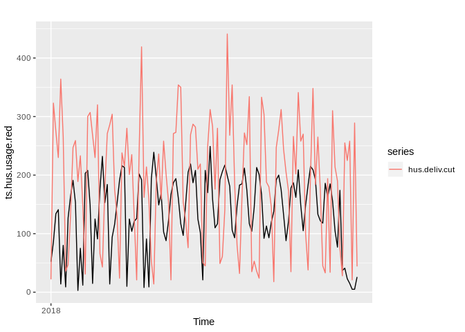

Demand Lab: Red Cells (HUS)
================

``` r
# Set working directory
knitr::opts_knit$set(root.dir = "/home/esa/production_forecasts") # Working on Ubuntu
# knitr::opts_knit$set(root.dir = "V:/production_forecasts") # Working home
```

## Create original datasets that should remain immutable throughout labbing

``` r
library(forecast)
library(ggplot2)
library(gridExtra)
library(knitr)
library(readxl)
library(plyr)
source("src/evalhelp.R")

# Load data
# HUS deliveríes 2013 -->
hus.deliv <- read_excel("./data/hus_data.xlsx", sheet = "Punasolutoim. HUS 2013-->")
colnames(hus.deliv) <- c("time", "deliveries")
ts.hus.deliv <- ts(hus.deliv$deliveries, start = 2013, frequency = 365)

# HUS usage 2018 Q1
hus.usage <- read_excel("./data/hus_data.xlsx", sheet = "Menekki HUS 2018 Q1")
colnames(hus.usage) <- c("product", "time", "type")  # Change column names
```

``` r
# Find daily counts for usage
hus.usage.red <- hus.usage[hus.usage$product == "PUNASOLUVALMISTE", ]  # Filter by product
hus.usage.red$time <- as.Date(hus.usage.red$time)  # Convert into workable datetime
temp <- aggregate(hus.usage.red, by = list(hus.usage.red$time), length)  # This is really ugly, maybe prettify later
ts.hus.usage.red <- ts(temp$product, start = 2018, frequency = 365)


# Restrict the deliveries for the same time period
hus.deliv.cut <- window(ts.hus.deliv, start = 2018, end = c(2018, 126))

# Plot
autoplot(ts.hus.usage.red) + autolayer(hus.deliv.cut)
```

<!-- -->

This looks very promising in terms of forecasting.
