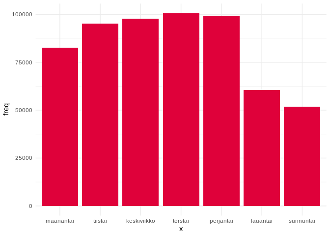

Usage Lab: Red Cells (Ketju)
================

``` r
library(forecast)
library(ggplot2)
library(gridExtra)
library(knitr)
library(readxl)
library(plyr)
library(lubridate)
library(numbers)
source("src/evalhelp.R")
```

# Intro

Currently under development. In this notebook we study how to use
hospital blood product usage data to create demand
predictions.

## Create original datasets that should remain immutable throughout labbing

``` r
# Load data
# All deliveries
deliv <- read_excel("./data/ketju_data.xlsx", sheet = "Ketju-punasolutoimitukset 2014-")[, c('Päivämäärä', 'Toimitukset')]
colnames(deliv) <- c("time", "deliveries")  # Change column names
deliv$time <- as.Date(deliv$time)

# Ketju usage 2014 -->
# I'm using read.csv() instead of read_excel() here, because this sheet contains some fields that kills read_excel!
ketju <- read.csv("./data/ketju_data.csv", header = TRUE, sep = ",", colClasses=c("NULL", NA, "NULL", "NULL", "NULL", NA, "NULL", "NULL", NA, NA, NA))
colnames(ketju) <- c("hospital", "type", "time", "exp", "pcs")  # Change column names

# Ensure compliant time format with lubridate
ketju$time <- mdy(ketju$time)
ketju$exp <- mdy(ketju$exp)  # This will produce an error "failed to parse" for fields that aren't dates. It will insert NAs.

# Arrange by time
ketju <- arrange(ketju, time)

# Find usage
usage <- aggregate(ketju$pcs, by = list(ketju$time), sum); colnames(usage) <- c("time", "pcs")
```

## Histograms of how fresh blood is used across hospitals

<!-- -->

The x-axis can be read as “days until an used product would’ve expired”,
so a larger number corresponds to a fresher product. We see a similar
pattern across all hospitals: products are used in a manner that
resembles a “weekly cycle”. Most products are used 21 days from
expiration, then 14 days, then 7 days…

## Same histogram but with blood types

<!-- -->

Here we observe the same weekly pattern, but the shape of **+** products
is somewhat different from **-** products. Older products are used more
with **-** products.

## Series of usage

``` r
# Create a convenience vector for hospital tags
hospitals <-c("FIMLAB  HÄMEENLINNA VERIKESKUS", "PHKS VERIKESKUS, LAHTI", "TYKSLAB VERIKESKUS", "SATADIAG VERIKESKUS, RAUMA", 
              "FIMLAB TAMPERE VERIKESKUS", "FIMLAB VERIKESKUS, JYVÄSKYLÄ", "KYMKS VERIKESKUS, KOTKA", "EKKS VERIKESKUS, LAPPEENRANTA", 
              "SEINÄJOEN KS VERIKESKUS", "VAASAN KS VERIKESKUS", "NORDLAB KOKKOLA VERIKESKUS", "ISLAB KUOPIO VERIKESKUS", 
              "NORDLAB OULU VERIKESKUS", "NORDLAB ROVANIEMI VERIKESKUS", "SATADIAG VERIKESKUS, PORI")
plots <- list()
i = 0
for(hospital in hospitals){
   i <- i + 1
  hospital.data <- ketju[ketju$hospital == hospital, ]
  hospital.usage <- aggregate(hospital.data$pcs, by = list(hospital.data$time), sum)
  colnames(hospital.usage) <- c("time", "pcs")
  temp <- make_whole(hospital.usage)
  hospital.whole <- temp[[1]]
  hospital.missing <- temp[[2]]

  # Plot
  hospital.plot <- ggplot() + 
    geom_line(data = hospital.whole, aes(x = time, y = pcs)) +
    geom_vline(xintercept = hospital.missing, color = "red") +
    xlab("time") +
    ggtitle(paste(hospital, "\n missing data: ", round(length(hospital.missing)/length(hospital.whole$pcs)*100, digits = 2), "%")) +
    theme(plot.title = element_text(size = 8))
  
  plots[[i]] <- hospital.plot
 
}

ml <- marrangeGrob(plots, nrow=2, ncol=2)
ml
```

<!-- --><!-- --><!-- --><!-- -->

These are daily red cell product usage data from each hospital. A red
line means a missing data point. The missing data point might just be a
zero, which is most probable with RAUMA. Let’s limit our explorations to
2019 for now. This probably means we’ll have to exclude
RAUMA.

``` r
hospitals <- c("FIMLAB  HÄMEENLINNA VERIKESKUS", "PHKS VERIKESKUS, LAHTI", "TYKSLAB VERIKESKUS", 
              "FIMLAB TAMPERE VERIKESKUS", "FIMLAB VERIKESKUS, JYVÄSKYLÄ", "KYMKS VERIKESKUS, KOTKA", "EKKS VERIKESKUS, LAPPEENRANTA", 
              "SEINÄJOEN KS VERIKESKUS", "VAASAN KS VERIKESKUS", "NORDLAB KOKKOLA VERIKESKUS", "ISLAB KUOPIO VERIKESKUS", 
              "NORDLAB OULU VERIKESKUS", "NORDLAB ROVANIEMI VERIKESKUS", "SATADIAG VERIKESKUS, PORI")

plots <- list()
i = 0
for(hospital in hospitals){
   i <- i + 1
  hospital.data <- ketju[ketju$hospital == hospital, ]
  hospital.usage <- aggregate(hospital.data$pcs, by = list(hospital.data$time), sum)
  colnames(hospital.usage) <- c("time", "pcs")
  hospital.usage <- hospital.usage[hospital.usage$time >= as.Date("2019-01-01"), ]
  temp <- make_whole(hospital.usage)
  hospital.whole <- temp[[1]]
  hospital.missing <- temp[[2]]

  # Plot
  hospital.plot <- ggplot() + 
    geom_line(data = hospital.whole, aes(x = time, y = pcs)) +
    geom_vline(xintercept = hospital.missing, color = "red") +
    ggtitle(paste(hospital, "\n missing data: ", round(length(hospital.missing)/length(hospital.whole$pcs)*100, digits = 2), "%")) +
    theme(plot.title = element_text(size = 8)) +
    ylab("")
  
  plots[[i]] <- hospital.plot
 
}

ml <- marrangeGrob(plots, nrow=2, ncol=2)
ml
```

<!-- --><!-- --><!-- --><!-- -->

There is a “clear” weekly seasonality in most hospitals, and it is more
pronounced where a lot of blood is used.

## Total usage across all hospitals (in 2019, *without imputation*)

<!-- -->

## Difference in total usage *with and without imputation*

<!-- -->

The imputed series does not differ significantly from the raw series, so
we can probably use either.

## Deliveries and usage 2019

``` r
ggplot() + 
  geom_line(data = total.usage[total.usage$time >= "2019-01-01", ], aes(x = time, y = pcs, colour = "usage")) +
  geom_line(data = deliv[deliv$time >= "2019-01-01", ], aes(x = time, y = deliveries, colour = "deliveries")) +
  scale_colour_manual(values = c("black", "#DF013A")) +
  theme(legend.position = "bottom")
```

<!-- -->

``` r
combined <- data.frame(usage = head(total.usage[total.usage$time >= "2018-01-01", ]$pcs, 521), deliveries = deliv[deliv$time >= "2018-01-01", ]$deliveries)

# Same week avg diff
diff0 <- 0
for(i in seq(from = 7, to = 469, by = 7)){
  diff0 <- diff0 + (sum(combined$usage[i:(i+6)]) - sum(combined$deliveries[i:(i+6)]))
}
avg0 <- diff0/67

# Next week sum
diff1 <- 0
for(i in seq(from = 7, to = 469, by = 7)){
  diff1 <- diff1 + (sum(combined$usage[i:(i+6)]) - sum(combined$deliveries[(i+7):(i+13)]))
}
avg1 <- diff1/67

# Second week sum
diff2 <- 0
for(i in seq(from = 7, to = 469, by = 7)){
  diff2 <- diff2 + (sum(combined$usage[i:(i+6)]) - sum(combined$deliveries[(i+14):(i+20)]))
}
avg2 <- diff2/67

# Third week sum
diff3 <- 0
for(i in seq(from = 7, to = 469, by = 7)){
  diff3 <- diff3 + (sum(combined$usage[i:(i+6)]) - sum(combined$deliveries[(i+21):(i+27)]))
}
avg3 <- diff3/67

cat(paste("Same week average diff: ", round(avg0, digits = 2), "\n",
            "Next week average diff: ", round(avg1, digits = 2), "\n",
            "Second week average diff: ", round(avg2, digits = 2), "\n",
            "Third week average diff: ", round(avg3, digits = 2)))
```

    ## Same week average diff:  -212.83 
    ##  Next week average diff:  -217.87 
    ##  Second week average diff:  -217.28 
    ##  Third week average diff:  -213.69

Same week difference seems to be the smallest, but only by a very small
margin. The difference constitutes a 10.79 % error, which is slightly
higher than what we want. Let’s go to the daily level and see what
happens.

``` r
# Same day avg diff
ddiff0 <- 0
for(i in seq(from = 7, to = 469, by = 1)){
  ddiff0 <- ddiff0 + (combined$usage[i] - combined$deliveries[i])
}
davg0 <- ddiff0/462

# Next day diff
ddiff1 <- 0
for(i in seq(from = 7, to = 469, by = 1)){
  ddiff1 <- ddiff1 + (combined$usage[i] - combined$deliveries[i+1])
}
davg1 <- ddiff1/462

# Second day diff
ddiff2 <- 0
for(i in seq(from = 7, to = 469, by = 1)){
  ddiff2 <- ddiff2 + (combined$usage[i] - combined$deliveries[i+2])
}
davg2 <- ddiff2/462

# Third day diff
ddiff3 <- 0
for(i in seq(from = 7, to = 469, by = 1)){
  ddiff3 <- ddiff3 + (combined$usage[i] - combined$deliveries[i+3])
}
davg3 <- ddiff3/462

# Fourth day diff
ddiff4 <- 0
for(i in seq(from = 7, to = 469, by = 1)){
  ddiff4 <- ddiff4 + (combined$usage[i] - combined$deliveries[i+4])
}
davg4 <- ddiff4/462

# Fifth day diff
ddiff5 <- 0
for(i in seq(from = 7, to = 469, by = 1)){
  ddiff5 <- ddiff5 + (combined$usage[i] - combined$deliveries[i+5])
}
davg5 <- ddiff5/462

# Sixth day diff
ddiff6 <- 0
for(i in seq(from = 7, to = 469, by = 1)){
  ddiff6 <- ddiff6 + (combined$usage[i] - combined$deliveries[i+6])
}
davg6 <- ddiff6/462

cat(paste("Same day average diff: ", round(davg0, digits = 2), "\n",
          "Next day average diff: ", round(davg1, digits = 2), "\n",
          "Second day average diff: ", round(davg2, digits = 2), "\n",
          "Third day average diff: ", round(davg3, digits = 2), "\n",
          "Fourth day average diff: ", round(davg4, digits = 2), "\n",
          "Fifth day average diff: ", round(davg5, digits = 2), "\n",
          "Sixth day average diff: ", round(davg6, digits = 2)
          )
    )
```

    ## Same day average diff:  -30.52 
    ##  Next day average diff:  -31.74 
    ##  Second day average diff:  -31.07 
    ##  Third day average diff:  -29.97 
    ##  Fourth day average diff:  -30.63 
    ##  Fifth day average diff:  -30.25 
    ##  Sixth day average diff:  -29.77

Same +10 % difference.

## Forecasting usage

``` r
ts.usage <- ts(total.usage$pcs, start = c(2018, 1), frequency = 365)

# Features: weekdays
mon <- rep(c(1, 0, 0, 0, 0, 0, 0), 52)
tue <- rep(c(0, 1, 0, 0, 0, 0, 0), 52)
wed <- rep(c(0, 0, 1, 0, 0, 0, 0), 52)
thu <- rep(c(0, 0, 0, 1, 0, 0, 0), 52)
fri <- rep(c(0, 0, 0, 0, 1, 0, 0), 52)
sat <- rep(c(0, 0, 0, 0, 0, 1, 0), 52)

usage.feature.matrix <- matrix(c(mon, tue, wed, thu, fri, sat),
                              ncol = 6,
                              byrow = FALSE)

usage.e <- tsCV(ts.usage, farima, h = 1)
usage.crit <- cMAPE(usage.e, ts.usage)
usage.mape <- mean(abs(100*usage.e/ts.usage), na.rm = TRUE)
usage.rmse <- sqrt(mean(usage.e^2, na.rm = TRUE))

# Table
usagebench <- matrix(c(usage.crit, usage.mape, usage.rmse),
                   ncol = 3,
                   byrow = TRUE)

colnames(usagebench) <- c("cMAPE", "MAPE", "RMSE")
rownames(usagebench) <- c("DynReg")
kable(usagebench, "markdown")
```

|        |    cMAPE |     MAPE |     RMSE |
| :----- | -------: | -------: | -------: |
| DynReg | 26.29518 | 17.23969 | 61.10245 |
