Usage Lab: Red Cells (Ketju)
================

``` r
library(forecast)
library(ggplot2)
library(gridExtra)
library(knitr)
library(readxl)
library(plyr)
library(lubridate)
library(numbers)
source("src/evalhelp.R")
```

# Intro

Currently under development. In this notebook we study how to use
hospital blood product usage data to create demand
predictions.

## Create original datasets that should remain immutable throughout labbing

``` r
# Load data
# All deliveries
deliv <- read_excel("./data/ketju_data.xlsx", sheet = "Ketju-punasolutoimitukset 2014-")[, c('Päivämäärä', 'Toimitukset')]
colnames(deliv) <- c("time", "deliveries")  # Change column names
deliv$time <- as.Date(deliv$time)

# Ketju usage 2014 -->
# I'm using read.csv() instead of read_excel() here, because this sheet contains some fields that kills read_excel!
ketju <- read.csv("./data/ketju_data.csv", header = TRUE, sep = ",", colClasses=c("NULL", NA, "NULL", "NULL", "NULL", NA, "NULL", "NULL", NA, NA, NA))
colnames(ketju) <- c("hospital", "type", "time", "exp", "pcs")  # Change column names

# Ensure compliant time format with lubridate
ketju$time <- mdy(ketju$time)
ketju$exp <- mdy(ketju$exp)  # This will produce an error "failed to parse" for fields that aren't dates. It will insert NAs.

# Arrange by time
ketju <- arrange(ketju, time)

# Find usage
usage <- aggregate(ketju$pcs, by = list(ketju$time), sum); colnames(usage) <- c("time", "pcs")
```

## Histograms of how fresh blood is used across hospitals

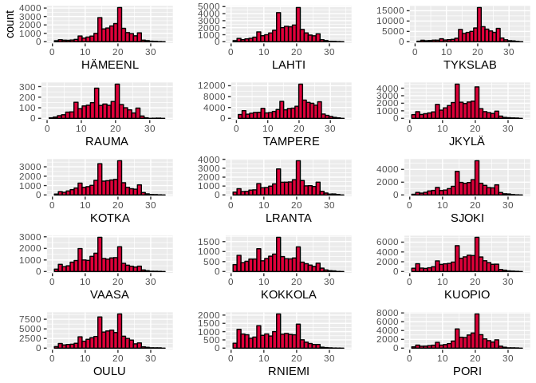<!-- -->

## Same histogram but with blood types

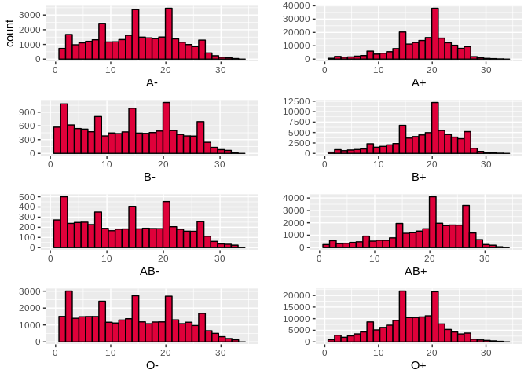<!-- -->

## Series of usage

``` r
# Create a convenience vector for hospital tags
hospitals <-c("FIMLAB  HÄMEENLINNA VERIKESKUS", "PHKS VERIKESKUS, LAHTI", "TYKSLAB VERIKESKUS", "SATADIAG VERIKESKUS, RAUMA", 
              "FIMLAB TAMPERE VERIKESKUS", "FIMLAB VERIKESKUS, JYVÄSKYLÄ", "KYMKS VERIKESKUS, KOTKA", "EKKS VERIKESKUS, LAPPEENRANTA", 
              "SEINÄJOEN KS VERIKESKUS", "VAASAN KS VERIKESKUS", "NORDLAB KOKKOLA VERIKESKUS", "ISLAB KUOPIO VERIKESKUS", 
              "NORDLAB OULU VERIKESKUS", "NORDLAB ROVANIEMI VERIKESKUS", "SATADIAG VERIKESKUS, PORI")
plots <- list()
i = 0
for(hospital in hospitals){
   i <- i + 1
  hospital.data <- ketju[ketju$hospital == hospital, ]
  hospital.usage <- aggregate(hospital.data$pcs, by = list(hospital.data$time), sum)
  colnames(hospital.usage) <- c("time", "pcs")
  temp <- make_whole(hospital.usage)
  hospital.whole <- temp[[1]]
  hospital.missing <- temp[[2]]

  # Plot
  hospital.plot <- ggplot() + 
    geom_line(data = hospital.whole, aes(x = time, y = pcs)) +
    geom_vline(xintercept = hospital.missing, color = "red") +
    xlab("time") +
    ggtitle(paste(hospital, "\n missing data: ", round(length(hospital.missing)/length(hospital.whole$pcs)*100, digits = 2), "%")) +
    theme(plot.title = element_text(size = 8))
  
  plots[[i]] <- hospital.plot
 
}

ml <- marrangeGrob(plots, nrow=2, ncol=2)
ml
```

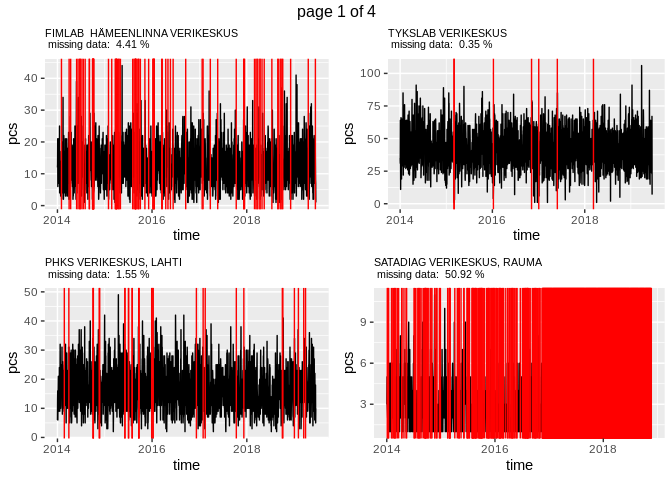<!-- -->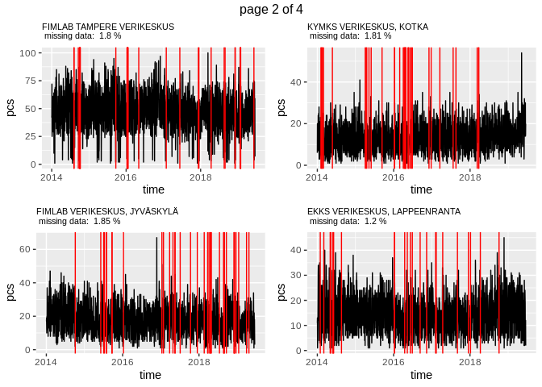<!-- --><!-- -->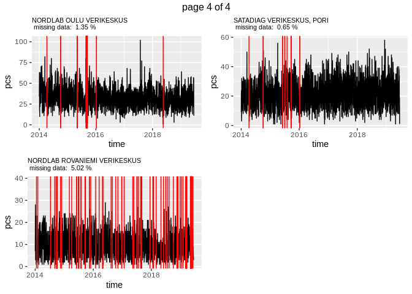<!-- -->

The problem might be that 0s are not recorded, so we can’t say what’s
actually missing data and what’s just a data point of zero. Let’s limit
our explorations to 2019 for now. This probably means we’ll have to
exclude
RAUMA.

``` r
hospitals <- c("FIMLAB  HÄMEENLINNA VERIKESKUS", "PHKS VERIKESKUS, LAHTI", "TYKSLAB VERIKESKUS", 
              "FIMLAB TAMPERE VERIKESKUS", "FIMLAB VERIKESKUS, JYVÄSKYLÄ", "KYMKS VERIKESKUS, KOTKA", "EKKS VERIKESKUS, LAPPEENRANTA", 
              "SEINÄJOEN KS VERIKESKUS", "VAASAN KS VERIKESKUS", "NORDLAB KOKKOLA VERIKESKUS", "ISLAB KUOPIO VERIKESKUS", 
              "NORDLAB OULU VERIKESKUS", "NORDLAB ROVANIEMI VERIKESKUS", "SATADIAG VERIKESKUS, PORI")

plots <- list()
i = 0
for(hospital in hospitals){
   i <- i + 1
  hospital.data <- ketju[ketju$hospital == hospital, ]
  hospital.usage <- aggregate(hospital.data$pcs, by = list(hospital.data$time), sum)
  colnames(hospital.usage) <- c("time", "pcs")
  hospital.usage <- hospital.usage[hospital.usage$time >= as.Date("2019-01-01"), ]
  temp <- make_whole(hospital.usage)
  hospital.whole <- temp[[1]]
  hospital.missing <- temp[[2]]

  # Plot
  hospital.plot <- ggplot() + 
    geom_line(data = hospital.whole, aes(x = time, y = pcs)) +
    geom_vline(xintercept = hospital.missing, color = "red") +
    ggtitle(paste(hospital, "\n missing data: ", round(length(hospital.missing)/length(hospital.whole$pcs)*100, digits = 2), "%")) +
    theme(plot.title = element_text(size = 8)) +
    ylab("")
  
  plots[[i]] <- hospital.plot
 
}

ml <- marrangeGrob(plots, nrow=2, ncol=2)
ml
```

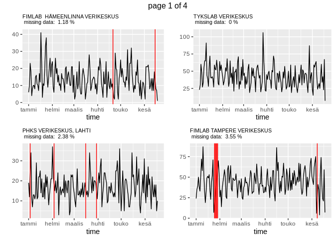<!-- -->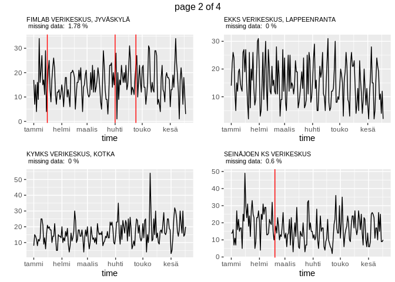<!-- -->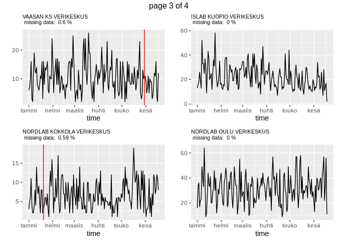<!-- -->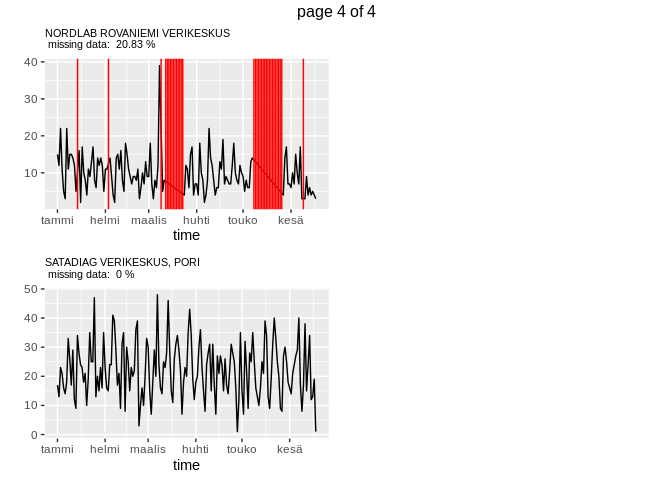<!-- -->

## Total usage across all hospitals (in 2019, *without imputation*)

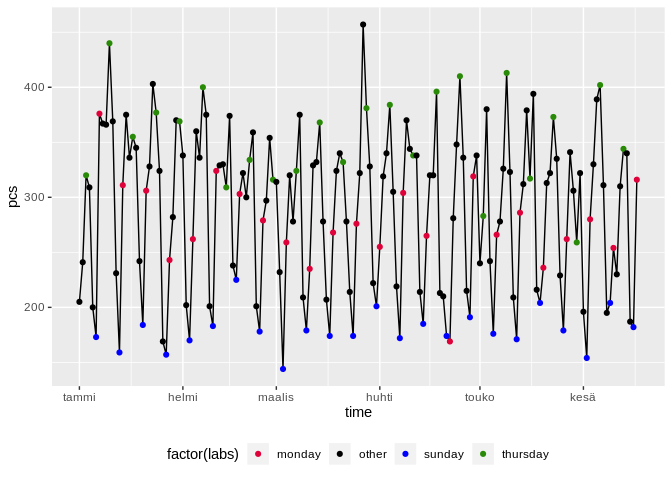<!-- -->

## Difference in total usage *with and without imputation*

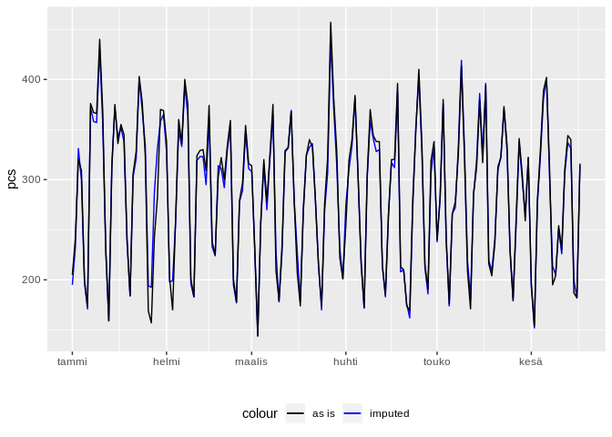<!-- -->

## Forecasting usage

``` r
ts.usage <- ts(total.usage$pcs, start = c(2018, 1), frequency = 365)

# Features: weekdays, months
mon <- rep(c(1, 0, 0, 0, 0, 0, 0), 52)
tue <- rep(c(0, 1, 0, 0, 0, 0, 0), 52)
wed <- rep(c(0, 0, 1, 0, 0, 0, 0), 52)
thu <- rep(c(0, 0, 0, 1, 0, 0, 0), 52)
fri <- rep(c(0, 0, 0, 0, 1, 0, 0), 52)
sat <- rep(c(0, 0, 0, 0, 0, 1, 0), 52)
#sun <- rep(c(0, 0, 0, 0, 0, 0, 1), 52)

# jan <- c(rep(1, 31), rep(0, (365-31)))
# feb <- c(rep(0, 31), rep(1, 28), rep(0, (365-59)))
# mar <- c(rep(0, 59), rep(1, 31), rep(0, (365-90)))
# apr <- c(rep(0, 90), rep(1, 30), rep(0, (365-120)))
# may <- c(rep(0, 120), rep(1, 31), rep(0, (365-151)))
# jun <- c(rep(0, 151), rep(1, 30), rep(0, (365-181)))
# jul <- c(rep(0, 181), rep(1, 31), rep(0, (365-212)))
# aug <- c(rep(0, 212), rep(1, 31), rep(0, (365-243)))
# sep <- c(rep(0, 243), rep(1, 30), rep(0, (365-273)))
# oct <- c(rep(0, 273), rep(1, 31), rep(0, (365-304)))
# nov <- c(rep(0, 304), rep(1, 30), rep(0, (365-334)))
# dec <- c(rep(0, 334), rep(1, 31))

usage.feature.matrix <- matrix(c(mon, tue, wed, thu, fri, sat),
                              ncol = 6,
                              byrow = FALSE)

usage.e <- tsCV(ts.usage, farima, h = 1)
usage.crit <- cMAPE(usage.e, ts.usage)
usage.mape <- mean(abs(100*usage.e/ts.usage), na.rm = TRUE)
usage.rmse <- sqrt(mean(usage.e^2, na.rm = TRUE))

# Table
usagebench <- matrix(c(usage.crit, usage.mape, usage.rmse),
                   ncol = 3,
                   byrow = TRUE)

colnames(usagebench) <- c("cMAPE", "MAPE", "RMSE")
rownames(usagebench) <- c("DynReg")
kable(usagebench, "markdown")
```

|        |    cMAPE |     MAPE |     RMSE |
| :----- | -------: | -------: | -------: |
| DynReg | 26.29518 | 17.23969 | 61.10245 |

## Simulation of storage

``` r
# Storage: 3000
# Expiration of products = 28 days

# Scenario 1: Storage is filled based on previous week's demand
STORAGE = 3000

for(i in seq(length(total.usage$pcs))){
  if(rem(i, 7) == 0){
    #print(paste("Adding ", round(sum(total.usage$pcs[(i-7) : i])), " to the storage."))
    STORAGE <- STORAGE + round(sum(total.usage$pcs[(i-7) : i]))
  }
  #print(paste("Depleting storage by ", round(total.usage$pcs[i])))
  STORAGE <- STORAGE - round(total.usage$pcs[i])
  if(STORAGE <= 0){
   # print(paste("Storage lasted ", i, " days."))
    break
  }
}
print(paste("Storage at the end of series: ", STORAGE))
```

    ## [1] "Storage at the end of series:  16199"
