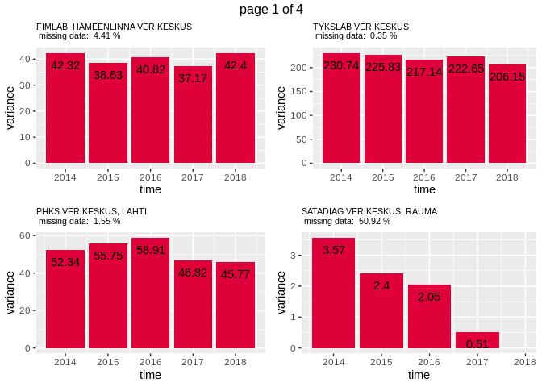
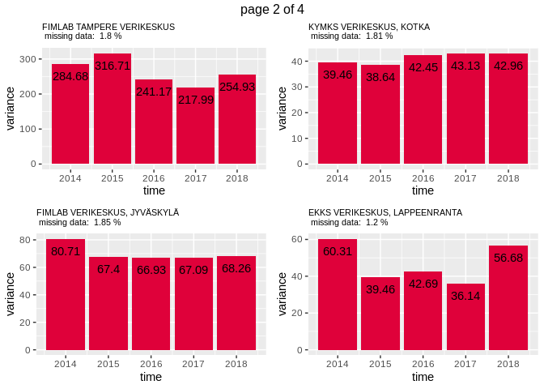
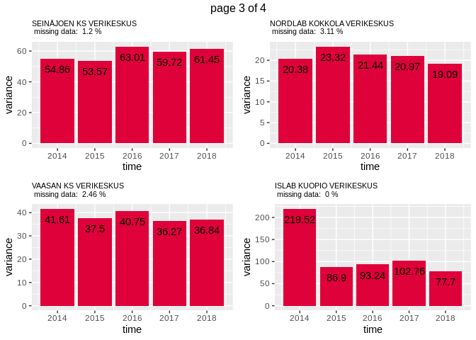
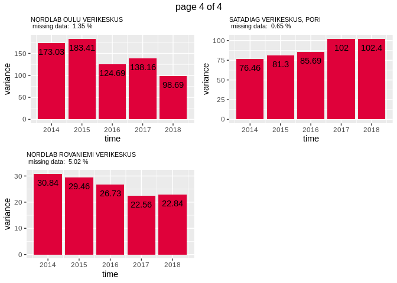
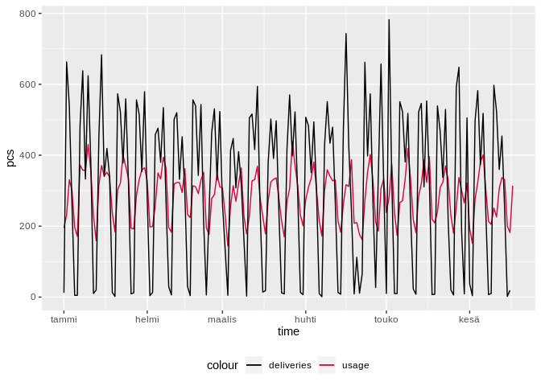

Usage Lab: Red Cells (Ketju)
================

``` r
library(forecast)
library(ggplot2)
library(gridExtra)
library(knitr)
library(readxl)
library(plyr)
library(lubridate)
library(numbers)
source("src/evalhelp.R")
```

# Intro

In this notebook we study how to use hospital blood product usage data
to create demand
predictions.

## Create original datasets that should remain immutable throughout labbing

``` r
# Load data
# All deliveries
deliv <- read_excel("./data/ketju_data.xlsx", sheet = "Ketju-punasolutoimitukset 2014-")[, c('Päivämäärä', 'Toimitukset')]
colnames(deliv) <- c("time", "deliveries")  # Change column names
deliv$time <- as.Date(deliv$time)

# Ketju usage 2014 -->
# I'm using read.csv() instead of read_excel() here, because this sheet contains some fields that kills read_excel!
ketju <- read.csv("./data/ketju_data.csv", header = TRUE, sep = ",", colClasses=c("NULL", NA, "NULL", "NULL", "NULL", NA, "NULL", "NULL", NA, NA, NA))
colnames(ketju) <- c("hospital", "type", "time", "exp", "pcs")  # Change column names

# Ensure compliant time format with lubridate
ketju$time <- mdy(ketju$time)
ketju$exp <- mdy(ketju$exp)  # This will produce an error "failed to parse" for fields that aren't dates. It will insert NAs.

# Arrange by time
ketju <- arrange(ketju, time)

# Find usage
usage <- aggregate(ketju$pcs, by = list(ketju$time), sum); colnames(usage) <- c("time", "pcs")
```

## Ketju weekday analysis

``` r
freqs <- count(weekdays(ketju$time))
freqs$x <- factor(freqs$x, levels = c("maanantai", "tiistai", "keskiviikko", "torstai", "perjantai", "lauantai", "sunnuntai"))
ggplot(data = freqs, aes(x = x, y = freq)) + geom_histogram(stat = "identity", fill = "#DF013A") + theme_minimal()
```

<!-- -->

## Histograms of how fresh blood is used across hospitals

<!-- -->

The x-axis can be read as “days until an used product would’ve expired”,
so a larger number corresponds to a fresher product. We see a similar
pattern across all hospitals: products are used in a manner that
resembles a “weekly cycle”. Most products are used 21 days from
expiration, then 14 days, then 7 days…

## Same histogram but with blood types

<!-- -->

Here we observe the same weekly pattern, but the shape of **+** products
is somewhat different from **-** products. Older products are used more
with **-** products.

## Series of usage

``` r
# Create a convenience vector for hospital tags
hospitals <-c("FIMLAB  HÄMEENLINNA VERIKESKUS", "PHKS VERIKESKUS, LAHTI", "TYKSLAB VERIKESKUS", "SATADIAG VERIKESKUS, RAUMA", 
              "FIMLAB TAMPERE VERIKESKUS", "FIMLAB VERIKESKUS, JYVÄSKYLÄ", "KYMKS VERIKESKUS, KOTKA", "EKKS VERIKESKUS, LAPPEENRANTA", 
              "SEINÄJOEN KS VERIKESKUS", "VAASAN KS VERIKESKUS", "NORDLAB KOKKOLA VERIKESKUS", "ISLAB KUOPIO VERIKESKUS", 
              "NORDLAB OULU VERIKESKUS", "NORDLAB ROVANIEMI VERIKESKUS", "SATADIAG VERIKESKUS, PORI")
plots <- list()
# variances <- list()
i = 0
for(hospital in hospitals){
   i <- i + 1
  hospital.data <- ketju[ketju$hospital == hospital, ]
  hospital.usage <- aggregate(hospital.data$pcs, by = list(hospital.data$time), sum)
  colnames(hospital.usage) <- c("time", "pcs")
  temp <- make_whole(hospital.usage)
  hospital.whole <- temp[[1]]
  hospital.missing <- temp[[2]]
  # 
  # # Yearly variance
  # vars <- c()
  # for(i in seq(from = 1, to = 1825, by = 365)){
  #   vars <- c(vars, var(hospital.whole$pcs[i:(i+364)]))
  # }

  # Plot
  hospital.plot <- ggplot() + 
    geom_line(data = hospital.whole, aes(x = time, y = pcs)) +
    geom_vline(xintercept = hospital.missing, color = "red") +
    xlab("time") +
    ggtitle(paste(hospital, "\n missing data: ", round(length(hospital.missing)/length(hospital.whole$pcs)*100, digits = 2), "%")) +
    theme(plot.title = element_text(size = 8))
  
  plots[[i]] <- hospital.plot
  # variances[[i]] <- vars
 
}

ml <- marrangeGrob(plots, nrow=2, ncol=2)
ml
```

<!-- --><!-- --><!-- --><!-- -->

These are daily red cell product usage data from each hospital. A red
line means a missing data point. The missing data point might just be a
zero, which is most probable with RAUMA.

## Changes in variance

``` r
# Create a convenience vector for hospital tags
hospitals <-c("FIMLAB  HÄMEENLINNA VERIKESKUS", "PHKS VERIKESKUS, LAHTI", "TYKSLAB VERIKESKUS", "SATADIAG VERIKESKUS, RAUMA", 
              "FIMLAB TAMPERE VERIKESKUS", "FIMLAB VERIKESKUS, JYVÄSKYLÄ", "KYMKS VERIKESKUS, KOTKA", "EKKS VERIKESKUS, LAPPEENRANTA", 
              "SEINÄJOEN KS VERIKESKUS", "VAASAN KS VERIKESKUS", "NORDLAB KOKKOLA VERIKESKUS", "ISLAB KUOPIO VERIKESKUS", 
              "NORDLAB OULU VERIKESKUS", "NORDLAB ROVANIEMI VERIKESKUS", "SATADIAG VERIKESKUS, PORI")
plots <- list()
i = 0
for(hospital in hospitals){
   i <- i + 1
  hospital.data <- ketju[ketju$hospital == hospital, ]
  hospital.usage <- aggregate(hospital.data$pcs, by = list(hospital.data$time), sum)
  colnames(hospital.usage) <- c("time", "pcs")
  temp <- make_whole(hospital.usage)
  hospital.whole <- temp[[1]]
  hospital.missing <- temp[[2]]

  # Yearly variance
  vars <- data.frame(years = 0, variance = 0)
  year <- 2013
  for(j in seq(from = 1, to = 1825, by = 365)){
    year <- year + 1
    
    vars <- rbind(vars, data.frame(years = year, variance = var(hospital.whole$pcs[j:(j+364)])))
  }

  vars <- vars[vars$years != 0, ]
  
  # Plot
  hospital.plot <- ggplot(data = vars, aes(x = years, y = variance)) + 
    geom_bar(stat = "identity", fill = "#DF013A") +
    geom_text(data = vars, aes(x = years, y = variance, label = round(variance, digits = 2)), vjust = 2) +
    xlab("time") +
    ggtitle(paste(hospital, "\n missing data: ", round(length(hospital.missing)/length(hospital.whole$pcs)*100, digits = 2), "%")) +
    theme(plot.title = element_text(size = 8))
  
  plots[[i]] <- hospital.plot
 
}

ml <- marrangeGrob(plots, nrow=2, ncol=2)
ml
```

<!-- --><!-- --><!-- --><!-- -->

Seems that the variance is not consistently higher in 2018 as previously
thought.

Let’s limit our explorations to 2019 for now. This probably means we’ll
have to exclude
RAUMA.

``` r
hospitals <- c("FIMLAB  HÄMEENLINNA VERIKESKUS", "PHKS VERIKESKUS, LAHTI", "TYKSLAB VERIKESKUS", 
              "FIMLAB TAMPERE VERIKESKUS", "FIMLAB VERIKESKUS, JYVÄSKYLÄ", "KYMKS VERIKESKUS, KOTKA", "EKKS VERIKESKUS, LAPPEENRANTA", 
              "SEINÄJOEN KS VERIKESKUS", "VAASAN KS VERIKESKUS", "NORDLAB KOKKOLA VERIKESKUS", "ISLAB KUOPIO VERIKESKUS", 
              "NORDLAB OULU VERIKESKUS", "NORDLAB ROVANIEMI VERIKESKUS", "SATADIAG VERIKESKUS, PORI")

plots <- list()
i = 0
for(hospital in hospitals){
   i <- i + 1
  hospital.data <- ketju[ketju$hospital == hospital, ]
  hospital.usage <- aggregate(hospital.data$pcs, by = list(hospital.data$time), sum)
  colnames(hospital.usage) <- c("time", "pcs")
  hospital.usage <- hospital.usage[hospital.usage$time >= as.Date("2019-01-01"), ]
  temp <- make_whole(hospital.usage)
  hospital.whole <- temp[[1]]
  hospital.missing <- temp[[2]]

  # Plot
  hospital.plot <- ggplot() + 
    geom_line(data = hospital.whole, aes(x = time, y = pcs)) +
    geom_vline(xintercept = hospital.missing, color = "red") +
    ggtitle(paste(hospital, "\n missing data: ", round(length(hospital.missing)/length(hospital.whole$pcs)*100, digits = 2), "%")) +
    theme(plot.title = element_text(size = 8)) +
    ylab("")
  
  plots[[i]] <- hospital.plot
 
}

ml <- marrangeGrob(plots, nrow=2, ncol=2)
ml
```

<!-- --><!-- --><!-- --><!-- -->

There is a “clear” weekly seasonality in most hospitals, and it is more
pronounced where a lot of blood is used.

## Total usage across all hospitals (in 2019, *without imputation*)

<!-- -->

## Difference in total usage *with and without imputation*

<!-- -->

The imputed series does not differ significantly from the raw series, so
we can probably use either.

## Deliveries and usage 2019

``` r
ggplot() + 
  geom_line(data = total.usage[total.usage$time >= "2019-01-01", ], aes(x = time, y = pcs, colour = "usage")) +
  geom_line(data = deliv[deliv$time >= "2019-01-01", ], aes(x = time, y = deliveries, colour = "deliveries")) +
  scale_colour_manual(values = c("black", "#DF013A")) +
  theme(legend.position = "bottom")
```

<!-- -->

``` r
combined <- data.frame(usage = head(total.usage[total.usage$time >= "2018-01-01", ]$pcs, 521), deliveries = deliv[deliv$time >= "2018-01-01", ]$deliveries)

# Same week avg diff
diff0 <- 0
for(i in seq(from = 7, to = 469, by = 7)){
  diff0 <- diff0 + (sum(combined$usage[i:(i+6)]) - sum(combined$deliveries[i:(i+6)]))
}
avg0 <- diff0/67

# Next week sum
diff1 <- 0
for(i in seq(from = 7, to = 469, by = 7)){
  diff1 <- diff1 + (sum(combined$usage[i:(i+6)]) - sum(combined$deliveries[(i+7):(i+13)]))
}
avg1 <- diff1/67

# Second week sum
diff2 <- 0
for(i in seq(from = 7, to = 469, by = 7)){
  diff2 <- diff2 + (sum(combined$usage[i:(i+6)]) - sum(combined$deliveries[(i+14):(i+20)]))
}
avg2 <- diff2/67

# Third week sum
diff3 <- 0
for(i in seq(from = 7, to = 469, by = 7)){
  diff3 <- diff3 + (sum(combined$usage[i:(i+6)]) - sum(combined$deliveries[(i+21):(i+27)]))
}
avg3 <- diff3/67

cat(paste("Same week average diff: ", round(avg0, digits = 2), "\n",
            "Next week average diff: ", round(avg1, digits = 2), "\n",
            "Second week average diff: ", round(avg2, digits = 2), "\n",
            "Third week average diff: ", round(avg3, digits = 2)))
```

    ## Same week average diff:  -212.83 
    ##  Next week average diff:  -217.87 
    ##  Second week average diff:  -217.28 
    ##  Third week average diff:  -213.69

Same week difference seems to be the smallest, but only by a very small
margin. The difference constitutes a 10.79 % error, which is slightly
higher than what we want. Let’s go to the daily level and see what
happens.

``` r
# Same day avg diff
ddiff0 <- 0
for(i in seq(from = 7, to = 469, by = 1)){
  ddiff0 <- ddiff0 + (combined$usage[i] - combined$deliveries[i])
}
davg0 <- ddiff0/462

# Next day diff
ddiff1 <- 0
for(i in seq(from = 7, to = 469, by = 1)){
  ddiff1 <- ddiff1 + (combined$usage[i] - combined$deliveries[i+1])
}
davg1 <- ddiff1/462

# Second day diff
ddiff2 <- 0
for(i in seq(from = 7, to = 469, by = 1)){
  ddiff2 <- ddiff2 + (combined$usage[i] - combined$deliveries[i+2])
}
davg2 <- ddiff2/462

# Third day diff
ddiff3 <- 0
for(i in seq(from = 7, to = 469, by = 1)){
  ddiff3 <- ddiff3 + (combined$usage[i] - combined$deliveries[i+3])
}
davg3 <- ddiff3/462

# Fourth day diff
ddiff4 <- 0
for(i in seq(from = 7, to = 469, by = 1)){
  ddiff4 <- ddiff4 + (combined$usage[i] - combined$deliveries[i+4])
}
davg4 <- ddiff4/462

# Fifth day diff
ddiff5 <- 0
for(i in seq(from = 7, to = 469, by = 1)){
  ddiff5 <- ddiff5 + (combined$usage[i] - combined$deliveries[i+5])
}
davg5 <- ddiff5/462

# Sixth day diff
ddiff6 <- 0
for(i in seq(from = 7, to = 469, by = 1)){
  ddiff6 <- ddiff6 + (combined$usage[i] - combined$deliveries[i+6])
}
davg6 <- ddiff6/462

cat(paste("Same day average diff: ", round(davg0, digits = 2), "\n",
          "Next day average diff: ", round(davg1, digits = 2), "\n",
          "Second day average diff: ", round(davg2, digits = 2), "\n",
          "Third day average diff: ", round(davg3, digits = 2), "\n",
          "Fourth day average diff: ", round(davg4, digits = 2), "\n",
          "Fifth day average diff: ", round(davg5, digits = 2), "\n",
          "Sixth day average diff: ", round(davg6, digits = 2)
          )
    )
```

    ## Same day average diff:  -30.52 
    ##  Next day average diff:  -31.74 
    ##  Second day average diff:  -31.07 
    ##  Third day average diff:  -29.97 
    ##  Fourth day average diff:  -30.63 
    ##  Fifth day average diff:  -30.25 
    ##  Sixth day average diff:  -29.77

Same +10 % difference.

## Forecasting usage

``` r
ts.usage <- ts(total.usage$pcs, start = c(2018, 1), frequency = 365)

# Features: weekdays
mon <- rep(c(1, 0, 0, 0, 0, 0, 0), 52)
tue <- rep(c(0, 1, 0, 0, 0, 0, 0), 52)
wed <- rep(c(0, 0, 1, 0, 0, 0, 0), 52)
thu <- rep(c(0, 0, 0, 1, 0, 0, 0), 52)
fri <- rep(c(0, 0, 0, 0, 1, 0, 0), 52)
sat <- rep(c(0, 0, 0, 0, 0, 1, 0), 52)

usage.feature.matrix <- matrix(c(mon, tue, wed, thu, fri, sat),
                              ncol = 6,
                              byrow = FALSE)

usage.e <- tsCV(ts.usage, farima, h = 1)
usage.crit <- cMAPE(usage.e, ts.usage)
usage.mape <- mean(abs(100*usage.e/ts.usage), na.rm = TRUE)
usage.rmse <- sqrt(mean(usage.e^2, na.rm = TRUE))

# Table
usagebench <- matrix(c(usage.crit, usage.mape, usage.rmse),
                   ncol = 3,
                   byrow = TRUE)

colnames(usagebench) <- c("cMAPE", "MAPE", "RMSE")
rownames(usagebench) <- c("DynReg")
kable(usagebench, "markdown")
```

|        |    cMAPE |     MAPE |     RMSE |
| :----- | -------: | -------: | -------: |
| DynReg | 26.29518 | 17.23969 | 61.10245 |

## Has the variance of blood usage changed during the years?

``` r
usage
```

    ##            time pcs
    ## 1    2014-01-01 225
    ## 2    2014-01-02 325
    ## 3    2014-01-03 409
    ## 4    2014-01-04 204
    ## 5    2014-01-05 153
    ## 6    2014-01-06 174
    ## 7    2014-01-07 366
    ## 8    2014-01-08 419
    ## 9    2014-01-09 453
    ## 10   2014-01-10 443
    ## 11   2014-01-11 238
    ## 12   2014-01-12 202
    ## 13   2014-01-13 318
    ## 14   2014-01-14 429
    ## 15   2014-01-15 334
    ## 16   2014-01-16 365
    ## 17   2014-01-17 381
    ## 18   2014-01-18 247
    ## 19   2014-01-19 221
    ## 20   2014-01-20 299
    ## 21   2014-01-21 368
    ## 22   2014-01-22 407
    ## 23   2014-01-23 363
    ## 24   2014-01-24 409
    ## 25   2014-01-25 277
    ## 26   2014-01-26 196
    ## 27   2014-01-27 303
    ## 28   2014-01-28 386
    ## 29   2014-01-29 370
    ## 30   2014-01-30 396
    ## 31   2014-01-31 359
    ## 32   2014-02-01 244
    ## 33   2014-02-02 224
    ## 34   2014-02-03 338
    ## 35   2014-02-04 403
    ## 36   2014-02-05 458
    ## 37   2014-02-06 418
    ## 38   2014-02-07 409
    ## 39   2014-02-08 223
    ## 40   2014-02-09 211
    ## 41   2014-02-10 304
    ## 42   2014-02-11 433
    ## 43   2014-02-12 369
    ## 44   2014-02-13 438
    ## 45   2014-02-14 391
    ## 46   2014-02-15 232
    ## 47   2014-02-16 208
    ## 48   2014-02-17 370
    ## 49   2014-02-18 352
    ## 50   2014-02-19 383
    ## 51   2014-02-20 355
    ## 52   2014-02-21 374
    ## 53   2014-02-22 231
    ## 54   2014-02-23 211
    ## 55   2014-02-24 348
    ## 56   2014-02-25 408
    ## 57   2014-02-26 347
    ## 58   2014-02-27 352
    ## 59   2014-02-28 317
    ## 60   2014-03-01 219
    ## 61   2014-03-02 190
    ## 62   2014-03-03 312
    ## 63   2014-03-04 351
    ## 64   2014-03-05 345
    ## 65   2014-03-06 335
    ## 66   2014-03-07 338
    ## 67   2014-03-08 217
    ## 68   2014-03-09 159
    ## 69   2014-03-10 295
    ## 70   2014-03-11 350
    ## 71   2014-03-12 388
    ## 72   2014-03-13 530
    ## 73   2014-03-14 450
    ## 74   2014-03-15 238
    ## 75   2014-03-16 195
    ## 76   2014-03-17 317
    ## 77   2014-03-18 320
    ## 78   2014-03-19 310
    ## 79   2014-03-20 417
    ## 80   2014-03-21 375
    ## 81   2014-03-22 234
    ## 82   2014-03-23 237
    ## 83   2014-03-24 318
    ## 84   2014-03-25 326
    ## 85   2014-03-26 366
    ## 86   2014-03-27 403
    ## 87   2014-03-28 391
    ## 88   2014-03-29 260
    ## 89   2014-03-30 208
    ## 90   2014-03-31 355
    ## 91   2014-04-01 334
    ## 92   2014-04-02 354
    ## 93   2014-04-03 421
    ## 94   2014-04-04 426
    ## 95   2014-04-05 285
    ## 96   2014-04-06 231
    ## 97   2014-04-07 340
    ## 98   2014-04-08 378
    ## 99   2014-04-09 306
    ## 100  2014-04-10 402
    ## 101  2014-04-11 389
    ## 102  2014-04-12 209
    ## 103  2014-04-13 156
    ## 104  2014-04-14 305
    ## 105  2014-04-15 424
    ## 106  2014-04-16 402
    ## 107  2014-04-17 334
    ## 108  2014-04-18 210
    ## 109  2014-04-19 184
    ## 110  2014-04-20 131
    ## 111  2014-04-21 184
    ## 112  2014-04-22 309
    ## 113  2014-04-23 390
    ## 114  2014-04-24 375
    ## 115  2014-04-25 465
    ## 116  2014-04-26 238
    ## 117  2014-04-27 220
    ## 118  2014-04-28 364
    ## 119  2014-04-29 422
    ## 120  2014-04-30 401
    ## 121  2014-05-01 249
    ## 122  2014-05-02 420
    ## 123  2014-05-03 221
    ## 124  2014-05-04 195
    ## 125  2014-05-05 305
    ## 126  2014-05-06 398
    ## 127  2014-05-07 366
    ## 128  2014-05-08 435
    ## 129  2014-05-09 429
    ## 130  2014-05-10 224
    ## 131  2014-05-11 205
    ## 132  2014-05-12 300
    ## 133  2014-05-13 341
    ## 134  2014-05-14 382
    ## 135  2014-05-15 367
    ## 136  2014-05-16 466
    ## 137  2014-05-17 262
    ## 138  2014-05-18 221
    ## 139  2014-05-19 374
    ## 140  2014-05-20 383
    ## 141  2014-05-21 389
    ## 142  2014-05-22 405
    ## 143  2014-05-23 388
    ## 144  2014-05-24 208
    ## 145  2014-05-25 220
    ## 146  2014-05-26 367
    ## 147  2014-05-27 441
    ## 148  2014-05-28 441
    ## 149  2014-05-29 216
    ## 150  2014-05-30 352
    ## 151  2014-05-31 241
    ## 152  2014-06-01 190
    ## 153  2014-06-02 309
    ## 154  2014-06-03 325
    ## 155  2014-06-04 395
    ## 156  2014-06-05 415
    ## 157  2014-06-06 432
    ## 158  2014-06-07 234
    ## 159  2014-06-08 202
    ## 160  2014-06-09 293
    ## 161  2014-06-10 407
    ## 162  2014-06-11 401
    ## 163  2014-06-12 498
    ## 164  2014-06-13 337
    ## 165  2014-06-14 253
    ## 166  2014-06-15 284
    ## 167  2014-06-16 281
    ## 168  2014-06-17 382
    ## 169  2014-06-18 414
    ## 170  2014-06-19 407
    ## 171  2014-06-20 288
    ## 172  2014-06-21 246
    ## 173  2014-06-22 229
    ## 174  2014-06-23 344
    ## 175  2014-06-24 360
    ## 176  2014-06-25 391
    ## 177  2014-06-26 378
    ## 178  2014-06-27 324
    ## 179  2014-06-28 256
    ## 180  2014-06-29 248
    ## 181  2014-06-30 375
    ## 182  2014-07-01 348
    ## 183  2014-07-02 391
    ## 184  2014-07-03 377
    ## 185  2014-07-04 408
    ## 186  2014-07-05 219
    ## 187  2014-07-06 199
    ## 188  2014-07-07 296
    ## 189  2014-07-08 339
    ## 190  2014-07-09 415
    ## 191  2014-07-10 379
    ## 192  2014-07-11 367
    ## 193  2014-07-12 225
    ## 194  2014-07-13 219
    ## 195  2014-07-14 289
    ## 196  2014-07-15 348
    ## 197  2014-07-16 374
    ## 198  2014-07-17 349
    ## 199  2014-07-18 353
    ## 200  2014-07-19 185
    ## 201  2014-07-20 189
    ## 202  2014-07-21 284
    ## 203  2014-07-22 370
    ## 204  2014-07-23 294
    ## 205  2014-07-24 395
    ## 206  2014-07-25 409
    ## 207  2014-07-26 260
    ## 208  2014-07-27 189
    ## 209  2014-07-28 290
    ## 210  2014-07-29 374
    ## 211  2014-07-30 353
    ## 212  2014-07-31 332
    ## 213  2014-08-01 376
    ## 214  2014-08-02 272
    ## 215  2014-08-03 149
    ## 216  2014-08-04 315
    ## 217  2014-08-05 367
    ## 218  2014-08-06 334
    ## 219  2014-08-07 328
    ## 220  2014-08-08 297
    ## 221  2014-08-09 232
    ## 222  2014-08-10 213
    ## 223  2014-08-11 351
    ## 224  2014-08-12 415
    ## 225  2014-08-13 416
    ## 226  2014-08-14 359
    ## 227  2014-08-15 375
    ## 228  2014-08-16 237
    ## 229  2014-08-17 246
    ## 230  2014-08-18 336
    ## 231  2014-08-19 399
    ## 232  2014-08-20 363
    ## 233  2014-08-21 432
    ## 234  2014-08-22 389
    ## 235  2014-08-23 235
    ## 236  2014-08-24 244
    ## 237  2014-08-25 336
    ## 238  2014-08-26 393
    ## 239  2014-08-27 403
    ## 240  2014-08-28 405
    ## 241  2014-08-29 443
    ## 242  2014-08-30 298
    ## 243  2014-08-31 233
    ## 244  2014-09-01 318
    ## 245  2014-09-02 393
    ## 246  2014-09-03 392
    ## 247  2014-09-04 377
    ## 248  2014-09-05 373
    ## 249  2014-09-06 256
    ## 250  2014-09-07 185
    ## 251  2014-09-08 325
    ## 252  2014-09-09 379
    ## 253  2014-09-10 414
    ## 254  2014-09-11 392
    ## 255  2014-09-12 327
    ## 256  2014-09-13 257
    ## 257  2014-09-14 180
    ## 258  2014-09-15 335
    ## 259  2014-09-16 368
    ## 260  2014-09-17 393
    ## 261  2014-09-18 378
    ## 262  2014-09-19 332
    ## 263  2014-09-20 287
    ## 264  2014-09-21 207
    ## 265  2014-09-22 316
    ## 266  2014-09-23 413
    ## 267  2014-09-24 376
    ## 268  2014-09-25 375
    ## 269  2014-09-26 374
    ## 270  2014-09-27 172
    ## 271  2014-09-28 152
    ## 272  2014-09-29 287
    ## 273  2014-09-30 372
    ## 274  2014-10-01 315
    ## 275  2014-10-02 255
    ## 276  2014-10-03 204
    ## 277  2014-10-04  68
    ## 278  2014-10-05  62
    ## 279  2014-10-06 196
    ## 280  2014-10-07 284
    ## 281  2014-10-08 251
    ## 282  2014-10-09 387
    ## 283  2014-10-10 371
    ## 284  2014-10-11 235
    ## 285  2014-10-12 189
    ## 286  2014-10-13 356
    ## 287  2014-10-14 317
    ## 288  2014-10-15 319
    ## 289  2014-10-16 355
    ## 290  2014-10-17 342
    ## 291  2014-10-18 198
    ## 292  2014-10-19 186
    ## 293  2014-10-20 270
    ## 294  2014-10-21 346
    ## 295  2014-10-22 330
    ## 296  2014-10-23 366
    ## 297  2014-10-24 387
    ## 298  2014-10-25 243
    ## 299  2014-10-26 209
    ## 300  2014-10-27 355
    ## 301  2014-10-28 374
    ## 302  2014-10-29 370
    ## 303  2014-10-30 390
    ## 304  2014-10-31 383
    ## 305  2014-11-01 206
    ## 306  2014-11-02 203
    ## 307  2014-11-03 319
    ## 308  2014-11-04 378
    ## 309  2014-11-05 373
    ## 310  2014-11-06 334
    ## 311  2014-11-07 346
    ## 312  2014-11-08 204
    ## 313  2014-11-09 168
    ## 314  2014-11-10 349
    ## 315  2014-11-11 343
    ## 316  2014-11-12 332
    ## 317  2014-11-13 340
    ## 318  2014-11-14 373
    ## 319  2014-11-15 238
    ## 320  2014-11-16 170
    ## 321  2014-11-17 331
    ## 322  2014-11-18 337
    ## 323  2014-11-19 328
    ## 324  2014-11-20 385
    ## 325  2014-11-21 384
    ## 326  2014-11-22 261
    ## 327  2014-11-23 172
    ## 328  2014-11-24 297
    ## 329  2014-11-25 397
    ## 330  2014-11-26 310
    ## 331  2014-11-27 347
    ## 332  2014-11-28 390
    ## 333  2014-11-29 227
    ## 334  2014-11-30 208
    ## 335  2014-12-01 315
    ## 336  2014-12-02 326
    ## 337  2014-12-03 331
    ## 338  2014-12-04 340
    ## 339  2014-12-05 360
    ## 340  2014-12-06 177
    ## 341  2014-12-07 163
    ## 342  2014-12-08 250
    ## 343  2014-12-09 405
    ## 344  2014-12-10 377
    ## 345  2014-12-11 360
    ## 346  2014-12-12 380
    ## 347  2014-12-13 200
    ## 348  2014-12-14 174
    ## 349  2014-12-15 353
    ## 350  2014-12-16 313
    ## 351  2014-12-17 366
    ## 352  2014-12-18 349
    ## 353  2014-12-19 444
    ## 354  2014-12-20 238
    ## 355  2014-12-21 190
    ## 356  2014-12-22 324
    ## 357  2014-12-23 338
    ## 358  2014-12-24 184
    ## 359  2014-12-25 178
    ## 360  2014-12-26 185
    ## 361  2014-12-27 218
    ## 362  2014-12-28 172
    ## 363  2014-12-29 245
    ## 364  2014-12-30 375
    ## 365  2014-12-31 416
    ## 366  2015-01-01 230
    ## 367  2015-01-02 358
    ## 368  2015-01-03 267
    ## 369  2015-01-04 192
    ## 370  2015-01-05 273
    ## 371  2015-01-06 213
    ## 372  2015-01-07 341
    ## 373  2015-01-08 374
    ## 374  2015-01-09 395
    ## 375  2015-01-10 220
    ## 376  2015-01-11 196
    ## 377  2015-01-12 299
    ## 378  2015-01-13 311
    ## 379  2015-01-14 374
    ## 380  2015-01-15 389
    ## 381  2015-01-16 422
    ## 382  2015-01-17 203
    ## 383  2015-01-18 193
    ## 384  2015-01-19 301
    ## 385  2015-01-20 349
    ## 386  2015-01-21 364
    ## 387  2015-01-22 353
    ## 388  2015-01-23 352
    ## 389  2015-01-24 255
    ## 390  2015-01-25 191
    ## 391  2015-01-26 339
    ## 392  2015-01-27 388
    ## 393  2015-01-28 342
    ## 394  2015-01-29 434
    ## 395  2015-01-30 329
    ## 396  2015-01-31 271
    ## 397  2015-02-01 195
    ## 398  2015-02-02 315
    ## 399  2015-02-03 401
    ## 400  2015-02-04 364
    ## 401  2015-02-05 323
    ## 402  2015-02-06 352
    ## 403  2015-02-07 223
    ## 404  2015-02-08 192
    ## 405  2015-02-09 338
    ## 406  2015-02-10 358
    ## 407  2015-02-11 359
    ## 408  2015-02-12 372
    ## 409  2015-02-13 324
    ## 410  2015-02-14 220
    ## 411  2015-02-15 221
    ## 412  2015-02-16 306
    ## 413  2015-02-17 362
    ## 414  2015-02-18 328
    ## 415  2015-02-19 359
    ## 416  2015-02-20 349
    ## 417  2015-02-21 251
    ## 418  2015-02-22 195
    ## 419  2015-02-23 314
    ## 420  2015-02-24 311
    ## 421  2015-02-25 335
    ## 422  2015-02-26 308
    ## 423  2015-02-27 369
    ## 424  2015-02-28 238
    ## 425  2015-03-01 166
    ## 426  2015-03-02 265
    ## 427  2015-03-03 322
    ## 428  2015-03-04 310
    ## 429  2015-03-05 276
    ## 430  2015-03-06 252
    ## 431  2015-03-07 170
    ## 432  2015-03-08 193
    ## 433  2015-03-09 298
    ## 434  2015-03-10 314
    ## 435  2015-03-11 319
    ## 436  2015-03-12 375
    ## 437  2015-03-13 363
    ## 438  2015-03-14 225
    ## 439  2015-03-15 190
    ## 440  2015-03-16 342
    ## 441  2015-03-17 375
    ## 442  2015-03-18 390
    ## 443  2015-03-19 367
    ## 444  2015-03-20 343
    ## 445  2015-03-21 187
    ## 446  2015-03-22 189
    ## 447  2015-03-23 236
    ## 448  2015-03-24 339
    ## 449  2015-03-25 335
    ## 450  2015-03-26 394
    ## 451  2015-03-27 362
    ## 452  2015-03-28 213
    ## 453  2015-03-29 188
    ## 454  2015-03-30 282
    ## 455  2015-03-31 308
    ## 456  2015-04-01 312
    ## 457  2015-04-02 353
    ## 458  2015-04-03 234
    ## 459  2015-04-04 206
    ## 460  2015-04-05 225
    ## 461  2015-04-06 148
    ## 462  2015-04-07 253
    ## 463  2015-04-08 348
    ## 464  2015-04-09 306
    ## 465  2015-04-10 406
    ## 466  2015-04-11 210
    ## 467  2015-04-12 180
    ## 468  2015-04-13 305
    ## 469  2015-04-14 335
    ## 470  2015-04-15 370
    ## 471  2015-04-16 436
    ## 472  2015-04-17 396
    ## 473  2015-04-18 227
    ## 474  2015-04-19 218
    ## 475  2015-04-20 271
    ## 476  2015-04-21 359
    ## 477  2015-04-22 354
    ## 478  2015-04-23 378
    ## 479  2015-04-24 402
    ## 480  2015-04-25 261
    ## 481  2015-04-26 226
    ## 482  2015-04-27 278
    ## 483  2015-04-28 358
    ## 484  2015-04-29 369
    ## 485  2015-04-30 397
    ## 486  2015-05-01 250
    ## 487  2015-05-02 152
    ## 488  2015-05-03 153
    ## 489  2015-05-04 262
    ## 490  2015-05-05 298
    ## 491  2015-05-06 310
    ## 492  2015-05-07 349
    ## 493  2015-05-08 365
    ## 494  2015-05-09 270
    ## 495  2015-05-10 206
    ## 496  2015-05-11 263
    ## 497  2015-05-12 329
    ## 498  2015-05-13 360
    ## 499  2015-05-14 229
    ## 500  2015-05-15 344
    ## 501  2015-05-16 195
    ## 502  2015-05-17 168
    ## 503  2015-05-18 264
    ## 504  2015-05-19 375
    ## 505  2015-05-20 333
    ## 506  2015-05-21 354
    ## 507  2015-05-22 358
    ## 508  2015-05-23 234
    ## 509  2015-05-24 185
    ## 510  2015-05-25 321
    ## 511  2015-05-26 412
    ## 512  2015-05-27 388
    ## 513  2015-05-28 344
    ## 514  2015-05-29 356
    ## 515  2015-05-30 197
    ## 516  2015-05-31 168
    ## 517  2015-06-01 269
    ## 518  2015-06-02 344
    ## 519  2015-06-03 376
    ## 520  2015-06-04 335
    ## 521  2015-06-05 268
    ## 522  2015-06-06 149
    ## 523  2015-06-07 225
    ## 524  2015-06-08 265
    ## 525  2015-06-09 412
    ## 526  2015-06-10 367
    ## 527  2015-06-11 353
    ## 528  2015-06-12 404
    ## 529  2015-06-13 234
    ## 530  2015-06-14 191
    ## 531  2015-06-15 299
    ## 532  2015-06-16 370
    ## 533  2015-06-17 389
    ## 534  2015-06-18 413
    ## 535  2015-06-19 234
    ## 536  2015-06-20 186
    ## 537  2015-06-21 172
    ## 538  2015-06-22 283
    ## 539  2015-06-23 365
    ## 540  2015-06-24 319
    ## 541  2015-06-25 407
    ## 542  2015-06-26 337
    ## 543  2015-06-27 216
    ## 544  2015-06-28 213
    ## 545  2015-06-29 269
    ## 546  2015-06-30 321
    ## 547  2015-07-01 316
    ## 548  2015-07-02 332
    ## 549  2015-07-03 242
    ## 550  2015-07-04 132
    ## 551  2015-07-05 153
    ## 552  2015-07-06 257
    ## 553  2015-07-07 336
    ## 554  2015-07-08 392
    ## 555  2015-07-09 348
    ## 556  2015-07-10 368
    ## 557  2015-07-11 200
    ## 558  2015-07-12 168
    ## 559  2015-07-13 261
    ## 560  2015-07-14 291
    ## 561  2015-07-15 336
    ## 562  2015-07-16 328
    ## 563  2015-07-17 307
    ## 564  2015-07-18 208
    ## 565  2015-07-19 180
    ## 566  2015-07-20 309
    ## 567  2015-07-21 318
    ## 568  2015-07-22 296
    ## 569  2015-07-23 333
    ## 570  2015-07-24 348
    ## 571  2015-07-25 200
    ## 572  2015-07-26 192
    ## 573  2015-07-27 271
    ## 574  2015-07-28 355
    ## 575  2015-07-29 303
    ## 576  2015-07-30 352
    ## 577  2015-07-31 184
    ## 578  2015-08-01 149
    ## 579  2015-08-02 200
    ## 580  2015-08-03 260
    ## 581  2015-08-04 264
    ## 582  2015-08-05 339
    ## 583  2015-08-06 423
    ## 584  2015-08-07 374
    ## 585  2015-08-08 201
    ## 586  2015-08-09 175
    ## 587  2015-08-10 321
    ## 588  2015-08-11 384
    ## 589  2015-08-12 398
    ## 590  2015-08-13 338
    ## 591  2015-08-14 326
    ## 592  2015-08-15 194
    ## 593  2015-08-16 200
    ## 594  2015-08-17 267
    ## 595  2015-08-18 305
    ## 596  2015-08-19 356
    ## 597  2015-08-20 388
    ## 598  2015-08-21 414
    ## 599  2015-08-22 244
    ## 600  2015-08-23 224
    ## 601  2015-08-24 298
    ## 602  2015-08-25 395
    ## 603  2015-08-26 376
    ## 604  2015-08-27 330
    ## 605  2015-08-28 277
    ## 606  2015-08-29 202
    ## 607  2015-08-30 164
    ## 608  2015-08-31 259
    ## 609  2015-09-01 291
    ## 610  2015-09-02 328
    ## 611  2015-09-03 339
    ## 612  2015-09-04 337
    ## 613  2015-09-05 197
    ## 614  2015-09-06 172
    ## 615  2015-09-07 264
    ## 616  2015-09-08 307
    ## 617  2015-09-09 268
    ## 618  2015-09-10 297
    ## 619  2015-09-11 299
    ## 620  2015-09-12 213
    ## 621  2015-09-13 162
    ## 622  2015-09-14 302
    ## 623  2015-09-15 393
    ## 624  2015-09-16 399
    ## 625  2015-09-17 355
    ## 626  2015-09-18 364
    ## 627  2015-09-19 209
    ## 628  2015-09-20 125
    ## 629  2015-09-21 131
    ## 630  2015-09-22 134
    ## 631  2015-09-23 383
    ## 632  2015-09-24 383
    ## 633  2015-09-25 344
    ## 634  2015-09-26 230
    ## 635  2015-09-27 187
    ## 636  2015-09-28 335
    ## 637  2015-09-29 364
    ## 638  2015-09-30 358
    ## 639  2015-10-01 391
    ## 640  2015-10-02 345
    ## 641  2015-10-03 243
    ## 642  2015-10-04 222
    ## 643  2015-10-05 311
    ## 644  2015-10-06 375
    ## 645  2015-10-07 358
    ## 646  2015-10-08 387
    ## 647  2015-10-09 383
    ## 648  2015-10-10 221
    ## 649  2015-10-11 269
    ## 650  2015-10-12 369
    ## 651  2015-10-13 403
    ## 652  2015-10-14 488
    ## 653  2015-10-15 342
    ## 654  2015-10-16 285
    ## 655  2015-10-17 269
    ## 656  2015-10-18 177
    ## 657  2015-10-19 325
    ## 658  2015-10-20 306
    ## 659  2015-10-21 337
    ## 660  2015-10-22 314
    ## 661  2015-10-23 397
    ## 662  2015-10-24 274
    ## 663  2015-10-25 161
    ## 664  2015-10-26 269
    ## 665  2015-10-27 342
    ## 666  2015-10-28 438
    ## 667  2015-10-29 398
    ## 668  2015-10-30 319
    ## 669  2015-10-31 199
    ## 670  2015-11-01 144
    ## 671  2015-11-02 311
    ## 672  2015-11-03 330
    ## 673  2015-11-04 373
    ## 674  2015-11-05 344
    ## 675  2015-11-06 295
    ## 676  2015-11-07 182
    ## 677  2015-11-08 174
    ## 678  2015-11-09 351
    ## 679  2015-11-10 386
    ## 680  2015-11-11 343
    ## 681  2015-11-12 379
    ## 682  2015-11-13 427
    ## 683  2015-11-14 214
    ## 684  2015-11-15 168
    ## 685  2015-11-16 308
    ## 686  2015-11-17 360
    ## 687  2015-11-18 334
    ## 688  2015-11-19 295
    ## 689  2015-11-20 312
    ## 690  2015-11-21 211
    ## 691  2015-11-22 181
    ## 692  2015-11-23 362
    ## 693  2015-11-24 355
    ## 694  2015-11-25 359
    ## 695  2015-11-26 365
    ## 696  2015-11-27 369
    ## 697  2015-11-28 235
    ## 698  2015-11-29 164
    ## 699  2015-11-30 290
    ## 700  2015-12-01 351
    ## 701  2015-12-02 350
    ## 702  2015-12-03 356
    ## 703  2015-12-04 374
    ## 704  2015-12-05 233
    ## 705  2015-12-06 233
    ## 706  2015-12-07 290
    ## 707  2015-12-08 381
    ## 708  2015-12-09 359
    ## 709  2015-12-10 362
    ## 710  2015-12-11 379
    ## 711  2015-12-12 220
    ## 712  2015-12-13 182
    ## 713  2015-12-14 259
    ## 714  2015-12-15 370
    ## 715  2015-12-16 372
    ## 716  2015-12-17 355
    ## 717  2015-12-18 385
    ## 718  2015-12-19 227
    ## 719  2015-12-20 203
    ## 720  2015-12-21 330
    ## 721  2015-12-22 325
    ## 722  2015-12-23 346
    ## 723  2015-12-24 224
    ## 724  2015-12-25 180
    ## 725  2015-12-26 177
    ## 726  2015-12-27 156
    ## 727  2015-12-28 258
    ## 728  2015-12-29 288
    ## 729  2015-12-30 312
    ## 730  2015-12-31 309
    ## 731  2016-01-01 161
    ## 732  2016-01-02 169
    ## 733  2016-01-03 193
    ## 734  2016-01-04 247
    ## 735  2016-01-05 368
    ## 736  2016-01-06 271
    ## 737  2016-01-07 343
    ## 738  2016-01-08  66
    ## 739  2016-01-09  29
    ## 740  2016-01-10 130
    ## 741  2016-01-11 346
    ## 742  2016-01-12 349
    ## 743  2016-01-13 303
    ## 744  2016-01-14 304
    ## 745  2016-01-15 304
    ## 746  2016-01-16 197
    ## 747  2016-01-17 113
    ## 748  2016-01-18 238
    ## 749  2016-01-19 305
    ## 750  2016-01-20 299
    ## 751  2016-01-21 378
    ## 752  2016-01-22 299
    ## 753  2016-01-23 200
    ## 754  2016-01-24 182
    ## 755  2016-01-25 331
    ## 756  2016-01-26 397
    ## 757  2016-01-27 354
    ## 758  2016-01-28 401
    ## 759  2016-01-29 398
    ## 760  2016-01-30 272
    ## 761  2016-01-31 182
    ## 762  2016-02-01 315
    ## 763  2016-02-02 400
    ## 764  2016-02-03 372
    ## 765  2016-02-04 363
    ## 766  2016-02-05 424
    ## 767  2016-02-06 245
    ## 768  2016-02-07 191
    ## 769  2016-02-08 326
    ## 770  2016-02-09 369
    ## 771  2016-02-10 369
    ## 772  2016-02-11 392
    ## 773  2016-02-12 379
    ## 774  2016-02-13 159
    ## 775  2016-02-14 189
    ## 776  2016-02-15 303
    ## 777  2016-02-16 362
    ## 778  2016-02-17 348
    ## 779  2016-02-18 364
    ## 780  2016-02-19 354
    ## 781  2016-02-20 236
    ## 782  2016-02-21 208
    ## 783  2016-02-22 324
    ## 784  2016-02-23 372
    ## 785  2016-02-24 338
    ## 786  2016-02-25 301
    ## 787  2016-02-26 307
    ## 788  2016-02-27 157
    ## 789  2016-02-28 177
    ## 790  2016-02-29 295
    ## 791  2016-03-01 344
    ## 792  2016-03-02 329
    ## 793  2016-03-03 331
    ## 794  2016-03-04 361
    ## 795  2016-03-05 221
    ## 796  2016-03-06 158
    ## 797  2016-03-07 281
    ## 798  2016-03-08 352
    ## 799  2016-03-09 386
    ## 800  2016-03-10 386
    ## 801  2016-03-11 386
    ## 802  2016-03-12 235
    ## 803  2016-03-13 189
    ## 804  2016-03-14 361
    ## 805  2016-03-15 316
    ## 806  2016-03-16 331
    ## 807  2016-03-17 428
    ## 808  2016-03-18 380
    ## 809  2016-03-19 217
    ## 810  2016-03-20 147
    ## 811  2016-03-21 271
    ## 812  2016-03-22 353
    ## 813  2016-03-23 364
    ## 814  2016-03-24 381
    ## 815  2016-03-25 186
    ## 816  2016-03-26 213
    ## 817  2016-03-27 199
    ## 818  2016-03-28 223
    ## 819  2016-03-29 304
    ## 820  2016-03-30 332
    ## 821  2016-03-31 379
    ## 822  2016-04-01 346
    ## 823  2016-04-02 205
    ## 824  2016-04-03 153
    ## 825  2016-04-04 309
    ## 826  2016-04-05 350
    ## 827  2016-04-06 332
    ## 828  2016-04-07 371
    ## 829  2016-04-08 372
    ## 830  2016-04-09 171
    ## 831  2016-04-10 197
    ## 832  2016-04-11 316
    ## 833  2016-04-12 335
    ## 834  2016-04-13 324
    ## 835  2016-04-14 346
    ## 836  2016-04-15 397
    ## 837  2016-04-16 207
    ## 838  2016-04-17 138
    ## 839  2016-04-18 322
    ## 840  2016-04-19 328
    ## 841  2016-04-20 384
    ## 842  2016-04-21 378
    ## 843  2016-04-22 342
    ## 844  2016-04-23 224
    ## 845  2016-04-24 157
    ## 846  2016-04-25 292
    ## 847  2016-04-26 369
    ## 848  2016-04-27 366
    ## 849  2016-04-28 333
    ## 850  2016-04-29 342
    ## 851  2016-04-30 246
    ## 852  2016-05-01 195
    ## 853  2016-05-02 314
    ## 854  2016-05-03 301
    ## 855  2016-05-04 328
    ## 856  2016-05-05 196
    ## 857  2016-05-06 302
    ## 858  2016-05-07 305
    ## 859  2016-05-08 184
    ## 860  2016-05-09 366
    ## 861  2016-05-10 395
    ## 862  2016-05-11 372
    ## 863  2016-05-12 410
    ## 864  2016-05-13 410
    ## 865  2016-05-14 215
    ## 866  2016-05-15 200
    ## 867  2016-05-16 283
    ## 868  2016-05-17 337
    ## 869  2016-05-18 316
    ## 870  2016-05-19 331
    ## 871  2016-05-20 320
    ## 872  2016-05-21 198
    ## 873  2016-05-22 196
    ## 874  2016-05-23 268
    ## 875  2016-05-24 347
    ## 876  2016-05-25 321
    ## 877  2016-05-26 378
    ## 878  2016-05-27 365
    ## 879  2016-05-28 229
    ## 880  2016-05-29 197
    ## 881  2016-05-30 307
    ## 882  2016-05-31 313
    ## 883  2016-06-01 322
    ## 884  2016-06-02 388
    ## 885  2016-06-03 331
    ## 886  2016-06-04 216
    ## 887  2016-06-05 182
    ## 888  2016-06-06 314
    ## 889  2016-06-07 301
    ## 890  2016-06-08 387
    ## 891  2016-06-09 313
    ## 892  2016-06-10 308
    ## 893  2016-06-11 211
    ## 894  2016-06-12 151
    ## 895  2016-06-13 319
    ## 896  2016-06-14 310
    ## 897  2016-06-15 335
    ## 898  2016-06-16 377
    ## 899  2016-06-17 399
    ## 900  2016-06-18 226
    ## 901  2016-06-19 194
    ## 902  2016-06-20 226
    ## 903  2016-06-21 355
    ## 904  2016-06-22 350
    ## 905  2016-06-23 444
    ## 906  2016-06-24 214
    ## 907  2016-06-25 163
    ## 908  2016-06-26 168
    ## 909  2016-06-27 267
    ## 910  2016-06-28 315
    ## 911  2016-06-29 337
    ## 912  2016-06-30 425
    ## 913  2016-07-01 356
    ## 914  2016-07-02 239
    ## 915  2016-07-03 198
    ## 916  2016-07-04 296
    ## 917  2016-07-05 291
    ## 918  2016-07-06 360
    ## 919  2016-07-07 363
    ## 920  2016-07-08 342
    ## 921  2016-07-09 188
    ## 922  2016-07-10 210
    ## 923  2016-07-11 266
    ## 924  2016-07-12 348
    ## 925  2016-07-13 382
    ## 926  2016-07-14 351
    ## 927  2016-07-15 367
    ## 928  2016-07-16 246
    ## 929  2016-07-17 163
    ## 930  2016-07-18 240
    ## 931  2016-07-19 323
    ## 932  2016-07-20 332
    ## 933  2016-07-21 363
    ## 934  2016-07-22 312
    ## 935  2016-07-23 197
    ## 936  2016-07-24 174
    ## 937  2016-07-25 315
    ## 938  2016-07-26 315
    ## 939  2016-07-27 372
    ## 940  2016-07-28 347
    ## 941  2016-07-29 309
    ## 942  2016-07-30 192
    ## 943  2016-07-31 201
    ## 944  2016-08-01 291
    ## 945  2016-08-02 283
    ## 946  2016-08-03 319
    ## 947  2016-08-04 386
    ## 948  2016-08-05 337
    ## 949  2016-08-06 213
    ## 950  2016-08-07 181
    ## 951  2016-08-08 271
    ## 952  2016-08-09 332
    ## 953  2016-08-10 360
    ## 954  2016-08-11 348
    ## 955  2016-08-12 327
    ## 956  2016-08-13 164
    ## 957  2016-08-14 159
    ## 958  2016-08-15 316
    ## 959  2016-08-16 368
    ## 960  2016-08-17 302
    ## 961  2016-08-18 381
    ## 962  2016-08-19 352
    ## 963  2016-08-20 245
    ## 964  2016-08-21 163
    ## 965  2016-08-22 263
    ## 966  2016-08-23 284
    ## 967  2016-08-24 398
    ## 968  2016-08-25 377
    ## 969  2016-08-26 387
    ## 970  2016-08-27 220
    ## 971  2016-08-28 186
    ## 972  2016-08-29 256
    ## 973  2016-08-30 336
    ## 974  2016-08-31 311
    ## 975  2016-09-01 338
    ## 976  2016-09-02 383
    ## 977  2016-09-03 218
    ## 978  2016-09-04 190
    ## 979  2016-09-05 306
    ## 980  2016-09-06 355
    ## 981  2016-09-07 426
    ## 982  2016-09-08 393
    ## 983  2016-09-09 370
    ## 984  2016-09-10 270
    ## 985  2016-09-11 188
    ## 986  2016-09-12 315
    ## 987  2016-09-13 382
    ## 988  2016-09-14 387
    ## 989  2016-09-15 402
    ## 990  2016-09-16 398
    ## 991  2016-09-17 211
    ## 992  2016-09-18 142
    ## 993  2016-09-19 345
    ## 994  2016-09-20 357
    ## 995  2016-09-21 354
    ## 996  2016-09-22 380
    ## 997  2016-09-23 370
    ## 998  2016-09-24 220
    ## 999  2016-09-25 208
    ## 1000 2016-09-26 294
    ## 1001 2016-09-27 359
    ## 1002 2016-09-28 386
    ## 1003 2016-09-29 408
    ## 1004 2016-09-30 367
    ## 1005 2016-10-01 210
    ## 1006 2016-10-02 179
    ## 1007 2016-10-03 319
    ## 1008 2016-10-04 322
    ## 1009 2016-10-05 351
    ## 1010 2016-10-06 291
    ## 1011 2016-10-07 342
    ## 1012 2016-10-08 231
    ## 1013 2016-10-09 207
    ## 1014 2016-10-10 324
    ## 1015 2016-10-11 373
    ## 1016 2016-10-12 375
    ## 1017 2016-10-13 389
    ## 1018 2016-10-14 403
    ## 1019 2016-10-15 221
    ## 1020 2016-10-16 184
    ## 1021 2016-10-17 310
    ## 1022 2016-10-18 341
    ## 1023 2016-10-19 344
    ## 1024 2016-10-20 378
    ## 1025 2016-10-21 393
    ## 1026 2016-10-22 202
    ## 1027 2016-10-23 180
    ## 1028 2016-10-24 362
    ## 1029 2016-10-25 357
    ## 1030 2016-10-26 346
    ## 1031 2016-10-27 428
    ## 1032 2016-10-28 355
    ## 1033 2016-10-29 199
    ## 1034 2016-10-30 181
    ## 1035 2016-10-31 272
    ## 1036 2016-11-01 344
    ## 1037 2016-11-02 350
    ## 1038 2016-11-03 404
    ## 1039 2016-11-04 366
    ## 1040 2016-11-05 231
    ## 1041 2016-11-06 161
    ## 1042 2016-11-07 308
    ## 1043 2016-11-08 390
    ## 1044 2016-11-09 341
    ## 1045 2016-11-10 326
    ## 1046 2016-11-11 405
    ## 1047 2016-11-12 231
    ## 1048 2016-11-13 241
    ## 1049 2016-11-14 355
    ## 1050 2016-11-15 354
    ## 1051 2016-11-16 360
    ## 1052 2016-11-17 395
    ## 1053 2016-11-18 396
    ## 1054 2016-11-19 219
    ## 1055 2016-11-20 207
    ## 1056 2016-11-21 303
    ## 1057 2016-11-22 300
    ## 1058 2016-11-23 402
    ## 1059 2016-11-24 388
    ## 1060 2016-11-25 345
    ## 1061 2016-11-26 262
    ## 1062 2016-11-27 180
    ## 1063 2016-11-28 313
    ## 1064 2016-11-29 329
    ## 1065 2016-11-30 382
    ## 1066 2016-12-01 334
    ## 1067 2016-12-02 414
    ## 1068 2016-12-03 202
    ## 1069 2016-12-04 178
    ## 1070 2016-12-05 316
    ## 1071 2016-12-06 181
    ## 1072 2016-12-07 358
    ## 1073 2016-12-08 336
    ## 1074 2016-12-09 356
    ## 1075 2016-12-10 187
    ## 1076 2016-12-11 179
    ## 1077 2016-12-12 275
    ## 1078 2016-12-13 361
    ## 1079 2016-12-14 336
    ## 1080 2016-12-15 391
    ## 1081 2016-12-16 394
    ## 1082 2016-12-17 223
    ## 1083 2016-12-18 184
    ## 1084 2016-12-19 335
    ## 1085 2016-12-20 417
    ## 1086 2016-12-21 357
    ## 1087 2016-12-22 357
    ## 1088 2016-12-23 414
    ## 1089 2016-12-24 223
    ## 1090 2016-12-25 201
    ## 1091 2016-12-26 187
    ## 1092 2016-12-27 251
    ## 1093 2016-12-28 339
    ## 1094 2016-12-29 331
    ## 1095 2016-12-30 353
    ## 1096 2016-12-31 194
    ## 1097 2017-01-01 165
    ## 1098 2017-01-02 283
    ## 1099 2017-01-03 304
    ## 1100 2017-01-04 304
    ## 1101 2017-01-05 390
    ## 1102 2017-01-06 171
    ## 1103 2017-01-07 199
    ## 1104 2017-01-08 188
    ## 1105 2017-01-09 304
    ## 1106 2017-01-10 347
    ## 1107 2017-01-11 326
    ## 1108 2017-01-12 353
    ## 1109 2017-01-13 350
    ## 1110 2017-01-14 238
    ## 1111 2017-01-15 187
    ## 1112 2017-01-16 311
    ## 1113 2017-01-17 363
    ## 1114 2017-01-18 334
    ## 1115 2017-01-19 320
    ## 1116 2017-01-20 347
    ## 1117 2017-01-21 229
    ## 1118 2017-01-22 147
    ## 1119 2017-01-23 327
    ## 1120 2017-01-24 317
    ## 1121 2017-01-25 319
    ## 1122 2017-01-26 292
    ## 1123 2017-01-27 372
    ## 1124 2017-01-28 195
    ## 1125 2017-01-29  93
    ## 1126 2017-01-30 306
    ## 1127 2017-01-31 332
    ## 1128 2017-02-01 368
    ## 1129 2017-02-02 332
    ## 1130 2017-02-03 299
    ## 1131 2017-02-04 217
    ## 1132 2017-02-05 182
    ## 1133 2017-02-06 283
    ## 1134 2017-02-07 326
    ## 1135 2017-02-08 376
    ## 1136 2017-02-09 350
    ## 1137 2017-02-10 360
    ## 1138 2017-02-11 217
    ## 1139 2017-02-12 173
    ## 1140 2017-02-13 292
    ## 1141 2017-02-14 356
    ## 1142 2017-02-15 390
    ## 1143 2017-02-16 392
    ## 1144 2017-02-17 371
    ## 1145 2017-02-18 231
    ## 1146 2017-02-19 196
    ## 1147 2017-02-20 297
    ## 1148 2017-02-21 404
    ## 1149 2017-02-22 314
    ## 1150 2017-02-23 333
    ## 1151 2017-02-24 381
    ## 1152 2017-02-25 189
    ## 1153 2017-02-26 183
    ## 1154 2017-02-27 328
    ## 1155 2017-02-28 316
    ## 1156 2017-03-01 376
    ## 1157 2017-03-02 352
    ## 1158 2017-03-03 403
    ## 1159 2017-03-04 220
    ## 1160 2017-03-05 164
    ## 1161 2017-03-06 309
    ## 1162 2017-03-07 327
    ## 1163 2017-03-08 283
    ## 1164 2017-03-09 306
    ## 1165 2017-03-10 386
    ## 1166 2017-03-11 205
    ## 1167 2017-03-12 149
    ## 1168 2017-03-13 273
    ## 1169 2017-03-14 362
    ## 1170 2017-03-15 367
    ## 1171 2017-03-16 362
    ## 1172 2017-03-17 353
    ## 1173 2017-03-18 202
    ## 1174 2017-03-19 219
    ## 1175 2017-03-20 365
    ## 1176 2017-03-21 381
    ## 1177 2017-03-22 407
    ## 1178 2017-03-23 352
    ## 1179 2017-03-24 355
    ## 1180 2017-03-25 187
    ## 1181 2017-03-26 109
    ## 1182 2017-03-27 287
    ## 1183 2017-03-28 332
    ## 1184 2017-03-29 331
    ## 1185 2017-03-30 340
    ## 1186 2017-03-31 371
    ## 1187 2017-04-01 214
    ## 1188 2017-04-02 185
    ## 1189 2017-04-03 276
    ## 1190 2017-04-04 327
    ## 1191 2017-04-05 333
    ## 1192 2017-04-06 329
    ## 1193 2017-04-07 373
    ## 1194 2017-04-08 238
    ## 1195 2017-04-09 183
    ## 1196 2017-04-10 337
    ## 1197 2017-04-11 369
    ## 1198 2017-04-12 411
    ## 1199 2017-04-13 410
    ## 1200 2017-04-14 221
    ## 1201 2017-04-15 187
    ## 1202 2017-04-16 206
    ## 1203 2017-04-17 145
    ## 1204 2017-04-18 237
    ## 1205 2017-04-19 361
    ## 1206 2017-04-20 344
    ## 1207 2017-04-21 315
    ## 1208 2017-04-22 208
    ## 1209 2017-04-23 156
    ## 1210 2017-04-24 288
    ## 1211 2017-04-25 313
    ## 1212 2017-04-26 314
    ## 1213 2017-04-27 328
    ## 1214 2017-04-28 343
    ## 1215 2017-04-29 201
    ## 1216 2017-04-30 186
    ## 1217 2017-05-01 159
    ## 1218 2017-05-02 270
    ## 1219 2017-05-03 290
    ## 1220 2017-05-04 391
    ## 1221 2017-05-05 390
    ## 1222 2017-05-06 238
    ## 1223 2017-05-07 172
    ## 1224 2017-05-08 333
    ## 1225 2017-05-09 395
    ## 1226 2017-05-10 315
    ## 1227 2017-05-11 411
    ## 1228 2017-05-12 326
    ## 1229 2017-05-13 215
    ## 1230 2017-05-14 195
    ## 1231 2017-05-15 263
    ## 1232 2017-05-16 279
    ## 1233 2017-05-17 363
    ## 1234 2017-05-18 376
    ## 1235 2017-05-19 396
    ## 1236 2017-05-20 219
    ## 1237 2017-05-21 180
    ## 1238 2017-05-22 227
    ## 1239 2017-05-23 324
    ## 1240 2017-05-24 351
    ## 1241 2017-05-25 219
    ## 1242 2017-05-26 322
    ## 1243 2017-05-27 189
    ## 1244 2017-05-28 186
    ## 1245 2017-05-29 276
    ## 1246 2017-05-30 402
    ## 1247 2017-05-31 366
    ## 1248 2017-06-01 372
    ## 1249 2017-06-02 351
    ## 1250 2017-06-03 221
    ## 1251 2017-06-04 152
    ## 1252 2017-06-05 317
    ## 1253 2017-06-06 350
    ## 1254 2017-06-07 336
    ## 1255 2017-06-08 351
    ## 1256 2017-06-09 350
    ## 1257 2017-06-10 178
    ## 1258 2017-06-11 122
    ## 1259 2017-06-12 329
    ## 1260 2017-06-13 352
    ## 1261 2017-06-14 352
    ## 1262 2017-06-15 356
    ## 1263 2017-06-16 340
    ## 1264 2017-06-17 227
    ## 1265 2017-06-18 189
    ## 1266 2017-06-19 275
    ## 1267 2017-06-20 399
    ## 1268 2017-06-21 324
    ## 1269 2017-06-22 393
    ## 1270 2017-06-23 267
    ## 1271 2017-06-24 198
    ## 1272 2017-06-25 176
    ## 1273 2017-06-26 290
    ## 1274 2017-06-27 309
    ## 1275 2017-06-28 346
    ## 1276 2017-06-29 345
    ## 1277 2017-06-30 357
    ## 1278 2017-07-01 201
    ## 1279 2017-07-02 167
    ## 1280 2017-07-03 307
    ## 1281 2017-07-04 305
    ## 1282 2017-07-05 296
    ## 1283 2017-07-06 308
    ## 1284 2017-07-07 304
    ## 1285 2017-07-08 178
    ## 1286 2017-07-09 194
    ## 1287 2017-07-10 355
    ## 1288 2017-07-11 365
    ## 1289 2017-07-12 361
    ## 1290 2017-07-13 379
    ## 1291 2017-07-14 274
    ## 1292 2017-07-15 210
    ## 1293 2017-07-16 167
    ## 1294 2017-07-17 340
    ## 1295 2017-07-18 289
    ## 1296 2017-07-19 282
    ## 1297 2017-07-20 329
    ## 1298 2017-07-21 350
    ## 1299 2017-07-22 246
    ## 1300 2017-07-23 173
    ## 1301 2017-07-24 244
    ## 1302 2017-07-25 275
    ## 1303 2017-07-26 282
    ## 1304 2017-07-27 286
    ## 1305 2017-07-28 380
    ## 1306 2017-07-29 188
    ## 1307 2017-07-30 165
    ## 1308 2017-07-31 258
    ## 1309 2017-08-01 330
    ## 1310 2017-08-02 278
    ## 1311 2017-08-03 379
    ## 1312 2017-08-04 354
    ## 1313 2017-08-05 172
    ## 1314 2017-08-06 164
    ## 1315 2017-08-07 286
    ## 1316 2017-08-08 354
    ## 1317 2017-08-09 303
    ## 1318 2017-08-10 333
    ## 1319 2017-08-11 357
    ## 1320 2017-08-12 208
    ## 1321 2017-08-13 197
    ## 1322 2017-08-14 273
    ## 1323 2017-08-15 343
    ## 1324 2017-08-16 295
    ## 1325 2017-08-17 356
    ## 1326 2017-08-18 380
    ## 1327 2017-08-19 161
    ## 1328 2017-08-20 183
    ## 1329 2017-08-21 304
    ## 1330 2017-08-22 314
    ## 1331 2017-08-23 334
    ## 1332 2017-08-24 392
    ## 1333 2017-08-25 379
    ## 1334 2017-08-26 216
    ## 1335 2017-08-27 232
    ## 1336 2017-08-28 244
    ## 1337 2017-08-29 319
    ## 1338 2017-08-30 358
    ## 1339 2017-08-31 319
    ## 1340 2017-09-01 272
    ## 1341 2017-09-02 196
    ## 1342 2017-09-03 149
    ## 1343 2017-09-04 257
    ## 1344 2017-09-05 339
    ## 1345 2017-09-06 337
    ## 1346 2017-09-07 345
    ## 1347 2017-09-08 316
    ## 1348 2017-09-09 269
    ## 1349 2017-09-10 186
    ## 1350 2017-09-11 304
    ## 1351 2017-09-12 381
    ## 1352 2017-09-13 312
    ## 1353 2017-09-14 386
    ## 1354 2017-09-15 395
    ## 1355 2017-09-16 204
    ## 1356 2017-09-17 186
    ## 1357 2017-09-18 288
    ## 1358 2017-09-19 342
    ## 1359 2017-09-20 374
    ## 1360 2017-09-21 359
    ## 1361 2017-09-22 372
    ## 1362 2017-09-23 211
    ## 1363 2017-09-24 198
    ## 1364 2017-09-25 284
    ## 1365 2017-09-26 351
    ## 1366 2017-09-27 346
    ## 1367 2017-09-28 328
    ## 1368 2017-09-29 380
    ## 1369 2017-09-30 208
    ## 1370 2017-10-01 194
    ## 1371 2017-10-02 295
    ## 1372 2017-10-03 337
    ## 1373 2017-10-04 344
    ## 1374 2017-10-05 415
    ## 1375 2017-10-06 326
    ## 1376 2017-10-07 215
    ## 1377 2017-10-08 184
    ## 1378 2017-10-09 284
    ## 1379 2017-10-10 356
    ## 1380 2017-10-11 307
    ## 1381 2017-10-12 226
    ## 1382 2017-10-13 327
    ## 1383 2017-10-14 211
    ## 1384 2017-10-15 188
    ## 1385 2017-10-16 289
    ## 1386 2017-10-17 293
    ## 1387 2017-10-18 313
    ## 1388 2017-10-19 371
    ## 1389 2017-10-20 367
    ## 1390 2017-10-21 198
    ## 1391 2017-10-22 174
    ## 1392 2017-10-23 307
    ## 1393 2017-10-24 269
    ## 1394 2017-10-25 312
    ## 1395 2017-10-26 349
    ## 1396 2017-10-27 350
    ## 1397 2017-10-28 258
    ## 1398 2017-10-29 192
    ## 1399 2017-10-30 256
    ## 1400 2017-10-31 334
    ## 1401 2017-11-01 352
    ## 1402 2017-11-02 357
    ## 1403 2017-11-03 397
    ## 1404 2017-11-04 230
    ## 1405 2017-11-05 211
    ## 1406 2017-11-06 309
    ## 1407 2017-11-07 336
    ## 1408 2017-11-08 379
    ## 1409 2017-11-09 321
    ## 1410 2017-11-10 344
    ## 1411 2017-11-11 187
    ## 1412 2017-11-12 214
    ## 1413 2017-11-13 326
    ## 1414 2017-11-14 302
    ## 1415 2017-11-15 296
    ## 1416 2017-11-16 326
    ## 1417 2017-11-17 364
    ## 1418 2017-11-18 200
    ## 1419 2017-11-19 177
    ## 1420 2017-11-20 320
    ## 1421 2017-11-21 311
    ## 1422 2017-11-22 328
    ## 1423 2017-11-23 319
    ## 1424 2017-11-24 404
    ## 1425 2017-11-25 222
    ## 1426 2017-11-26 156
    ## 1427 2017-11-27 300
    ## 1428 2017-11-28 369
    ## 1429 2017-11-29 354
    ## 1430 2017-11-30 281
    ## 1431 2017-12-01 363
    ## 1432 2017-12-02 260
    ## 1433 2017-12-03 209
    ## 1434 2017-12-04 329
    ## 1435 2017-12-05 318
    ## 1436 2017-12-06 233
    ## 1437 2017-12-07 324
    ## 1438 2017-12-08 368
    ## 1439 2017-12-09 118
    ## 1440 2017-12-10 129
    ## 1441 2017-12-11 296
    ## 1442 2017-12-12 302
    ## 1443 2017-12-13 325
    ## 1444 2017-12-14 376
    ## 1445 2017-12-15 263
    ## 1446 2017-12-16 200
    ## 1447 2017-12-17 174
    ## 1448 2017-12-18 265
    ## 1449 2017-12-19 350
    ## 1450 2017-12-20 342
    ## 1451 2017-12-21 369
    ## 1452 2017-12-22 355
    ## 1453 2017-12-23 203
    ## 1454 2017-12-24 168
    ## 1455 2017-12-25 177
    ## 1456 2017-12-26 177
    ## 1457 2017-12-27 268
    ## 1458 2017-12-28 306
    ## 1459 2017-12-29 376
    ## 1460 2017-12-30 201
    ## 1461 2017-12-31 163
    ## 1462 2018-01-01 147
    ## 1463 2018-01-02 282
    ## 1464 2018-01-03 317
    ## 1465 2018-01-04 398
    ## 1466 2018-01-05 431
    ## 1467 2018-01-06 191
    ## 1468 2018-01-07 208
    ## 1469 2018-01-08 307
    ## 1470 2018-01-09 300
    ## 1471 2018-01-10 330
    ## 1472 2018-01-11 311
    ## 1473 2018-01-12 375
    ## 1474 2018-01-13 202
    ## 1475 2018-01-14 231
    ## 1476 2018-01-15 290
    ## 1477 2018-01-16 387
    ## 1478 2018-01-17 339
    ## 1479 2018-01-18 355
    ## 1480 2018-01-19 396
    ## 1481 2018-01-20 237
    ## 1482 2018-01-21 191
    ## 1483 2018-01-22 363
    ## 1484 2018-01-23 362
    ## 1485 2018-01-24 363
    ## 1486 2018-01-25 361
    ## 1487 2018-01-26 344
    ## 1488 2018-01-27 227
    ## 1489 2018-01-28 164
    ## 1490 2018-01-29 326
    ## 1491 2018-01-30 353
    ## 1492 2018-01-31 385
    ## 1493 2018-02-01 371
    ## 1494 2018-02-02 361
    ## 1495 2018-02-03 210
    ## 1496 2018-02-04 178
    ## 1497 2018-02-05 262
    ## 1498 2018-02-06 320
    ## 1499 2018-02-07 367
    ## 1500 2018-02-08 349
    ## 1501 2018-02-09 363
    ## 1502 2018-02-10 188
    ## 1503 2018-02-11 198
    ## 1504 2018-02-12 289
    ## 1505 2018-02-13 313
    ## 1506 2018-02-14 344
    ## 1507 2018-02-15 388
    ## 1508 2018-02-16 343
    ## 1509 2018-02-17 244
    ## 1510 2018-02-18 182
    ## 1511 2018-02-19 260
    ## 1512 2018-02-20 366
    ## 1513 2018-02-21 346
    ## 1514 2018-02-22 390
    ## 1515 2018-02-23 362
    ## 1516 2018-02-24 224
    ## 1517 2018-02-25 176
    ## 1518 2018-02-26 321
    ## 1519 2018-02-27 338
    ## 1520 2018-02-28 373
    ## 1521 2018-03-01 328
    ## 1522 2018-03-02 319
    ## 1523 2018-03-03 229
    ## 1524 2018-03-04 158
    ## 1525 2018-03-05 263
    ## 1526 2018-03-06 289
    ## 1527 2018-03-07 343
    ## 1528 2018-03-08 295
    ## 1529 2018-03-09 345
    ## 1530 2018-03-10 217
    ## 1531 2018-03-11 123
    ## 1532 2018-03-12 270
    ## 1533 2018-03-13 250
    ## 1534 2018-03-14 373
    ## 1535 2018-03-15 352
    ## 1536 2018-03-16 351
    ## 1537 2018-03-17 239
    ## 1538 2018-03-18 200
    ## 1539 2018-03-19 325
    ## 1540 2018-03-20 320
    ## 1541 2018-03-21 354
    ## 1542 2018-03-22 281
    ## 1543 2018-03-23 354
    ## 1544 2018-03-24 212
    ## 1545 2018-03-25 150
    ## 1546 2018-03-26 277
    ## 1547 2018-03-27 277
    ## 1548 2018-03-28 248
    ## 1549 2018-03-29 418
    ## 1550 2018-03-30 247
    ## 1551 2018-03-31 226
    ## 1552 2018-04-01 232
    ## 1553 2018-04-02 222
    ## 1554 2018-04-03 256
    ## 1555 2018-04-04 287
    ## 1556 2018-04-05 255
    ## 1557 2018-04-06 357
    ## 1558 2018-04-07 170
    ## 1559 2018-04-08 151
    ## 1560 2018-04-09 275
    ## 1561 2018-04-10 277
    ## 1562 2018-04-11 314
    ## 1563 2018-04-12 339
    ## 1564 2018-04-13 262
    ## 1565 2018-04-14 142
    ## 1566 2018-04-15 157
    ## 1567 2018-04-16 232
    ## 1568 2018-04-17 329
    ## 1569 2018-04-18 356
    ## 1570 2018-04-19 363
    ## 1571 2018-04-20 315
    ## 1572 2018-04-21 231
    ## 1573 2018-04-22 154
    ## 1574 2018-04-23 264
    ## 1575 2018-04-24 322
    ## 1576 2018-04-25 299
    ## 1577 2018-04-26 319
    ## 1578 2018-04-27 379
    ## 1579 2018-04-28 203
    ## 1580 2018-04-29 128
    ## 1581 2018-04-30 234
    ## 1582 2018-05-01 218
    ## 1583 2018-05-02 275
    ## 1584 2018-05-03 334
    ## 1585 2018-05-04 391
    ## 1586 2018-05-05 199
    ## 1587 2018-05-06 188
    ## 1588 2018-05-07 286
    ## 1589 2018-05-08 363
    ## 1590 2018-05-09 355
    ## 1591 2018-05-10 223
    ## 1592 2018-05-11 362
    ## 1593 2018-05-12 219
    ## 1594 2018-05-13 178
    ## 1595 2018-05-14 250
    ## 1596 2018-05-15 330
    ## 1597 2018-05-16 297
    ## 1598 2018-05-17 354
    ## 1599 2018-05-18 336
    ## 1600 2018-05-19 187
    ## 1601 2018-05-20 188
    ## 1602 2018-05-21 275
    ## 1603 2018-05-22 360
    ## 1604 2018-05-23 361
    ## 1605 2018-05-24 410
    ## 1606 2018-05-25 314
    ## 1607 2018-05-26 182
    ## 1608 2018-05-27 163
    ## 1609 2018-05-28 308
    ## 1610 2018-05-29 302
    ## 1611 2018-05-30 344
    ## 1612 2018-05-31 369
    ## 1613 2018-06-01 414
    ## 1614 2018-06-02 222
    ## 1615 2018-06-03 197
    ## 1616 2018-06-04 261
    ## 1617 2018-06-05 368
    ## 1618 2018-06-06 370
    ## 1619 2018-06-07 348
    ## 1620 2018-06-08 379
    ## 1621 2018-06-09 214
    ## 1622 2018-06-10 239
    ## 1623 2018-06-11 300
    ## 1624 2018-06-12 361
    ## 1625 2018-06-13 350
    ## 1626 2018-06-14 409
    ## 1627 2018-06-15 392
    ## 1628 2018-06-16 195
    ## 1629 2018-06-17 179
    ## 1630 2018-06-18 297
    ## 1631 2018-06-19 312
    ## 1632 2018-06-20 312
    ## 1633 2018-06-21 352
    ## 1634 2018-06-22 179
    ## 1635 2018-06-23 142
    ## 1636 2018-06-24 114
    ## 1637 2018-06-25 288
    ## 1638 2018-06-26 333
    ## 1639 2018-06-27 299
    ## 1640 2018-06-28 315
    ## 1641 2018-06-29 377
    ## 1642 2018-06-30 152
    ## 1643 2018-07-01 182
    ## 1644 2018-07-02 256
    ## 1645 2018-07-03 320
    ## 1646 2018-07-04 332
    ## 1647 2018-07-05 348
    ## 1648 2018-07-06 392
    ## 1649 2018-07-07 244
    ## 1650 2018-07-08 189
    ## 1651 2018-07-09 260
    ## 1652 2018-07-10 358
    ## 1653 2018-07-11 355
    ## 1654 2018-07-12 357
    ## 1655 2018-07-13 340
    ## 1656 2018-07-14 216
    ## 1657 2018-07-15 193
    ## 1658 2018-07-16 272
    ## 1659 2018-07-17 300
    ## 1660 2018-07-18 346
    ## 1661 2018-07-19 353
    ## 1662 2018-07-20 331
    ## 1663 2018-07-21 192
    ## 1664 2018-07-22 153
    ## 1665 2018-07-23 224
    ## 1666 2018-07-24 220
    ## 1667 2018-07-25 306
    ## 1668 2018-07-26 329
    ## 1669 2018-07-27 323
    ## 1670 2018-07-28 204
    ## 1671 2018-07-29 197
    ## 1672 2018-07-30 290
    ## 1673 2018-07-31 303
    ## 1674 2018-08-01 339
    ## 1675 2018-08-02 356
    ## 1676 2018-08-03 367
    ## 1677 2018-08-04 209
    ## 1678 2018-08-05 202
    ## 1679 2018-08-06 270
    ## 1680 2018-08-07 310
    ## 1681 2018-08-08 340
    ## 1682 2018-08-09 265
    ## 1683 2018-08-10 346
    ## 1684 2018-08-11 200
    ## 1685 2018-08-12 126
    ## 1686 2018-08-13 290
    ## 1687 2018-08-14 312
    ## 1688 2018-08-15 268
    ## 1689 2018-08-16 318
    ## 1690 2018-08-17 377
    ## 1691 2018-08-18 182
    ## 1692 2018-08-19 193
    ## 1693 2018-08-20 234
    ## 1694 2018-08-21 312
    ## 1695 2018-08-22 330
    ## 1696 2018-08-23 414
    ## 1697 2018-08-24 340
    ## 1698 2018-08-25 216
    ## 1699 2018-08-26 172
    ## 1700 2018-08-27 316
    ## 1701 2018-08-28 309
    ## 1702 2018-08-29 240
    ## 1703 2018-08-30 347
    ## 1704 2018-08-31 360
    ## 1705 2018-09-01 212
    ## 1706 2018-09-02 175
    ## 1707 2018-09-03 345
    ## 1708 2018-09-04 332
    ## 1709 2018-09-05 327
    ## 1710 2018-09-06 360
    ## 1711 2018-09-07 361
    ## 1712 2018-09-08 252
    ## 1713 2018-09-09 237
    ## 1714 2018-09-10 311
    ## 1715 2018-09-11 326
    ## 1716 2018-09-12 261
    ## 1717 2018-09-13 327
    ## 1718 2018-09-14 333
    ## 1719 2018-09-15 221
    ## 1720 2018-09-16 151
    ## 1721 2018-09-17 278
    ## 1722 2018-09-18 350
    ## 1723 2018-09-19 336
    ## 1724 2018-09-20 269
    ## 1725 2018-09-21 337
    ## 1726 2018-09-22 178
    ## 1727 2018-09-23 182
    ## 1728 2018-09-24 266
    ## 1729 2018-09-25 342
    ## 1730 2018-09-26 341
    ## 1731 2018-09-27 323
    ## 1732 2018-09-28 398
    ## 1733 2018-09-29 224
    ## 1734 2018-09-30 174
    ## 1735 2018-10-01 234
    ## 1736 2018-10-02 286
    ## 1737 2018-10-03 324
    ## 1738 2018-10-04 331
    ## 1739 2018-10-05 418
    ## 1740 2018-10-06  41
    ## 1741 2018-10-07 183
    ## 1742 2018-10-08 314
    ## 1743 2018-10-09 354
    ## 1744 2018-10-10 353
    ## 1745 2018-10-11 370
    ## 1746 2018-10-12 319
    ## 1747 2018-10-13 224
    ## 1748 2018-10-14 166
    ## 1749 2018-10-15 308
    ## 1750 2018-10-16 323
    ## 1751 2018-10-17 334
    ## 1752 2018-10-18 362
    ## 1753 2018-10-19 367
    ## 1754 2018-10-20 253
    ## 1755 2018-10-21 220
    ## 1756 2018-10-22 304
    ## 1757 2018-10-23 340
    ## 1758 2018-10-24 335
    ## 1759 2018-10-25 354
    ## 1760 2018-10-26 349
    ## 1761 2018-10-27 214
    ## 1762 2018-10-28 160
    ## 1763 2018-10-29 308
    ## 1764 2018-10-30 293
    ## 1765 2018-10-31 342
    ## 1766 2018-11-01 386
    ## 1767 2018-11-02 391
    ## 1768 2018-11-03 239
    ## 1769 2018-11-04 172
    ## 1770 2018-11-05 274
    ## 1771 2018-11-06 311
    ## 1772 2018-11-07 337
    ## 1773 2018-11-08 323
    ## 1774 2018-11-09 403
    ## 1775 2018-11-10 201
    ## 1776 2018-11-11 205
    ## 1777 2018-11-12 325
    ## 1778 2018-11-13 353
    ## 1779 2018-11-14 328
    ## 1780 2018-11-15 365
    ## 1781 2018-11-16 348
    ## 1782 2018-11-17 237
    ## 1783 2018-11-18 155
    ## 1784 2018-11-19 282
    ## 1785 2018-11-20 338
    ## 1786 2018-11-21 339
    ## 1787 2018-11-22 399
    ## 1788 2018-11-23 368
    ## 1789 2018-11-24 188
    ## 1790 2018-11-25 195
    ## 1791 2018-11-26 297
    ## 1792 2018-11-27 389
    ## 1793 2018-11-28 346
    ## 1794 2018-11-29 340
    ## 1795 2018-11-30 397
    ## 1796 2018-12-01 184
    ## 1797 2018-12-02  89
    ## 1798 2018-12-03 291
    ## 1799 2018-12-04 351
    ## 1800 2018-12-05 299
    ## 1801 2018-12-06 149
    ## 1802 2018-12-07 373
    ## 1803 2018-12-08 211
    ## 1804 2018-12-09 160
    ## 1805 2018-12-10 269
    ## 1806 2018-12-11 370
    ## 1807 2018-12-12 358
    ## 1808 2018-12-13 402
    ## 1809 2018-12-14 374
    ## 1810 2018-12-15 221
    ## 1811 2018-12-16 182
    ## 1812 2018-12-17 256
    ## 1813 2018-12-18 383
    ## 1814 2018-12-19 361
    ## 1815 2018-12-20 397
    ## 1816 2018-12-21 403
    ## 1817 2018-12-22 248
    ## 1818 2018-12-23 203
    ## 1819 2018-12-24 161
    ## 1820 2018-12-25 202
    ## 1821 2018-12-26 182
    ## 1822 2018-12-27 292
    ## 1823 2018-12-28 365
    ## 1824 2018-12-29 230
    ## 1825 2018-12-30 184
    ## 1826 2018-12-31 279
    ## 1827 2019-01-01 205
    ## 1828 2019-01-02 241
    ## 1829 2019-01-03 320
    ## 1830 2019-01-04 309
    ## 1831 2019-01-05 200
    ## 1832 2019-01-06 173
    ## 1833 2019-01-07 376
    ## 1834 2019-01-08 367
    ## 1835 2019-01-09 366
    ## 1836 2019-01-10 440
    ## 1837 2019-01-11 369
    ## 1838 2019-01-12 231
    ## 1839 2019-01-13 159
    ## 1840 2019-01-14 311
    ## 1841 2019-01-15 375
    ## 1842 2019-01-16 336
    ## 1843 2019-01-17 355
    ## 1844 2019-01-18 345
    ## 1845 2019-01-19 242
    ## 1846 2019-01-20 184
    ## 1847 2019-01-21 306
    ## 1848 2019-01-22 328
    ## 1849 2019-01-23 403
    ## 1850 2019-01-24 377
    ## 1851 2019-01-25 324
    ## 1852 2019-01-26 169
    ## 1853 2019-01-27 157
    ## 1854 2019-01-28 243
    ## 1855 2019-01-29 282
    ## 1856 2019-01-30 370
    ## 1857 2019-01-31 369
    ## 1858 2019-02-01 338
    ## 1859 2019-02-02 202
    ## 1860 2019-02-03 170
    ## 1861 2019-02-04 262
    ## 1862 2019-02-05 360
    ## 1863 2019-02-06 336
    ## 1864 2019-02-07 400
    ## 1865 2019-02-08 375
    ## 1866 2019-02-09 201
    ## 1867 2019-02-10 183
    ## 1868 2019-02-11 324
    ## 1869 2019-02-12 329
    ## 1870 2019-02-13 330
    ## 1871 2019-02-14 309
    ## 1872 2019-02-15 374
    ## 1873 2019-02-16 238
    ## 1874 2019-02-17 225
    ## 1875 2019-02-18 303
    ## 1876 2019-02-19 322
    ## 1877 2019-02-20 300
    ## 1878 2019-02-21 334
    ## 1879 2019-02-22 359
    ## 1880 2019-02-23 201
    ## 1881 2019-02-24 178
    ## 1882 2019-02-25 279
    ## 1883 2019-02-26 297
    ## 1884 2019-02-27 354
    ## 1885 2019-02-28 316
    ## 1886 2019-03-01 314
    ## 1887 2019-03-02 232
    ## 1888 2019-03-03 144
    ## 1889 2019-03-04 259
    ## 1890 2019-03-05 320
    ## 1891 2019-03-06 278
    ## 1892 2019-03-07 324
    ## 1893 2019-03-08 375
    ## 1894 2019-03-09 209
    ## 1895 2019-03-10 179
    ## 1896 2019-03-11 235
    ## 1897 2019-03-12 329
    ## 1898 2019-03-13 332
    ## 1899 2019-03-14 368
    ## 1900 2019-03-15 278
    ## 1901 2019-03-16 207
    ## 1902 2019-03-17 174
    ## 1903 2019-03-18 268
    ## 1904 2019-03-19 324
    ## 1905 2019-03-20 340
    ## 1906 2019-03-21 332
    ## 1907 2019-03-22 278
    ## 1908 2019-03-23 214
    ## 1909 2019-03-24 174
    ## 1910 2019-03-25 276
    ## 1911 2019-03-26 322
    ## 1912 2019-03-27 457
    ## 1913 2019-03-28 381
    ## 1914 2019-03-29 328
    ## 1915 2019-03-30 222
    ## 1916 2019-03-31 201
    ## 1917 2019-04-01 255
    ## 1918 2019-04-02 319
    ## 1919 2019-04-03 340
    ## 1920 2019-04-04 384
    ## 1921 2019-04-05 305
    ## 1922 2019-04-06 219
    ## 1923 2019-04-07 172
    ## 1924 2019-04-08 304
    ## 1925 2019-04-09 370
    ## 1926 2019-04-10 344
    ## 1927 2019-04-11 338
    ## 1928 2019-04-12 338
    ## 1929 2019-04-13 214
    ## 1930 2019-04-14 185
    ## 1931 2019-04-15 265
    ## 1932 2019-04-16 320
    ## 1933 2019-04-17 320
    ## 1934 2019-04-18 396
    ## 1935 2019-04-19 213
    ## 1936 2019-04-20 210
    ## 1937 2019-04-21 174
    ## 1938 2019-04-22 169
    ## 1939 2019-04-23 281
    ## 1940 2019-04-24 348
    ## 1941 2019-04-25 410
    ## 1942 2019-04-26 336
    ## 1943 2019-04-27 215
    ## 1944 2019-04-28 191
    ## 1945 2019-04-29 319
    ## 1946 2019-04-30 338
    ## 1947 2019-05-01 240
    ## 1948 2019-05-02 283
    ## 1949 2019-05-03 380
    ## 1950 2019-05-04 242
    ## 1951 2019-05-05 176
    ## 1952 2019-05-06 266
    ## 1953 2019-05-07 278
    ## 1954 2019-05-08 326
    ## 1955 2019-05-09 413
    ## 1956 2019-05-10 323
    ## 1957 2019-05-11 209
    ## 1958 2019-05-12 171
    ## 1959 2019-05-13 286
    ## 1960 2019-05-14 312
    ## 1961 2019-05-15 379
    ## 1962 2019-05-16 317
    ## 1963 2019-05-17 394
    ## 1964 2019-05-18 216
    ## 1965 2019-05-19 204
    ## 1966 2019-05-20 236
    ## 1967 2019-05-21 313
    ## 1968 2019-05-22 322
    ## 1969 2019-05-23 373
    ## 1970 2019-05-24 335
    ## 1971 2019-05-25 229
    ## 1972 2019-05-26 179
    ## 1973 2019-05-27 262
    ## 1974 2019-05-28 341
    ## 1975 2019-05-29 306
    ## 1976 2019-05-30 259
    ## 1977 2019-05-31 322
    ## 1978 2019-06-01 196
    ## 1979 2019-06-02 154
    ## 1980 2019-06-03 280
    ## 1981 2019-06-04 330
    ## 1982 2019-06-05 389
    ## 1983 2019-06-06 402
    ## 1984 2019-06-07 311
    ## 1985 2019-06-08 195
    ## 1986 2019-06-09 204
    ## 1987 2019-06-10 254
    ## 1988 2019-06-11 230
    ## 1989 2019-06-12 310
    ## 1990 2019-06-13 344
    ## 1991 2019-06-14 340
    ## 1992 2019-06-15 187
    ## 1993 2019-06-16 182
    ## 1994 2019-06-17 316
    ## 1995 2019-06-18  42
