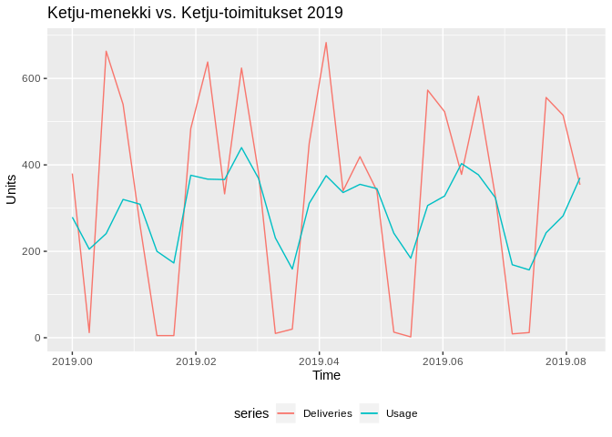
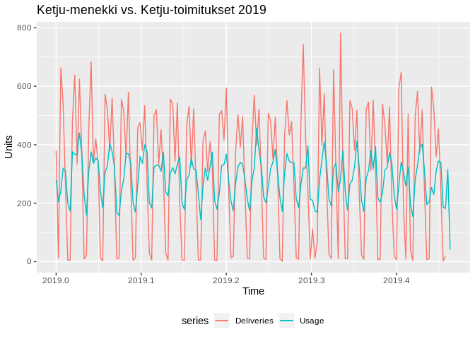

Usage Lab: Red Cells (Ketju)
================

``` r
library(forecast)
library(ggplot2)
library(gridExtra)
library(knitr)
library(readxl)
library(plyr)
library(lubridate)
source("src/evalhelp.R")
```

# Intro

Currently under development. In this notebook we study how to use
hospital blood product usage data to create demand
predictions.

## Create original datasets that should remain immutable throughout labbing

``` r
# Load data
# All deliveries
deliv <- read_excel("./data/ketju_data.xlsx", sheet = "Ketju-punasolutoimitukset 2014-")[, c('Päivämäärä', 'Toimitukset')]
colnames(deliv) <- c("time", "deliveries")  # Change column names
deliv$time <- as.Date(deliv$time)

# Ketju usage 2014 -->
# I'm using read.csv() instead of read_excel() here, because this sheet contains some fields that kills read_excel!
ketju <- read.csv("./data/ketju_data.csv", header = TRUE, sep = ",", colClasses=c("NULL", NA, "NULL", "NULL", "NULL", NA, "NULL", "NULL", NA, NA, NA))
colnames(ketju) <- c("hospital", "type", "time", "exp", "pcs")  # Change column names

# Ensure compliant time format with lubridate
ketju$time <- mdy(ketju$time)
ketju$exp <- mdy(ketju$exp)  # This will produce an error "failed to parse" for fields that aren't dates. It will insert NAs.

# Arrange by time
ketju <- arrange(ketju, time)

# Find usage
usage <- aggregate(ketju$pcs, by = list(ketju$time), sum); colnames(usage) <- c("time", "pcs")
```

## Histograms of how fresh blood is used across hospitals

<!-- -->

## Same histogram but with blood types

<!-- -->

Check if the series have missing days

``` r
date_range <- seq(min(deliv$time), max(deliv$time), by = 1)
date_range[!date_range %in% deliv$time]
```

    ##  [1] "2014-01-26" "2014-03-09" "2015-01-18" "2015-03-29" "2015-06-27"
    ##  [6] "2016-08-07" "2016-11-06" "2017-01-06" "2017-02-12" "2017-04-02"
    ## [11] "2017-05-21" "2017-06-25" "2017-07-30" "2018-01-14" "2018-02-04"
    ## [16] "2018-05-26" "2018-06-03" "2018-06-10" "2018-07-21" "2018-08-19"
    ## [21] "2019-02-24" "2019-03-02" "2019-03-09" "2019-04-28"

The deliveries are missing 24 days. We will impute.

``` r
deliv.imputed <- as.data.frame(rbind(deliv,
                                     c("2014-01-26", deliv$deliveries[deliv$time == "2014-01-19"]),
                                     c("2014-03-09", deliv$deliveries[deliv$time == "2014-03-02"]),
                                     c("2015-01-18", deliv$deliveries[deliv$time == "2015-01-11"]),
                                     c("2015-03-29", deliv$deliveries[deliv$time == "2015-03-22"]),
                                     c("2015-06-27", deliv$deliveries[deliv$time == "2015-06-20"]),
                                     c("2016-08-07", deliv$deliveries[deliv$time == "2016-07-31"]),
                                     c("2016-11-06", deliv$deliveries[deliv$time == "2016-10-30"]),
                                     c("2017-01-06", deliv$deliveries[deliv$time == "2016-12-30"]),
                                     c("2017-02-12", deliv$deliveries[deliv$time == "2017-02-05"]),
                                     c("2017-04-02", deliv$deliveries[deliv$time == "2017-03-26"]),
                                     c("2017-05-21", deliv$deliveries[deliv$time == "2017-05-14"]),
                                     c("2017-06-25", deliv$deliveries[deliv$time == "2017-06-18"]),
                                     c("2017-07-30", deliv$deliveries[deliv$time == "2017-07-23"]),
                                     c("2018-01-14", deliv$deliveries[deliv$time == "2018-01-07"]),
                                     c("2018-02-04", deliv$deliveries[deliv$time == "2018-01-28"]),
                                     c("2018-05-26", deliv$deliveries[deliv$time == "2018-05-19"]),
                                     c("2018-06-03", deliv$deliveries[deliv$time == "2018-05-27"]),
                                     c("2018-06-10", deliv$deliveries[deliv$time == "2018-06-04"]),
                                     c("2018-07-21", deliv$deliveries[deliv$time == "2018-07-14"]),
                                     c("2018-08-19", deliv$deliveries[deliv$time == "2018-08-12"]),
                                     c("2019-02-24", deliv$deliveries[deliv$time == "2019-02-17"]),
                                     c("2019-03-02", deliv$deliveries[deliv$time == "2019-02-23"]),
                                     c("2019-03-09", deliv$deliveries[deliv$time == "2019-03-03"]),
                                     c("2019-04-28", deliv$deliveries[deliv$time == "2019-04-21"]))); colnames(deliv.imputed) <- c("time", "deliveries")

deliv.imputed <- arrange(deliv.imputed, time)
```

``` r
date_range <- seq(min(deliv.imputed$time), max(deliv.imputed$time), by = 1)
date_range[!date_range %in% deliv.imputed$time]
```

    ## Date of length 0

## Create time series

``` r
ts.deliv <- ts(deliv.imputed$deliveries, start = 2014, frequency = 365)
ts.usage <- ts(usage$pcs, start = 2014, frequency = 365)
```

``` r
Deliveries <- window(ts.deliv, start = 2019, end = c(2019, 31))
Usage <- window(ts.usage, start = 2019, end = c(2019, 31))
ggplot() + 
  autolayer(Deliveries) + 
  autolayer(Usage) + 
  ggtitle("Ketju-menekki vs. Ketju-toimitukset 2019") +
  ylab("Units") +
  xlab("Time") +
  scale_fill_discrete(name = "Series", labels = c("Deliveries", "Usage")) +
  theme(legend.position = "bottom")
```

<!-- -->

``` r
# Plot
usage.c <- ts(cumsum(usage$pcs), start = 2014, frequency = 365)
deliv.c <- ts(cumsum(deliv.imputed$deliveries), start = 2014, frequency = 365)
difference <- tail(cumsum(deliv.imputed$deliveries), 1) - tail(cumsum(usage$pcs), 1)
ggplot() + 
  autolayer(usage.c) + 
  autolayer(deliv.c) + 
  ylab("Units") +
  xlab("Time") +
  ggtitle(paste("Cumsum difference at end of series: ", difference))
```

<!-- -->

There exists a 6% difference between deliveries and usage at the end of
series. This is due to the fact that not all blood bags get used that
get delivered\!
