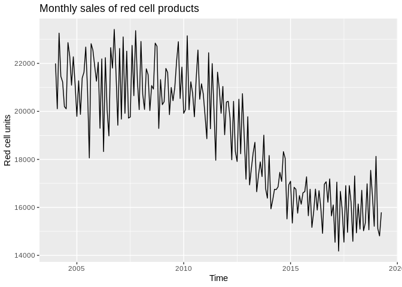
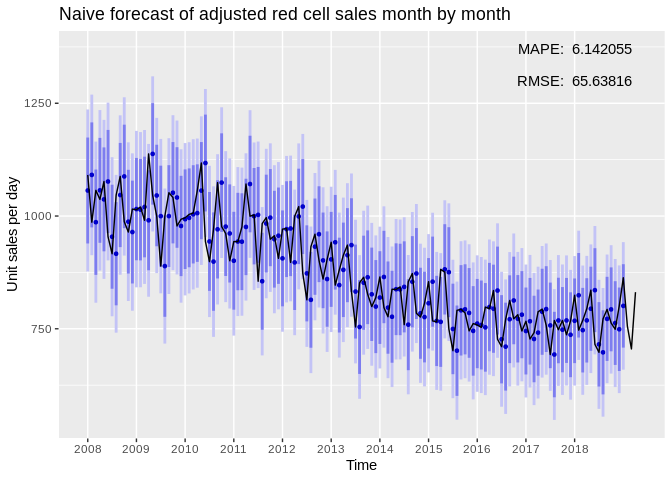
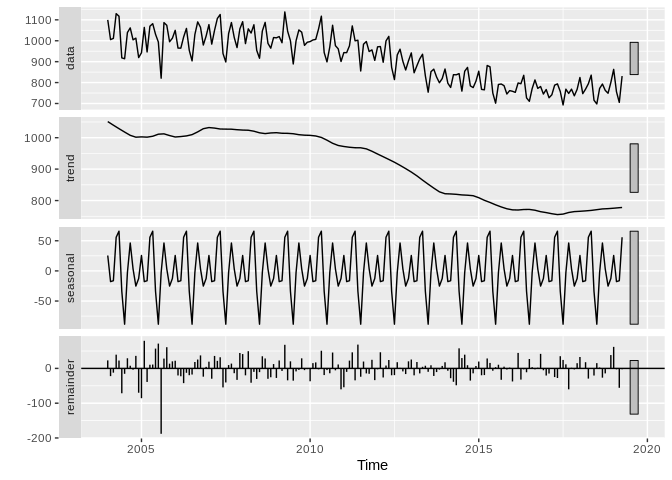
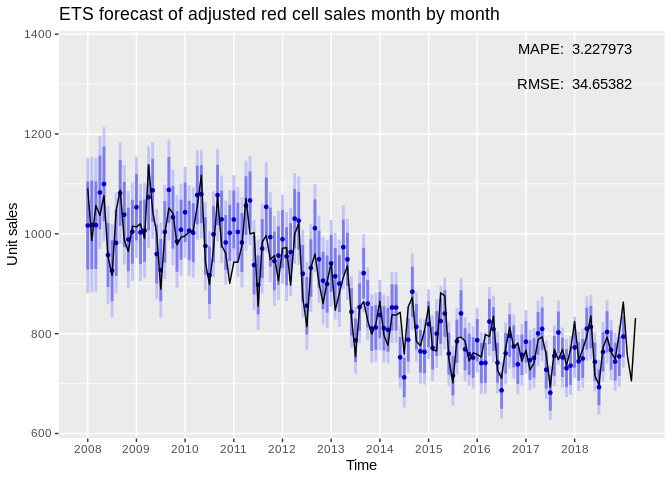
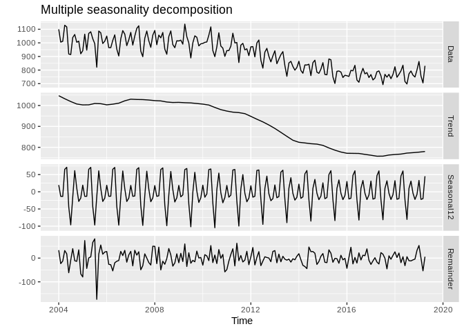

Forecasting Lab: Production Figures
================

Tässä dokumentissa tutkitaan aikasarjaennustamista tuotannon
kuukausittaisilla luvuilla. Erityisesti halutaan tietää seuraavat:

1.  Kuinka hyvin ennustemallit ovat historiallisesti toimineet? Onko
    jompi kumpi malleista parempi? 1.1. Kuinka hyvä keskiarvoennuste on?
    1.2. Kuinka hyvin vaihtelu mahtuu ennustettuihin rajoihin? Onko
    yksittäisiä selitettäviä poikkeamia? 1.3. Miten parametrien valinta
    vaikuttaa mallien suoriutumiseen (esim. ikkunan koko)?
2.  Voidaanko tehdä kuukausiennuste tulevaisuuteen?
3.  Onko olemassa uusia ja parempia helposti sovellettavia malleja?
4.  Saisiko malleihin lisää parametreja? 4.1. Työpäivien määrä
    kuukaudessa 4.2. Historiallinen vuosivaihtelu 4.3. Priori yleisestä
    trendistä 4.4. Väestörakenne 4.4.1 Auttaako sairaanhoitopiirien
    tasolle
meneminen?

## Create original dataset that should remain immutable throughout labbing

``` r
library(forecast)
library(ggplot2)
library(gridExtra)
library(knitr)

# Set working directory and load data
setwd("/home/esa/production_forecasts")
monthly_sales <- read.table("/home/esa/production_forecasts/data/kuukausimyynti.txt", header = T, sep = "\t")

# Separate yyyy/mmm column into months and years
monthly_sales$year <- substr(monthly_sales$kuukausi, 1, 4)
monthly_sales$month <- factor(substr(monthly_sales$kuukausi, 6, 8), levels=c("tam", "hel", "maa", "huh", "tou", "kes", "hei", "elo", "syy", "lok", "mar", "jou"))

# Create a numeric column for months
monthly_sales$month_num <- as.numeric(monthly_sales$month)

# Omit empty values
d <- na.omit(monthly_sales)
```

## Create the time series object

``` r
ts.red <- ts(d$Punasoluvalmisteet, 
             start=as.numeric(c(d$year[1], d$month_num[1])), 
             end=as.numeric(c(tail(d$year, 1), tail(d$month_num, 1))), 
             frequency=12)  # This tells the series that it is monthly data

# Month adjustment
ts.red <- ts.red/monthdays(ts.red)

# Create plots for a quick overview
p1 <- autoplot(ts.red)
p1
```

<!-- -->

``` r
ggseasonplot(ts.red, year.labels = TRUE, year.labels.left = TRUE)
```

<!-- -->

Seems to me that July and December are low points in sales very
consistently, while lots of sales happen in October and November.

Trying out more advanced methods of decomposing

``` r
# DECOMP HERE
```

EXPLANATION OF RESULTS

Let’s do this again, but with filtering and see if it could improve the
results

``` r
# FILTERING PLUS DECOMP
```

EXAMINE RESULTS

## Forecasts of Jarno Tuimala now with better decomp and filtering

Jarno built his forecasts using **STL+ETS** and **ETS** models,
including also a naive 6 month repetition forecast. I will not be
considering the naive “forecast” here, as I’m fairly certain we want to
do proper modelling.

``` r
# Seasonal and Trend decomposition by LOESS + ETS
# The t.window of stl() should be an odd number, but Tuimala has decided against it. Will investigate.
stl.red <- forecast(stl(ts.red, s.window="periodic", t.window=6), h=12)


# Exponential smoothing state space model
# ets() is an automated model selection function, so these are not the same model! Uses AICc, AIC and BIC.
ets.red <- forecast(ets(ts.red), h=12)


# Plot
grid.arrange(grobs=list(autoplot(stl.red),
                        autoplot(ets.red)),
             layout_matrix=rbind(c(1),
                                 c(2)))
```

<!-- -->

ETS models are based on weighted averages of past observations, with
*exponentially* decaying weights as the observations move further back
in time. The ETS function used in Tuimala’s script optimize the
smoothing parameters and initial values required by minimising the sum
of the squared errors (SSE). They can be simple explonential smoothing
models (SES), or state space models consisting of Error, Trend and
Seasonal parts. The \(ets()\) function used here tries to automatically
select the best model from the ets model family using information
criteria measures (AIC, AICc and BIC).

The STL+ETS models use a “Seasonal and Trend decomposition by LOESS”
method to extract the seasonal component of the series and feed the
seasonally adjusted series to the \(ets()\) function.

## Model comparisons

``` r
monthly <- ggplot() 
forecast_errors <- c()
stl_RMSE <- c()
stl_MAPE <- c()
# Loop 
for(i in seq(from=48, to=180, by=1)){
  fit <- stl(head(ts.red, i), s.window="periodic", t.window=6)  # Fit based on history so far
  fcast <- forecast(fit, h=1)  # Forecast the next month
  segment <- ts.red[i+1]  # Extract that year from the history for plotting purposes
  
  # Build the plot piece by piece
  monthly <- monthly + autolayer(fcast) # + autolayer(segment, colour=FALSE)
  
  # Calculate raw forecast errors
  forecast_errors <- c(forecast_errors, abs(data.frame(fcast)$Point.Forecast - segment))
  
  stl_RMSE <- c(stl_RMSE, data.frame(accuracy(fcast, segment))$RMSE)
  stl_MAPE <- c(stl_MAPE, data.frame(accuracy(fcast, segment))$MAPE)
}

monthly + ggtitle("STL+ETS forecast of red cell sales month by month") +
  scale_x_discrete(limits=c(2008, 2009, 2010, 2011, 2012, 2013, 2014, 2015, 2016, 2017, 2018)) + xlab("Time") +
  ylab("Unit sales") + autolayer(window(ts.red, start=2008), colour=FALSE)
```

<!-- -->

``` r
autoplot(ts(forecast_errors, start=2008, end=2018, frequency=12)) + ggtitle("STL+ETS historical forecast errors for red cells") + ylab("Unit sales")
```

<!-- -->

``` r
monthly_ets <- ggplot() 
ets_forecast_errors <- c()
ets_RMSE <- c()
ets_MAPE <- c()
# Loop 
for(i in seq(from=48, to=180, by=1)){
  fit <- ets(head(ts.red, i))  # Fit based on history so far
  fcast <- forecast(fit, h=1)  # Forecast the next month
  segment <- ts.red[i+1]  # Extract that month from the history for error calculation
  
  # Build the plot piece by piece
  monthly_ets <- monthly_ets + autolayer(fcast)
  
  # Calculate forecast errors
  ets_forecast_errors <- c(ets_forecast_errors, abs(data.frame(fcast)$Point.Forecast - segment))
  
  ets_RMSE <- c(ets_RMSE, data.frame(accuracy(fcast, segment))$RMSE)
  ets_MAPE <- c(ets_MAPE, data.frame(accuracy(fcast, segment))$MAPE)
}

monthly_ets + ggtitle("ETS forecast of red cell sales year by year") +
  scale_x_discrete(limits=c(2008, 2009, 2010, 2011, 2012, 2013, 2014, 2015, 2016, 2017, 2018)) + xlab("Time") +
  ylab("Unit sales") + autolayer(window(ts.red, start=2008), colour=FALSE)
```

<!-- -->

``` r
autoplot(ts(ets_forecast_errors, start=2008, end=2018, frequency=12)) + ggtitle("ETS historical forecast errors for red cells") + ylab("Unit sales")
```

<!-- -->

## How far back do the models actually look?

``` r
##################################
# 5 YEARS
##################################
monthly_1yr <- ggplot() 
forecast_errors_1yr <- c()
stl_RMSE_1yr <- c()
stl_MAPE_1yr <- c()
# Loop 
for(i in seq(from=48, to=180, by=1)){
  fit <- stl(tail(head(ts.red, i), 60), s.window="periodic", t.window=6)  # Fit based on 1yr history
  fcast <- forecast(fit, h=1)  # Forecast the next month
  segment <- ts.red[i+1]  # Extract that month from the history for error calculation
  
  # Build the plot piece by piece
  monthly_1yr <- monthly_1yr + autolayer(fcast)
  
  # Calculate raw forecast errors
  forecast_errors_1yr <- c(forecast_errors_1yr, abs(data.frame(fcast)$Point.Forecast - segment))
  
  stl_RMSE_1yr <- c(stl_RMSE_1yr, data.frame(accuracy(fcast, segment))$RMSE)
  stl_MAPE_1yr <- c(stl_MAPE_1yr, data.frame(accuracy(fcast, segment))$MAPE)
}

monthly_1yr + ggtitle("STL+ETS forecast of red cell sales month by month, 5 years of data") +
  scale_x_discrete(limits=c(2008, 2009, 2010, 2011, 2012, 2013, 2014, 2015, 2016, 2017, 2018)) + xlab("Time") +
  ylab("Unit sales") + autolayer(window(ts.red, start=2008), colour=FALSE)
```

<!-- -->

``` r
##################################
# 3 YEARS
##################################
monthly_3yr <- ggplot() 
forecast_errors_3yr <- c()
stl_RMSE_3yr <- c()
stl_MAPE_3yr <- c()
# Loop 
for(i in seq(from=48, to=180, by=1)){
  fit <- stl(tail(head(ts.red, i), 36), s.window="periodic", t.window=6)  # Fit based on 3yr history
  fcast <- forecast(fit, h=1)  # Forecast the next month
  segment <- ts.red[i+1]  # Extract that month from the history for error calculation
  
  # Build the plot piece by piece
  monthly_3yr <- monthly_3yr + autolayer(fcast)
  
  # Calculate raw forecast errors
  forecast_errors_3yr <- c(forecast_errors_3yr, abs(data.frame(fcast)$Point.Forecast - segment))
  
  stl_RMSE_3yr <- c(stl_RMSE_3yr, data.frame(accuracy(fcast, segment))$RMSE)
  stl_MAPE_3yr <- c(stl_MAPE_3yr, data.frame(accuracy(fcast, segment))$MAPE)
}

monthly_3yr + ggtitle("STL+ETS forecast of red cell sales month by month, 3 years of data") +
  scale_x_discrete(limits=c(2008, 2009, 2010, 2011, 2012, 2013, 2014, 2015, 2016, 2017, 2018)) + xlab("Time") +
  ylab("Unit sales") + autolayer(window(ts.red, start=2008), colour=FALSE)
```

<!-- -->

``` r
##################################
# 5 YEARS
##################################

monthly_ets_1yr <- ggplot() 
ets_forecast_errors_1yr <- c()
ets_RMSE_1yr <- c()
ets_MAPE_1yr <- c()
# Loop 
for(i in seq(from=48, to=180, by=1)){
  fit <- ets(tail(head(ts.red, i), 60))  # Fit based on 1yr history
  fcast <- forecast(fit, h=1)  # Forecast the next month
  segment <- ts.red[i+1]  # Extract that month from the history for error calculation
  
  # Build the plot piece by piece
  monthly_ets_1yr <- monthly_ets_1yr + autolayer(fcast)
  
  # Calculate forecast errors
  ets_forecast_errors_1yr <- c(ets_forecast_errors_1yr, abs(data.frame(fcast)$Point.Forecast - segment))
  
  ets_RMSE_1yr <- c(ets_RMSE_1yr, data.frame(accuracy(fcast, segment))$RMSE)
  ets_MAPE_1yr <- c(ets_MAPE_1yr, data.frame(accuracy(fcast, segment))$MAPE)
}

monthly_ets_1yr + ggtitle("ETS forecast of red cell sales month by month, 5 years of data") +
  scale_x_discrete(limits=c(2008, 2009, 2010, 2011, 2012, 2013, 2014, 2015, 2016, 2017, 2018)) + xlab("Time") +
  ylab("Unit sales") + autolayer(window(ts.red, start=2008), colour=FALSE)
```

<!-- -->

``` r
##################################
# 3 YEARS
##################################

monthly_ets_3yr <- ggplot() 
ets_forecast_errors_3yr <- c()
ets_RMSE_3yr <- c()
ets_MAPE_3yr <- c()
# Loop 
for(i in seq(from=48, to=180, by=1)){
  fit <- ets(tail(head(ts.red, i), 36))  # Fit based on 3yr history
  fcast <- forecast(fit, h=1)  # Forecast the next month
  segment <- ts.red[i+1]  # Extract that month from the history for error calculation
  
  # Build the plot piece by piece
  monthly_ets_3yr <- monthly_ets_3yr + autolayer(fcast)
  
  # Calculate forecast errors
  ets_forecast_errors_3yr <- c(ets_forecast_errors_3yr, abs(data.frame(fcast)$Point.Forecast - segment))
  
  ets_RMSE_3yr <- c(ets_RMSE_3yr, data.frame(accuracy(fcast, segment))$RMSE)
  ets_MAPE_3yr <- c(ets_MAPE_3yr, data.frame(accuracy(fcast, segment))$MAPE)
}

monthly_ets_3yr + ggtitle("ETS forecast of red cell sales month by month, 3 years of data") +
  scale_x_discrete(limits=c(2008, 2009, 2010, 2011, 2012, 2013, 2014, 2015, 2016, 2017, 2018)) + xlab("Time") +
  ylab("Unit sales") + autolayer(window(ts.red, start=2008), colour=FALSE)
```

<!-- -->

## Forecasting from 2012 onwards

``` r
monthly_2012 <- ggplot() 
forecast_errors_2012 <- c()
stl_RMSE_2012 <- c()
stl_MAPE_2012 <- c()
# Loop 
for(i in seq(from=96, to=180, by=1)){
  fit <- stl(head(ts.red, i), s.window="periodic", t.window=6)  # Fit based on history from 2012
  fcast <- forecast(fit, h=1)  # Forecast the next month
  segment <- ts.red[i+1]  # Extract that year from the history for plotting purposes
  
  # Build the plot piece by piece
  monthly_2012 <- monthly_2012 + autolayer(fcast) # + autolayer(segment, colour=FALSE)
  
  # Calculate raw forecast errors
  forecast_errors_2012 <- c(forecast_errors_2012, abs(data.frame(fcast)$Point.Forecast - segment))
  
  stl_RMSE_2012 <- c(stl_RMSE_2012, data.frame(accuracy(fcast, segment))$RMSE)
  stl_MAPE_2012 <- c(stl_MAPE_2012, data.frame(accuracy(fcast, segment))$MAPE)
}

monthly_2012 + ggtitle("STL+ETS forecast of red cell sales month by month from 2012") +
  scale_x_discrete(limits=c(2011, 2012, 2013, 2014, 2015, 2016, 2017, 2018)) + xlab("Time") +
  ylab("Unit sales") + autolayer(window(ts.red, start=2011), colour=FALSE)
```

<!-- -->

## Test out multiple regression

``` r
# Implement multiple regression with dummy variables
```

## Playing around with a NN

``` r
monthly_NN <- ggplot() 
NN_forecast_errors <- c()
NN_RMSE <- c()
NN_MAPE <- c()
# Loop 
for(i in seq(from=48, to=180, by=1)){
  fit <- nnetar(head(ts.red, i), lambda=0)  # Fit based on history
  fcast <- forecast(fit, h=1)  # Forecast the next month
  segment <- ts.red[i+1]  # Extract that month from the history for error calculation
  
  # Build the plot piece by piece
  monthly_NN <- monthly_NN + autolayer(fcast)
  
  # Calculate forecast errors
  NN_forecast_errors <- c(NN_forecast_errors, abs(data.frame(fcast)$Point.Forecast - segment))
  
  NN_RMSE <- c(NN_RMSE, data.frame(accuracy(fcast, segment))$RMSE)
  NN_MAPE <- c(NN_MAPE, data.frame(accuracy(fcast, segment))$MAPE)
}

monthly_NN + ggtitle("NN forecast of red cell sales month by month") +
  scale_x_discrete(limits=c(2008, 2009, 2010, 2011, 2012, 2013, 2014, 2015, 2016, 2017, 2018)) + xlab("Time") +
  ylab("Unit sales") + autolayer(window(ts.red, start=2008), colour=FALSE)
```

<!-- -->

``` r
#fit <- nnetar(ts.red, lambda=0)
#autoplot(forecast(fit, PI=TRUE, h=12))
```

Find out which performed better on average:

``` r
results <- matrix(c(mean(stl_RMSE), mean(stl_MAPE), 
                    mean(ets_RMSE), mean(ets_MAPE),
                    mean(NN_RMSE), mean(NN_MAPE),
                    mean(stl_RMSE_3yr), mean(stl_MAPE_3yr),
                    mean(ets_RMSE_3yr), mean(ets_MAPE_3yr),
                    mean(stl_RMSE_1yr), mean(stl_MAPE_1yr),
                    mean(ets_RMSE_1yr), mean(ets_MAPE_1yr),
                    mean(stl_RMSE_2012), mean(stl_MAPE_2012)), 
                  ncol=2, 
                  byrow=TRUE)

colnames(results) <- c("RMSE", "MAPE")
rownames(results) <- c("STL+ETS whole", 
                       "ETS whole",
                       "NN whole",
                       "STL+ETS 3yr",
                       "ETS 3yr",
                       "STL+ETS 1yr",
                       "ETS 1yr",
                       "STL+ETS 2012")

results <- kable(results, "markdown")
results
```

|               |     RMSE |     MAPE |
| :------------ | -------: | -------: |
| STL+ETS whole | 29.51083 | 4.194451 |
| ETS whole     | 30.82392 | 4.354935 |
| NN whole      | 25.34266 | 3.642746 |
| STL+ETS 3yr   | 28.19377 | 4.285169 |
| ETS 3yr       | 30.53135 | 4.521159 |
| STL+ETS 1yr   | 28.15434 | 4.179257 |
| ETS 1yr       | 31.85850 | 4.661747 |
| STL+ETS 2012  | 28.15345 | 4.184228 |
