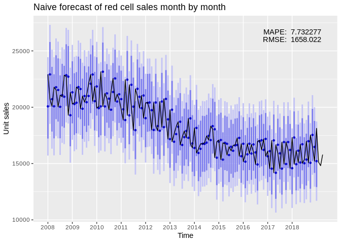
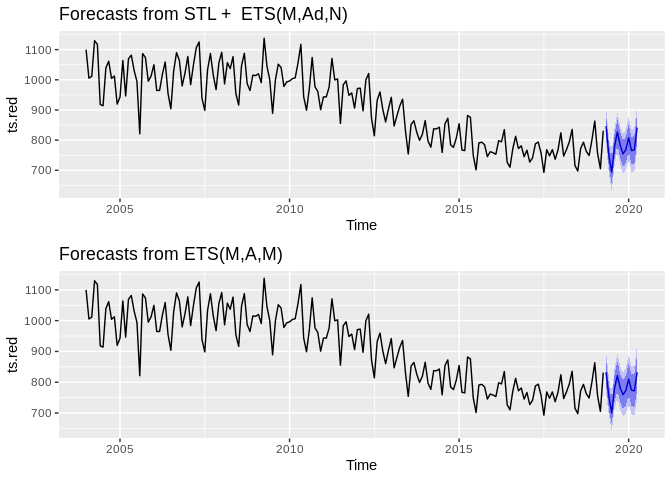
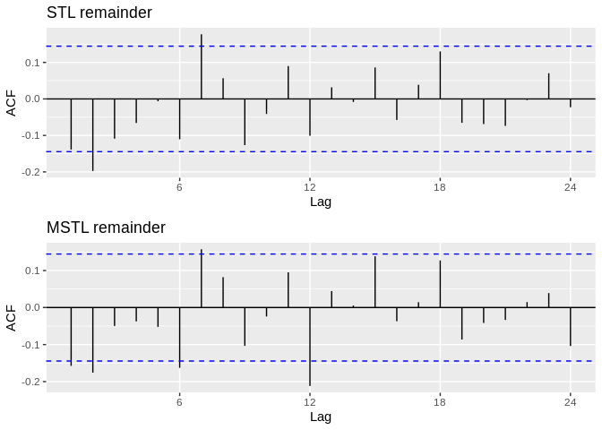
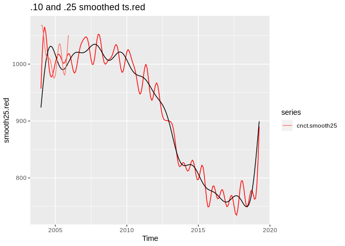
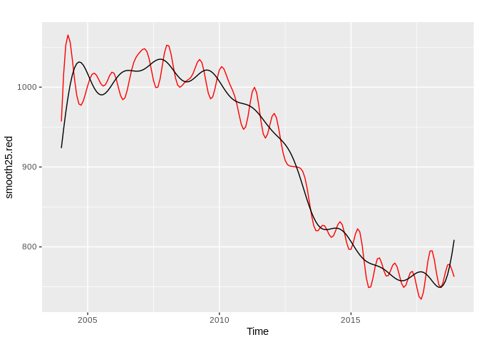
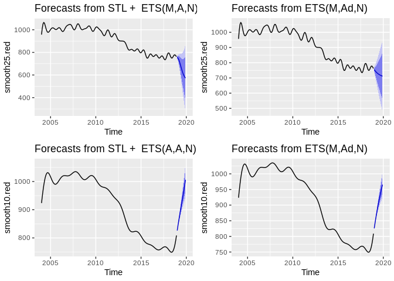
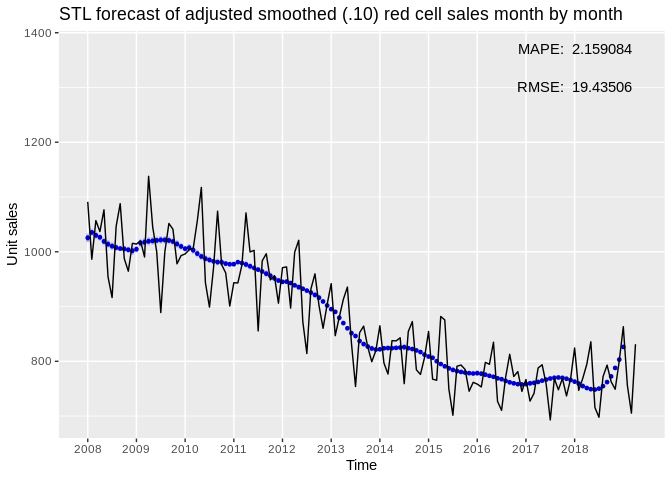

Forecasting Lab: Production Figures (red cells)
================

``` r
# Set working directory
knitr::opts_knit$set(root.dir = "/home/esa/production_forecasts")
```

Tässä dokumentissa tutkitaan aikasarjaennustamista tuotannon
kuukausittaisilla luvuilla. Erityisesti halutaan tietää seuraavat:

1.  Kuinka hyvin ennustemallit ovat historiallisesti toimineet? Onko
    jompi kumpi malleista parempi? 1.1. Kuinka hyvä keskiarvoennuste on?
    1.2. Kuinka hyvin vaihtelu mahtuu ennustettuihin rajoihin? Onko
    yksittäisiä selitettäviä poikkeamia? 1.3. Miten parametrien valinta
    vaikuttaa mallien suoriutumiseen (esim. ikkunan koko)?
2.  Voidaanko tehdä kuukausiennuste tulevaisuuteen?
3.  Onko olemassa uusia ja parempia helposti sovellettavia malleja?
4.  Saisiko malleihin lisää parametreja? 4.1. Työpäivien määrä
    kuukaudessa 4.2. Historiallinen vuosivaihtelu 4.3. Priori yleisestä
    trendistä 4.4. Väestörakenne 4.4.1 Auttaako sairaanhoitopiirien
    tasolle
meneminen?

## Create original dataset that should remain immutable throughout labbing

``` r
library(forecast)
library(ggplot2)
library(gridExtra)
library(knitr)

# Load data
monthly_sales <- read.table("./data/kuukausimyynti.txt", header = T, sep = "\t")

# Separate yyyy/mmm column into months and years
monthly_sales$year <- substr(monthly_sales$kuukausi, 1, 4)
monthly_sales$month <- factor(substr(monthly_sales$kuukausi, 6, 8), levels=c("tam", "hel", "maa", "huh", "tou", "kes", "hei", "elo", "syy", "lok", "mar", "jou"))

# Create a numeric column for months
monthly_sales$month_num <- as.numeric(monthly_sales$month)

# Omit empty values
d <- na.omit(monthly_sales)
```

## Create the time series object

``` r
ts.red <- ts(d$Punasoluvalmisteet, 
             start=as.numeric(c(d$year[1], d$month_num[1])), 
             end=as.numeric(c(tail(d$year, 1), tail(d$month_num, 1))), 
             frequency=12)  # This tells the series that it is monthly data
autoplot(ts.red) + ggtitle("Monthly sales of red cell products") + ylab("Red cell units")
```

<!-- --> \#\# Naive
forecast as a benchmark

``` r
naive_plot <- ggplot() 
naive_forecast_errors <- c()
naive_RMSE <- c()
naive_MAPE <- c()
# Loop 
for(i in seq(from=48, to=180, by=1)){
  fit <- naive(head(ts.red, i))  # Fit based on history so far
  fcast <- forecast(fit, h=1)  # Forecast the next month
  segment <- ts.red[i+1]  # Extract that year from the history for error calculations
  
  # Build the plot piece by piece
  naive_plot <- naive_plot + autolayer(fcast)
  
  # Calculate raw forecast errors
  naive_forecast_errors <- c(naive_forecast_errors, abs(data.frame(fcast)$Point.Forecast - segment))
  
  naive_RMSE <- c(naive_RMSE, data.frame(accuracy(fcast, segment))$RMSE)
  naive_MAPE <- c(naive_MAPE, data.frame(accuracy(fcast, segment))$MAPE)
}
```

``` r
# Plot
naive_plot + ggtitle("Naive forecast of red cell sales month by month") +
  scale_x_discrete(limits=c(2008, 2009, 2010, 2011, 2012, 2013, 2014, 2015, 2016, 2017, 2018)) + xlab("Time") +
  ylab("Unit sales") + autolayer(window(ts.red, start=2008), colour=FALSE) +
  geom_text(aes(2018, 26000, label=paste("RMSE: ", as.name(mean(naive_RMSE))))) + geom_text(aes(2018, 26700, label=paste("MAPE: ", as.name(mean(naive_MAPE)))))
```

<!-- --> \#\# First
improvement: Business day adjustment

``` r
# Business day adjustment
ts.red <- ts.red/bizdays(ts.red, FinCenter = "Zurich")  # Zurich is closest to Finnish business calendar, implementing of which would be a chore

# Create plots for a quick overview
p1 <- autoplot(ts.red)
p1
```

<!-- -->

``` r
naive_adj_plot <- ggplot() 
naive_adj_forecast_errors <- c()
naive_adj_RMSE <- c()
naive_adj_MAPE <- c()
# Loop 
for(i in seq(from=48, to=180, by=1)){
  fit <- naive(head(ts.red, i))  # Fit based on history so far
  fcast <- forecast(fit, h=1)  # Forecast the next month
  segment <- ts.red[i+1]  # Extract that year from the history for error calculations
  
  # Build the plot piece by piece
  naive_adj_plot <- naive_adj_plot + autolayer(fcast)
  
  # Calculate raw forecast errors
  naive_adj_forecast_errors <- c(naive_adj_forecast_errors, abs(data.frame(fcast)$Point.Forecast - segment))
  
  naive_adj_RMSE <- c(naive_adj_RMSE, data.frame(accuracy(fcast, segment))$RMSE)
  naive_adj_MAPE <- c(naive_adj_MAPE, data.frame(accuracy(fcast, segment))$MAPE)
}
```

``` r
# Plot
naive_adj_plot + ggtitle("Naive forecast of adjusted red cell sales month by month") +
  scale_x_discrete(limits=c(2008, 2009, 2010, 2011, 2012, 2013, 2014, 2015, 2016, 2017, 2018)) + xlab("Time") +
  ylab("Unit sales per day") + autolayer(window(ts.red, start=2008), colour=FALSE) +
  geom_text(aes(2018, 1300, label=paste("RMSE: ", as.name(mean(naive_adj_RMSE))))) + geom_text(aes(2018, 1370, label=paste("MAPE: ", as.name(mean(naive_adj_MAPE)))))
```

<!-- -->

Adjusting for business days per month improved the naive forecast by a
whopping 1.59 percentage points.

``` r
ggseasonplot(ts.red, year.labels = TRUE, year.labels.left = TRUE)
```

<!-- -->

Seems to me that July is a low point in sales very consistently, while
lots of sales happen in April, May and September.

## Forecasts of Jarno Tuimala now with better decomp and filtering

Jarno built his forecasts using **STL+ETS** and **ETS** models,
including also a naive 6 month repetition forecast. I will not be
considering the naive “forecast” here, as I’m fairly certain we want to
do proper modelling. Here we will run Jarno’s models on business day
adjusted data, which will improve their performance somewhat.

``` r
# Seasonal and Trend decomposition by LOESS + ETS
# The t.window of stl() should be an odd number, but Tuimala has decided against it. Will investigate.

# IF MODEL EXISTS ALREADY, LOAD
if (file.exists("./data/models/biz_jarno_stl_red.rds")) {
  stl.red <- readRDS("./data/models/biz_jarno_stl_red.rds")
} else {  # IF IT DOESN'T, CREATE AND SAVE
  stl.red <- forecast(stl(ts.red, s.window="periodic", t.window=6), h=12)
  saveRDS(stl.red, "./data/models/biz_jarno_stl_red.rds")
}


# Exponential smoothing state space model
# ets() is an automated model selection function, so these are not the same model! Uses AICc, AIC and BIC.
if (file.exists("./data/models/biz_jarno_ets_red.rds")) {
  ets.red <- readRDS("./data/models/biz_jarno_ets_red.rds")
} else {
  ets.red <- forecast(ets(ts.red), h=12)
  saveRDS(ets.red, "./data/models/biz_jarno_ets_red.rds")
}


# Plot
grid.arrange(grobs=list(autoplot(stl.red),
                        autoplot(ets.red)),
             layout_matrix=rbind(c(1),
                                 c(2)))
```

<!-- -->

Let’s see how the STL performs on business day adjusted
data

``` r
decomposed <- stl(ts.red, s.window="periodic")  # Seasonal and Trend decomposition using LOESS
seasonal <- decomposed$time.series[,1]          # Season component
trend <- decomposed$time.series[,2]             # Trend component
remainder <- decomposed$time.series[,3]         # Remainder component

autoplot(decomposed)  # Plot
```

<!-- -->

The seasonal component looks consistent, but seems to still be smaller
than random noise. Let’s check the autocorrelation of the remainder to
see how well the decomposition works.

``` r
ggAcf(remainder)
```

<!-- -->

There are significant lags at 2 and 7 lags, but otherwise the ACF looks
*much* cleaner than before. The business day adjustment seems to be
effective. Let’s see what kind of forecasts these give.

``` r
stl_adj_plot <- ggplot() 
stl_adj_forecast_errors <- c()
stl_adj_RMSE <- c()
stl_adj_MAPE <- c()
# Loop 
for(i in seq(from=48, to=180, by=1)){
  fit <- stl(head(ts.red, i), s.window="periodic", t.window=6)  # Fit based on history so far
  fcast <- forecast(fit, h=1)  # Forecast the next month
  segment <- ts.red[i+1]  # Extract that year from the history for plotting purposes
  
  # Build the plot piece by piece
  stl_adj_plot <- stl_adj_plot + autolayer(fcast) # + autolayer(segment, colour=FALSE)
  
  # Calculate raw forecast errors
  stl_adj_forecast_errors <- c(stl_adj_forecast_errors, abs(data.frame(fcast)$Point.Forecast - segment))
  
  stl_adj_RMSE <- c(stl_adj_RMSE, data.frame(accuracy(fcast, segment))$RMSE)
  stl_adj_MAPE <- c(stl_adj_MAPE, data.frame(accuracy(fcast, segment))$MAPE)
}

stl_adj_plot + ggtitle("STL+ETS forecast of adjusted red cell sales month by month") +
  scale_x_discrete(limits=c(2008, 2009, 2010, 2011, 2012, 2013, 2014, 2015, 2016, 2017, 2018)) + xlab("Time") +
  ylab("Unit sales") + autolayer(window(ts.red, start=2008), colour=FALSE) +
  geom_text(aes(2018, 1300, label=paste("RMSE: ", as.name(mean(stl_adj_RMSE))))) + geom_text(aes(2018, 1370, label=paste("MAPE: ", as.name(mean(stl_adj_MAPE)))))
```

<!-- --> The naive
errors are halved.

``` r
ets_adj_plot <- ggplot() 
ets_adj_forecast_errors <- c()
ets_adj_RMSE <- c()
ets_adj_MAPE <- c()
# Loop 
for(i in seq(from=48, to=180, by=1)){
  fit <- ets(head(ts.red, i))  # Fit based on history so far
  fcast <- forecast(fit, h=1)  # Forecast the next month
  segment <- ts.red[i+1]  # Extract that month from the history for error calculation
  
  # Build the plot piece by piece
  ets_adj_plot <- ets_adj_plot + autolayer(fcast)
  
  # Calculate forecast errors
  ets_adj_forecast_errors <- c(ets_adj_forecast_errors, abs(data.frame(fcast)$Point.Forecast - segment))
  
  ets_adj_RMSE <- c(ets_adj_RMSE, data.frame(accuracy(fcast, segment))$RMSE)
  ets_adj_MAPE <- c(ets_adj_MAPE, data.frame(accuracy(fcast, segment))$MAPE)
}

ets_adj_plot + ggtitle("ETS forecast of adjusted red cell sales month by month") +
  scale_x_discrete(limits=c(2008, 2009, 2010, 2011, 2012, 2013, 2014, 2015, 2016, 2017, 2018)) + xlab("Time") +
  ylab("Unit sales") + autolayer(window(ts.red, start=2008), colour=FALSE) +
  geom_text(aes(2018, 1300, label=paste("RMSE: ", as.name(mean(ets_adj_RMSE))))) + geom_text(aes(2018, 1370, label=paste("MAPE: ", as.name(mean(ets_adj_MAPE)))))
```

<!-- -->

## Trying out more advanced methods of decomposing

``` r
multi_decomp <- mstl(ts.red)
multi_trend <- multi_decomp[,2]
multi_season <- multi_decomp[,3]
multi_remainder <- multi_decomp[,4]
autoplot(multi_decomp) + ggtitle("Multiple seasonality decomposition")
```

<!-- -->

``` r
# Plot with simple seasonal decomposition to see if there are tangible differences
grid.arrange(grobs=list(autoplot(seasonal) + ggtitle("STL"),
                        autoplot(multi_season) + ggtitle("MSTL")),
             layout_matrix=rbind(c(1),
                                 c(2)))
```

<!-- -->

The MSTL has a slight decrease in the magnitude of the seasonality.

``` r
# Let's compare their autocorrelation plots
grid.arrange(grobs=list(ggAcf(remainder) + ggtitle("STL remainder"),
                        ggAcf(multi_remainder) + ggtitle("MSTL remainder")),
             layout_matrix=rbind(c(1),
                                 c(2)))
```

<!-- -->

Somewhat surprisingly it seems that the simpler STL decomposition is
more accurate. Let’s confirm by CV.

``` r
stl_multi_plot <- ggplot() 
stl_multi_forecast_errors <- c()
stl_multi_RMSE <- c()
stl_multi_MAPE <- c()
# Loop 
for(i in seq(from=48, to=180, by=1)){
  fit <- stlf(head(ts.red, i), s.window="periodic", t.window=6)  # Fit based on history so far
  fcast <- forecast(fit, h=1)  # Forecast the next month
  segment <- ts.red[i+1]  # Extract that year from the history for plotting purposes
  
  # Build the plot piece by piece
  stl_multi_plot <- stl_multi_plot + autolayer(fcast) # + autolayer(segment, colour=FALSE)
  
  # Calculate raw forecast errors
  stl_multi_forecast_errors <- c(stl_multi_forecast_errors, abs(data.frame(fcast)$Point.Forecast - segment))
  
  stl_multi_RMSE <- c(stl_multi_RMSE, data.frame(accuracy(fcast, segment))$RMSE)
  stl_multi_MAPE <- c(stl_multi_MAPE, data.frame(accuracy(fcast, segment))$MAPE)
}

stl_multi_plot + ggtitle("STLF forecast of adjusted red cell sales month by month") +
  scale_x_discrete(limits=c(2008, 2009, 2010, 2011, 2012, 2013, 2014, 2015, 2016, 2017, 2018)) + xlab("Time") +
  ylab("Unit sales") + autolayer(window(ts.red, start=2008), colour=FALSE) +
  geom_text(aes(2018, 1300, label=paste("RMSE: ", as.name(mean(stl_multi_RMSE))))) + geom_text(aes(2018, 1370, label=paste("MAPE: ", as.name(mean(stl_multi_MAPE)))))
```

<!-- -->

The results are exactly the same to the 5th decimal point\! It appears
that Multiple Seasonal Decomposition has no advantage over simple STL.

Let’s do this again, but with filtering and see if it could improve the
results

``` r
# Filter
smooth25.red <- ts(itsmr::smooth.fft(ts.red, .25), start=as.numeric(c(d$year[1], d$month_num[1])), 
                   end=as.numeric(c(tail(d$year, 1), tail(d$month_num, 1))), frequency = 12)
smooth10.red <- ts(itsmr::smooth.fft(ts.red, .1), start=as.numeric(c(d$year[1], d$month_num[1])), 
             end=as.numeric(c(tail(d$year, 1), tail(d$month_num, 1))), frequency = 12)

cnct.smooth25 <- ts(itsmr::smooth.fft(head(ts.red, 24), .25), start=as.numeric(c(d$year[1], d$month_num[1])), frequency = 12)
autoplot(smooth25.red, colour = "red") + autolayer(smooth10.red, colour = FALSE) + ggtitle(".10 and .25 smoothed ts.red") + autolayer(cnct.smooth25, colour = TRUE)
```

<!-- -->

The filtering changes as we move down the time stream. We’ll try to
incorporate this into the CV.

We’ll need to cut off the end of the series as the smoothing produces an
awkwardly aggressive slope at the end. Or do we? Will investigate.

``` r
smooth25.red <- head(smooth25.red, 180)
smooth10.red <- head(smooth10.red, 180)
autoplot(smooth25.red, colour = "red") + autolayer(smooth10.red, colour = FALSE)
```

<!-- -->

## Forecasts of Jarno Tuimala now with filtering

``` r
# Seasonal and Trend decomposition by LOESS + ETS
# The t.window of stl() should be an odd number, but Tuimala has decided against it. Will investigate.

# IF MODEL EXISTS ALREADY, LOAD
if (file.exists("./data/models/biz_smooth25_jarno_stl_red.rds")) {
  smooth25.stl.red <- readRDS("./data/models/biz_smooth25_jarno_stl_red.rds")
} else {  # IF IT DOESN'T, CREATE AND SAVE
  smooth25.stl.red <- forecast(stl(smooth25.red, s.window="periodic", t.window=6), h=12)
  saveRDS(smooth25.stl.red, "./data/models/biz_smooth25_jarno_stl_red.rds")
}

if (file.exists("./data/models/biz_smooth10_jarno_stl_red.rds")) {
  smooth10.stl.red <- readRDS("./data/models/biz_smooth10_jarno_stl_red.rds")
} else {  # IF IT DOESN'T, CREATE AND SAVE
  smooth10.stl.red <- forecast(stl(smooth10.red, s.window="periodic", t.window=6), h=12)
  saveRDS(smooth10.stl.red, "./data/models/biz_smooth10_jarno_stl_red.rds")
}

# Exponential smoothing state space model
# ets() is an automated model selection function, so these are not the same model! Uses AICc, AIC and BIC.
if (file.exists("./data/models/biz_smooth25_jarno_ets_red.rds")) {
  smooth25.ets.red <- readRDS("./data/models/biz_smooth25_jarno_ets_red.rds")
} else {
  smooth25.ets.red <- forecast(ets(smooth25.red), h=12)
  saveRDS(smooth25.ets.red, "./data/models/biz_smooth25_jarno_ets_red.rds")
}

if (file.exists("./data/models/biz_smooth10_jarno_ets_red.rds")) {
  smooth10.ets.red <- readRDS("./data/models/biz_smooth10_jarno_ets_red.rds")
} else {
  smooth10.ets.red <- forecast(ets(smooth10.red), h=12)
  saveRDS(smooth10.ets.red, "./data/models/biz_smooth10_jarno_ets_red.rds")
}

# Plot
grid.arrange(grobs=list(autoplot(smooth25.stl.red),
                        autoplot(smooth25.ets.red),
                        autoplot(smooth10.stl.red),
                        autoplot(smooth10.ets.red)),
             layout_matrix=rbind(c(1, 2),
                                 c(3, 4)))
```

<!-- --> These give
somewhat nonsensical forecasts. The smoothing isn’t robust for
“pathological” observations at the end I suppose?

Let’s see how these perform in CV

``` r
stl_smooth_plot <- ggplot() 
stl_smooth_forecast_errors <- c()
stl_smooth_RMSE <- c()
stl_smooth_MAPE <- c()
# Loop 
for(i in seq(from=48, to=180, by=1)){
  fit <- stl(head(smooth25.red, i), s.window="periodic", t.window=6)  # Fit based on history so far
  fcast <- forecast(fit, h=1)  # Forecast the next month
  segment <- ts.red[i+1]  # Extract that year from the history for errror
  
  # Build the plot piece by piece
  stl_smooth_plot <- stl_smooth_plot + autolayer(fcast) # + autolayer(segment, colour=FALSE)
  
  # Calculate raw forecast errors
  stl_smooth_forecast_errors <- c(stl_smooth_forecast_errors, abs(data.frame(fcast)$Point.Forecast - segment))
  
  stl_smooth_RMSE <- c(stl_smooth_RMSE, data.frame(accuracy(fcast, segment))$RMSE)
  stl_smooth_MAPE <- c(stl_smooth_MAPE, data.frame(accuracy(fcast, segment))$MAPE)
}

stl_smooth_plot + ggtitle("STL forecast of adjusted smoothed (.25) red cell sales month by month") +
  scale_x_discrete(limits=c(2008, 2009, 2010, 2011, 2012, 2013, 2014, 2015, 2016, 2017, 2018)) + xlab("Time") +
  ylab("Unit sales") + autolayer(window(ts.red, start=2008), colour=FALSE) +
  geom_text(aes(2018, 1300, label=paste("RMSE: ", as.name(mean(stl_smooth_RMSE))))) + geom_text(aes(2018, 1370, label=paste("MAPE: ", as.name(mean(stl_smooth_MAPE)))))
```

<!-- -->

``` r
stl_smooth10_plot <- ggplot() 
stl_smooth10_forecast_errors <- c()
stl_smooth10_RMSE <- c()
stl_smooth10_MAPE <- c()
# Loop 
for(i in seq(from=48, to=180, by=1)){
  fit <- stl(head(smooth10.red, i), s.window="periodic", t.window=6)  # Fit based on history so far
  fcast <- forecast(fit, h=1)  # Forecast the next month
  segment <- ts.red[i+1]  # Extract that year from the history for errror
  
  # Build the plot piece by piece
  stl_smooth10_plot <- stl_smooth10_plot + autolayer(fcast) # + autolayer(segment, colour=FALSE)
  
  # Calculate raw forecast errors
  stl_smooth10_forecast_errors <- c(stl_smooth10_forecast_errors, abs(data.frame(fcast)$Point.Forecast - segment))
  
  stl_smooth10_RMSE <- c(stl_smooth10_RMSE, data.frame(accuracy(fcast, segment))$RMSE)
  stl_smooth10_MAPE <- c(stl_smooth10_MAPE, data.frame(accuracy(fcast, segment))$MAPE)
}

stl_smooth10_plot + ggtitle("STL forecast of adjusted smoothed (.10) red cell sales month by month") +
  scale_x_discrete(limits=c(2008, 2009, 2010, 2011, 2012, 2013, 2014, 2015, 2016, 2017, 2018)) + xlab("Time") +
  ylab("Unit sales") + autolayer(window(ts.red, start=2008), colour=FALSE) +
  geom_text(aes(2018, 1300, label=paste("RMSE: ", as.name(mean(stl_smooth10_RMSE))))) + geom_text(aes(2018, 1370, label=paste("MAPE: ", as.name(mean(stl_smooth10_MAPE)))))
```

<!-- -->

ETS models are based on weighted averages of past observations, with
*exponentially* decaying weights as the observations move further back
in time. The ETS function used in Tuimala’s script optimize the
smoothing parameters and initial values required by minimising the sum
of the squared errors (SSE). They can be simple explonential smoothing
models (SES), or state space models consisting of Error, Trend and
Seasonal parts. The \(ets()\) function used here tries to automatically
select the best model from the ets model family using information
criteria measures (AIC, AICc and BIC).

The STL+ETS models use a “Seasonal and Trend decomposition by LOESS”
method to extract the seasonal component of the series and feed the
seasonally adjusted series to the \(ets()\) function.

## Model comparisons

``` r
monthly <- ggplot() 
forecast_errors <- c()
stl_RMSE <- c()
stl_MAPE <- c()
# Loop 
for(i in seq(from=48, to=180, by=1)){
  fit <- stl(head(ts.red, i), s.window="periodic", t.window=6)  # Fit based on history so far
  fcast <- forecast(fit, h=1)  # Forecast the next month
  segment <- ts.red[i+1]  # Extract that year from the history for plotting purposes
  
  # Build the plot piece by piece
  monthly <- monthly + autolayer(fcast) # + autolayer(segment, colour=FALSE)
  
  # Calculate raw forecast errors
  forecast_errors <- c(forecast_errors, abs(data.frame(fcast)$Point.Forecast - segment))
  
  stl_RMSE <- c(stl_RMSE, data.frame(accuracy(fcast, segment))$RMSE)
  stl_MAPE <- c(stl_MAPE, data.frame(accuracy(fcast, segment))$MAPE)
}

monthly + ggtitle("STL+ETS forecast of red cell sales month by month") +
  scale_x_discrete(limits=c(2008, 2009, 2010, 2011, 2012, 2013, 2014, 2015, 2016, 2017, 2018)) + xlab("Time") +
  ylab("Unit sales") + autolayer(window(ts.red, start=2008), colour=FALSE)  +
  geom_text(aes(2018, 1300, label=paste("RMSE: ", as.name(mean(stl_RMSE))))) + geom_text(aes(2018, 1370, label=paste("MAPE: ", as.name(mean(stl_MAPE)))))
```

<!-- -->

``` r
autoplot(ts(forecast_errors, start=2008, end=2018, frequency=12)) + ggtitle("STL+ETS historical forecast errors for red cells") + ylab("Unit sales")
```

<!-- -->

``` r
monthly_ets <- ggplot() 
ets_forecast_errors <- c()
ets_RMSE <- c()
ets_MAPE <- c()
# Loop 
for(i in seq(from=48, to=180, by=1)){
  fit <- ets(head(ts.red, i))  # Fit based on history so far
  fcast <- forecast(fit, h=1)  # Forecast the next month
  segment <- ts.red[i+1]  # Extract that month from the history for error calculation
  
  # Build the plot piece by piece
  monthly_ets <- monthly_ets + autolayer(fcast)
  
  # Calculate forecast errors
  ets_forecast_errors <- c(ets_forecast_errors, abs(data.frame(fcast)$Point.Forecast - segment))
  
  ets_RMSE <- c(ets_RMSE, data.frame(accuracy(fcast, segment))$RMSE)
  ets_MAPE <- c(ets_MAPE, data.frame(accuracy(fcast, segment))$MAPE)
}

monthly_ets + ggtitle("ETS forecast of red cell sales year by year") +
  scale_x_discrete(limits=c(2008, 2009, 2010, 2011, 2012, 2013, 2014, 2015, 2016, 2017, 2018)) + xlab("Time") +
  ylab("Unit sales") + autolayer(window(ts.red, start=2008), colour=FALSE)  +
  geom_text(aes(2018, 1300, label=paste("RMSE: ", as.name(mean(ets_RMSE))))) + geom_text(aes(2018, 1370, label=paste("MAPE: ", as.name(mean(ets_MAPE)))))
```

<!-- -->

``` r
autoplot(ts(ets_forecast_errors, start=2008, end=2018, frequency=12)) + ggtitle("ETS historical forecast errors for red cells") + ylab("Unit sales")
```

<!-- -->

## How far back do the models actually look?

``` r
##################################
# 5 YEARS
##################################
monthly_5yr <- ggplot() 
forecast_errors_5yr <- c()
stl_RMSE_5yr <- c()
stl_MAPE_5yr <- c()
# Loop 
for(i in seq(from=48, to=180, by=1)){
  fit <- stl(tail(head(ts.red, i), 60), s.window="periodic", t.window=6)  # Fit based on 5yr history
  fcast <- forecast(fit, h=1)  # Forecast the next month
  segment <- ts.red[i+1]  # Extract that month from the history for error calculation
  
  # Build the plot piece by piece
  monthly_5yr <- monthly_5yr + autolayer(fcast)
  
  # Calculate raw forecast errors
  forecast_errors_5yr <- c(forecast_errors_5yr, abs(data.frame(fcast)$Point.Forecast - segment))
  
  stl_RMSE_5yr <- c(stl_RMSE_5yr, data.frame(accuracy(fcast, segment))$RMSE)
  stl_MAPE_5yr <- c(stl_MAPE_5yr, data.frame(accuracy(fcast, segment))$MAPE)
}

monthly_5yr + ggtitle("STL+ETS forecast of red cell sales month by month, 5 years of data") +
  scale_x_discrete(limits=c(2008, 2009, 2010, 2011, 2012, 2013, 2014, 2015, 2016, 2017, 2018)) + xlab("Time") +
  ylab("Unit sales") + autolayer(window(ts.red, start=2008), colour=FALSE) +
  geom_text(aes(2018, 1300, label=paste("RMSE: ", as.name(mean(stl_RMSE_5yr))))) + geom_text(aes(2018, 1370, label=paste("MAPE: ", as.name(mean(stl_MAPE_5yr)))))
```

<!-- -->

``` r
##################################
# 3 YEARS
##################################
monthly_3yr <- ggplot() 
forecast_errors_3yr <- c()
stl_RMSE_3yr <- c()
stl_MAPE_3yr <- c()
# Loop 
for(i in seq(from=48, to=180, by=1)){
  fit <- stl(tail(head(ts.red, i), 36), s.window="periodic", t.window=6)  # Fit based on 3yr history
  fcast <- forecast(fit, h=1)  # Forecast the next month
  segment <- ts.red[i+1]  # Extract that month from the history for error calculation
  
  # Build the plot piece by piece
  monthly_3yr <- monthly_3yr + autolayer(fcast)
  
  # Calculate raw forecast errors
  forecast_errors_3yr <- c(forecast_errors_3yr, abs(data.frame(fcast)$Point.Forecast - segment))
  
  stl_RMSE_3yr <- c(stl_RMSE_3yr, data.frame(accuracy(fcast, segment))$RMSE)
  stl_MAPE_3yr <- c(stl_MAPE_3yr, data.frame(accuracy(fcast, segment))$MAPE)
}

monthly_3yr + ggtitle("STL+ETS forecast of red cell sales month by month, 3 years of data") +
  scale_x_discrete(limits=c(2008, 2009, 2010, 2011, 2012, 2013, 2014, 2015, 2016, 2017, 2018)) + xlab("Time") +
  ylab("Unit sales") + autolayer(window(ts.red, start=2008), colour=FALSE)  +
  geom_text(aes(2018, 1300, label=paste("RMSE: ", as.name(mean(stl_RMSE_3yr))))) + geom_text(aes(2018, 1370, label=paste("MAPE: ", as.name(mean(stl_MAPE_3yr)))))
```

<!-- -->

``` r
##################################
# 5 YEARS
##################################

monthly_ets_5yr <- ggplot() 
ets_forecast_errors_5yr <- c()
ets_RMSE_5yr <- c()
ets_MAPE_5yr <- c()
# Loop 
for(i in seq(from=48, to=180, by=1)){
  fit <- ets(tail(head(ts.red, i), 60))  # Fit based on 5yr history
  fcast <- forecast(fit, h=1)  # Forecast the next month
  segment <- ts.red[i+1]  # Extract that month from the history for error calculation
  
  # Build the plot piece by piece
  monthly_ets_5yr <- monthly_ets_5yr + autolayer(fcast)
  
  # Calculate forecast errors
  ets_forecast_errors_5yr <- c(ets_forecast_errors_5yr, abs(data.frame(fcast)$Point.Forecast - segment))
  
  ets_RMSE_5yr <- c(ets_RMSE_5yr, data.frame(accuracy(fcast, segment))$RMSE)
  ets_MAPE_5yr <- c(ets_MAPE_5yr, data.frame(accuracy(fcast, segment))$MAPE)
}

monthly_ets_5yr + ggtitle("ETS forecast of red cell sales month by month, 5 years of data") +
  scale_x_discrete(limits=c(2008, 2009, 2010, 2011, 2012, 2013, 2014, 2015, 2016, 2017, 2018)) + xlab("Time") +
  ylab("Unit sales") + autolayer(window(ts.red, start=2008), colour=FALSE)  +
  geom_text(aes(2018, 1300, label=paste("RMSE: ", as.name(mean(ets_RMSE_5yr))))) + geom_text(aes(2018, 1370, label=paste("MAPE: ", as.name(mean(ets_MAPE_5yr)))))
```

<!-- -->

``` r
##################################
# 3 YEARS
##################################

monthly_ets_3yr <- ggplot() 
ets_forecast_errors_3yr <- c()
ets_RMSE_3yr <- c()
ets_MAPE_3yr <- c()
# Loop 
for(i in seq(from=48, to=180, by=1)){
  fit <- ets(tail(head(ts.red, i), 36))  # Fit based on 3yr history
  fcast <- forecast(fit, h=1)  # Forecast the next month
  segment <- ts.red[i+1]  # Extract that month from the history for error calculation
  
  # Build the plot piece by piece
  monthly_ets_3yr <- monthly_ets_3yr + autolayer(fcast)
  
  # Calculate forecast errors
  ets_forecast_errors_3yr <- c(ets_forecast_errors_3yr, abs(data.frame(fcast)$Point.Forecast - segment))
  
  ets_RMSE_3yr <- c(ets_RMSE_3yr, data.frame(accuracy(fcast, segment))$RMSE)
  ets_MAPE_3yr <- c(ets_MAPE_3yr, data.frame(accuracy(fcast, segment))$MAPE)
}

monthly_ets_3yr + ggtitle("ETS forecast of red cell sales month by month, 3 years of data") +
  scale_x_discrete(limits=c(2008, 2009, 2010, 2011, 2012, 2013, 2014, 2015, 2016, 2017, 2018)) + xlab("Time") +
  ylab("Unit sales") + autolayer(window(ts.red, start=2008), colour=FALSE)  +
  geom_text(aes(2018, 1300, label=paste("RMSE: ", as.name(mean(ets_RMSE_3yr))))) + geom_text(aes(2018, 1370, label=paste("MAPE: ", as.name(mean(ets_MAPE_3yr)))))
```

<!-- -->

## Forecasting from 2012 onwards

``` r
monthly_2012 <- ggplot() 
forecast_errors_2012 <- c()
stl_RMSE_2012 <- c()
stl_MAPE_2012 <- c()
# Loop 
for(i in seq(from=96, to=180, by=1)){
  fit <- stl(head(ts.red, i), s.window="periodic", t.window=6)  # Fit based on history from 2012
  fcast <- forecast(fit, h=1)  # Forecast the next month
  segment <- ts.red[i+1]  # Extract that year from the history for plotting purposes
  
  # Build the plot piece by piece
  monthly_2012 <- monthly_2012 + autolayer(fcast) # + autolayer(segment, colour=FALSE)
  
  # Calculate raw forecast errors
  forecast_errors_2012 <- c(forecast_errors_2012, abs(data.frame(fcast)$Point.Forecast - segment))
  
  stl_RMSE_2012 <- c(stl_RMSE_2012, data.frame(accuracy(fcast, segment))$RMSE)
  stl_MAPE_2012 <- c(stl_MAPE_2012, data.frame(accuracy(fcast, segment))$MAPE)
}

monthly_2012 + ggtitle("STL+ETS forecast of red cell sales month by month from 2012") +
  scale_x_discrete(limits=c(2011, 2012, 2013, 2014, 2015, 2016, 2017, 2018)) + xlab("Time") +
  ylab("Unit sales") + autolayer(window(ts.red, start=2011), colour=FALSE)  +
  geom_text(aes(2018, 1300, label=paste("RMSE: ", as.name(mean(stl_RMSE_2012))))) + geom_text(aes(2018, 1370, label=paste("MAPE: ", as.name(mean(stl_MAPE_2012)))))
```

<!-- -->

## Test out multiple regression

``` r
# Implement multiple regression with dummy variables
```

## Playing around with a NN

``` r
monthly_NN <- ggplot() 
NN_forecast_errors <- c()
NN_RMSE <- c()
NN_MAPE <- c()
# Loop 
for(i in seq(from=48, to=180, by=1)){
  fit <- nnetar(head(ts.red, i), lambda=0)  # Fit based on history
  fcast <- forecast(fit, h=1)  # Forecast the next month
  segment <- ts.red[i+1]  # Extract that month from the history for error calculation
  
  # Build the plot piece by piece
  monthly_NN <- monthly_NN + autolayer(fcast)
  
  # Calculate forecast errors
  NN_forecast_errors <- c(NN_forecast_errors, abs(data.frame(fcast)$Point.Forecast - segment))
  
  NN_RMSE <- c(NN_RMSE, data.frame(accuracy(fcast, segment))$RMSE)
  NN_MAPE <- c(NN_MAPE, data.frame(accuracy(fcast, segment))$MAPE)
}

monthly_NN + ggtitle("NN forecast of red cell sales month by month") +
  scale_x_discrete(limits=c(2008, 2009, 2010, 2011, 2012, 2013, 2014, 2015, 2016, 2017, 2018)) + xlab("Time") +
  ylab("Unit sales") + autolayer(window(ts.red, start=2008), colour=FALSE)  +
  geom_text(aes(2018, 1300, label=paste("RMSE: ", as.name(mean(NN_RMSE))))) + geom_text(aes(2018, 1370, label=paste("MAPE: ", as.name(mean(NN_MAPE)))))
```

<!-- -->

``` r
#fit <- nnetar(ts.red, lambda=0)
#autoplot(forecast(fit, PI=TRUE, h=12))
```

Find out which performed better on average:

``` r
results <- matrix(c(mean(stl_RMSE), mean(stl_MAPE), 
                    mean(ets_RMSE), mean(ets_MAPE),
                    mean(NN_RMSE), mean(NN_MAPE),
                    mean(stl_multi_RMSE), mean(stl_multi_MAPE),
                    mean(stl_RMSE_3yr), mean(stl_MAPE_3yr),
                    mean(ets_RMSE_3yr), mean(ets_MAPE_3yr),
                    mean(stl_RMSE_5yr), mean(stl_MAPE_5yr),
                    mean(ets_RMSE_5yr), mean(ets_MAPE_5yr),
                    mean(stl_RMSE_2012), mean(stl_MAPE_2012)), 
                  ncol=2, 
                  byrow=TRUE)

colnames(results) <- c("RMSE", "MAPE")
rownames(results) <- c("STL+ETS whole", 
                       "ETS whole",
                       "NN whole",
                       "STLF whole",
                       "STL+ETS 3yr",
                       "ETS 3yr",
                       "STL+ETS 1yr",
                       "ETS 1yr",
                       "STL+ETS 2012")

results <- kable(results, "markdown")
results
```

|               |     RMSE |     MAPE |
| :------------ | -------: | -------: |
| STL+ETS whole | 34.74112 | 3.270382 |
| ETS whole     | 34.65382 | 3.227973 |
| NN whole      | 39.42908 | 3.713717 |
| STLF whole    | 34.74112 | 3.270382 |
| STL+ETS 3yr   | 28.41612 | 2.888570 |
| ETS 3yr       | 35.32236 | 3.603965 |
| STL+ETS 1yr   | 29.59490 | 2.924929 |
| ETS 1yr       | 29.95052 | 2.944572 |
| STL+ETS 2012  | 32.89986 | 3.243638 |
