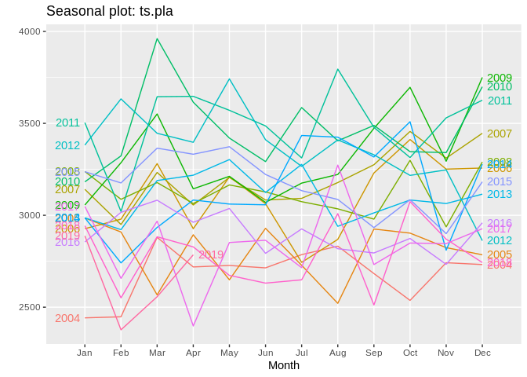
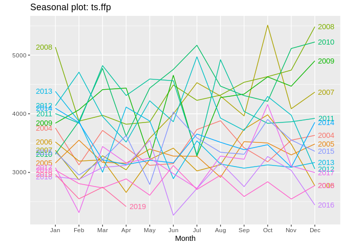

Forecasting Lab: Production Figures
================

Tässä dokumentissa tutkitaan aikasarjaennustamista tuotannon
kuukausittaisilla luvuilla. Erityisesti halutaan tietää seuraavat:

1.  Kuinka hyvin ennustemallit ovat historiallisesti toimineet? Onko
    jompi kumpi malleista parempi? 1.1. Kuinka hyvä keskiarvoennuste on?
    1.2. Kuinka hyvin vaihtelu mahtuu ennustettuihin rajoihin? Onko
    yksittäisiä selitettäviä poikkeamia? 1.3. Miten parametrien valinta
    vaikuttaa mallien suoriutumiseen (esim. ikkunan koko)?
2.  Voidaanko tehdä kuukausiennuste tulevaisuuteen?
3.  Onko olemassa uusia ja parempia helposti sovellettavia malleja?
4.  Saisiko malleihin lisää parametreja? 4.1. Työpäivien määrä
    kuukaudessa 4.2. Historiallinen vuosivaihtelu 4.3. Priori yleisestä
    trendistä 4.4. Väestörakenne 4.4.1 Auttaako sairaanhoitopiirien
    tasolle
meneminen?

## Create original dataset that should remain immutable throughout labbing

``` r
library(forecast)

# Set working directory and load data
setwd("/home/esa/production_forecasts")
monthly_sales <- read.table("/home/esa/production_forecasts/data/kuukausimyynti.txt", header = T, sep = "\t")

# Separate yyyy/mmm column into months and years
monthly_sales$year <- substr(monthly_sales$kuukausi, 1, 4)
monthly_sales$month <- factor(substr(monthly_sales$kuukausi, 6, 8), levels=c("tam", "hel", "maa", "huh", "tou", "kes", "hei", "elo", "syy", "lok", "mar", "jou"))

# Create a numeric column for months
monthly_sales$month_num <- as.numeric(monthly_sales$month)

# Omit empty values
d <- na.omit(monthly_sales)
```

## Create time series objects

``` r
ts.red <- ts(d$Punasoluvalmisteet, 
             start=as.numeric(c(d$year[1], d$month_num[1])), 
             end=as.numeric(c(tail(d$year, 1), tail(d$month_num, 1))), 
             frequency=12)  # This tells the series that it is monthly data
ts.pla <- ts(d$Trombosyyttivalmisteet,
             start=as.numeric(c(d$year[1], d$month_num[1])), 
             end=as.numeric(c(tail(d$year, 1), tail(d$month_num, 1))), 
             frequency=12)
ts.ffp <- ts(d$FFP,
             start=as.numeric(c(d$year[1], d$month_num[1])), 
             end=as.numeric(c(tail(d$year, 1), tail(d$month_num, 1))), 
             frequency=12)

# Create also a time series matrix for wicked snappy plotting yo
tsm <- cbind(ts.red, ts.pla, ts.ffp)  # Try plot(tsm) !
plot(tsm)
```

<!-- -->

## Forecasts of Jarno Tuimala

``` r
# Seasonal Decomposition by LOESS
# The t.window of stl() should be an odd number, but Tuimala has decided against it. Will investigate.
stl.red <- forecast(stl(ts.red, s.window="periodic", t.window=6), h=12)
stl.pla <- forecast(stl(ts.pla, s.window="periodic", t.window=6), h=12)
stl.ffp <- forecast(stl(ts.ffp, s.window="periodic", t.window=6), h=12)

# Exponential smoothing state space model
# ets() is an automated model selection function, so these are not the same model! Uses AICc, AIC and BIC.
ets.red <- forecast(ets(ts.red), h=12)
ets.pla <- forecast(ets(ts.pla), h=12)
ets.ffp <- forecast(ets(ts.ffp), h=12)

# Plot
par(mfcol=c(3, 2))
plot(stl.red)
plot(stl.pla)
plot(stl.ffp)
plot(ets.red)
plot(ets.pla)
plot(ets.ffp)
```

<!-- -->

## Accuracy of Tuimala’s forecasts year by year

``` r
stl.red.forecasts <- c()
stl.pla.forecasts <- c()
stl.ffp.forecasts <- c()
ets.red.forecasts <- c()
ets.pla.forecasts <- c()
ets.ffp.forecasts <- c()
avg.red.forecasts <- c()
avg.pla.forecasts <- c()
avg.ffp.forecasts <- c()
for(n in seq(36, 180, by=12)){
  red.period <- head(ts.red, n)
  pla.period <- head(ts.pla, n)
  ffp.period <- head(ts.ffp, n)
  
  # STL + ETS
  stl.red.forecasts <- c(stl.red.forecasts, data.frame(forecast(stl(red.period, s.window="periodic", t.window=6), h=12))$Point.Forecast)
  stl.pla.forecasts <- c(stl.pla.forecasts, data.frame(forecast(stl(pla.period, s.window="periodic", t.window=6), h=12))$Point.Forecast)
  stl.ffp.forecasts <- c(stl.ffp.forecasts, data.frame(forecast(stl(ffp.period, s.window="periodic", t.window=6), h=12))$Point.Forecast)
  
  # ETS
  ets.red.forecasts <- c(ets.red.forecasts, data.frame(forecast(ets(red.period), h=12))$Point.Forecast)
  ets.pla.forecasts <- c(ets.pla.forecasts, data.frame(forecast(ets(pla.period), h=12))$Point.Forecast)
  ets.ffp.forecasts <- c(ets.ffp.forecasts, data.frame(forecast(ets(ffp.period), h=12))$Point.Forecast)
  
  # Naive
  avg.red.forecasts <- c(avg.red.forecasts, data.frame(naive(red.period, h=12))$Point.Forecast)
  avg.pla.forecasts <- c(avg.pla.forecasts, data.frame(naive(pla.period, h=12))$Point.Forecast)
  avg.ffp.forecasts <- c(avg.ffp.forecasts, data.frame(naive(ffp.period, h=12))$Point.Forecast)
  
  
  
}
```

### Quick check

``` r
# Arduous plotting

red_slice <- tail(ts.red, 156)
pla_slice <- tail(ts.pla, 156)
ffp_slice <- tail(ts.ffp, 156)

par(mfcol=c(3, 3))

stl.red.p <- plot(red_slice, col="red")
par(new=TRUE)
stl.red.p <- plot(ts(stl.red.forecasts, frequency=12))

stl.pla.p <- plot(pla_slice, col="red")
par(new=TRUE)
stl.pla.p <- plot(ts(stl.pla.forecasts, start=head(pla_slice, 1), frequency=12))

stl.ffp.p <- plot(ffp_slice, col="red")
par(new=TRUE)
stl.ffp.p <- plot(ts(stl.ffp.forecasts, start=head(ffp_slice, 1), frequency=12))

ets.red.p <- plot(red_slice, col="red")
par(new=TRUE)
ets.red.p <- plot(ts(ets.red.forecasts, start=head(red_slice, 1), frequency=12))

ets.pla.p <- plot(pla_slice, col="red")
par(new=TRUE)
ets.pla.p <- plot(ts(ets.pla.forecasts, start=head(pla_slice, 1), frequency=12))

ets.ffp.p <- plot(ffp_slice, col="red")
par(new=TRUE)
ets.ffp.p <- plot(ts(ets.ffp.forecasts, start=head(ffp_slice, 1), frequency=12))

avg.red.p <- plot(red_slice, col="red")
par(new=TRUE)
avg.red.p <- plot(ts(avg.red.forecasts, start=head(red_slice, 1), frequency=12))

avg.pla.p <- plot(pla_slice, col="red")
par(new=TRUE)
avg.pla.p <- plot(ts(avg.pla.forecasts, start=head(pla_slice, 1), frequency=12))

avg.ffp.p <- plot(ffp_slice, col="red")
par(new=TRUE)
avg.ffp.p <- plot(ts(avg.ffp.forecasts, start=head(ffp_slice, 1), frequency=12))
```

<!-- -->

## Investigating the seasonality and trend of the series

``` r
library(TSA)
```

    ## Registered S3 methods overwritten by 'TSA':
    ##   method       from    
    ##   fitted.Arima forecast
    ##   plot.Arima   forecast

    ## 
    ## Attaching package: 'TSA'

    ## The following objects are masked from 'package:stats':
    ## 
    ##     acf, arima

    ## The following object is masked from 'package:utils':
    ## 
    ##     tar

``` r
pgram <- periodogram(ts.red)
```

<!-- -->

``` r
dd = data.frame(freq=pgram$freq, spec=pgram$spec)
order = dd[order(-dd$spec),]
top2 = head(order, 10)
 
# display the 2 highest "power" frequencies
top2
```

    ##           freq      spec
    ## 1  0.005208333 849128648
    ## 2  0.010416667  48706118
    ## 67 0.348958333  41043788
    ## 3  0.015625000  35691685
    ## 80 0.416666667  35631260
    ## 4  0.020833333  16580768
    ## 32 0.166666667  14257508
    ## 16 0.083333333  11523455
    ## 96 0.500000000  10403239
    ## 48 0.250000000   9703553

## Using a decomposition

``` r
decomposed <- stl(ts.red, s.window="periodic")
plot(decomposed)
```

<!-- -->

``` r
seasonal   <- decomposed$time.series[,1]
trend      <- decomposed$time.series[,2]
remainder  <- decomposed$time.series[,3]

par(mfcol = c(3, 1))
plot(trend+remainder,
     main="Red cell production over Time, Seasonally Adjusted",
     ylab="Red cell production (units)")
plot(seasonal+remainder,
     main="Red cell production over Time, Trend Adjusted",
     ylab="Red cell production (units")
plot(trend+seasonal,
     main="Red cell production over Time, Noise removed",
     ylab="Red cell production (units")
```

<!-- --> \#\# Test
noise to see if decomposition is
    successful

``` r
checkresiduals(remainder)
```

    ## Warning in modeldf.default(object): Could not find appropriate degrees of
    ## freedom for this model.

<!-- --> Something
suspicious about this decomp. Let’s observe the seasons more closely.

## Seasonal plot

``` r
library(ggplot2)
ggseasonplot(ts.red, year.labels = TRUE, year.labels.left = TRUE)
```

<!-- -->

``` r
ggseasonplot(ts.pla, year.labels = TRUE, year.labels.left = TRUE)
```

<!-- -->

``` r
ggseasonplot(ts.ffp, year.labels = TRUE, year.labels.left = TRUE)
```

<!-- -->

``` r
ggsubseriesplot(ts.red)
```

<!-- --> \#\# Do
blood product types correlate with each other?

``` r
GGally::ggpairs(as.data.frame(cbind(ts.red, ts.pla, ts.ffp)))
```

    ## Registered S3 method overwritten by 'GGally':
    ##   method from   
    ##   +.gg   ggplot2

<!-- -->

``` r
ggAcf(ts.red)
```

<!-- -->
