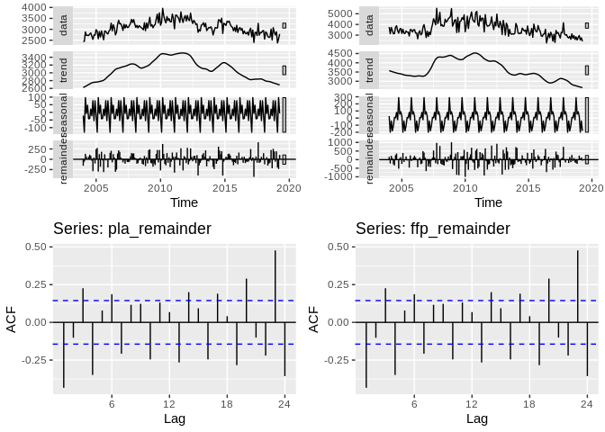
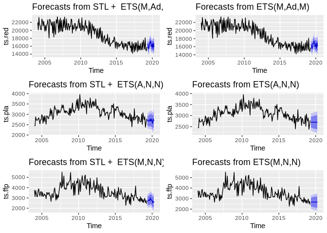
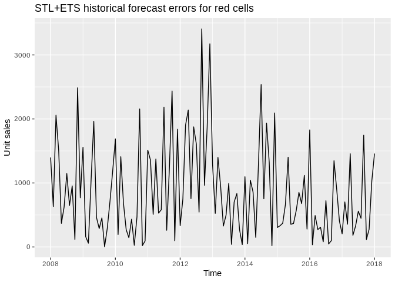
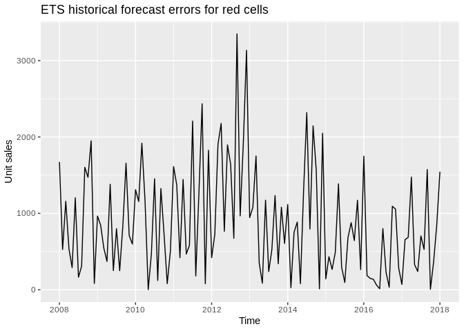
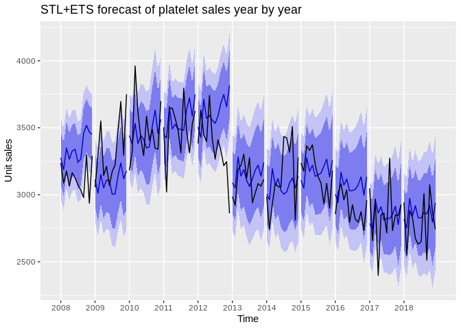

Forecasting Lab: Production Figures
================

Tässä dokumentissa tutkitaan aikasarjaennustamista tuotannon
kuukausittaisilla luvuilla. Erityisesti halutaan tietää seuraavat:

1.  Kuinka hyvin ennustemallit ovat historiallisesti toimineet? Onko
    jompi kumpi malleista parempi? 1.1. Kuinka hyvä keskiarvoennuste on?
    1.2. Kuinka hyvin vaihtelu mahtuu ennustettuihin rajoihin? Onko
    yksittäisiä selitettäviä poikkeamia? 1.3. Miten parametrien valinta
    vaikuttaa mallien suoriutumiseen (esim. ikkunan koko)?
2.  Voidaanko tehdä kuukausiennuste tulevaisuuteen?
3.  Onko olemassa uusia ja parempia helposti sovellettavia malleja?
4.  Saisiko malleihin lisää parametreja? 4.1. Työpäivien määrä
    kuukaudessa 4.2. Historiallinen vuosivaihtelu 4.3. Priori yleisestä
    trendistä 4.4. Väestörakenne 4.4.1 Auttaako sairaanhoitopiirien
    tasolle
meneminen?

## Create original dataset that should remain immutable throughout labbing

``` r
library(forecast)
library(ggplot2)
library(gridExtra)

# Set working directory and load data
setwd("/home/esa/production_forecasts")
monthly_sales <- read.table("/home/esa/production_forecasts/data/kuukausimyynti.txt", header = T, sep = "\t")

# Separate yyyy/mmm column into months and years
monthly_sales$year <- substr(monthly_sales$kuukausi, 1, 4)
monthly_sales$month <- factor(substr(monthly_sales$kuukausi, 6, 8), levels=c("tam", "hel", "maa", "huh", "tou", "kes", "hei", "elo", "syy", "lok", "mar", "jou"))

# Create a numeric column for months
monthly_sales$month_num <- as.numeric(monthly_sales$month)

# Omit empty values
d <- na.omit(monthly_sales)
```

## Create time series objects

``` r
ts.red <- ts(d$Punasoluvalmisteet, 
             start=as.numeric(c(d$year[1], d$month_num[1])), 
             end=as.numeric(c(tail(d$year, 1), tail(d$month_num, 1))), 
             frequency=12)  # This tells the series that it is monthly data
ts.pla <- ts(d$Trombosyyttivalmisteet,
             start=as.numeric(c(d$year[1], d$month_num[1])), 
             end=as.numeric(c(tail(d$year, 1), tail(d$month_num, 1))), 
             frequency=12)
ts.ffp <- ts(d$FFP,
             start=as.numeric(c(d$year[1], d$month_num[1])), 
             end=as.numeric(c(tail(d$year, 1), tail(d$month_num, 1))), 
             frequency=12)

# Create plots for a quick overview
tsm <- cbind(ts.red, ts.pla, ts.ffp)
p1 <- autoplot(ts.red)
p2 <- autoplot(ts.pla)
p3 <- autoplot(ts.ffp)
p4 <- autoplot(tsm)
grid.arrange(grobs=list(p1, p2, p3, p4), 
             widths=c(4, 2, 2), 
             layout_matrix = rbind(c(4, 1, 2), 
                                   c(4, 3, NA)))
```

<!-- -->

Initial remarks: Blood product types don’t seem to correlate in sales.
Why are platelets and plasma triangular while red cells have a smoother
downwards trend curve? It’s also obvious that red cells get sold in much
larger quantities than platelets or plasma.

``` r
# Correlation plot
GGally::ggpairs(as.data.frame(cbind(ts.red, ts.pla, ts.ffp)))
```

    ## Registered S3 method overwritten by 'GGally':
    ##   method from   
    ##   +.gg   ggplot2

<!-- -->

The correlation is not non-existent though, as all of the products have
a downward trend beginning from 2011. Let’s inspect their seasonality
more closely and see if we could extract it from the series.

``` r
ggseasonplot(ts.red, year.labels = TRUE, year.labels.left = TRUE)
```

<!-- -->

There seems to be a set of prominent features present in the red cell
sales series. January starts off high and demand decreases sharply in
February. Same pattern happens with March and April, May and June,
August and September and October and November. Overall the zig-zag
pattern repeats throughout the year. The current standing hypothesis is
that there are certain designated months when surgeries and other large
operations are not performed as frequently (for whatever reasons) and
this results in high demand during the following month. Let’s confirm
with one extra plot:

``` r
ggsubseriesplot(ts.red)
```

<!-- -->

Next up, platelets

``` r
ggseasonplot(ts.pla, year.labels = TRUE, year.labels.left = TRUE)
```

<!-- -->

The pattern found in red cell sales is not as prominent in platelets,
but some zig-zagging is still present.

``` r
ggseasonplot(ts.ffp, year.labels = TRUE, year.labels.left = TRUE)
```

<!-- -->

Frozen fresh plasma is even more messy, but some believable zig-zagging
could be pointed out.

So, there is some obvious seasonality in the series. Wonder what it
might look like if we try decomposing with
LOESS?

``` r
decomposed <- stl(ts.red, s.window="periodic")  # Seasonal and Trend decomposition using LOESS
seasonal <- decomposed$time.series[,1]          # Season component
trend <- decomposed$time.series[,2]             # Trend component
remainder <- decomposed$time.series[,3]         # Remainder component

autoplot(decomposed)  # Plot
```

<!-- -->

STL seems to think that the trend is significant, but that the remainder
is 3 to 4 times greater in magnitude compared to the seasonal component,
so it’s questionable whether we should trust this decomposition. Let’s
check the autocorrelation of the remainder:

``` r
ggAcf(remainder)
```

<!-- -->

There is significant autocorrelation at multiple lags, which tells us
that there is a considerable amount of information thrown out during the
decomposition. This is not a particularly good decomposition. Let’s
check decompositions for platelets and plasma also.

``` r
# Platelets
pla_decomposed <- stl(ts.pla, s.window="periodic")  # Seasonal and Trend decomposition using LOESS
pla_seasonal <- decomposed$time.series[,1]          # Season component
pla_trend <- decomposed$time.series[,2]             # Trend component
pla_remainder <- decomposed$time.series[,3]         # Remainder component

# FFP
ffp_decomposed <- stl(ts.ffp, s.window="periodic")  # Seasonal and Trend decomposition using LOESS
ffp_seasonal <- decomposed$time.series[,1]          # Season component
ffp_trend <- decomposed$time.series[,2]             # Trend component
ffp_remainder <- decomposed$time.series[,3]         # Remainder component

grid.arrange(grobs=list(autoplot(pla_decomposed),
                        autoplot(ffp_decomposed),
                        ggAcf(pla_remainder),
                        ggAcf(ffp_remainder)),
             layout_matrix=rbind(c(1, 2),
                                 c(3, 4)))
```

<!-- -->

Same decomposition problems persist with platelets and plasma\!

## Forecasts of Jarno Tuimala

Jarno built his forecasts using STL+ETS and ETS models, including also a
naïve 6 month repetition forecast. I will not be considering the naïve
“forecast” here, as I’m fairly certain we want to do proper modelling.

``` r
# Seasonal and Trend decomposition by LOESS + ETS
# The t.window of stl() should be an odd number, but Tuimala has decided against it. Will investigate.
stl.red <- forecast(stl(ts.red, s.window="periodic", t.window=6), h=12)
stl.pla <- forecast(stl(ts.pla, s.window="periodic", t.window=6), h=12)
stl.ffp <- forecast(stl(ts.ffp, s.window="periodic", t.window=6), h=12)

# Exponential smoothing state space model
# ets() is an automated model selection function, so these are not the same model! Uses AICc, AIC and BIC.
ets.red <- forecast(ets(ts.red), h=12)
ets.pla <- forecast(ets(ts.pla), h=12)
ets.ffp <- forecast(ets(ts.ffp), h=12)

# Plot
grid.arrange(grobs=list(autoplot(stl.red),
                        autoplot(stl.pla),
                        autoplot(stl.ffp),
                        autoplot(ets.red),
                        autoplot(ets.pla),
                        autoplot(ets.ffp)),
             layout_matrix=rbind(c(1, 4),
                                 c(2, 5),
                                 c(3, 6)))
```

<!-- -->

## Check the errors of yearly and monthly predictions.

``` r
yearly <- ggplot() 
forecast_errors <- c()
# Loop 
for(i in seq(from=2008, to=2018, by=1)){
  fit <- stl(window(ts.red, start=2004, end=c(i-1, 12)), s.window="periodic", t.window=6)  # Fit based on history so far
  fcast <- forecast(fit, h=12)  # Forecast the next year
  segment <- window(ts.red, start=i, end=c(i, 12))  # Extract that year from the history for plotting purposes
  
  # Build the plot piece by piece
  yearly <- yearly + autolayer(fcast) + autolayer(segment, colour=FALSE)
  
  # Calculate forecast errors
  forecast_errors <- c(forecast_errors, abs(data.frame(fcast)$Point.Forecast - segment))
}

yearly + ggtitle("STL+ETS forecast of red cell sales year by year") +
  scale_x_discrete(limits=c(2008, 2009, 2010, 2011, 2012, 2013, 2014, 2015, 2016, 2017, 2018)) + xlab("Time") +
  ylab("Unit sales")
```

<!-- -->

``` r
autoplot(ts(forecast_errors, start=2008, end=2018, frequency=12)) + ggtitle("STL+ETS historical forecast errors") + ylab("Unit sales")
```

<!-- -->

``` r
yearly_ets <- ggplot() 
ets_forecast_errors <- c()
# Loop 
for(i in seq(from=2008, to=2018, by=1)){
  fit <- ets(window(ts.red, start=2004, end=c(i-1, 12)))  # Fit based on history so far
  fcast <- forecast(fit, h=12)  # Forecast the next year
  segment <- window(ts.red, start=i, end=c(i, 12))  # Extract that year from the history for plotting purposes
  
  # Build the plot piece by piece
  yearly_ets <- yearly_ets + autolayer(fcast) + autolayer(segment, colour=FALSE)
  
  # Calculate forecast errors
  ets_forecast_errors <- c(ets_forecast_errors, abs(data.frame(fcast)$Point.Forecast - segment))
}

yearly_ets + ggtitle("ETS forecast of red cell sales year by year") +
  scale_x_discrete(limits=c(2008, 2009, 2010, 2011, 2012, 2013, 2014, 2015, 2016, 2017, 2018)) + xlab("Time") +
  ylab("Unit sales")
```

<!-- -->

``` r
autoplot(ts(ets_forecast_errors, start=2008, end=2018, frequency=12)) + ggtitle("ETS historical forecast errors") + ylab("Unit sales")
```

<!-- -->

Find out which performed better on average:

``` r
median(forecast_errors)
```

    ## [1] 679.1006

``` r
median(ets_forecast_errors)
```

    ## [1] 723.6955

It is noteworthy that after 2011 the models have been identical\!

## Investigating the seasonality and trend of the series

``` r
library(TSA)
```

    ## Registered S3 methods overwritten by 'TSA':
    ##   method       from    
    ##   fitted.Arima forecast
    ##   plot.Arima   forecast

    ## 
    ## Attaching package: 'TSA'

    ## The following objects are masked from 'package:stats':
    ## 
    ##     acf, arima

    ## The following object is masked from 'package:utils':
    ## 
    ##     tar

``` r
pgram <- periodogram(ts.red)
```

<!-- -->

``` r
dd = data.frame(freq=pgram$freq, spec=pgram$spec)
order = dd[order(-dd$spec),]
top2 = head(order, 10)
 
# display the 2 highest "power" frequencies
top2
```

    ##           freq      spec
    ## 1  0.005208333 849128648
    ## 2  0.010416667  48706118
    ## 67 0.348958333  41043788
    ## 3  0.015625000  35691685
    ## 80 0.416666667  35631260
    ## 4  0.020833333  16580768
    ## 32 0.166666667  14257508
    ## 16 0.083333333  11523455
    ## 96 0.500000000  10403239
    ## 48 0.250000000   9703553

## Playing around with a NN

``` r
library(ggplot2)
fit <- nnetar(ts.red, lambda=0)
autoplot(forecast(fit, PI=TRUE, h=12))
```

<!-- -->
